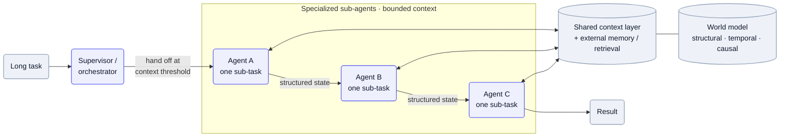

Give one agent a long task and its context window fills with transcript, tool output, and earlier reasoning until quality quietly falls off — it loses earlier instructions, latches onto the wrong detail, and slows down. The fix isn't a bigger window; it's keeping each agent's context small on purpose: split the job before the threshold, represent the world compactly instead of dumping it, and push durable state out to memory and retrieval rather than carrying it in the prompt.

## Why it's hard

The failure is silent and gradual — nothing errors, the answers just get worse as the window grows, so it's easy to miss until a complex case falls apart. And the obvious fix makes it worse: stuffing more context to "give the model everything" is exactly what degrades it, because a model reasons better over a small, well-structured input than a giant raw one. Antimetal hit this head-on — its first agent, "an AI agent in a simple search-and-synthesis loop" that dumped observability, infra, and code into context, found that "in complex environments, quality quickly degraded," latching onto symptoms. Their diagnosis is the whole lesson: "this wasn't a technology problem. It was a representation problem."

## Patterns

**Split into specialized sub-agents at a context threshold** — Hand off to a fresh specialized agent before the window bloats, rather than letting one agent carry the whole task. [Traba](/teardowns/traba/) splits its voice interviewer into sequential intro / vetting / logistics / Q&A agents with transfer between them, explicitly because "at a certain threshold of context, they begin to degrade." — [Traba](/teardowns/traba/)

**Replace bigger context with a better representation** — When quality falls in complex cases, structure the world so the agent reasons over a compact model instead of a raw dump. [Antimetal](/teardowns/antimetal/) rebuilt around an explicit layered world model — structural (graph + ontology), temporal (time-travel diff), causal (DAGs), semantic (clustering) — so "multiple agents can investigate different regions of the system in parallel, each using the full model, without duplicating work." — [Antimetal](/teardowns/antimetal/)

**Externalize durable state to memory and retrieval** — Keep long-lived facts in a store and pull only what each step needs, so the window never accumulates them. [Pallet](/teardowns/pallet/) holds 20,000+ learned per-tenant memories outside the prompt; [Glean](/teardowns/glean/) makes retrieval the substrate so agents "decompose questions into multi-step plans" rather than stuffing documents into context. — [Pallet](/teardowns/pallet/), [Glean](/teardowns/glean/)

**Coordinate through a shared context layer, not concatenation** — Let short-lived workers read and write a central context layer instead of each one carrying the full transcript. [Basis](/teardowns/basis/) runs a supervisor that routes each step to a best-fit model while agents "share context through a central layer, surfacing assumptions, data sources, and the logic behind each decision." — [Basis](/teardowns/basis/)

**Trim redundancy before the model sees it** — Drop repeats and noise at the input so the window fills with signal, not duplication. Traba runs a semantic-dedup pre-processor that omits 10–20% of repeated questions before they reach the model. — [Traba](/teardowns/traba/)

## Tools & popular choices

| Decision | Common choice | Notes |
| --- | --- | --- |
| Bounding a long task | Multi-agent decomposition with handoff at a context threshold | [Traba](/teardowns/traba/) transfers between specialized agents before the window degrades — see [Graduating an agent from assistant to actor](/ai-playbook/agent-assistant-to-actor/) for the autonomy angle. |
| Representing a complex system | An explicit world model (graph + ontology + temporal/causal layers), not a context dump | [Antimetal](/teardowns/antimetal/): structural / temporal / causal / semantic layers; agents reason over the model, not raw logs. |
| Holding long-lived state | External memory store + retrieval, pulled per step | [Pallet](/teardowns/pallet/) memories over pgvector; [Glean](/teardowns/glean/) retrieval substrate — keep facts out of the window. |
| Coordinating sub-agents | A supervisor + a shared central context layer | [Basis](/teardowns/basis/): workers share context through a central layer; the supervisor routes each step. |
| Input hygiene | Semantic dedup / pruning before the call | [Traba](/teardowns/traba/) drops 10–20% of repeat questions. |

## Reference architecture

The shape inverts the naïve "one agent, one growing window." A supervisor decomposes the task and hands it off to specialized sub-agents, each holding only the context for its own piece and passing a compact structured state — not its full transcript — to the next. The sub-agents don't accumulate knowledge in their prompts: they read and write a shared context layer and pull durable facts from external memory and retrieval, and where the domain is complex they reason over an explicit world model rather than raw data. Each window stays small, so quality holds across a task far longer than any single context could span.

Mermaid source

## Best practices

- **Hand off before you degrade, don't summarize after.** Watch the window and pass to a fresh specialized agent at a threshold — recovering a degraded context is harder than never letting it bloat.
- **Fix representation before you add tokens.** If quality falls in complex cases, the cause is usually *how* the world is represented, not the context size — structure it so the agent reasons over a compact model.
- **Externalize durable state.** Memory stores and retrieval keep long-lived facts out of the window; pull only what the step needs (see [Retrieval at multi-tenant scale](/ai-playbook/multi-tenant-retrieval/)).
- **Pass structured state between agents, not raw transcripts.** A handoff should carry a compact decision/state object — concatenating the whole conversation just moves the bloat downstream.
- **Share context through a layer.** A central context layer lets short-lived workers coordinate without each one accumulating everyone else's history.

## Seen in

- [Traba](/teardowns/traba/) — splits a single voice agent into sequential specialized agents with handoff, explicitly because "at a certain threshold of context, they begin to degrade"; a semantic-dedup pre-processor trims 10–20% of repeat input.
- [Antimetal](/teardowns/antimetal/) — when a search-and-synthesis agent's "quality quickly degraded" in complex environments, it rebuilt around an explicit layered world model so agents reason over a compact representation and investigate regions in parallel without re-stuffing context.
- [Basis](/teardowns/basis/) — a supervisor routes each step to a best-fit model while agents "share context through a central layer," keeping any one agent's window from carrying the whole task.
- [Pallet](/teardowns/pallet/) / [Glean](/teardowns/glean/) — externalize long-lived knowledge into a memory store and a retrieval substrate, pulling only what each step needs instead of growing the prompt.
