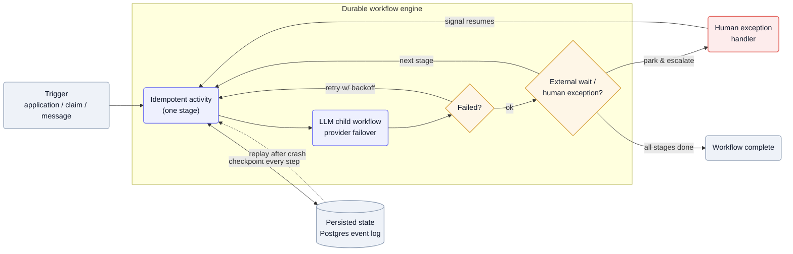

A mortgage from application to close, a customer conversation that runs for days, a claim that bounces between portals — these workflows span hours to weeks, touch multiple parties, and fail in a dozen places. A crash mid-flight can't lose the loan or re-file the dispute. The recurring answer is **durable execution**: run the workflow on an engine that records every step, so a process that dies resumes from the last completed activity instead of starting over — with humans modeled as exception handlers the workflow waits on, not blocking calls.

## Why it's hard

A long workflow is mostly *waiting* — on an appraisal, a title company, a human approval, an external API's SLA — so the process that owns it will outlive the machine it started on, and any crash, deploy, or rate-limit in between must not lose state. The actions are also hard to unwind: these are systems of record, so re-running a step after a crash can double-charge a fee or double-file a document unless every side effect is idempotent. And the expensive parts — LLM calls — fail transiently all the time (5XX, rate limits, latency spikes), so naïve retry-from-the-top re-runs everything that already succeeded. You need state that survives the process, semantics that survive a retry, and a way to park on a human or an external wait for days and pick up exactly where you left off.

## Patterns

**Durable execution: persist the workflow, replay it deterministically** — Run the workflow on an engine that journals every step, so a crash resumes from the last completed activity rather than the start. [Pylon](/teardowns/pylon-lending/): "Temporal orchestrates every multi-day origination workflow … gives durable, replayable workflows over Postgres state, with humans as exception handlers." [Gradient Labs](/teardowns/gradient-labs/) runs "each conversation … [as] a long-running Temporal workflow which manages the conversation's state, timers, and runs child workflows to generate responses." — [Pylon](/teardowns/pylon-lending/), [Gradient Labs](/teardowns/gradient-labs/)

**Idempotent activities for exactly-once side effects** — Because the engine replays and retries, every side-effecting step must be safe to run twice. Pylon's origination has to "survive crashes and retries without double-processing loans or double-charging fees" — the durability guarantee is only worth anything if filing or charging twice is a no-op. — [Pylon](/teardowns/pylon-lending/)

**Checkpoint the expensive steps so failover doesn't redo them** — Wrap LLM calls as child workflows whose intermediate results are checkpointed, so a provider failure resumes at the checkpoint with a backup model instead of re-running the whole chain. [Gradient Labs](/teardowns/gradient-labs/) keeps an "ordered list of API provider preferences … failing over on 5XX errors, rate limits, invalid outputs, or p99+ latency" with "tailored prompts for both the primary and backup models." — [Gradient Labs](/teardowns/gradient-labs/)

**Humans as exception handlers, not the happy path** — Model the human as a durable wait the workflow parks on — a timer or signal — and resumes from when they act, rather than a synchronous block. Pylon escalates blocked workflows to "humans as exception handlers" and resumes with full state intact once the exception clears. — [Pylon](/teardowns/pylon-lending/), [Confido](/teardowns/confido/)

**Persist the run, not the worker** — Separate durable run state — ownership, history, artifacts, provider-session refs — in a control plane from the ephemeral worker that executes it, so workers can crash or be torn down while the run survives. [Harvey](/teardowns/harvey/): "the run, not the worker, is the thing that persists," which is how it gets crash-durability and zero data retention at the same time. — [Harvey](/teardowns/harvey/)

## Tools & popular choices

| Decision | Common choice | Notes |
| --- | --- | --- |
| Orchestration engine | **Temporal** — durable, replayable workflows | Named at [Pylon](/teardowns/pylon-lending/) and [Gradient Labs](/teardowns/gradient-labs/); deterministic replay = automatic crash recovery. AWS Step Functions / Inngest are managed alternatives. |
| Workflow state store | **Postgres** | Both Pylon and Gradient Labs back Temporal with Postgres state. |
| Lighter-weight orchestration | Event-driven messaging (Pub/Sub / SQS / Kafka) | [Pallet](/teardowns/pallet/) — "everything in the system would be triggered by events" over Pub/Sub: durable queues + idempotent handlers when you don't need full replay. |
| LLM-call resilience | Ordered provider failover with checkpointed child workflows | [Gradient Labs](/teardowns/gradient-labs/) fails over on 5XX / rate-limit / invalid output / p99 latency with tailored backup prompts. |
| Run vs worker split | A durable-run control plane + ephemeral workers | [Harvey](/teardowns/harvey/) persists run records (refs, not raw data) so workers are disposable. |
| Human waits | Durable timers + typed escalation signals | The workflow blocks and resumes on the human's action — humans handle exceptions, not the happy path. |

## Reference architecture

A trigger — an application, a claim, an inbound message — starts a workflow on a durable engine that drives it stage by stage, checkpointing every step to a persisted event log (Postgres). Each stage is an idempotent activity; a failure retries with backoff, and LLM-heavy steps run as child workflows that fail over across providers without redoing earlier work. When the flow hits an external wait or an ambiguity it can't resolve, it parks on a durable timer or escalates to a human and resumes on their signal — no spinning, no lost state. And because every step is journaled, a process crash replays from the recorded events and continues from the last completed activity rather than the beginning.

Mermaid source

## Best practices

- **Persist the workflow, not just the data.** A durable engine that journals every step turns a crash from "start over" into "resume from the last activity" — that's the whole game for multi-day flows.
- **Make every side effect idempotent.** Replay and retries are only safe if charging a fee or filing a document twice is a no-op; key activities so re-execution can't double-act.
- **Model the human as a durable wait.** Park the workflow on a timer or signal and resume on the human's action — humans handle exceptions, not the happy path, so they shouldn't block a thread for days.
- **Checkpoint the expensive steps.** Wrap LLM calls so a provider failure resumes at the checkpoint with a backup model, instead of re-running the whole chain (see [Keeping inference cheap & fast](/ai-playbook/inference-cost-and-latency/)).
- **Split the durable run from the disposable worker.** Keep run state — history, refs, artifacts — in a control plane so workers can crash or be torn down, and so durability and zero retention can coexist.

## Seen in

- [Pylon](/teardowns/pylon-lending/) — Temporal orchestrates every multi-day mortgage origination over Postgres state: durable, replayable workflows with idempotent activities and humans as exception handlers, surviving multi-week appraisal and title waits without double-processing.
- [Gradient Labs](/teardowns/gradient-labs/) — each customer conversation is a long-running Temporal workflow managing state and timers, with LLM child workflows that fail over across providers on 5XX / rate-limit / latency using tailored backup prompts.
- [Harvey](/teardowns/harvey/) — a durable-run control plane persists the run (ownership, history, artifacts, provider-session refs) while workers stay ephemeral, achieving crash-durability and zero data retention together.
- [Pallet](/teardowns/pallet/) — event-driven orchestration over Pub/Sub ("everything in the system would be triggered by events"), with decision rules backtested against history offline so runtime failures are rarer to begin with.
