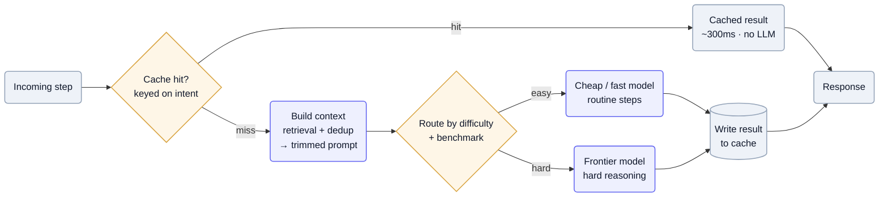

A frontier-model call on every step of a multi-step agent multiplies both the bill and the latency budget — and most steps don't need the biggest model, or any model at all. The teardowns converge on a funnel: serve from cache when you can, trim the prompt before you call, and route each call to the cheapest model that can actually do it. The frontier model becomes the exception path, not the default.

## Why it's hard

Cost and latency compound with depth: a ten-step agent at one frontier call per step is ten times the price and the wait of a single-shot feature, and users feel every second. The naïve fix — "always use the best model" — is exactly the expensive one, because difficulty isn't uniform: a clarifying question and a month-end reconciliation don't need the same horsepower. But routing down to a cheaper model trades against quality, caching trades against staleness, and trimming context trades against missing something the model needed — so the cheap path has to be measured, not assumed, or you save money by quietly getting worse.

## Patterns

**Cache-first, model-on-miss** — Cache the *result of a step* and serve it directly; fire the model only when the cache misses. [Momentic](/teardowns/momentic/) keys its cache on the step's *intent* (text, role, structural signals) rather than the raw DOM, so cosmetic changes don't bust it — 95%+ hit rate, ~300ms to serve a cached step versus >5s and one LLM call on a miss. The cheapest token is the one you never generate. — [Momentic](/teardowns/momentic/)

**Tiered per-step model routing** — Run a cheap, fast model for routine steps and reserve the frontier model for the hard ones, deciding per step. Basis routes "GPT-4.1 for latency-sensitive interactions, like clarifying questions mid-review, [and] GPT-5 for interpreting unusual transaction patterns, resolving ambiguous classifications, or … month-end close" — the supervisor picks against an internal benchmark, not by habit. — [Basis](/teardowns/basis/)

**Trim the prompt before the call** — Cut input tokens at the source, since fewer tokens are cheaper and faster on any model. Glean's hybrid retrieval (vector + lexical + anchors-and-signals) returns a smaller, more relevant context window instead of dumping documents at the LLM; Traba runs a semantic-dedup pre-processor that omits 10–20% of repeated questions before the model ever sees them. — [Glean](/teardowns/glean/), [Traba](/teardowns/traba/)

**Keep the model swappable** — Treat the model as a benchmarked, provider-agnostic dependency so the cheapest capable one wins and a better release upgrades the whole system without a rewrite. Glean runs "model selection/routing" as a first-class service across OpenAI, Anthropic, and Gemini; Basis re-runs its benchmark every release and is "model-agnostic by benchmark, not allegiance." — [Glean](/teardowns/glean/), [Basis](/teardowns/basis/)

## Tools & popular choices

| Decision | Common choice | Notes |
| --- | --- | --- |
| Model tiering | A cheap/fast model for routine steps + a frontier model for hard reasoning, picked per step | [Basis](/teardowns/basis/): GPT-4.1 for latency-sensitive turns, GPT-5 for ambiguous classification and month-end close. |
| Routing layer | A provider-agnostic supervisor / model-selection service | [Glean](/teardowns/glean/) runs model selection/routing across OpenAI, Anthropic, Gemini; [Basis](/teardowns/basis/) re-benchmarks candidates each release. |
| Step / result cache | **ClickHouse** or **Redis**, keyed on *intent* not raw input | [Momentic](/teardowns/momentic/): ClickHouse ReplacingMergeTree + sparse PK, ~20B entry-touches/day at ~250ms avg, 95%+ hit so the LLM fires on misses only. [Glean](/teardowns/glean/) uses Redis. |
| Context trimming | Hybrid retrieval (vector + lexical) + semantic dedup | Fewer input tokens at the source — [Glean](/teardowns/glean/) returns smaller relevant context; [Traba](/teardowns/traba/) drops 10–20% of repeat questions. |
| Prompt caching | Provider prompt caching (Anthropic / OpenAI) on stable system prefixes | Standard practice for agents with a long fixed preamble; typical rather than separately confirmed in these teardowns. |

## Reference architecture

The shape is a cost funnel, widest at the cheap end. An incoming step first hits the **cache**, keyed on intent — a hit returns in milliseconds with no model call at all. Only on a miss does the request flow on: a context builder trims it with retrieval and dedup into the smallest prompt that still carries what the model needs, then a router sends it to the cheapest model that can handle it — frontier only for genuinely hard steps. The result is written back to the cache so the next identical step is free. Every stage exists to keep work *off* the frontier model.

Mermaid source

## Best practices

- **Cache before you call.** The cheapest token is the one you never generate; key the cache on intent so cosmetic input changes don't force a needless re-run.
- **Default to the cheap model; earn the frontier.** Route by measured difficulty, not habit — reserve the big model for the steps that actually need it, and verify the cheap path's quality with the eval rail (see [Testing output that isn't reproducible](/ai-playbook/evaluating-non-deterministic-agents/)).
- **Trim the prompt, not just the model.** Retrieval and dedup cut tokens at the input; fewer tokens are cheaper and faster on any model, frontier or not.
- **Keep the model swappable.** Benchmark candidates per release behind a provider-agnostic router so a cheaper or better model upgrades the whole system without a rewrite — don't hard-wire one vendor.
- **Budget latency per step, not per request.** A multi-step agent multiplies any single-call latency; track it per step and cache aggressively, because that's where the seconds add up.

## Seen in

- [Momentic](/teardowns/momentic/) — intent-based caching at 95%+ hit (~300ms cached vs >5s and one LLM call on a miss), making the model the exception path rather than the default.
- [Basis](/teardowns/basis/) — per-step routing: GPT-4.1 for latency-sensitive turns, GPT-5 for hard reasoning, chosen against an internal benchmark re-run every release.
- [Glean](/teardowns/glean/) — retrieval-first cost control: hybrid search returns a smaller relevant context (fewer tokens), behind a provider-agnostic model-selection/routing service and a Redis cache.
- [Traba](/teardowns/traba/) — a semantic-dedup pre-processor drops 10–20% of repeated questions before the model sees them, cutting input tokens at the source.
