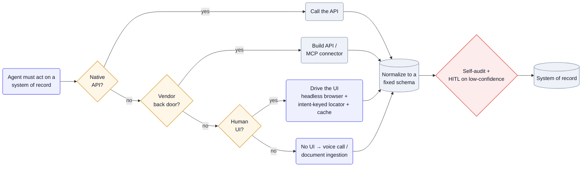

The systems of record are payer portals, ERPs, TMS/WMS stacks, and on-prem databases built for humans clicking through screens — and the customer won't migrate to suit you. So the agent integrates through whatever surface exists, in preference order: a real API if there is one, an API you build where the vendor leaves a back door, and failing that, the human UI itself — driven by a browser, the phone line, or the inbox.

## Why it's hard

The surface you're handed is the one built for a person, not a program: a web portal with randomized classnames, a phone tree, a PDF invoice in one of hundreds of formats. None of it is contractual, so all of it drifts — a UI refactor that a human wouldn't notice silently breaks a scripted click-path. And these are systems of record, so the actions are write actions on someone's money or medical claim, hard to unwind if the agent misreads the screen. The naïve answer — classic RPA that replays fixed click coordinates — is exactly the brittle one; the systems change underneath it constantly, and there's no API contract to catch the break.

## Patterns

**The integration ladder: API → built API → drive the UI** — Prefer a native API; where the vendor exposes a back door, build one (an MCP connector or shim); and only when neither exists, fall back to driving the human UI with a browser. [Pallet](/teardowns/pallet/) reaches "any system with an API, including on-premise AS400-based databases," ships MCP connectors to common TMS/WMS/ERP systems, and — "where APIs don't exist, Pallet builds them" — drops to browser automation for legacy web apps. Each rung down is more brittle and more expensive, so you climb only as far as you must. — [Pallet](/teardowns/pallet/), [Amperos](/teardowns/amperos-health/)

**Read-and-reason, not record-and-replay** — Instead of replaying fixed clicks, let the agent read the on-screen text and decide the next action, so it survives layout changes a scripted bot would choke on. Amperos: "unlike RPA that loops clicks, the agent can read on-screen text and understand spoken responses" — its agents work payer portals "like a human collector," adapting live when a portal changes. The cost is an inference call per step, which is why the next pattern matters. — [Amperos](/teardowns/amperos-health/), [Momentic](/teardowns/momentic/)

**Target meaning, then cache the resolved path** — Locate elements by what they *mean* — text, role, accessibility and structural signals — not by brittle CSS selectors, then cache the resolved locator so replay needs no model call. [Momentic](/teardowns/momentic/)'s locator is "a compiled multi-signal matcher"; invalidation "keys on intent, not DOM identity, so randomized classnames and restructures don't bust it, but a renamed semantic does" — and inference "runs on ~1 step in 20." UI automation that survives a rewrite. — [Momentic](/teardowns/momentic/)

**Voice and documents are integration surfaces too** — When there's no UI to drive, the interface is the phone line or the inbox. Amperos works the payer phone line with real-time voice AI as a third surface alongside portals and PM/EMR APIs; [Confido](/teardowns/confido/) treats messy retailer invoices and deductions as the integration point, parsing them with a "format-agnostic pipeline" into a fixed schema. — [Amperos](/teardowns/amperos-health/), [Confido](/teardowns/confido/)

**Connector library + per-tenant config, not a fork per customer** — Keep the integration as data and configuration so one codebase spans every customer's stack. Confido maintains "50+ connectors" across retailer portals, distributors, EDI, and ERP; Pallet learns each customer's workflow as plain-English "memories" (20,000+ on its largest tenant) rather than per-customer adapter code. The variety lives in config, not in branches of the code. — [Confido](/teardowns/confido/), [Pallet](/teardowns/pallet/)

## Tools & popular choices

| Decision | Common choice | Notes |
| --- | --- | --- |
| Drive the UI | Headless Chromium via **Playwright**, on managed cloud browsers (**Browserbase**) | [Pallet](/teardowns/pallet/) runs Playwright on Browserbase; [Momentic](/teardowns/momentic/) drives a Chromium driver. The fallback when no API exists. |
| Element targeting | A multi-signal locator (text + role + a11y + structure), not raw CSS selectors | [Momentic](/teardowns/momentic/)'s locator agent survives randomized classnames and restructures; cache the resolved match keyed on intent. |
| No UI → voice | Real-time voice AI on the phone line | [Amperos](/teardowns/amperos-health/) works payer phone lines as an integration surface; OpenAI-voice / ElevenLabs-class ASR+TTS. |
| Unstructured ingestion | Multimodal LLM extraction to a fixed schema | [Confido](/teardowns/confido/)'s format-agnostic pipeline parses messy invoices and deductions across hundreds of retailer formats. |
| Connector strategy | A tenant-agnostic connector / MCP library + learned per-tenant config | [Pallet](/teardowns/pallet/) builds APIs where none exist plus MCP connectors; [Confido](/teardowns/confido/) keeps 50+ connectors — config, not forks. |
| Correctness gate | Human-in-the-loop on low-confidence / high-$ + self-audit | [Amperos](/teardowns/amperos-health/)'s AI auditor reviews each action before handoff — see [Graduating an agent from assistant to actor](/ai-playbook/agent-assistant-to-actor/). |

## Reference architecture

The shape is a cascade with a gate at the end. When an agent must act on a system of record, it tries the most stable surface first — a native API — and steps down only when that's absent: build an API or MCP connector if the vendor allows it, else drive the human UI with a headless browser and an intent-keyed locator, else fall back to the phone line or document inbox. Whatever surface it used, the action is normalized to a fixed schema, then passed through a self-audit and a human-in-the-loop gate for low-confidence or high-value items before it's written back — because UI and voice actions are the hardest to unwind.

Mermaid source

## Best practices

- **Climb only as far down the ladder as you must.** API beats built-API beats UI beats voice/docs — each rung down is more brittle and more expensive, so reach for the most stable surface the system offers.
- **Target meaning, not markup.** Locate by text, role, and structure so a CSS refactor doesn't break you, and cache the resolved path keyed on intent so a cosmetic change doesn't force a re-run.
- **Read-and-reason over record-and-replay.** Scripted click-paths break on the first layout change; an agent that reads the screen adapts — pay the inference cost once, then cache it (see [Keeping inference cheap & fast](/ai-playbook/inference-cost-and-latency/)).
- **Treat voice and documents as first-class integrations.** When there's no UI, the phone line and the inbox *are* the API — budget for ASR/TTS and document extraction the same way you'd budget for an HTTP client.
- **Make integration config, not a fork.** A connector library plus learned per-tenant memories scales across customers; a branch of code per customer does not.
- **Gate writes to the system of record.** UI and voice actions are hard to unwind, so self-audit them and route low-confidence or high-value actions to a human before they land.

## Seen in

- [Pallet](/teardowns/pallet/) — the full API → built-API → drive-the-legacy-UI ladder (Playwright on Browserbase), reaching on-prem AS400; "where APIs don't exist, Pallet builds them," with workflows stored as per-tenant memories rather than per-customer code.
- [Amperos](/teardowns/amperos-health/) — works three surfaces like a human collector: payer portals (browser/RPA), the phone line (voice AI), and PM/EMR (API); read-and-reason agents adapt to portal changes and self-audit before handoff.
- [Confido](/teardowns/confido/) — structured extraction as the fallback to missing APIs: a format-agnostic pipeline parses messy retailer invoices and deductions into a fixed schema, behind 50+ portal, distributor, EDI, and ERP connectors.
- [Momentic](/teardowns/momentic/) — intent-keyed locators and caching let UI automation survive rewrites: a multi-signal matcher keyed on intent, not DOM, with the model firing on ~1 step in 20.
