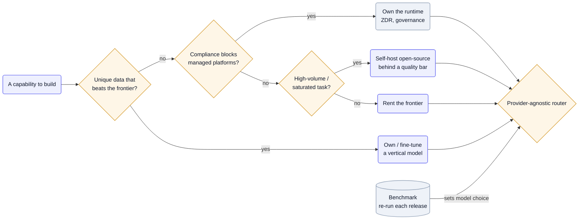

Every applied-AI team faces the same fork: train or fine-tune a model you own, or rent a frontier LLM by the token. The teardowns are near-unanimous on the default — rent the reasoning, because frontier models are a fast-moving commodity you can't out-train — and own the *data, retrieval, and runtime* around them instead. Fine-tuning earns its keep only where a unique proprietary dataset beats the frontier, or where cost or compliance forces your hand.

## Why it's hard

The frontier moves faster than any training budget: a model you fine-tune today is competing with next quarter's general model, so a custom model is a depreciating asset unless your data gives an edge the labs can't get. But renting isn't free either — frontier calls on every step are expensive (see [Keeping inference cheap & fast](/ai-playbook/inference-cost-and-latency/)), some tasks are saturated enough that a cheap open-source model matches frontier quality, and regulated domains have constraints — zero data retention, conflict-aware governance — that no managed API offers. So "own vs. rent" isn't one decision; it's a per-capability call weighing data moat, cost, latency, control, and compliance.

## Patterns

**Rent the reasoning, own the data** — Treat frontier reasoning as a swappable commodity and put your investment into the proprietary data and pipeline around it. [Rilla](/teardowns/rilla/) owns custom field-noise ASR (PyTorch + Baseten) over a corpus of "millions of in-person conversations no competitor captures," but rents OpenAI reasoning through a LiteLLM router, kept swappable; [Glean](/teardowns/glean/) owns the index, knowledge graph, and permissions — the moat — and keeps models rented and zero-retention. — [Rilla](/teardowns/rilla/), [Glean](/teardowns/glean/)

**Fine-tune only where your data beats the frontier** — Train or fine-tune a vertical model where proprietary data gives an edge a general model can't match, and rent everything else. [Pallet](/teardowns/pallet/) fine-tunes "Pallet Core" on "licensed supply-chain datasets" via Vertex AI for logistics patterns while renting frontier reasoning; [Confido](/teardowns/confido/) is building CPG-tuned proprietary models because the domain is underserved by general ones. — [Pallet](/teardowns/pallet/), [Confido](/teardowns/confido/)

**Stay model-agnostic: route by benchmark, not allegiance** — Make the model a routed dependency chosen by a scored internal benchmark re-run each release, so a better model is an upgrade, not a migration. [Basis](/teardowns/basis/) is "model-agnostic by benchmark, not allegiance" — GPT-5 "hit a perfect 100% success rate on its parallel-tool-calling benchmark before being promoted to the supervisor role." — [Basis](/teardowns/basis/)

**Self-host open-source to cut cost on saturated tasks** — Where open-source matches frontier quality on a task, route there and keep frontier for the hard reasoning; owning the runtime makes that tenable. [Harvey](/teardowns/harvey/): "the choice of model is just a routing decision" behind a Legal Agent Benchmark quality bar, with measured 3–5x cost reductions routing intelligence-saturated tasks to self-hosted open-source models. — [Harvey](/teardowns/harvey/)

**Own the runtime when compliance forces it** — Sometimes you own infrastructure not for the model but for guarantees no managed platform offers — zero data retention, conflict-aware governance, access enforced at the DB layer. [Harvey](/teardowns/harvey/) owns its agent runtime precisely because "automatic state persistence and zero retention are mutually exclusive," and privileged legal work needs both durability and ZDR. — [Harvey](/teardowns/harvey/)

## Tools & popular choices

| Decision | Common choice | Notes |
| --- | --- | --- |
| Reasoning | Rent frontier via a provider-agnostic router | [Rilla](/teardowns/rilla/) via LiteLLM; [Glean](/teardowns/glean/) and [Basis](/teardowns/basis/) multi-provider — swap a model in roughly one line. |
| Domain perception (speech / vision / extraction) | Own / fine-tune on proprietary data | [Rilla](/teardowns/rilla/) custom ASR on PyTorch + Baseten; the noisy domain data is the edge. |
| Vertical reasoning model | Fine-tune a base model on licensed/proprietary data, only where it beats frontier | [Pallet](/teardowns/pallet/) Core via Vertex AI on supply-chain data; [Confido](/teardowns/confido/) building CPG-tuned models. |
| Cost on high-volume tasks | Self-host open-source (vLLM/TGI on K8s), route by benchmark | [Harvey](/teardowns/harvey/): 3–5x cheaper on saturated tasks behind a quality bar. |
| Model selection | A scored internal benchmark, re-run per release | [Basis](/teardowns/basis/) promotes models by eval, not vendor relationship. |
| The real moat | Data, retrieval, runtime, integrations — not the model | [Glean](/teardowns/glean/) (retrieval + permissions), [Pallet](/teardowns/pallet/) (memory), [Confido](/teardowns/confido/) (50+ connectors). |

## Reference architecture

Treat "own vs. rent" as a decision cascade run per capability, with everything downstream of a provider-agnostic router. First ask whether you have a unique dataset that beats the frontier — if so, own or fine-tune a vertical model. If not, ask whether compliance constraints (ZDR, governance) rule out managed platforms — if so, own the *runtime* even while renting the models inside it. Otherwise, ask whether the task is high-volume and saturated enough that open-source clears your quality bar — if so, self-host it; if not, rent the frontier. Every path terminates at the router, and a benchmark re-run each release decides which concrete model serves each call — so the decision is revisited automatically as the frontier moves.

Mermaid source

## Best practices

- **Rent the reasoning by default.** Frontier reasoning is a commodity moving faster than you can train — put it behind a provider-agnostic router and treat the model as swappable.
- **Own only where your data wins.** Fine-tune or train when a unique proprietary dataset (field audio, supply-chain, CPG docs) beats the frontier; don't build a general model to compete with the labs.
- **Route by benchmark, not allegiance.** A scored internal eval re-run each release lets a better model earn promotion without a rewrite (see [Testing output that isn't reproducible](/ai-playbook/evaluating-non-deterministic-agents/)).
- **Self-host open-source for saturated, high-volume tasks.** Measure which tasks OSS clears your quality bar on and route them there for big cost cuts; keep the frontier for the hard reasoning.
- **Own the runtime when compliance demands it.** Zero retention, conflict-aware governance, and DB-layer access control can be blockers no managed platform meets — that, not the model, is the reason to own infrastructure.
- **Remember the moat is rarely the model.** Retrieval, permissions, memory, integrations, and proprietary data compound; the model is rented.

## Seen in

- [Rilla](/teardowns/rilla/) — owns custom field-noise ASR (PyTorch + Baseten) over a proprietary conversation corpus no competitor captures, but rents frontier reasoning via LiteLLM, kept swappable.
- [Basis](/teardowns/basis/) — pure rent, model-agnostic by benchmark: each step routed to the best-fit OpenAI model off a scored internal suite re-run every release (GPT-5 promoted to supervisor after a perfect benchmark).
- [Harvey](/teardowns/harvey/) — owns the runtime for compliance (zero retention, conflict-aware governance) and routes by a Legal Agent Benchmark, self-hosting open-source for 3–5x cost cuts on saturated tasks.
- [Pallet](/teardowns/pallet/) — fine-tunes a vertical model (Pallet Core) on licensed supply-chain data via Vertex AI for logistics patterns, while renting frontier reasoning and keeping per-customer uniqueness in a memory layer.
- [Glean](/teardowns/glean/) — owns the retrieval engine, knowledge graph, and permissions (the moat) and rents models, kept multi-provider and zero-retention.
