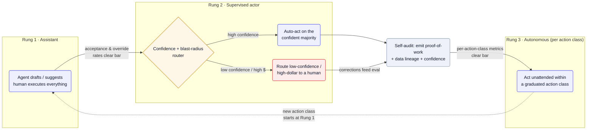

Almost every applied-AI product ships as an assistant — it drafts, suggests, flags — and almost every one wants to graduate into an actor that does the work unattended. The crossing from *suggest* to *act* is the irreversible step, and it's where trust is won or lost. The recurring answer across the teardowns is the same: don't flip a switch — climb a ladder, one action class at a time, gated on measured behavior.

## Why it's hard

The output is non-deterministic, so you can't prove correctness up front the way a normal feature ships — you can only observe how often the agent is right and how badly it's wrong when it isn't. And "wrong" isn't uniform: drafting a reply a human will read costs nothing if it's off, but moving money, sending an external email, or changing a system of record is hard or impossible to unwind. So autonomy can't be granted wholesale. It has to be earned per *action class*, weighed against that action's blast radius, and backed by evidence the user can inspect — because in finance, healthcare, and security a confident-but-unexplained action is a liability, not a feature.

## Patterns

**Confidence-graduated autonomy** — Ship as an assistant first, then promote the agent to act on its own one action class at a time, gated on measured acceptance and override rates and on each action's blast radius. Trust is earned per action type, never granted all at once. — [Antimetal](/archive/teardowns/antimetal/), [Prophet Security](/archive/teardowns/prophet-security/), [Pallet](/archive/teardowns/pallet/), [Basis](/archive/teardowns/basis/)

**Human-in-the-loop as the validation gate** — Auto-process the confident majority; route low-confidence or high-dollar items to a person, whose corrections feed back as training and eval signal. It's what lets an ops or finance team trust AI-produced figures inside a system of record. — [Confido](/archive/teardowns/confido/), [Amperos](/archive/teardowns/amperos-health/), [Pallet](/archive/teardowns/pallet/)

**Self-audit before handoff** — Have the agent review its own actions and emit proof-of-work artifacts — transcripts, exported PDFs, reasoning traces — so the output is pre-audited before a human ever sees it. Turns "trust me" into "here's the evidence." — [Amperos](/archive/teardowns/amperos-health/)

**Show-your-work / explainability gating** — Make every output carry its data lineage and a confidence score, and gate go-live on how clearly the system can *explain* its reasoning, not just on raw accuracy. In regulated domains explainability is a first-class eval metric. — [Basis](/archive/teardowns/basis/), [Prophet Security](/archive/teardowns/prophet-security/), [Confido](/archive/teardowns/confido/)

## Tools & popular choices

| Decision | Common choice | Notes |
| --- | --- | --- |
| Where the gate lives | An explicit confidence + blast-radius router before any side-effecting action | The classifier that decides auto-act vs. escalate; the single most important control point. |
| Capturing override signal | Annotation / feedback datasets (e.g. Langfuse), versioned alongside prompts | Every human correction becomes ground truth for the next eval run — see [Testing output that isn't reproducible](/archive/ai-playbook/evaluating-non-deterministic-agents/). |
| Proof-of-work surface | The product's own audit log / activity feed — transcripts, exported docs, reasoning traces | Reviewers approve from the artifact, not by re-doing the work. |
| Tracking the promotion bar | Per-action-class acceptance & override dashboards | Promotion is a metrics decision, not a calendar one; each action class graduates on its own curve. |

## Reference architecture

The shape is a ladder, not a switch. An action enters as a *suggestion* a human executes (Rung 1). Once acceptance and override rates clear a bar, a router decides per item: auto-act on the confident majority, escalate the low-confidence or high-dollar tail to a human (Rung 2). Both paths flow through a self-audit step that emits proof-of-work and lineage, and human corrections loop back as eval signal. Only when an *individual action class* clears its own metrics does it graduate to unattended action (Rung 3) — and any new action class re-enters at Rung 1.

Mermaid source

## Best practices

- **Graduate per action class, not per agent.** "Can draft a reply" and "can send the reply" are different promotions with different blast radii — gate them separately.
- **Make the override the product, early.** The cheapest source of eval data is users correcting the assistant; capture it from day one so the promotion bar is measurable.
- **Pre-audit, don't post-mortem.** Emit the proof-of-work *with* the action so a reviewer approves from the artifact instead of reconstructing what happened after something breaks.
- **Treat explainability as a gate, not a nicety.** In regulated domains, "we can't say why" should block promotion even when accuracy looks fine.
- **Keep the ladder reversible.** A spike in overrides should automatically demote an action class back to supervised — autonomy is a lease, not a deed.

## Seen in

- [Antimetal](/archive/teardowns/antimetal/) — graduates cloud-cost actions by blast radius; shadow-tests changes before they touch a live account.
- [Prophet Security](/archive/teardowns/prophet-security/) — autonomy gated on explainability of an alert triage decision, not just verdict accuracy.
- [Pallet](/archive/teardowns/pallet/) — confident-majority automation with humans as the exception path across logistics workflows.
- [Basis](/archive/teardowns/basis/) — per-action-class trust in accounting, where outputs must carry confidence and lineage.
- [Confido](/archive/teardowns/confido/) — human-in-the-loop validation of AI-produced financial figures inside the system of record.
- [Amperos](/archive/teardowns/amperos-health/) — self-audit and proof-of-work artifacts (call recordings, transcripts) so output is pre-audited before handoff.
