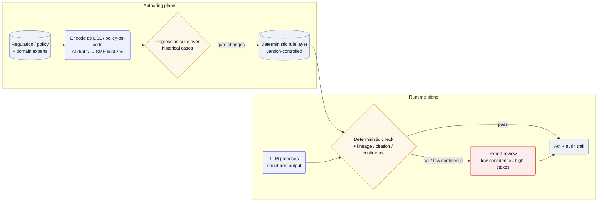

Underwriting guidelines, tax rules, compliance controls, regulatory timing — this logic has to be *exact*, *testable*, and *auditable*, and you can't get there by hoping a free-running LLM "knows the rules." The recurring answer is to pull the rule out of the model: encode it as deterministic, version-controlled code (with the LLM drafting the encoding and proposing inputs), constrain the model's output to a checkable shape, and make every decision carry the lineage that proves which rule fired.

## Why it's hard

The rules are dense and they change — too intricate to trust to a model's latent knowledge, too fluid to bury in hand-written `if`-statements that drift out of date. And the cost of getting one wrong is asymmetric: Pylon "reps & warrants every loan," so "an incorrectly modeled rule can cost the company tens of thousands of dollars on a single loan" — there's no partial credit. On top of correctness, regulated domains demand *auditability*: a CPA, an examiner, or a lawyer has to see *why* a decision was made, which rule applied, and what data fed it — so a confident answer with no traceable basis is a liability, not a feature.

## Patterns

**Rules-as-code, with the LLM as the draft layer** — Compile the regulatory text into deterministic, executable logic and enforce it *outside* the model; let the LLM draft the encoding and propose inputs, but never be the final arbiter of the rule. [Pylon](/archive/teardowns/pylon-lending/) "encode[s] natural language rules into code … with DSLs and novel techniques — including AI — to translate dense regulatory guidelines into executable logic," built "side-by-side with mortgage experts." — [Pylon](/archive/teardowns/pylon-lending/)

**Constrain generation to a schema** — Where model output feeds a rule, force it into a structured shape so it's machine-checkable rather than prose to parse. [Comp AI](/archive/teardowns/comp-ai/) generates policies and controls as Zod-structured output (57 `generateObject` call-sites vs. 7 free-text), with controls mapped many-to-many to frameworks so one control satisfies many regulations. — [Comp AI](/archive/teardowns/comp-ai/)

**Explainability as a ship gate: lineage, confidence, citation** — A rule-bound output must carry *why* it fired, and go-live is gated on that, not just accuracy. [Basis](/archive/teardowns/basis/) benchmarks "not just accuracy, but how clearly the model can explain its reasoning," each output carrying "what data was used, why it was mapped that way, and how confident the system is"; [Harvey](/archive/teardowns/harvey/) emits sentence-level citations alongside its reasoning. — [Basis](/archive/teardowns/basis/), [Harvey](/archive/teardowns/harvey/)

**Author with experts, gate the hard cases to them** — Domain experts write and validate the rules, and low-confidence or high-stakes items route to a human rather than auto-executing. Pylon builds its DSLs with mortgage experts; [Confido](/archive/teardowns/confido/) routes low-confidence and high-dollar deductions to reviewers with "full traceability." — [Pylon](/archive/teardowns/pylon-lending/), [Confido](/archive/teardowns/confido/)

**Test the rulebook like code** — Version the rules and run a regression suite over historical cases so a rule change can't silently break, the same discipline you'd apply to any build. For Pylon, where a misencoded rule is six figures of liability, that means golden-file/snapshot tests over historical loans gating DSL changes in CI. — [Pylon](/archive/teardowns/pylon-lending/)

## Tools & popular choices

| Decision | Common choice | Notes |
| --- | --- | --- |
| Encoding the rule | A domain DSL / rules-as-code; AI drafts → experts finalize | [Pylon](/archive/teardowns/pylon-lending/) compiles regulatory English into executable, version-controlled DSLs. |
| Shaping model output | Schema-constrained generation (Zod / structured output) | [Comp AI](/archive/teardowns/comp-ai/): structured from the start, not prose — 57 `generateObject` call-sites. |
| Proving the decision | Data lineage + confidence + sentence-level citations | [Basis](/archive/teardowns/basis/) attaches lineage and confidence per output; [Harvey](/archive/teardowns/harvey/) cites at sentence level across 30k concurrent cells. |
| Mapping to regulation | Many-to-many control → framework mappings, version-controlled | [Comp AI](/archive/teardowns/comp-ai/)'s `RequirementMap`: one control satisfies many frameworks. |
| Authoring | SME-in-the-loop: experts write/validate; HITL on hard cases | [Pylon](/archive/teardowns/pylon-lending/) with mortgage experts; [Confido](/archive/teardowns/confido/) reviewers on low-confidence / high-$. |
| Testing | Golden-file / snapshot regression over historical cases in CI | Gates rule changes against real history — see [Testing output that isn't reproducible](/archive/ai-playbook/evaluating-non-deterministic-agents/). |

## Reference architecture

There are two planes: an authoring plane and a runtime plane. In authoring, domain experts and the LLM together turn regulation into a deterministic, version-controlled rule layer — a DSL or schema-defined policy set — and a regression suite over historical cases gates every change before it lands. At runtime, the LLM proposes a *structured* output, which a deterministic check validates against the rule layer and stamps with data lineage, confidence, and citations. Clear cases act and write to an audit trail; low-confidence or high-stakes cases route to an expert. The model never *is* the rule — it drafts the rule offline and proposes inputs online, and the deterministic layer is what actually decides.

Mermaid source

## Best practices

- **Encode the rule, don't hope the model knows it.** Dense regulation belongs in deterministic, tested code — let the LLM draft the encoding and propose inputs, but enforce the rule outside the model.
- **Constrain generation to a schema.** Where output feeds a rule, force structure so it's machine-checkable, not prose to parse after the fact.
- **Make explainability a ship gate.** A rule-bound decision must carry its lineage, confidence, and citations; if the system can't say why, it doesn't go live (see [Graduating an agent from assistant to actor](/archive/ai-playbook/agent-assistant-to-actor/)).
- **Author with the experts, gate the hard cases to them.** SMEs write and validate the rules; route low-confidence or high-stakes items to a human instead of auto-executing.
- **Test the rulebook like code.** Snapshot and regression suites over historical cases catch a rule change that silently breaks — version the rules and gate changes in CI.

## Seen in

- [Pylon](/archive/teardowns/pylon-lending/) — compiles dense mortgage-underwriting guidelines into executable, version-controlled DSLs (AI drafts, mortgage experts finalize), enforced deterministically and gated by economic liability — a misencoded rule can cost tens of thousands on a single loan.
- [Basis](/archive/teardowns/basis/) — explainability is the gate, not accuracy alone: outputs carry data lineage and confidence, and models are benchmarked on how clearly they explain their reasoning before a workflow ships.
- [Comp AI](/archive/teardowns/comp-ai/) — compliance-as-code in the open: policies generated as Zod-structured output (not free text), controls mapped many-to-many to frameworks, every rule auditable on GitHub.
- [Harvey](/archive/teardowns/harvey/) / [Confido](/archive/teardowns/confido/) — proof at the point of decision: Harvey emits sentence-level citations with reasoning; Confido gates low-confidence and high-dollar items to human reviewers with full traceability.
