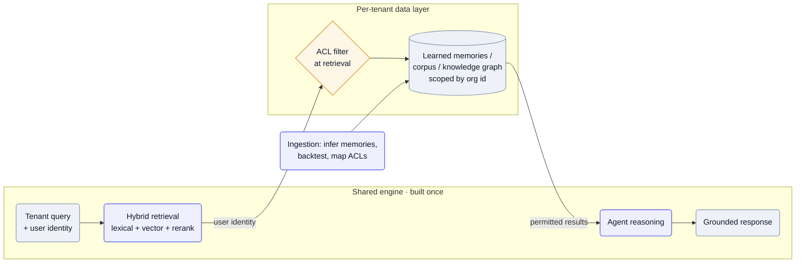

Every customer's knowledge is different — their SOPs, their documents, their permissions — but writing code per customer doesn't scale past the first handful. The recurring answer is to split the system in two: a shared reasoning engine built once, and a per-tenant **data layer** it reads at query time. The uniqueness lives in data — learned memories, an ACL-bearing knowledge graph, a proprietary corpus — so onboarding a tenant is loading data, not forking the codebase.

## Why it's hard

The naïve approach — branch the code per customer — collapses under its own weight: every new tenant adds a fork to maintain, and a bug fix has to land N times. So the variety has to move into data the shared engine can read generically, which is harder than it sounds. Retrieval has to be *permission-faithful* — in enterprise search the bottleneck is access fidelity, not recall, and a query that returns a document the user can't open is a security incident, not a relevance miss. It has to stay isolated, so tenant A's data can't leak into tenant B's results. And the per-tenant knowledge is rarely handed to you clean — it's tribal, buried in inboxes and recordings — so something has to *learn* it and prove it's right before it grounds a live answer.

## Patterns

**Knowledge-as-data, not per-customer code** — Put per-tenant uniqueness in a data layer the shared engine reads, so the reasoning core and connectors are built once and amortized across customers. [Pallet](/archive/teardowns/pallet/)'s explicit bet is that "per-customer heterogeneity lives in *data, not code*" — its largest tenant runs on "more than 20,000 customer-specific memories" while the engine stays single. — [Pallet](/archive/teardowns/pallet/), [Glean](/archive/teardowns/glean/)

**Permission-faithful hybrid retrieval** — Combine lexical precision with vector recall, rerank with whatever signals you have, and enforce access *at retrieval* rather than as a post-filter. [Glean](/archive/teardowns/glean/) fuses "the precision of lexical search and the nuanced understanding of vector search … powered by the additional context and nuance provided by the signals and anchors within our knowledge graph," whose edges carry access control so a multi-hop traversal still respects ACLs — a query "never returns a document the user can't open." — [Glean](/archive/teardowns/glean/)

**Learn the tenant's knowledge, then backtest it before it goes live** — Don't hand-author per-customer rules; infer them from the tenant's own data, then validate against history before activation. Pallet infers customer tribal knowledge "from the inbox into thousands of discrete facts," and "memories are backtested against historical scenarios before going active" — inference is only safe once it's proven on real cases. — [Pallet](/archive/teardowns/pallet/)

**A proprietary corpus is the retrieval asset** — The data you uniquely capture becomes a queryable index a competitor can't replicate, and often trains the model too. [Rilla](/archive/teardowns/rilla/) turns "millions of in-person conversations no competitor captures" into "a search engine over voice data," the same corpus that fine-tunes its field-noise ASR. — [Rilla](/archive/teardowns/rilla/)

**Scope isolation explicitly** — Make tenant boundaries a property of the deployment or the row, not something the app layer remembers. Glean runs single-tenant — "ingestion, index, and knowledge graph run in the customer's GCP/AWS/Azure project … data never leaves your tenant's environment"; Pallet scopes with Postgres row-level security keyed on org id. — [Glean](/archive/teardowns/glean/), [Pallet](/archive/teardowns/pallet/)

## Tools & popular choices

| Decision | Common choice | Notes |
| --- | --- | --- |
| Vector store | **pgvector** in Postgres, or a managed vector DB | [Pallet](/archive/teardowns/pallet/) runs pgvector in Cloud SQL; [Rilla](/archive/teardowns/rilla/) keeps embeddings alongside transcripts in Postgres. Co-locating with relational data makes tenant scoping natural. |
| Retrieval style | Hybrid: lexical (BM25) + vector, reranked by signals | [Glean](/archive/teardowns/glean/) combines lexical precision, vector recall, and knowledge-graph anchors-and-signals — +24% relevance from the agentic layer on top. |
| Access control | ACLs mapped per source at retrieval time, carried on graph edges | [Glean](/archive/teardowns/glean/) connectors "map and maintain each source's ACLs"; enforce at retrieval, never post-filter. |
| Tenant isolation | Single-tenant deployment in the customer's cloud, or row-level security on org id | [Glean](/archive/teardowns/glean/) runs in the customer's own cloud project; [Pallet](/archive/teardowns/pallet/) uses Postgres RLS keyed on org id. |
| Per-tenant knowledge | Learned "memories" / SOPs, backtested before activation | [Pallet](/archive/teardowns/pallet/) infers 20,000+ facts per tenant from the inbox and backtests each one against history. |
| Models / embeddings | Multi-provider, routed | [Glean](/archive/teardowns/glean/), [Pallet](/archive/teardowns/pallet/), and [Rilla](/archive/teardowns/rilla/) all route across OpenAI / Anthropic / Google (Rilla via LiteLLM). |

## Reference architecture

The system splits into a shared plane and a per-tenant plane. A query arrives carrying the user's identity; the **shared engine** — hybrid retrieval (lexical + vector + rerank) feeding an agent — is built once and serves every tenant. It reads from the **per-tenant data layer**: learned memories, a proprietary corpus, or an ACL-bearing knowledge graph, scoped by org id or by single-tenant deployment. An ACL filter applies the user's permissions *at retrieval*, so results can never include something the user can't open. A separate ingestion pipeline keeps that data layer fresh — inferring memories, backtesting them, mapping each source's ACLs — without ever touching the shared engine's code.

Mermaid source

## Best practices

- **Put the uniqueness in data, not code.** If onboarding a customer means writing code, it won't scale — make it loading memories, connectors, or a corpus into a shared engine.
- **Enforce permissions at retrieval, never as a post-filter.** A query should be incapable of returning a document the user can't open; carry the user's identity into the retrieval call itself.
- **Go hybrid.** Lexical catches exact terms, vectors catch meaning, and a reranker with domain signals beats either alone — don't ship vector-only and call it search.
- **Learn the tenant's knowledge, then backtest it.** Inferred SOPs are only safe once validated against historical cases — gate activation on that, the same way you'd gate a model change (see [Testing output that isn't reproducible](/archive/ai-playbook/evaluating-non-deterministic-agents/)).
- **Scope isolation explicitly.** Single-tenant deployment or row-level security keyed on org id — don't rely on the app layer to remember which tenant it's serving.

## Seen in

- [Glean](/archive/teardowns/glean/) — permission-faithful hybrid retrieval over a knowledge graph whose edges carry ACLs, deployed single-tenant in the customer's own cloud, with agentic reasoning adding +24% relevance.
- [Pallet](/archive/teardowns/pallet/) — per-tenant uniqueness as data not code: 20,000+ plain-English memories inferred per customer from the inbox and backtested before activation, retrieved over pgvector.
- [Rilla](/archive/teardowns/rilla/) — a proprietary corpus of millions of field conversations becomes the searchable retrieval asset, the same data that fine-tunes its noise-robust ASR.
