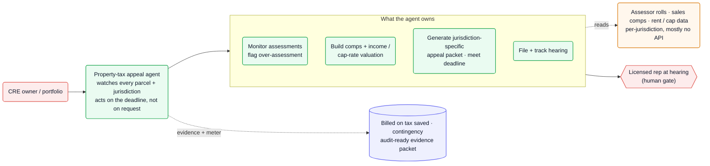

Commercial real estate is routinely over-assessed, and the only fix is a deadline-bound, jurisdiction-specific appeal: pull comparable sales, build an income/cap-rate valuation, assemble an evidence packet, and argue it before an assessment board. Today boutique consultants and attorneys do this by hand on a **contingency fee of 33–50% of the tax savings** ([Russell, Krafft & Gruber][rkg]) — and they win **70–85% of the time when the evidence is good** ([Polter][pol]). That combination — provable ROI, recurring annual savings, and a value-capture model with zero budget objection — is the cleanest business case on the opportunity board. The agent owns the detection-to-filing case work; a licensed human still argues the hearing.

**Vitals:** market: $797B US property tax/yr ([Census][nahb]) · `deadline-driven, per-jurisdiction` · buyer: CRE owners / CFOs / consultants · model: contingency on savings · whitespace: ★★★

Market context — size, money flow, why CRE owners care

- **The base:** US state + local property tax revenue hit **~$797B in 2024, up 8.2%** ([Census via NAHB][nahb]); property taxes are **70% of all local tax collections** ([Tax Foundation][tf]). Commercial/industrial property is a large slice of that base.
- **The leakage:** appeals succeed 70–85% with professional evidence ([Polter][pol]) and 40–60% on average ([NTU Foundation, reported][ntu]) — i.e., over-assessment is systematic, so even a low single-digit error rate against an ~$797B base implies **billions in recoverable tax**.
- **Why owners care beyond cash:** an over-assessment doesn't just cost annual tax — it depresses the asset. A **$16K annual overpayment can knock $200K–$270K off property value** at prevailing cap rates ([Uthoff Graeber][uth]). NAIOP, the CRE-development association, openly urges owners to "contest excessive assessments" ([NAIOP][naiop]).
- **The win is recurring:** a single 50% assessment reduction produced **$89,665 in tax savings** in one documented case ([Property Valuation Services][pvs]), and a reduction lowers the base for subsequent years too.

## The mess

- **The clock is short, per-jurisdiction, and unforgiving.** Appeals must usually be filed within **30 days of the assessment notice (some allow 45–60)** ([Madras][mad]), on dates that vary by jurisdiction (Florida: 25 days after the TRIM notice — [CBIZ][cbiz]). Miss it and the owner eats the over-assessment for the whole year.
- **Case-building is manual valuation work.** Winning means pulling comparable sales *and* running an income/cap-rate analysis for income-producing property, then assembling a defensible evidence packet — the labor boutique consultants charge a third to half the savings to perform ([rkg]).
- **It's a two-track bureaucracy.** Administrative "grievance" review and a board-of-review hearing first, judicial review (tax court) if that fails ([NY Courts][nyc]) — each with its own forms, evidence rules, and calendar.
- **Coverage is the real gap.** A consultant works the parcels an owner remembers to send. Nobody is *monitoring every parcel in a portfolio every cycle* for a fresh over-assessment — so winnable appeals silently lapse past the deadline.

## Why now

The business model has always been clean — you bill from money you save, so there's no budget fight and ROI is provable from day one. What was missing was the ability to do the consultant's case work at software cost and software coverage. An agent can now ingest an assessment roll, pull and weigh comps, run an income/cap-rate valuation, draft the jurisdiction-specific appeal, and hit the deadline — across an entire portfolio, every cycle, not just the parcels someone flagged.

Why it stayed a boutique cottage industry: the work is deadline-bound and fragmented across thousands of assessing jurisdictions with their own forms, calendars, and evidence norms — exactly the per-jurisdiction arcana that resists generic software ([Opportunities thesis](/archive/opportunities/about/)). That fragmentation is the moat; an agent that encodes it scales where a consultant's billable hours can't.

## The money

| Signal | Figure | Basis |
| --- | --- | --- |
| US property tax base | **~$797B/yr** (2024, +8.2%) | Census via NAHB ([nahb]) — VERIFIED |
| Local reliance on property tax | **70%** of local tax collections | Tax Foundation ([tf]) — VERIFIED |
| Commercial contingency fee | **33–50%** of (first-year) tax savings | Law-firm fee terms ([rkg], [pol]) — VERIFIED |
| Win rate w/ professional evidence | **70–85%** (commercial); 40–60% avg | Polter ([pol]); NTU, reported ([ntu]) — VERIFIED / INFERRED |
| Single-appeal upside | **$89,665** saved on one CRE reduction | Case study ([pvs]) — VERIFIED |
| Asset-value stakes | $16K/yr tax → **$200–270K** off value | Cap-rate math ([uth]) — VERIFIED |

:::note[The cleanest model on the board]
You're paid a cut of tax you actually save, so the buyer is self-funded and ROI needs no projection — and the saving recurs because a lowered assessment resets the base for future years. This is the genuine contingency the probate opportunity lacks.
:::

## How it works today

A consultant works one parcel at a time, on the owner's prompt, against a hard deadline. The valuation is built by hand; the win recurs but the *coverage* depends on someone remembering to file.

```mermaid
flowchart LR
  classDef human fill:#fdecec,stroke:#e0564f,stroke-width:1.5px,color:#0f172a;
  classDef pro fill:#eef0fe,stroke:#6366f1,stroke-width:1.5px,color:#0f172a;
  classDef gov fill:#e8f1fd,stroke:#2563eb,stroke-width:1.5px,color:#0f172a;
  classDef ext fill:#fff7ed,stroke:#d97706,stroke-width:1.5px,color:#0f172a;

  Assr("County assessor<br/>sets assessed value"):::gov
  Notice("Assessment notice<br/>~30–45 day appeal window"):::gov
  Owner("CRE owner / CFO<br/>often misses it or eats it"):::human
  Cons("Boutique consultant / attorney<br/>contingency: 33–50% of savings"):::pro

  subgraph Work["Manual case-building, by hand"]
    direction TB
    Comps("Pull comparable sales"):::ext
    Income("Income / cap-rate analysis"):::ext
    Pkt("Assemble evidence packet"):::pro
  end

  Board("Board of review /<br/>assessment appeals board<br/>hearing"):::gov
  Court("Tax court<br/>judicial review"):::gov
  Save("Reduced assessment<br/>→ recurring annual tax savings"):::human

  Assr --> Notice --> Owner --> Cons
  Cons --> Comps
  Cons --> Income
  Comps --> Pkt
  Income --> Pkt
  Pkt --> Board --> Save
  Board -. "escalate" .-> Court
```

![Commercial property-tax appeal today: the county assessor sets an assessed value and issues an assessment notice with a ~30–45 day appeal window. The CRE owner or CFO — who often misses the window or simply eats the over-assessment — hires a boutique consultant or attorney on a 33–50%-of-savings contingency. The consultant builds the case by hand: pulling comparable sales, running an income/cap-rate analysis, and assembling an evidence packet. That goes to a board-of-review or assessment-appeals-board hearing, which can escalate to tax court on judicial review, and a successful reduction yields recurring annual tax savings for the owner.](/diagrams/opportunities/property-tax-appeals-today.svg)

Mermaid source

## Where an agent fits

Flip coverage from reactive to continuous. The agent watches every parcel across every jurisdiction, flags fresh over-assessments, and — for the ones worth pursuing — builds the comps-plus-income valuation, generates the jurisdiction-specific appeal packet, files before the deadline, and tracks the hearing calendar. The owner (or a licensed agent) still appears at the board hearing where representation is required; everything upstream is the agent's. Because it's billed on tax saved, the audit-ready evidence packet is both the work product and the meter.

This is the playbook in miniature: [an agent that acts on the deadline rather than waiting to be asked](/archive/ai-playbook/agent-assistant-to-actor/); [per-jurisdiction rules — deadlines, forms, evidence norms — encoded as a domain layer](/archive/ai-playbook/encoding-domain-rules/) instead of hand-held per county; and [pulling assessor rolls and comps from systems with no API](/archive/ai-playbook/integrating-systems-without-apis/).

![Commercial property-tax appeal with an agent: the CRE owner or portfolio delegates to a property-tax appeal agent that watches every parcel and jurisdiction and acts on the deadline rather than on request. The agent owns monitoring assessments and flagging over-assessment, building comps plus income/cap-rate valuations, generating jurisdiction-specific appeal packets that meet the deadline, and filing and tracking the hearing — reading from assessor rolls, sales comps, and rent/cap data that are per-jurisdiction and mostly have no API. A licensed representative at the hearing is the human gate. The work is billed on tax saved, on contingency, with the audit-ready evidence packet as the meter.](/diagrams/opportunities/property-tax-appeals-agent.svg)

Mermaid source

## Whitespace & incumbents

Residential is no longer open; commercial still is. The field sorts cleanly:

- **AI-native, but residential-first** — **Ownwell** is the funded entrant: it "manage[s] the end-to-end process of property tax protests and appeals… from paperwork to negotiations and appeal hearings" ([Ownwell][own]) and raised **$50M in Feb 2026**, reporting "86% success and $774 average savings per customer" ([HousingWire][ownhw]). But that $774 figure is a homeowner number — Ownwell appeals taxes "on behalf of homeowners" ([Crunchbase][owncb]). The income-approach valuation that wins *commercial* appeals is a different, harder product.
- **Commercial incumbents are consultancies, not software** — **Ryan LLC** and peers (Altus, Paradigm) dominate commercial property tax, pairing contingency consulting with "web-based property tax software to track your commercial property tax history by property and by parcel" ([Ryan][ryan]). The software tracks; the humans still do the valuation and the hearings.

:::caution[The real risk is a residential AI moving up-market]
Commercial CRE appeals are genuinely under-tooled by AI today (★★★) — but the obvious threat isn't the boutiques, it's a well-capitalized residential player like Ownwell extending into the income-approach work. The defensible wedge is owning that commercial valuation + per-jurisdiction filing depth before they do.
:::

## Hard problems

| Problem | Why it's hard here | Signal | Likely approach (speculative) |
| --- | --- | --- | --- |
| Commercial valuation, not comps lookup | Income-producing CRE is valued by income/cap-rate, not a sales-comp pull; the agent must reason about NOI, vacancy, and cap rates to a defensible standard | cap-rate math underpins the asset-value case ([uth]); win rate hinges on "professional evidence" ([pol]) | Probably a valuation model (income + sales + cost approaches) that outputs an evidence packet a licensed appraiser/agent will sign, not a single number |
| Per-jurisdiction deadlines & forms | Thousands of assessing jurisdictions, each with its own window, forms, and evidence rules; one missed date forfeits the year | 30/45/60-day windows ([mad]); FL "25 days after TRIM" ([cbiz]) | Likely a per-jurisdiction rules/calendar layer (deadlines + form templates as a DSL) — see [encoding domain rules](/archive/ai-playbook/encoding-domain-rules/) |
| Sourcing assessor + market data | Assessor rolls, sales comps, and rent/cap data are fragmented and mostly API-less, varying by county | Ryan sells "by property and by parcel" tracking software because the data is messy ([ryan]) | Probably scraping/ingest of assessor portals + comps feeds, normalized per jurisdiction — see [integrating systems without APIs](/archive/ai-playbook/integrating-systems-without-apis/) |
| The hearing still needs a human | Many jurisdictions require a licensed agent/attorney to represent at the board; the agent can't fully close the loop alone | Two-track admin→judicial process ([nyc]); consultants/attorneys hold the relationships | Likely agent-does-everything-to-the-hearing, with a licensed rep (in-house or partner) gating the appearance and signature |

## Sources

- [Census via NAHB][nahb] · [Tax Foundation][tf] — property-tax market size and local reliance
- [Russell, Krafft & Gruber][rkg] · [Polter][pol] · [Peraica retainer][peraica] — commercial contingency fees and win rates
- [NTU Foundation, reported][ntu] — national appeal success rate
- [Property Valuation Services][pvs] · [Uthoff Graeber][uth] · [NAIOP][naiop] — savings cases and asset-value stakes
- [Madras][mad] · [CBIZ][cbiz] · [NY Courts][nyc] — deadlines and the two-track process
- [Ownwell][own] · [HousingWire][ownhw] · [Crunchbase][owncb] · [Ryan LLC][ryan] — incumbents and the AI-native entrant

Reconstructed from public sources; claims are tier-labeled (VERIFIED / INFERRED / SPECULATIVE) — see [how to read the tiers](/archive/opportunities/about/). Supporting quotes live in this repo's evidence map (`evidence/opp-property-tax-appeals-evidence-map.md`).

[nahb]: https://www.nahb.org/blog/2025/03/state-local-property-tax-revenue
[tf]: https://taxfoundation.org/data/all/state/property-taxes-by-state-county/
[rkg]: https://www.rkglaw.com/lancaster-law-blog/how-much-will-a-property-tax-assessment-appeal-cost
[pol]: https://epta.polterlaw.com/resources/
[peraica]: https://peraica.com/
[ntu]: https://www.appealdesk.com/guides/
[pvs]: https://propertyvaluationservices.net/commercial-real-estate-property-tax-protest-success-stories/
[uth]: https://www.ugbblaw.com/
[naiop]: https://www.naiop.org/research-and-publications/magazine/2024/spring-2024/development-ownership/seize-opportunities-to-appeal-property-tax-bills/
[mad]: https://madrasaccountancy.com/blog-posts/property-tax-appeals
[cbiz]: https://www.cbiz.com/insights/articles/article-details/commercial-real-estate-state-property-tax-updates
[nyc]: https://www.nycourts.gov/courthelp/pdfs/grievancebooklet.pdf
[own]: https://www.ownwell.com/
[ownhw]: https://www.housingwire.com/articles/ownwell-property-tax-appeal-50-million/
[owncb]: https://news.crunchbase.com/venture/ownwell-raise-property-tax/
[ryan]: https://ryan.com/practice-areas/commercial-property-tax/
