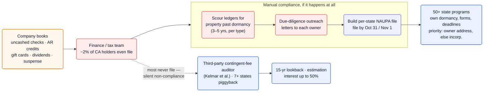
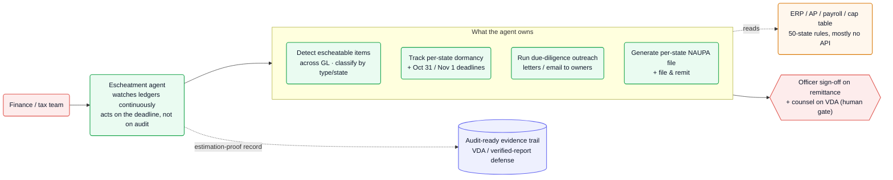

Every U.S. business that holds someone else's money — an uncashed payroll or vendor check, a credit balance, an unused gift-card balance, a stale dividend — is legally required to track it through a multi-year dormancy clock, attempt to find the owner, and remit it to the right state in a prescribed file format. Almost nobody does: in California, **an estimated 2% of holders are in compliance** ([Andersen][and]). The penalty for the other 98% isn't a missed-filing fine — it's a third-party contingent-fee auditor with a **15-year lookback, a mandatory interest rate up to 50%, and statutory authority to *estimate* liability** when records are thin ([Andersen][and]). The agent opportunity is to flip this from a latent landmine into a continuous background process: scan the general ledger for escheatable items, run the due-diligence outreach, and file each state's report on its deadline — before the audit notice arrives.

**Vitals:** market: states hold tens of $B (CA >$14B, NY $20B alone — [Andersen][and]) · `annual, per-state` · buyer: corporate finance / tax / controller · model: subscription + audit/VDA defense · whitespace: ★★★

Market context — where the money sits and why states press

- **The float is enormous and one-directional.** State programs returned **over $5 billion to owners in FY2023** ([NAUPA][naupaw]), yet the holdings only grow: California alone holds **more than $14 billion** (of which just $1.39B is booked as a current liability), New York **$20 billion** ([Andersen][and]). Property the rightful owner never claims effectively becomes state revenue.
- **For some states it's a budget pillar, not a rounding error.** Delaware — incorporation home to **two million-plus entities and two-thirds of the Fortune 500** ([Spotlight Delaware][spot]) — took in **>$550M of unclaimed property in 2024, ~7% of its budget** ([Spotlight Delaware][spot]); it has consistently been the state's **third-largest revenue source** ([Andersen][and]). That revenue dependence is exactly why enforcement is aggressive.
- **The buyer is every company with a payables ledger.** Exposure is created by ordinary AP, payroll, and equity operations, so the candidate pool is effectively all of mid-market-and-up corporate America — most of it unaware it has a filing obligation at all ([Andersen][and]).

## The mess

- **The obligation is invisible until it's expensive.** Escheatment liability accretes silently inside normal accounting — voided checks, write-offs, AR credits, suspense accounts — so a finance team that has never filed doesn't see a growing problem, only a clean-looking ledger. "Most companies do not fully understand the requirements… and, as a result, may be subject to material risk and liability" ([Andersen][and]).
- **Compliance is a 50-jurisdiction matrix, by hand.** Each state sets its own dormancy periods (generally **3–5 years** for vendor/AR property), forms, and deadlines (**most file by Oct 31 or Nov 1**), and the laws "are constantly changing" ([Andersen][and], [NAUPA][naupa], [UPPO][uppofall]). Which state gets a given item follows the *Texas v. New Jersey* priority rules — owner's last-known address, else the holder's state of incorporation ([Andersen][and]).
- **Due diligence is mandatory legwork.** Before remitting, holders must make a documented good-faith effort to reach each owner by mail or electronic notice ([NAUPA][naupa]) — a per-owner outreach campaign that scales with the size of the ledger.
- **The downside is estimation, not a fine.** With no statute of limitations that bites and **13–15-year reviews**, an auditor facing incomplete records uses "gross estimation techniques," and "it is not uncommon for holders to face higher estimated liabilities" than their actual exposure ([Andersen][and]) — a method one federal court said "shocked the conscience" ([DeCarrera][temple]).

## Why now

The model-capability inflection is real: detecting escheatable property means reasoning over messy GL line items, vendor masters, and equity records, matching them against a 50-state rules matrix, and drafting per-owner outreach and per-state filings — an LLM-over-records-plus-encoded-rules problem that wasn't tractable cheaply before. Nothing about that requires new data sources; it requires reading systems a company already has.

The enforcement tailwind is sharper still. California now forces the question onto the corporate income-tax return (AB 466) and is running a fresh outreach campaign — **~4,000 letters in late 2025, "likely an indicator that the State plans to increase its enforcement efforts"** ([Andersen][and]). Self-audit demands are rising across Florida, Illinois, Massachusetts, Utah, and D.C., and Delaware funnels non-filers through a 90-day VDA letter straight into audit ([Andersen][and]). Meanwhile the practice is under federal scrutiny — a CBS investigation into states "profiting" from unclaimed property has drawn bipartisan attention ([CBS News][cbs]). Net effect: the cost of staying invisible is going up at the same moment an agent can make compliance cheap.

## The money

| Signal | Figure | Basis |
| --- | --- | --- |
| Holder compliance rate (CA) | **~2%** of holders compliant | Andersen ([and]) — VERIFIED |
| Delaware interest exposure | mandatory **up to 50%**; 15-yr lookback | Andersen ([and]) — VERIFIED |
| California interest exposure | **12%/yr** on past-due property | Andersen ([and]) — VERIFIED |
| Audit duration | **3–7 years**, ≥7 states piggybacking | Andersen ([and]) — VERIFIED |
| State holdings (proxy for liability pool) | CA **>$14B**, NY **$20B** | Andersen ([and]) — VERIFIED |
| Returned to owners | **>$5B** in FY2023 | NAUPA ([naupaw]) — VERIFIED |

:::caution[The value capture is real but messier than property-tax]
There's no single "tax saved" number to take a cut of. The agent is paid from avoided interest/penalty and avoided estimation blow-ups — quantifiable only against a counterfactual audit. The cleaner commercial wedge is a **compliance subscription plus VDA/audit-defense engagements** (where reducing an auditor's *estimated* liability is itself billable), not a pure found-money contingency.
:::

## How it works today

Compliance, when it happens, is a once-a-year manual scramble run by a finance team against a deadline — and for ~98% of California holders it simply doesn't happen, which routes them instead to a contingent-fee auditor years later ([Andersen][and]).

![Unclaimed-property compliance today: a company's books accumulate escheatable items — uncashed checks, AR credits, gift-card balances, dividends, suspense accounts. A finance or tax team must scour the ledgers for property past its 3–5-year dormancy period, run due-diligence outreach letters to each owner, and build a per-state NAUPA-format file to submit by the Oct 31 / Nov 1 deadline to 50+ state programs, each with its own dormancy rules, forms, and deadlines under priority rules keyed to owner address or state of incorporation. Because most holders never file, they are instead routed to a third-party contingent-fee auditor (Kelmar and peers), with seven or more states piggybacking, facing a 15-year lookback, liability by estimation, and interest of up to 50%.](/diagrams/opportunities/unclaimed-property-escheatment-today.svg)

Mermaid source

## Where an agent fits

Turn an annual fire-drill into a standing background process. The agent connects to the systems that *create* exposure — ERP/AP, payroll, the cap table — and continuously classifies escheatable items by property type and owing state, tracks each item's dormancy clock against the per-state calendar, runs the owner due-diligence outreach, and generates and files the NAUPA-format report on each deadline. The byproduct is the thing that defeats estimation: a complete, dated, item-level record, so that if an audit comes, actual liability replaces a gross estimate. Humans keep two gates — an officer signs off on remittance, and counsel runs any voluntary-disclosure agreement.

This is the playbook in miniature: [an agent that acts on the deadline rather than waiting to be asked](/archive/ai-playbook/agent-assistant-to-actor/); [50 states' dormancy rules, forms, and deadlines encoded as a domain layer](/archive/ai-playbook/encoding-domain-rules/) instead of tracked in a spreadsheet; and [reading the ERP, payroll, and equity systems of record that mostly expose no clean API](/archive/ai-playbook/integrating-systems-without-apis/).

![Unclaimed-property compliance with an agent: a finance/tax team delegates to an escheatment agent that watches the ledgers continuously and acts on the deadline rather than on an audit. The agent owns detecting escheatable items across the GL and classifying them by type and state, tracking per-state dormancy and the Oct 31 / Nov 1 deadlines, running due-diligence outreach to owners, and generating the per-state NAUPA file and remitting — reading from ERP, AP, payroll, and cap-table systems whose 50-state rules mostly have no API. An officer signs off on remittance and counsel handles any VDA as the human gate, and the agent keeps an estimation-proof, audit-ready evidence trail.](/diagrams/opportunities/unclaimed-property-escheatment-agent.svg)

Mermaid source

## Whitespace & incumbents

The space is real but no one occupies the agentic detection-to-filing slot. The field sorts into three camps, none of which proactively finds your exposure and closes it:

- **Reporting software** — **Sovos** sells escheat software to "automate manual, time-consuming unclaimed property compliance processes" and "minimize penalties" ([Sovos][sovos]), and in Sep 2025 launched **ReportMyUP**, a self-service SMB platform for "property tracking, dormancy calculations, due diligence" ([ReportMyUP][rmup]); **Tracker PRO** bills itself "the most trusted unclaimed property compliance system in the world" ([UPPO][uppo]); the free **HRS Pro** just emits a NAUPA-format file ([NAUPA][naupa]). These are formatting-and-filing tools — they assume you already *know* what to report.
- **Consultants** — Big-4-adjacent advisory practices (Andersen, BDO, Deloitte) run VDAs and audit defense as fixed/hourly engagements. Expert, but bespoke and human-priced, so most under-the-radar holders never engage one until an audit notice forces it.
- **Auditors** — contingent-fee firms like **Kelmar** are the *adversary*, not a service to the holder; they monetize the very non-compliance an agent would prevent ([Andersen][and]).

:::note[Why this is ★★★ whitespace]
The incumbents are split between tools that file what you hand them and consultants who show up after the audit. The empty slot is an agent that does the *detection* — finding the escheatable items in the ledger continuously — which is exactly the part both camps assume is already solved.
:::

## Hard problems

| Problem | Why it's hard here | Signal | Likely approach (speculative) |
| --- | --- | --- | --- |
| Identifying what's actually escheatable | Escheatable items hide in ordinary accounting (write-offs, AR credits, suspense) and depend on property type × state; over-reporting forfeits company cash, under-reporting invites penalty | "Most companies do not fully understand the requirements" ([and]); estimation fills the gap when records are weak ([and]) | Probably LLM classification over GL/vendor/equity records against a per-type rules model, with a confidence threshold routing edge cases to a human reviewer |
| The 50-state rules matrix | Each state has its own dormancy periods, forms, deadlines, and the rules "are constantly changing" ([naupa]); priority rules route each item to a different state | 3–5-yr dormancy, Oct 31/Nov 1 deadlines, *Texas v. New Jersey* priority ([and], [uppofall]) | Likely a maintained per-state rules/calendar DSL — see [encoding domain rules](/archive/ai-playbook/encoding-domain-rules/) — versioned as statutes change |
| Reading the systems of record | Exposure lives in ERP, AP, payroll, and cap-table systems that mostly expose no clean API and differ per company | Sovos/Tracker sell *tracking* tools precisely because the source data is messy ([sovos], [uppo]) | Probably connectors + ingestion that normalize messy ledgers — see [integrating systems without APIs](/archive/ai-playbook/integrating-systems-without-apis/) |
| Surviving an audit / estimation | Auditors estimate liability over 13–15 years with no real statute of limitations; the defense is a complete, dated record | "gross estimation techniques… higher estimated liabilities" ([and]); estimation that "shocked the conscience" ([temple]) | Likely an immutable, item-level evidence trail purpose-built to replace an estimate with actuals in a VDA or audit |

## Sources

- [Andersen — Hot Topics in Unclaimed Property][and] — dormancy, priority rules, estimation, DE/CA audit mechanics, the 2% compliance figure
- [NAUPA — Reporting Overview][naupa] · [NAUPA — Who We Are][naupaw] — the three-step holder process, NAUPA file format, $5B returned
- [Spotlight Delaware][spot] — Delaware's escheat revenue and corporate-capital base
- [DeCarrera — Temple-Inland][temple] — estimation "shocked the conscience"
- [Sovos][sovos] · [ReportMyUP][rmup] · [UPPO — reporting software][uppo] · [UPPO][uppofall] — incumbent tooling and deadlines
- [CBS News — California Investigates][cbs] — federal scrutiny of state escheatment

Reconstructed from public sources; claims are tier-labeled (VERIFIED / INFERRED / SPECULATIVE) — see [how to read the tiers](/archive/opportunities/about/). Supporting quotes live in this repo's evidence map (`evidence/opp-unclaimed-property-escheatment-evidence-map.md`).

[and]: https://andersen.com/resources/hot-topics-in-unclaimed-property
[naupa]: https://unclaimed.org/reporting-overview/
[naupaw]: https://unclaimed.org/who-we-are/
[spot]: https://spotlightdelaware.org/2025/08/13/delaware-unclaimed-property-lawsuit/
[temple]: https://decarreralaw.com/temple-inland-delaware/
[sovos]: https://sovos.com/
[rmup]: https://reportmyup.com/
[uppo]: https://www.uppo.org/page/PDSoftware
[uppofall]: https://www.uppo.org/
[cbs]: https://www.cbsnews.com/cbs-california-investigates/
