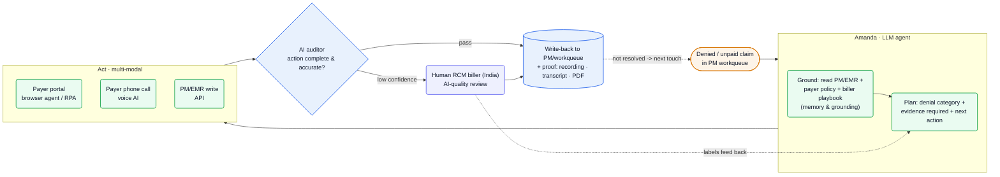
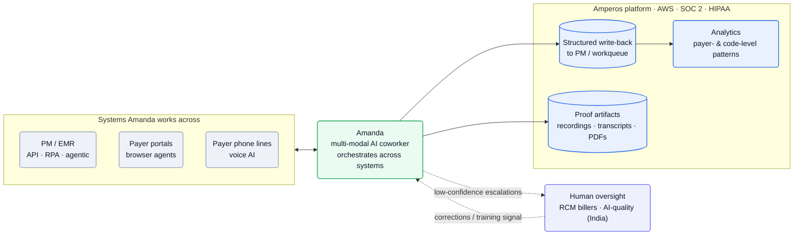

[Amperos][home] is *"healthcare's first AI-native denial management and revenue recovery platform"* ([Ashby][ashby]). Its product is **Amanda**, a *"multi-modal AI coworker"* for revenue-cycle management (RCM) that works denied and unpaid insurance claims **end-to-end** — like a human biller, but across *"phone + portals"* at once ([LLM blog][blog-llm], [Boulder blog][blog-boulder]). The engineering core is exactly that multi-modality: an LLM agent that holds real payer phone calls (voice), navigates payer portals (browser/RPA), reads and writes the practice-management/EMR system (API), then **audits its own work** before a human ever looks — with offshore RCM billers as the quality backstop.

**Vitals:** NYC (in-office) · $16M Series A (Bessemer · Uncork · Neo, Apr 2026) + $4.2M seed (Jun 2025) · small team · SOC 2 + HIPAA.

Business context — founders, funding, customers, metrics

- Co-founders: **Michal Miernowski** (CEO — career in healthcare-focused private equity), **Alvin Wu** (CPO — product, consumer health → enterprise SaaS), **Wilson Wang** (CTO — *"AI agent developer since early ChatGPT days"*) ([About][about]). NYC HQ, primarily in-office.
- **$16M Series A led by Bessemer Venture Partners**, with Uncork Capital and Neo (Apr 22 2026, [Series A][blog-a], [Bessemer][bvp]); builds on a **$4.2M seed** (June 2025) that launched **Amanda**, billed as *"the world's first AI biller for healthcare denials and collections"* ([Series A][blog-a]).
- Customers named publicly: **Boulder Care** (telehealth SUD), **U.S. Urology Partners**, **EyeCare Services Partners (ESP)**, **Tend Dental**, plus an unnamed inpatient provider ([Boulder blog][blog-boulder], [blog index][blog], [LLM blog][blog-llm]).
- Headline metrics: **22%+ higher claim recovery** vs. traditional vendors, **60%+ reduction in AR backlog**, **50% lower cost to collect**, **500K+ claims processed** ([home][home]); in the deep-dive, *"denials decrease by up to 80% after full deployment,"* collectors *"working 2–5× more claims within roughly eight weeks,"* and Amanda *"costs 50–80% less than a human"* per action ([LLM blog][blog-llm]).
- The market framing: U.S. claim denials hit ~12% in 2024, a *"$262 billion"* problem, amid RCM staffing shortages ([Series A][blog-a]).

## The heavy lifting

- **One agent, three modalities, one claim.** Amanda works a claim across the **payer phone line (voice), the payer portal (browser/RPA), and the PM/EMR (API)** — *"like a human collector … across the PM, payer [portals], and phone"* — rather than automating one isolated step and handing back to staff ([LLM blog][blog-llm]).
- **Read-and-reason, not record-and-replay.** Unlike RPA that *"loops clicks,"* the agent *"can read on-screen text and understand spoken responses,"* so it adapts to portal changes and live call turns — *"LLM agents can do the same actions as RPA (click, type), and they can also read and think"* ([LLM blog][blog-llm]).
- **Self-audit before handoff.** *"After every action — portal or call — she pauses to r[eview]"*; an *"AI auditor"* checks each portal action and call summary for completeness, so output is *"pre-audited"* before a human sees it, and *"every call is recorded and transcribed; every portal action is captured and exported to PDF"* for proof ([LLM blog][blog-llm]).

## Stack

The product is built from job posts, the engineering blog, and the trust footer; the team is a small applied-LLM shop on AWS. Languages/infra beyond Python+AWS aren't named — reconstructed in [Likely internals](#likely-internals).

| Layer | Choice | Evidence |
| --- | --- | --- |
| **Core language** | **Python** (heavy) for ML / applied-LLM work | [AI Research JD][jd-air] |
| **Cloud / infra** | **AWS** — dev-ops, observability, monitoring, compliance | [Infra JD][jd-infra] |
| **LLM layer** | **LLM orchestration**, prompt optimization, an **evaluation framework**, AI infra | [AI Research JD][jd-air] |
| **Voice** | *"state-of-the-art LLMs and speech technology"* for payer calls | [LLM blog][blog-llm], [Full-Stack JD][jd-fs] |
| **Browser / computer use** | **browser agents** for payer portals | [Full-Stack JD][jd-fs], [LLM blog][blog-llm] |
| **Legacy automation** | **RPA** where portals/EMRs have no API | [Integrations JD][jd-int], [LLM blog][blog-llm] |
| **EMR/PM integration** | *"APIs, RPA, or agentic flows"* into healthcare EMR software | [Integrations JD][jd-int] |
| **Self-audit** | an *"AI auditor"* reviews each action for completeness | [LLM blog][blog-llm] |
| **Observability** | **LLM observability** + monitoring on the AWS stack | [Infra JD][jd-infra] |
| **Proof artifacts** | call recordings + transcripts; portal actions exported to **PDF** | [LLM blog][blog-llm] |
| **Compliance** | **SOC 2**, **HIPAA** (monitored by Drata) | [home][home] |
| **Internal AI tooling** | Claude Code, Cursor, Figma Make (named in design role) | [Designer JD][jd-design] |

:::note[Key finding — the team eyes computer-use + voice frontier models]
The AI Research role wants engineers *"eager to try out the latest releases (ie. o1, OpenAI voice mode, Claude Computer-Use)"* ([AI Research JD][jd-air]) — the three capabilities Amanda is built on (reasoning, voice calls, portal/computer use), and a strong tell that the model layer leans on OpenAI + Anthropic frontier models.
:::

## Hard problems

The parts an engineer at this company loses sleep over. **Public signal** is cited (verified); **likely approach** is labeled speculation — best-practice fill-in, hedged.

| Problem | Why it's hard | Public signal | Likely approach (speculative) |
| --- | --- | --- | --- |
| **Real-time voice calls to payers** | A non-scripted phone call must hear, reason, and respond fast enough to navigate a payer rep through a denial, reliably, at fan-out | Amanda holds *"real conversations — not from a fixed script, but guided by an objective,"* with *"state-of-the-art LLMs and speech technology"* ([LLM blog][blog-llm]) | Streaming ASR + a fast LLM tier + TTS (OpenAI voice-mode-class), with biller-trained playbooks scoping each call; concurrency scaled per call |
| **Brittle, heterogeneous payer portals & EMRs** | Hundreds of payer portals and PM/EMR systems change constantly; many have no API; pure RPA breaks | integrations via *"APIs, RPA, or agentic flows"* ([Integrations JD][jd-int]); LLM agents *"read and think"* vs RPA's fixed clicks ([LLM blog][blog-llm]) | Browser agents that read+reason over the live DOM as the adaptive tier, RPA/API where stable; per-system connectors maintained by an integrations team |
| **Correctness & auditability in a compliance domain** | A wrong claim action loses revenue and is a HIPAA/compliance liability; output must be provable | per-action *"AI auditor,"* every call *"recorded and transcribed,"* every portal action *"exported to PDF"*; SOC 2 + HIPAA ([LLM blog][blog-llm], [home][home]) | Self-review gate + human-biller QA on low confidence; immutable proof-of-work artifacts per claim; write-back with structured fields |
| **Evaluating a non-deterministic agent** | Quality of a probabilistic biller across thousands of denial scenarios can't be unit-tested | AI Research owns an *"evaluation framework"* and improving the agent *"so it acts more human-like and collects more accurate … results"* ([AI Research JD][jd-air]) | Golden-set + LLM-as-judge over biller-labeled calls/claims; online scoring on recovery rate and override rate before widening autonomy |

## Likely internals

The infrastructure Amperos doesn't name publicly, inferred from the stack it does (heavy Python on AWS, multi-modal LLM agent, RCM-biller oversight):

| Component | Likely choice | Basis |
| --- | --- | --- |
| LLM providers | OpenAI + Anthropic frontier models, routed | role wants *"o1, OpenAI voice mode, Claude Computer-Use"* ([AI Research JD][jd-air]); providers not named in production |
| Voice stack | a real-time speech pipeline (OpenAI voice / Deepgram / ElevenLabs-class) + telephony | *"speech technology"* for payer calls ([LLM blog][blog-llm]); vendor unstated |
| Browser-agent infra | a managed cloud-browser layer (Browserbase/Playwright-class) | *"browser agents"* on payer portals ([Full-Stack JD][jd-fs]); platform not named |
| RPA tooling | an RPA framework or in-house drivers for no-API systems | *"RPA"* named for EMR integration ([Integrations JD][jd-int]) |
| Memory / grounding store | a vector index over payer policies + biller playbooks | *"memory & grounding … payer policies, and internal playbooks"* ([LLM blog][blog-llm]) |
| Eval / observability | a prompt-eval + LLM-observability stack (Langfuse/Braintrust-class) | *"evaluation framework"* + *"LLM observability"* ([AI Research JD][jd-air], [Infra JD][jd-infra]) |
| Primary DB | Postgres on AWS | claims/workqueue + relational RCM data; conventional for an AWS shop |
| Auth | enterprise SSO + audited access | SOC 2 / HIPAA, app at app.amperoshealth.com ([home][home]); vendor not named |

## Architecture

### Amanda's loop: ground → plan → act (multi-modal) → self-audit → write back

Amanda is *"built on LLMs,"* and the loop mirrors an experienced biller. She **grounds** on context — *"prior attempts, payer policies, and internal playbooks"* plus the PM/workqueue — then **plans** against the denial: she *"understand[s] denial categories, know[s] which questions"* and *"thousands of denial scenarios,"* and *"knows when and how to request reprocessing"* ([LLM blog][blog-llm]). She then **acts across modalities** — payer portal, phone call, and PM/EMR write-back — and after *every* action *"pauses to review,"* with an *"AI auditor"* checking completeness before handoff. Low-confidence work routes to a human RCM biller; everything is captured as proof ([LLM blog][blog-llm]).

![Amperos Amanda agent loop: a denied or unpaid claim from the PM workqueue enters Amanda, an LLM agent that first grounds on the PM/EMR plus payer policy and biller playbook (memory and grounding), then plans the denial category, required evidence and next action; it acts across three modalities — a payer portal via browser agent or RPA, a payer phone call via voice AI, and a PM/EMR write via API; an AI auditor then checks whether the action was complete and accurate, passing high-confidence results to a structured write-back to the PM/workqueue with proof artifacts (recording, transcript, PDF) while routing low-confidence work to a human RCM biller in India for AI-quality review whose labels feed back into planning; unresolved claims loop back for a next touch.](/diagrams/amperos-health/amanda-loop.svg)

Mermaid source

### Integration surfaces: where Amanda plugs in

The product's reach is defined by what it can touch. Integrations are built *"with healthcare EMR software using APIs, RPA, or agentic flows"* ([Integrations JD][jd-int]); Amanda *"orchestrates actions across systems and writes back structured updates"* to the PM/workqueue, and the captured data drives analytics — customers *"gain clear visibility into payer- and code-level patterns"* ([LLM blog][blog-llm]). Deployment is configured per customer: *"your Amperos deployment team maps your exact workflows, payor priorities, and standard operating procedures into the system"* ([Solution][solution]).

![Amperos integration map: Amanda, a multi-modal AI coworker, works across three system types — PM/EMR via API, RPA or agentic flows; payer portals via browser agents; and payer phone lines via voice AI — orchestrating across them; on the Amperos platform (AWS, SOC 2, HIPAA) it produces a structured write-back to the PM/workqueue, proof artifacts (recordings, transcripts, PDFs), and analytics over payer- and code-level patterns; a human oversight layer of RCM billers doing AI-quality review in India receives low-confidence escalations and feeds corrections back as a training signal.](/diagrams/amperos-health/integration-map.svg)

Mermaid source

:::note[Key finding — humans move from the line to AI quality]
Amperos hires offshore **RCM billers** in two flavors — *"Billing Associate (AR & Denials)"* and *"Billing Associate (AI Quality)"* ([Ashby][ashby]) — the same humans-as-oversight pattern seen at other agent companies: people don't work the claims, they review the agent's work and become its training signal.
:::

## Team & process

A three-founder team — **CEO Michal Miernowski**, **CPO Alvin Wu**, **CTO Wilson Wang** (*"AI agent developer since early ChatGPT days"*) — building in-office in NYC ([About][about]).

| Role | Person | Source |
| --- | --- | --- |
| Co-founder / CEO | Michal Miernowski — healthcare private equity | [About][about] |
| Co-founder / CPO | Alvin Wu — consumer health → enterprise SaaS | [About][about] |
| Co-founder / CTO | Wilson Wang — AI agent developer since early ChatGPT | [About][about] |

The engineering org is a compact **applied-LLM shop** ($170–300K + equity): **AI Research** (LLM orchestration, eval, AI infra — *"heavy Python"*), **Full-Stack** (voice AI, browser agents, generative features), **Integrations** (EMR via API/RPA/agentic), and **Infra** (AWS dev-ops + LLM observability) ([AI Research JD][jd-air], [Full-Stack JD][jd-fs], [Integrations JD][jd-int], [Infra JD][jd-infra]). There is **no in-house research org and no QA team** — quality is the *"AI auditor"* plus offshore RCM billers ([LLM blog][blog-llm], [Ashby][ashby]). Delivery is design-partner-led: an *"AI Deployment Strategist"* and a **deployment team** that *"maps your exact workflows, payor priorities, and standard operating procedures into the system"* ([Solution][solution], [Ashby][ashby]) — configure-per-customer, then let Amanda work, with humans auditing as autonomy widens.

## Sources

Reconstructed from public sources only — no insider information. Crawled 2026-06-09 via Chrome MCP (logged-out) + the Ashby posting API. First-party (amperos.com, the Amperos blog, Amperos's Ashby board) prioritized; Bessemer post labeled third-party. Claim tiers: **verified** (stated on a public page, linked) · **inferred** (reasoned from a cited signal, confidence flagged) · **speculative** (best-practice fill-in, labeled). Links are live; pages change, so the supporting quote for each claim is kept in this repo's evidence map (`evidence/amperos-health-evidence-map.md`).

| # | Source | Link |
| --- | --- | --- |
| S1 | Homepage | <https://www.amperos.com/> |
| S2 | About | <https://www.amperos.com/about> |
| S3 | Solution — End-to-End Insurance Recovery | <https://www.amperos.com/end-to-end-insurance-recovery> |
| S4 | Blog index | <https://www.amperos.com/blog> |
| S5 | Blog — How LLMs are transforming RCM | <https://www.amperos.com/blog/how-llms-are-transforming-revenue-cycle-management> |
| S6 | Blog — Series A announcement | <https://www.amperos.com/blog/series-a-announcement> |
| S7 | Blog — Boulder Care engages Amperos | <https://www.amperos.com/blog/boulder-care-a-leading-telehealth-substance-use-disorder-platform-engages-amperos-to-automate-denial-and-collections-work-with-ai-agents> |
| S8 | Job board (Ashby) | <https://jobs.ashbyhq.com/amperos> |
| S9 | AI Research Engineer (JD) | <https://jobs.ashbyhq.com/amperos> |
| S10 | Software Engineer, Full Stack (JD) | <https://jobs.ashbyhq.com/amperos> |
| S11 | Software Engineer, Integrations (JD) | <https://jobs.ashbyhq.com/amperos> |
| S12 | Software Engineer, Infra (JD) | <https://jobs.ashbyhq.com/amperos> |
| S13 | Bessemer — Amperos Series A (third-party) | <https://www.bvp.com/news/amperos-tackling-healthcares-260b-denial-management-problem> |

[home]: https://www.amperos.com/
[about]: https://www.amperos.com/about
[solution]: https://www.amperos.com/end-to-end-insurance-recovery
[blog]: https://www.amperos.com/blog
[blog-llm]: https://www.amperos.com/blog/how-llms-are-transforming-revenue-cycle-management
[blog-a]: https://www.amperos.com/blog/series-a-announcement
[blog-boulder]: https://www.amperos.com/blog/boulder-care-a-leading-telehealth-substance-use-disorder-platform-engages-amperos-to-automate-denial-and-collections-work-with-ai-agents
[ashby]: https://jobs.ashbyhq.com/amperos
[jd-air]: https://jobs.ashbyhq.com/amperos
[jd-fs]: https://jobs.ashbyhq.com/amperos
[jd-int]: https://jobs.ashbyhq.com/amperos
[jd-infra]: https://jobs.ashbyhq.com/amperos
[jd-design]: https://jobs.ashbyhq.com/amperos
[bvp]: https://www.bvp.com/news/amperos-tackling-healthcares-260b-denial-management-problem
