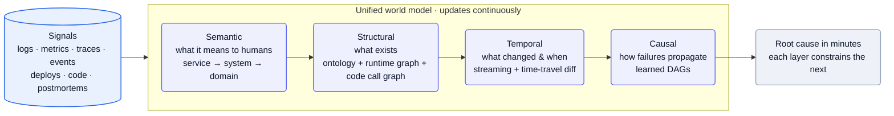
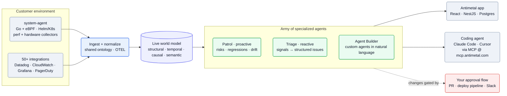

[Antimetal][home] is building *"the autonomous system for production"* — *"a new layer between your team and your running systems"* that *"diagnoses … fixes … prevents,"* sitting *"on top of the observability tools you already use"* and using their data ([home][home]). The architecture is two halves: *"a live world model, a continuous understanding of how your stack behaves"* and *"an army of specialized agents [that] acts on the model to diagnose, fix, prevent, and answer any question"* ([home][home]). The engineering core is the world model itself — a four-layer representation fed by a first-party **Go/eBPF in-cluster agent** — plus an MCP that drops production context into your coding agent.

**Vitals:** founded 2022 · Series A ($20M, Sound Ventures) · ~20 people · NYC (on-site).

Business context — founders, funding, the pivot

- Founded 2022 in NYC by **Matthew Parkhurst** (CEO) and **Shreyas Iyer** (CTO) ([TechCrunch][tc], [press release][pr]).
- **$4.3M seed** led by Framework Ventures (2023, [TechCrunch][tc]); **$20M Series A** led by **Sound Ventures** (June 2025), with Buckley Ventures, Nat Friedman, Daniel Gross, Aravind Srinivas, Ben Uretsky, Aaron Levie, and Arash Ferdowsi ([press release][pr]).
- The CEO frames the wedge as a category error in tooling: *"More dashboards, more alerts, more tools. It's not a headcount problem. It's a complexity problem"* ([press release][pr]). **SOC 2, GDPR, and HIPAA compliant** ([home][home]).
- **The pivot is the story:** Antimetal launched in 2022 as **AWS cost optimization** — promising to *"save customers up to 75%"* and auto-reselling reserved instances ([TechCrunch][tc]). The current product is a different company — autonomous production engineering on a world model — and the cost-optimizer was the wedge that mapped the harder problem.

## The heavy lifting

- **A four-layer world model, not a bigger context window.** Signals compile into structural (ontology + runtime graph + code call graph), temporal (streaming + time-travel diff), causal (learned DAGs), and semantic layers, each constraining the next — the fix for a v1 agent that *"latched onto symptoms over causes"* ([world-model post][worldmodel]).
- **Own the collection layer with a Go + eBPF in-cluster agent.** The `system-agent` ships kernel-level performance and hardware collectors as a Helm chart, producing first-party telemetry the vendor dashboards never expose — raw signal for the model, not just scraped metrics ([system-agent repo][gh-agent]).
- **An explicit shared model as a multi-agent coordination surface.** Because the representation is explicit, many agents investigate different regions of the system in parallel over the full model without duplicating work — how it scales to *"trillions of data points per day"* ([world-model post][worldmodel]).

## Stack

A TypeScript product core, a Go + eBPF agent in the customer's cluster, and a Python research surface. Every component below is named in a first-party JD, blog post, or public repo.

| Layer | Choice | Evidence |
| --- | --- | --- |
| **Product backend** | **TypeScript + NestJS** | [Product Eng JD][jd-pe], [Agents JD][jd-agents] |
| **Frontend** | **React** | [Product Eng JD][jd-pe], [Agents JD][jd-agents] |
| **Primary datastore** | **PostgreSQL** | [Product Eng JD][jd-pe], [Agents JD][jd-agents] |
| **In-cluster agent** | **Go + eBPF** (`system-agent`) | [system-agent repo][gh-agent] |
| **Agent packaging** | **Helm charts**, Docker (amd64 + arm64) | [system-agent repo][gh-agent] |
| **Orchestration** | **Kubernetes** | [Platform JD][jd-platform], [helm-charts][gh] |
| **Telemetry standard** | **OpenTelemetry (OTEL)** | [Platform JD][jd-platform], [opentelemetry-demo fork][gh] |
| **Internal observability** | **Datadog**, OTEL/distributed tracing | [Platform JD][jd-platform] |
| **Research / ML** | **Python** (+ TypeScript) | [Research JD][jd-research] |
| **Customer onboarding IaC** | **Terraform** (provider + AWS module) | [GitHub][gh] |
| **Agent ↔ tools fabric** | **MCP gateway** + self-hosted MCP servers, **OAuth** | [Platform JD][jd-platform], [MCP post][mcp] |
| **Retrieval** | semantic search + keyword + API + **SQL** | [Agents JD][jd-agents] |
| **Internal coding agent** | **Claude Code** (heavy use) | [Platform JD][jd-platform] |
| **Internal onboarding tool** | **Anvil** | [Anvil post][anvil] |
| **Docs** | **Mintlify** | [GitHub][gh] |

:::note[Key finding — they own the collection layer, not just vendor APIs]
The `system-agent` is **Go with eBPF** kernel programs for *"performance collectors"* and *"hardware discovery"*, shipped as a Helm chart into the customer's Kubernetes cluster ([system-agent repo][gh-agent]). First-party kernel-level telemetry — not only scraping Datadog/CloudWatch — is what feeds the world model the raw signal those dashboards never expose.
:::

## Hard problems

The parts an engineer would lose sleep over. **Public signal** is cited (verified); **likely approach** is labeled speculation — best-practice fill-in, hedged.

| Problem | Why it's hard | Public signal | Likely approach (speculative) |
| --- | --- | --- | --- |
| **Evaluating agents that change production** | An agent that fixes prod can't be regression-tested like a service; a bad change has blast radius, and eval is the only safety rail. | Research builds *"live and offline evaluation pipelines, benchmarks, and synthetic data generation"* jointly *"with platform"* ([jd-research][jd-research]); plus *"sandboxed shadow traffic environments to run our product against live customer events"* ([anvil][anvil]) | Likely a shadow/replay harness over recorded incidents + reasoning traces as offline benchmarks, with live online eval scored on acceptance and override rates before any action ships |
| **Autonomy gating without bad automated changes** | Crossing from suggest to act is irreversible per change; over-trust ships a wrong fix, under-trust kills the product's value. | *"Initially, these systems should assist … As confidence grows through repeated acceptance, low override rates, or explicit approval, it begins automating"* ([vision][vision]); default *"changes still route through your existing approval flow"* ([home][home]) | Likely a per-action-class trust score gated on measured acceptance/override history, defaulting to PR/Slack approval and graduating specific low-risk action types to autonomous |
| **Keeping the world model current at scale** | A stale model gives wrong root causes; staying live means ingesting *"trillions of data points per day"* across *"thousands of services"* without falling behind. | Temporal layer needs *"a streaming architecture"* plus time travel — *"rewind to any point in the past … and diff against the current state"* — over *"thousands of services emitting trillions of data points per day"* ([worldmodel][worldmodel]) | Likely a streaming bus (Kafka/Kinesis) into incremental graph updates, with an event-sourced/append-only store so any past state is reconstructable for the diff |
| **Observability of non-deterministic multi-agent investigations** | Many agents reasoning in parallel over a shared model are hard to debug, attribute, or reproduce when an investigation goes wrong. | *"multiple agents can investigate different regions of the system in parallel, each using the full model"* ([worldmodel][worldmodel]); platform owns *"investigation traces, agent trajectories"* as first-class data ([jd-platform][jd-platform]) | Likely full trajectory capture (every tool call, model step, and decision) persisted per investigation, feeding both replay-based debugging and the offline eval set above |

## Likely internals

The infrastructure Antimetal doesn't name publicly, inferred from the stack it does:

| Component | Likely choice | Basis |
| --- | --- | --- |
| Reasoning LLM | a frontier model behind a provider abstraction (Anthropic/OpenAI), swappable | agentic workflows + heavy internal Claude Code use ([Platform JD][jd-platform]); no production model named |
| Production models | prompted frontier models today; fine-tuning / RL as a research direction | Research JD mentions fine-tuning + RL ([Research JD][jd-research]); in-house vs. prompted is unconfirmed |
| Temporal / structural store | a graph database (or event-sourced log) for the runtime + code graphs with time travel | the model needs streaming updates and *"rewind to any point in the past"* ([world-model post][worldmodel]); Postgres alone doesn't fit graph + time travel |
| Semantic retrieval | embeddings + a vector index (pgvector or a managed vector DB) | *"semantic search"* is confirmed ([Agents JD][jd-agents]); pgvector reuses the existing Postgres |
| Agent orchestration | an in-house orchestrator over a graph/state machine, with eval in the loop | *"orchestration, context management, memory"* + RL ([Research JD][jd-research]); no named framework |
| Stream ingest | a streaming bus (Kafka/Kinesis) into the normalization layer | *"trillions of data points per day"* ([world-model post][worldmodel]) needs durable high-throughput ingest |
| Own-platform cloud | AWS (EKS) | AWS-first product heritage + terraform-aws module ([GitHub][gh]); Kubernetes confirmed ([Platform JD][jd-platform]) |
| Auth | managed IdP / enterprise SSO | SOC 2 / HIPAA enterprise buyers ([home][home]); no vendor named |

## Architecture

### The world model: one representation, four layers

The first version of Antimetal was *"an AI agent in a simple search-and-synthesis loop"* — dump observability, infra, deploys, and code into context and ask for a root cause. *"In complex environments, quality quickly degraded,"* latching onto symptoms over causes ([world-model post][worldmodel]). The diagnosis: *"This wasn't a technology problem. It was a representation problem."*

The fix is a unified **world model** with four layers that *"updates continuously,"* each one constraining the search space for the next ([world-model post][worldmodel]):

Mermaid source

- **Structural** — *"what exists."* A provider-agnostic **ontology** maps components to a shared lexicon, a **runtime graph** is built from logs/traces, and a **code call graph** comes from *"parsing code into ASTs, resolving functions and call sites."* Logs and traces are the link between runtime and code ([world-model post][worldmodel]).
- **Temporal** — *"what changed, and when."* Requires *"a streaming architecture"* to stay current, plus **time travel**: *"rewind to any point in the past … and diff against the current state"* to narrow the search ([world-model post][worldmodel]).
- **Causal** — *"how failures propagate."* Encoded as **directed acyclic graphs**, learned from three sources: system changes (natural experiments), parsed **postmortems**, and confirmed **reasoning traces** ([world-model post][worldmodel]).
- **Semantic** — *"what the system means to humans."* Built *"by watching engineers work"* until *"services cluster into systems, and systems cluster into domains"* ([world-model post][worldmodel]).

:::note[Key finding — the model is a multi-agent coordination surface]
Because the representation is explicit and shared, *"multiple agents can investigate different regions of the system in parallel, each using the full model, without duplicating work."* That is how Antimetal claims to scale to *"thousands of services emitting trillions of data points per day"* ([world-model post][worldmodel]).
:::

### The platform: signals in, gated actions out

The in-cluster `system-agent` and 50+ observability integrations feed normalization; the world model sits in the middle; the agents act on top; everything actionable routes back through the customer's own approval flow.

![Antimetal platform architecture: in the customer environment, a Go/eBPF system-agent on Kubernetes and 50+ integrations (Datadog, CloudWatch, Grafana, PagerDuty) feed an ingest/normalize layer using a shared ontology and OTEL; that builds the live world model; an army of specialized agents (Patrol for proactive risk, Triage for reactive issues, Agent Builder for custom agents in natural language) act on the model and surface to the Antimetal React/NestJS app and to coding agents (Claude Code, Cursor) via the MCP at mcp.antimetal.com, with changes gated by the customer's PR / deploy pipeline / Slack approval flow.](/diagrams/antimetal/architecture.svg)

Mermaid source

The agents are productized as named surfaces ([home][home]): **Patrol** (*"continuously watches for operational risks, regressions, and system drift"*), **Triage** (*"turns noisy production signals into structured, actionable issues"*), **World Model** (*"continuously learns how your systems and teams behave"*), and **Agent Builder** (*"create custom operational agents via natural language"*).

### The MCP: production context inside your coding agent

Rather than confine itself to a dashboard, Antimetal ships *"a single MCP for the runtime context your coding agent is missing"* ([MCP post][mcp]). It *"pulls from 50+ integrations—Datadog, CloudWatch, Grafana, PagerDuty, and more,"* normalized into **six tools** — `investigate_issue`, `get_issue_report`, `get_issue_fixes`, `search_issues`, `get_artifact`, `ask` — plus `/investigate` and `/fix` skills ([MCP post][mcp], [skills repo][gh-skills]). The server is live at **mcp.antimetal.com** and installs into **Claude Code** (OAuth) and **Cursor** (API key) ([skills repo][gh-skills]).

:::note[Inference — the MCP is the distribution wedge — confidence: medium]
Aggregating 50+ tools behind one normalized interface, then meeting engineers *inside* Claude Code/Cursor where they already work, is a land-and-expand motion: read-only context first, gated `/fix` second. The same world model powers both the standalone app and the MCP ([MCP post][mcp]).
:::

## Team & process

Small, senior, in-person NYC — **9 open roles, four in engineering** (Platform, Product, Product/Agents, Research), comp **$200–300K + equity**; third-party trackers put headcount in the 11–50 band (~20) ([Ashby][ashby], [Platform JD][jd-platform]).

| Role | Person | Source |
| --- | --- | --- |
| Co-founder / CEO | Matthew Parkhurst | [press release][pr] |
| Co-founder / CTO | Shreyas Iyer | [press release][pr], [world-model post][worldmodel] |

The eng shape: a **Platform** track owning *"the MCP gateway … OAuth and credential management … self-hosted MCP servers"* and the data substrate (*"investigation traces, agent trajectories, the resource graph, customer telemetry"*); **Product** and **Product (Agents)** building agentic incident workflows; and **Research** on *"infrastructure intelligence, autonomous agents, evaluation … multi-step reasoning, orchestration, context management, memory, and reinforcement learning"* — with **eval owned jointly by research and platform**, not a separate QA org ([Ashby][ashby], [Research JD][jd-research]). The culture is agent-native (*"we're all heavy users of Claude Code"* ([Platform JD][jd-platform])), and the operating philosophy is **automate-before-you-hire**: **Anvil**, an internal tool with authenticated production access, runs a five-stage onboarding pipeline that *"cut the hands-on work by around 80%,"* tested against *"sandboxed shadow traffic environments to run our product against live customer events,"* looping humans in only for judgment ([Anvil post][anvil]). Autonomy is earned: *"initially, these systems should assist … As confidence grows … it begins automating,"* and by default *"changes still route through your existing approval flow"* ([vision post][vision], [home][home]).

## Sources

Reconstructed from public sources only — no insider information. Crawled 2026-06-07. Claim tiers: **verified** (stated on a public page, linked) · **inferred** (reasoned from a cited signal, confidence flagged) · **speculative** (best-practice fill-in, labeled). Links are live; pages change, so the supporting quote for each claim is kept in this repo's evidence map (`evidence/antimetal-evidence-map.md`).

| # | Source | Link |
| --- | --- | --- |
| S1 | Homepage | <https://antimetal.com/> |
| S2 | Research log (blog index) | <https://antimetal.com/blog> |
| S3 | "Building a Unified Model of Software Systems" (Iyer & Roy) | <https://antimetal.com/blog/building-a-unified-model-of-software-systems> |
| S4 | "Introducing Antimetal for Coding Agents" (Casey) | <https://antimetal.com/blog/introducing-antimetal-for-coding-agents> |
| S5 | "How we automated technical implementation" (Naidu) | <https://antimetal.com/blog/how-we-automated-technical-implementation> |
| S6 | "The Future of Infrastructure is Invisible" (Iyer) | <https://antimetal.com/blog/the-future-of-infrastructure-is-invisible> |
| S7 | Job board (Ashby) | <https://jobs.ashbyhq.com/antimetal> |
| S8 | Platform Engineer (JD) | <https://jobs.ashbyhq.com/antimetal/f7619c4a-8e35-4b70-875b-0586a93c9a54> |
| S9 | Product Engineer (JD) | <https://jobs.ashbyhq.com/antimetal/c8d8ccad-70cf-4961-ad56-1f5512c7f766> |
| S10 | Product Engineer - Agents (JD) | <https://jobs.ashbyhq.com/antimetal/cc1139f1-e5c3-4527-876e-63d05007ac9b> |
| S11 | Research Engineer (JD) | <https://jobs.ashbyhq.com/antimetal/1bbcb7e5-f3c3-4060-ad50-6f76157fcacf> |
| S12 | GitHub org | <https://github.com/antimetal> |
| S13 | system-agent (Go + eBPF) | <https://github.com/antimetal/system-agent> |
| S14 | skills (MCP / coding-agent plugin) | <https://github.com/antimetal/skills> |
| S15 | Connect / MCP docs | <https://docs.antimetal.com/connect> |
| S16 | TechCrunch (third-party — 2023 seed + origin) | <https://techcrunch.com/2023/05/08/antimetal-is-putting-ai-to-work-to-root-out-cloud-cost-inefficiencies/> |
| S17 | Series A press release (PR Newswire) | <https://www.prnewswire.com/news-releases/antimetal-raises-20m-to-automate-infrastructure-management-302480516.html> |

[home]: https://antimetal.com/
[blog]: https://antimetal.com/blog
[vision]: https://antimetal.com/blog/the-future-of-infrastructure-is-invisible
[worldmodel]: https://antimetal.com/blog/building-a-unified-model-of-software-systems
[mcp]: https://antimetal.com/blog/introducing-antimetal-for-coding-agents
[anvil]: https://antimetal.com/blog/how-we-automated-technical-implementation
[ashby]: https://jobs.ashbyhq.com/antimetal
[jd-platform]: https://jobs.ashbyhq.com/antimetal/f7619c4a-8e35-4b70-875b-0586a93c9a54
[jd-pe]: https://jobs.ashbyhq.com/antimetal/c8d8ccad-70cf-4961-ad56-1f5512c7f766
[jd-agents]: https://jobs.ashbyhq.com/antimetal/cc1139f1-e5c3-4527-876e-63d05007ac9b
[jd-research]: https://jobs.ashbyhq.com/antimetal/1bbcb7e5-f3c3-4060-ad50-6f76157fcacf
[gh]: https://github.com/antimetal
[gh-agent]: https://github.com/antimetal/system-agent
[gh-skills]: https://github.com/antimetal/skills
[tc]: https://techcrunch.com/2023/05/08/antimetal-is-putting-ai-to-work-to-root-out-cloud-cost-inefficiencies/
[pr]: https://www.prnewswire.com/news-releases/antimetal-raises-20m-to-automate-infrastructure-management-302480516.html
