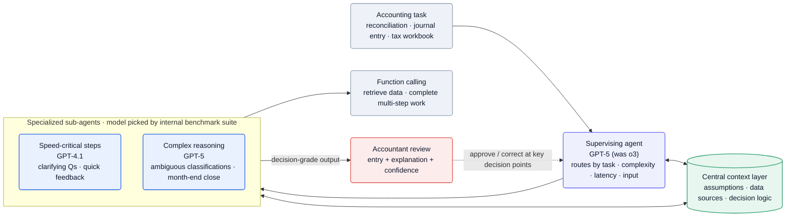
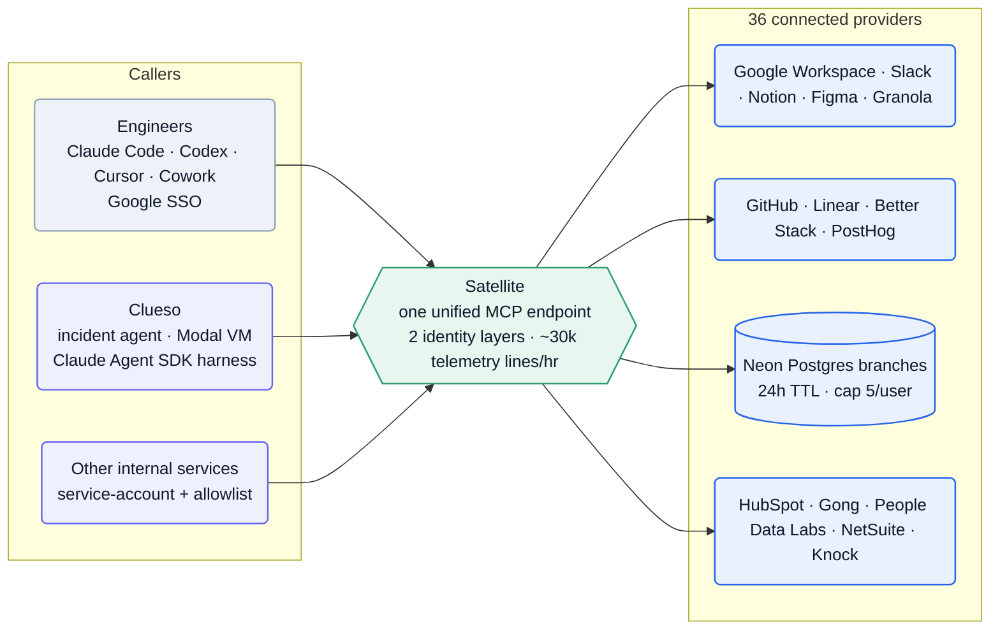

[Basis][home] builds **AI agents that do accounting work end-to-end** for accounting firms — *"agents that do real accounting work, end to end. These agents run autonomously, sometimes for hours, collaborating with accountants at key decision points"* ([about][about]). The visible workload is reconciliations, journal entries, financial summaries, technical accounting memos, and *"a partnership tax workbook end to end"* ([OpenAI case study][openai], [Series B][seriesb]). The technical story is two-sided: a multi-agent **product** (a GPT-5 supervisor routing to model-benchmarked sub-agents over a reviewable context layer) and an agent-native **company** built to ship it (Atlas, the Satellite MCP gateway, the Clueso incident agent).

**Vitals:** founded 2023 · Series B ($100M @ $1.15B) · ~80 people · NYC (in-person, Flatiron).

Business context — founders, funding, customers

- Co-founders **Matt Harpe** (CEO) and **Mitchell Troyanovsky** ([Series B][seriesb], [OpenAI case study][openai]).
- **$100M Series B at a $1.15B valuation** (Feb 24 2026), led by **Accel** (Miles Clements) and **GV** ([Series B][seriesb]); follows a **$34M Series A** led by **Khosla Ventures** and a **$3.6M** seed ([blog][blog]).
- Backers include **Khosla (Keith Rabois & Vinod Khosla), Nat Friedman & Daniel Gross, Adam D'Angelo, Jeff Dean, Jack Altman, Noam Brown, Kyle Vogt, Amjad Masad, Clem Delangue** ([Ashby][ashby]).
- The wedge is **reviewable autonomy**, not a copilot: firms report *"up to 30% time savings"* and redirect recovered capacity to advisory work ([OpenAI case study][openai]). *"Basis supports a significant share of large accounting firms across the U.S."* ([OpenAI case study][openai]); named partnership with **Baker Tilly** ([blog][blog]).
- *"Racing to deploy the most advanced applied ML at production scale"* ([Ashby][ashby]).

## The heavy lifting

- **Per-step model routing off an internal benchmark.** A supervisor (GPT-5, was o3) routes each step to a sub-agent whose model is chosen by a scored internal benchmark suite re-run every release — GPT-4.1 for latency-sensitive steps, GPT-5 for hard reasoning ([OpenAI case study][openai]).
- **Autonomy gated on explainability, not just accuracy.** Each release is benchmarked on *"how clearly the model can explain its reasoning"*; a workflow ships only when the model both performs and emits the data lineage + confidence a CPA signs off on ([OpenAI case study][openai]).
- **The company is the product's test harness.** Internal agents hit one Satellite MCP gateway over 36 providers; the Clueso incident agent (Modal + Claude Agent SDK) clears 78% of bugs first-pass — the same supervisor/sub-agent + shared-context patterns sold to firms ([Satellite][satellite], [Clueso][clueso]).

## Stack

TypeScript + Python across the board, with OpenAI frontier models as the product's reasoning substrate and a mix of coding-agent harnesses internally. Two columns of evidence: the customer-facing product, and the internal "Atlas" platform.

| Layer | Choice | Evidence |
| --- | --- | --- |
| **Product reasoning models** | OpenAI **o3, o3-Pro, GPT-4.1, GPT-5** | [OpenAI case study][openai] |
| **Supervising agent** | **GPT-5** (originally o3) | [OpenAI case study][openai] |
| **Sub-agents** | range of OpenAI models, chosen per task — **GPT-4.1** (speed), **GPT-5** (deep reasoning) | [OpenAI case study][openai] |
| **Model selection** | internal **benchmark suite** scoring capability/traits per release | [OpenAI case study][openai] |
| **Languages** | **Python + TypeScript** (monorepo) | [monorepo][monorepo] |
| **Lint / types** | **Ruff**, **BasedPyright**, **ESLint**, **Prettier** | [monorepo][monorepo] |
| **Internal tool gateway** | **Satellite** — one **MCP** endpoint fronting **36 providers** | [Satellite][satellite] |
| **Internal coding agents** | **Claude Code, Codex, Cursor, Cowork** (all MCP clients) | [Satellite][satellite] |
| **Internal incident agent** | **Clueso** — **Modal** VM + **Claude Agent SDK** harness | [Clueso][clueso] |
| **Dev databases** | **Neon** (Postgres branches, 24h TTL) | [Satellite][satellite] |
| **Observability** | **Better Stack**, **PostHog** | [monorepo][monorepo] |
| **SSO / identity** | **Google Workspace** SSO (humans); service accounts + allowlists (services) | [Satellite][satellite] |
| **Internal SaaS** | Slack, Linear, GitHub, Figma, Notion, Granola, Knock, HubSpot, Gong, NetSuite, People Data Labs | [Satellite][satellite] |

:::note[Key finding — model-agnostic by benchmark, not by allegiance]
Basis picks the model per step from a scored internal suite, and re-runs it every release — GPT-5 hit *"a perfect 100% success rate"* on its parallel-tool-calling benchmark before being promoted to the supervisor role ([OpenAI case study][openai]). The product is built so a better model upgrades the whole system, not so one model is load-bearing.
:::

## Hard problems

The parts an engineer would lose sleep over. **Public signal** is cited (verified); **likely approach** is labeled speculation — best-practice fill-in, hedged.

| Problem | Why it's hard | Public signal | Likely approach (speculative) |
| --- | --- | --- | --- |
| **Trajectory-level eval & credit assignment** | An agent runs hours across thousands of decisions; attributing a bad outcome to one reasoning step, and tuning judges over subjective accounting calls, doesn't reduce to pass/fail | Basis names it as an open frontier — *"An agent runs for five hours across thousands of decisions. How do we attribute outcomes back to specific reasoning steps? How do we tune eval judges when the judgement includes subjectivity?"* ([mts][mts]) | Likely a dedicated Agent Platform eval-systems team building step-level trace replay + LLM-judge harnesses graded against accountant corrections |
| **Audit-grade explainability** | In accounting, a wrong-but-confident journal entry is an audit/compliance liability; the output must justify itself well enough for a CPA to sign off | Each output carries *"what data was used, why it was mapped that way, and how confident the system is"*, and models are benchmarked on *"how clearly the model can explain its reasoning"* to gate go-live ([openai][openai]) | Likely explanation + confidence treated as first-class eval metrics, with new workflows probably gated behind an explainability threshold, not just an accuracy one |
| **Per-firm data isolation** | Agents act autonomously over multiple firms' client financials; one cross-tenant leak via a tool call is catastrophic and a compliance breach | Agents touch client financials and a GRC role is open, but tenancy controls are undescribed ([ashby][ashby]) | Likely schema-per-tenant or row-level isolation plus scoped, per-firm agent tool access enforced at the Satellite-style gateway |
| **Model-version churn** | The product is built on bought OpenAI models that change under it; each release can shift behavior on long-horizon accounting tasks | Basis re-benchmarks every release — GPT-5 hit *"a perfect 100% success rate"* on its tool-calling benchmark before promotion to supervisor ([openai][openai]) | Likely an automated benchmark gate in CI that re-scores candidate models per workflow and only promotes one that clears accuracy + explainability bars |

## Likely internals

The infrastructure Basis doesn't name publicly, inferred from the stack it does — and from the fact that Modal/Neon/Google-SSO are confirmed only on the *internal* side:

| Component | Likely choice | Basis |
| --- | --- | --- |
| Product front end | React / Next.js (TypeScript) | TypeScript confirmed in the monorepo ([monorepo][monorepo]); React the low-surprise default for a review-heavy web app |
| Product backend compute | containerized Python services (Modal or a cloud container runtime) | Modal confirmed for internal Clueso ([Clueso][clueso]); the product's Python services plausibly reuse it, but it's unstated |
| Customer accounting-data store | PostgreSQL | Neon Postgres confirmed for *dev* ([Satellite][satellite]); Postgres the conventional system of record for structured financial data |
| Context-layer retrieval | embeddings + pgvector / a managed vector DB | a "central context layer" surfacing sources implies retrieval; the store isn't public |
| LLM gateway | thin internal router over OpenAI (+ benchmark hooks) | benchmark-driven model selection ([OpenAI case study][openai]) implies a routing abstraction, though it isn't named |
| Per-firm isolation | row-level / schema-per-tenant + scoped agent tool access | client financials demand tenancy isolation; an open GRC role ([Ashby][ashby]) signals controls exist |
| Customer auth | a managed IdP (Auth0 / WorkOS / Stytch) | Google SSO confirmed *internally* ([Satellite][satellite]); firm-facing SSO/SAML usually via a managed IdP |
| Secrets | a secrets manager behind Satellite | Satellite already does "secrets-manager indirection" for shared keys ([Satellite][satellite]) |

## Architecture

### The product: a supervisor that routes to model-matched sub-agents

Basis *"treats accounting as a system of workflows, each with its own context and complexity"* and built *"a multi-agent architecture that assigns the best-fit OpenAI model to the right job"* ([OpenAI case study][openai]). Every task opens with a **supervising agent** — *"originally built on OpenAI o3 and now migrated to GPT-5, which coordinates the full process—routing steps to specialized sub-agents based on task, complexity, latency needs, and input type"* ([OpenAI case study][openai]). Sub-agents draw from a range of models *"selected by an internal benchmark suite"* — GPT-4.1 for *"speed-critical interactions, like clarifying questions mid-review,"* GPT-5 for *"interpreting unusual transaction patterns, resolving ambiguous classifications, or … month-end close"* ([OpenAI case study][openai]).

![Basis product architecture: an accounting task enters a GPT-5 supervising agent that routes by task, complexity, latency and input type to specialized sub-agents (GPT-4.1 for speed, GPT-5 for deep reasoning) whose model is chosen by an internal benchmark suite; agents read and write a central context layer of assumptions, data sources and decision logic, use function calling to complete multi-step work, and return decision-grade output with explanation and confidence to an accountant who approves or corrects at key decision points.](/diagrams/basis/product-architecture.svg)

Mermaid source

Two design choices make the autonomy sellable to auditors. First, a **shared context layer**: agents *"act independently but share context through a central layer, surfacing assumptions, data sources, and the logic behind each decision"* — so a journal entry arrives with *"what data was used, why it was mapped that way, and how confident the system is in its recommendation"* ([OpenAI case study][openai]). Second, **function calling** turned proposals into completed work — *"enabling agents to complete multi-step processes like reconciliations and journal entries, not just propose them"* ([OpenAI case study][openai]).

:::note[Key finding — explainability is gated, not assumed]
Basis benchmarks each model release on real workflows *"evaluating not just accuracy, but how clearly the model can explain its reasoning,"* and uses that to decide *"when agents can safely take on new workflows"* ([OpenAI case study][openai]). New autonomy ships only when a model can both do the task and account for it.
:::

### The internal platform: Atlas, Satellite, Clueso

Basis runs the same agent thesis on itself. The **Atlas** team's mandate is *"the context layer, internal agents, and knowledge systems that will eventually produce the majority of total output at Basis"* — built on the premise that *"the Basis organization needs to be built agent-native"* and that you should *"treat your company context like a codebase"* ([building-for-AGI][agi]).

The connective tissue is **Satellite**, a unified MCP gateway: *"one MCP endpoint that fronts 36 providers, with one identity layer for human callers and a second for service-to-service callers"* — humans authenticate with Google SSO, services with account credentials + per-service allowlists, and every call is logged *"at roughly 30,000 lines per hour"* ([Satellite][satellite]). It serves whatever harness an engineer uses — *"Claude Code, Codex, Cursor, and Cowork all support MCP"* — and per-teammate third-party integration use jumped from 3.2 to 17.3 after launch ([Satellite][satellite]).

Mermaid source

**Clueso** is the proof that the internal agents are load-bearing: an incident-response agent that *"runs in a Modal VM using the Claude Agent SDK as a harness,"* *"pulls error logs, writes queries, steps through our monorepo,"* and *"now debugs more than 78% of incidents on the first pass"* — keeping *"a progress document modeled after a researcher's logbook"* for long investigations and cutting support response times *"almost 50%"* ([Clueso][clueso]). The monorepo itself was reshaped for agents: **100+ nested `AGENTS.md`** files, a `.agents/roles/` directory of six sub-agent roles (incl. a **verifier** and a **standards-enforcer**), and a skills directory — after which *"token usage increased 5x per developer in three months"* and *"commit velocity increased 2.5x"* ([monorepo][monorepo]).

:::note[Inference — internal agents are R&D for the product — confidence: high]
The same primitives appear on both sides: a supervisor delegating to specialized sub-agents (product) mirrors `.agents/roles/` with verifier/enforcer agents (monorepo); the product's "central context layer" mirrors "treat company context like a codebase" (Atlas). Building Clueso and Satellite is how Basis pressure-tests long-horizon agent patterns before — or alongside — shipping them to firms.
:::

## Team & process

Engineers are **"Members of Technical Staff,"** comp banded **$100K–$300K + equity**, **in-person in Flatiron NYC, 5 days a week** ([Ashby MTS][mts]); third-party trackers peg headcount near **~80** ([Ashby][ashby]).

| Role | Person | Source |
| --- | --- | --- |
| Co-founder / CEO | Matt Harpe | [Series B][seriesb] |
| Co-founder | Mitchell Troyanovsky | [OpenAI case study][openai] |

The org is deliberately fluid — *"pods that … reform every quarter,"* each project owned by a single *"Responsible Party"* ([Ashby MTS][mts]) — and it's an **applied-ML shop, not a research lab**: harnesses, eval systems, and context/tool engineering over bought frontier models, with no advertised pretraining function ([Ashby MTS][mts]). Engineering is being redefined as agent-direction: *"approx 20% of product engineering … is teaching agents to tackle non-deterministic workflows. We see that being 70% by end of year,"* every engineer gets an **unlimited token budget**, and the named frontier is trajectory-level eval — *"an agent runs for five hours across thousands of decisions. How do we attribute outcomes back to specific reasoning steps?"* ([Ashby MTS][mts]).

## Sources

Reconstructed from public sources only — no insider information. Crawled 2026-06-07. Claim tiers: **verified** (stated on a public page, linked) · **inferred** (reasoned from a cited signal, confidence flagged) · **speculative** (best-practice fill-in, labeled). Links are live; pages change, so the supporting quote for each claim is kept in this repo's evidence map (`evidence/basis-evidence-map.md`).

| # | Source | Link |
| --- | --- | --- |
| S1 | Homepage | <https://www.getbasis.ai/> |
| S2 | About | <https://www.getbasis.ai/about> |
| S3 | Careers | <https://www.getbasis.ai/careers> |
| S4 | Blog & News index | <https://www.getbasis.ai/blog> |
| S5 | Series B announcement | <https://www.getbasis.ai/blogs/basis-raises-100m-series-b-led-by-accel-and-google-ventures> |
| S6 | Introducing Deployed Intelligence | <https://www.getbasis.ai/blogs/introducing-deployed-intelligence> |
| S7 | Building a Company for the AGI Era | <https://www.getbasis.ai/blogs/building-a-company-for-the-agi-era> |
| S8 | Your team needs a unified MCP (Satellite) | <https://www.getbasis.ai/blogs/your-team-needs-a-unified-mcp-heres-a-recipe> |
| S9 | How We Made Our Monorepo Ergonomic for Agents | <https://www.getbasis.ai/blogs/how-we-made-our-monorepo-ergonomic-for-agents> |
| S10 | Clueso: an agent that resolves 78% of bugs | <https://www.getbasis.ai/blogs/clueso-how-we-built-an-agent-that-autonomously-resolves-78-of-bugs> |
| S11 | Chesterton's Wall | <https://www.getbasis.ai/blogs/chestertons-wall> |
| S12 | OpenAI case study (quotes Basis) | <https://openai.com/index/basis/> |
| S13 | Job board (Ashby) — incl. Member of Technical Staff (All Levels) | <https://jobs.ashbyhq.com/basis-ai> |

[home]: https://www.getbasis.ai/
[about]: https://www.getbasis.ai/about
[careers]: https://www.getbasis.ai/careers
[blog]: https://www.getbasis.ai/blog
[seriesb]: https://www.getbasis.ai/blogs/basis-raises-100m-series-b-led-by-accel-and-google-ventures
[deployed]: https://www.getbasis.ai/blogs/introducing-deployed-intelligence
[agi]: https://www.getbasis.ai/blogs/building-a-company-for-the-agi-era
[satellite]: https://www.getbasis.ai/blogs/your-team-needs-a-unified-mcp-heres-a-recipe
[monorepo]: https://www.getbasis.ai/blogs/how-we-made-our-monorepo-ergonomic-for-agents
[clueso]: https://www.getbasis.ai/blogs/clueso-how-we-built-an-agent-that-autonomously-resolves-78-of-bugs
[chesterton]: https://www.getbasis.ai/blogs/chestertons-wall
[openai]: https://openai.com/index/basis/
[ashby]: https://jobs.ashbyhq.com/basis-ai
[mts]: https://jobs.ashbyhq.com/basis-ai/d0c983cf-214a-4d03-9ef4-e680ddf5022b
