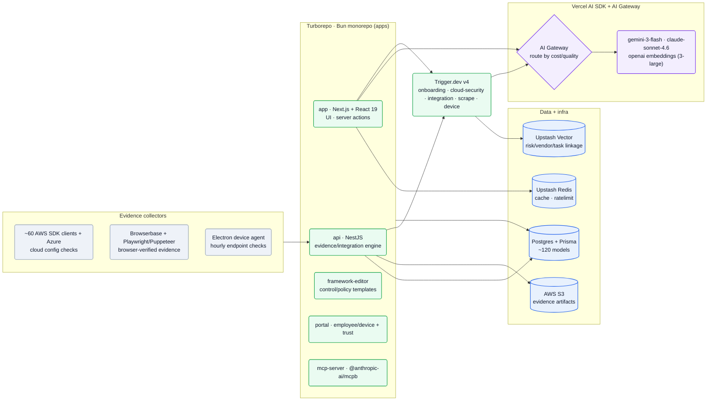
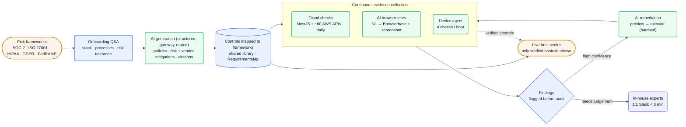

[Comp AI][home] is an **open-source, AI-native compliance platform** — a *"Vanta & Drata Alternative"* for SOC 2, ISO 27001, HIPAA, GDPR and FedRAMP ([repo][repo], [home][home]). The unusual thing for a teardown: **the entire product is open source** (`trycompai/comp`, AGPL-3.0), so this reconstruction is read mostly from the actual code, not inferred. What the code shows is a Turborepo/Bun monorepo where a **NestJS** engine pulls evidence from ~60 AWS service APIs, **AI generates per-business policies** (structured output routed through Vercel AI Gateway across Gemini/Claude/OpenAI), an **Electron device agent** runs hourly endpoint checks, and AI-authored **browser tests** verify controls in a hosted browser — the whole posture continuously, *"in the open."*

**Vitals:** launched from stealth Apr 2025 · $2.6M pre-seed (OSS Capital + Grand Ventures, Jul 2025) · ~10 people · remote / open-source.

Business context — founders, funding, traction

- **Co-founders:** **Mariano Fuentes, Lewis Carhart, Claudio Fuentes** — *"experienced Silicon Valley VC-backed founders"* who lived *"the pains of achieving SOC 2 compliance at their previous startups"* ([pre-seed][seed]).
- **Funding:** **$2.6M pre-seed co-led by OSS Capital** (Joseph Jacks) **and Grand Ventures** (Nathan Owen), with angels **David Cramer** (Sentry founder) and **Ben Tossell** (Ben's Bites) ([pre-seed][seed]). OSS Capital backs open-source challengers (Cal.com, Plane, ProjectDiscovery).
- **Traction:** launched from stealth Apr 2025; first customers saved *"2,500+ hours,"* *"3,500 companies"* in pre-launch testing, *"89%+"* avg monthly growth; **700+ companies**, 1,620★ on GitHub; in the Vercel Spring '25 OSS program ([pre-seed][seed], [home][home], [repo][repo]).
- **Positioning:** *"the Vercel of compliance"* — automate *"up to 90% of the process,"* 1:1 Slack support from in-house experts (*"under 3 minutes"*), and a live trust center. Customers cite switching from Vanta/Drata/Delve (Dub, Persona AI, Docspring, Capgo) ([home][home], [pre-seed][seed]).

## The heavy lifting

- **The platform is open source, so the compliance is auditable — not trust-me.** *"Every agent, every integration, every check is auditable on GitHub … you verify it"* ([home][home]); the AGPL-3.0 monorepo is self-hostable (`docker-compose`, `SELF_HOSTING.md`). For a category whose incumbents are black boxes, *being inspectable* is the product wedge.
- **Evidence by AI-authored, self-running browser tests + direct cloud APIs.** Say *"show me that SSL is active"* or give browser instructions (*"go to our GitHub repo … verify branch protection"*) and *"AI opens a browser, verifies the control, and screenshots the result"* on a daily schedule — backed by `BrowserAutomation`/`BrowserbaseContext` models and Playwright/Puppeteer; for cloud, a NestJS engine wired to **~60 AWS service SDK clients** + Azure reads config directly ([home][home], [repo][repo]). Beats manual screenshots that are stale on arrival.
- **Per-business policy generation, routed cheap-vs-quality.** Onboarding Q&A (*"your stack, your processes, your risk tolerance"*) feeds `generateObject` (Zod-structured) policy and risk/vendor-mitigation generation with citations, routed through **Vercel AI Gateway** — `google/gemini-3-flash` for bulk onboarding, `anthropic/claude-sonnet-4.6` for harder reasoning ([repo][repo], [home][home]). *"No two customers get the same boilerplate."*
- **Continuous endpoint enforcement via an open-source Electron agent.** A custom system-tray app runs **four checks every hour** — disk encryption, antivirus, password policy, screen lock — cross-platform (FileVault/BitLocker/LUKS, etc.) with auto-remediation, *replacing* a hosted FleetDM/osquery setup with a self-contained app registering directly to Postgres ([device-agent SPEC][repo]). Beats point-in-time audit snapshots.

## Stack

Almost all **verified from the source**. Rows cite the repo path or manifest; little is inferred (see the short [Likely internals](#likely-internals)).

| Layer | Choice | Evidence |
| --- | --- | --- |
| **Monorepo** | **Turborepo + Bun** (bun@1.3.4) | `turbo.json`, `bun.lock` ([repo][repo]) |
| **Web app** | **Next.js + React 19**, Tailwind, better-auth, next-safe-action, Novu, Sentry | `apps/app` package.json ([repo][repo]) |
| **API / evidence engine** | **NestJS** + Express + Swagger | `apps/api` (`@nestjs/platform-express`) ([repo][repo]) |
| **DB** | **Postgres + Prisma** (adapter-pg), ~120 models | `packages/db` schema ([repo][repo]) |
| **Background jobs** | **Trigger.dev v4** (onboarding, cloud-security, integration, scrape, device) | `apps/app/src/trigger` ([repo][repo]) |
| **Cache / vector** | **Upstash** Redis + Ratelimit + **Vector** | `@upstash/*`; `lib/embedding` ([repo][repo]) |
| **AI** | **Vercel AI SDK + AI Gateway**; providers OpenAI/Anthropic/Google/Groq | `@ai-sdk/*`, `createGateway` ([repo][repo]) |
| **Models** | embeddings **text-embedding-3-large**; onboarding **gemini-3-flash**; rerank **gemini-3.1-flash-lite**; **claude-sonnet-4.6** | model constants in `trigger` ([repo][repo]) |
| **Cloud evidence** | **~60 AWS service SDK clients** + Azure SDK | `apps/api`, `packages/integration-platform` ([repo][repo]) |
| **Browser evidence** | **Browserbase** + Playwright + Puppeteer | `BrowserbaseContext` model; `playwright-core`, `puppeteer-core` ([repo][repo]) |
| **Device agent** | **Electron** (electron-vite, electron-builder) | `packages/device-agent` ([repo][repo]) |
| **MCP** | `apps/mcp-server` via **@anthropic-ai/mcpb**; `McpOrgBinding` | `apps/mcp-server` ([repo][repo]) |
| **Storage / billing / deploy** | **S3**; **Stripe**; **Vercel** (app) + Docker/AWS CodeBuild (self-host) | manifests + `buildspec.yml` ([repo][repo]) |

:::note[Key finding — multi-model, structured-output-first, routed by cost]
The AI is built on the Vercel AI SDK with **57 `generateObject`** call-sites (Zod-typed structured output) vs 7 `streamText`, all behind **AI Gateway**. Cheap bulk work (policy/onboarding generation, reranking) runs on **Gemini Flash**; harder reasoning calls **Claude Sonnet 4.6**; embeddings use **OpenAI 3-large** into Upstash Vector. The model is a routed, swappable dependency — verifiable in the repo.
:::

## Hard problems

The parts an engineer here works hardest on — read from the code. **Public signal** is cited (verified); **likely approach** is hedged speculation.

| Problem | Why it's hard | Public signal | Likely approach (speculative) |
| --- | --- | --- | --- |
| **Evidence that's never stale** | Manual screenshots regress the moment they're taken; compliance must reflect *now*, across 580+ tools | *"we pull evidence continuously from 580+ integrations"*; `EvidenceAutomation*`, `IntegrationCheckRun`, `Finding*`/`FindingRegression` models ([home][home], [repo][repo]) | Trigger.dev schedules per-integration checks; results diffed into Findings with regression tracking; failures alerted pre-audit |
| **AI-written browser tests that auditors trust** | A natural-language check must become a repeatable, *evidenced* test — not a one-off LLM answer | *"AI opens a browser, verifies the control, and screenshots the result … auditable and logged"*; `BrowserAutomation`, `BrowserbaseContext` ([home][home], [repo][repo]) | NL → generated browser script run in a Browserbase session on a schedule; screenshots + logs stored to S3 as evidence artifacts |
| **One control, many frameworks** | SOC 2 / ISO 27001 / HIPAA / FedRAMP overlap; re-authoring per framework doesn't scale | `RequirementMap`, `FrameworkControl{Policy,Task}Link`, `FrameworkEditor*` templates, `CustomFramework`, SOA models; an open `framework-editor` app ([repo][repo]) | A shared control library with many-to-many requirement mappings; crosswalk a control once, satisfy many frameworks; community-contributed templates |
| **Safe AI cloud remediation** | Auto-fixing a customer's live cloud has real blast radius | `cloud-security` tasks: `remediate-preview`, `remediate-single`, `remediate-batch`, `execute-result`, `retry-preview`; `RemediationAction`/`RemediationBatch` ([repo][repo]) | Generate a diff/preview first, gate execution (human or confidence), batch + retry; log every action for audit |

## Likely internals

Little is unknown — it's open source. The few non-obvious points:

| Component | Likely choice | Basis |
| --- | --- | --- |
| AI Gateway routing policy | cheap bulk → Gemini Flash; hard reasoning → Claude Sonnet 4.6 | model constants + call-sites ([repo][repo]); a single routing config isn't centrally documented |
| Browser-test codegen | NL → Playwright script executed in Browserbase, screenshots to S3 | BrowserAutomation + Browserbase + S3 ([repo][repo]); the codegen step isn't fully spelled out |
| Multi-tenancy | org-scoped isolation via better-auth `Organization`; `organizationId` on records | better-auth org model + org-scoping in embedding/trigger code ([repo][repo]) |
| AI Agent studio | customer-deployable agents for evidence/risk/vendor onboarding | announced as moving *"beta to general availability"* ([pre-seed][seed]) — a stated direction |
| Headcount / HQ | ~10, remote-first | small early team; not stated first-party |

## Architecture

### The monorepo: apps, jobs, models, collectors

The code is a Turborepo/Bun monorepo. A **Next.js** app is the UI and AI surface; a **NestJS** API is the evidence/integration engine; `framework-editor`, `portal` and an Anthropic **MCP server** round out the apps. **Trigger.dev** runs the background AI work (onboarding, cloud-security remediation, integration checks, vendor research, device). AI calls route through **Vercel AI Gateway**; state lives in **Postgres/Prisma** (~120 models), **Upstash Vector** (semantic linkage), **Upstash Redis**, and **S3**. Evidence flows in from three collectors: ~60 AWS service APIs (+Azure), Browserbase-driven browser tests, and the Electron device agent ([repo][repo]).

![Comp AI monorepo platform: a Turborepo and Bun monorepo whose apps include a Next.js + React 19 web app, a NestJS evidence and integration engine, a framework-editor for control and policy templates, a portal for device and trust, and an Anthropic MCP server; Trigger.dev v4 runs background jobs for onboarding, cloud-security, integration, scrape and device; AI calls route through the Vercel AI SDK and AI Gateway, which selects between Gemini 3 flash, Claude Sonnet 4.6 and OpenAI embeddings by cost and quality; data and infra are Postgres with Prisma holding about 120 models, Upstash Vector for risk/vendor/task linkage, Upstash Redis for cache and rate-limiting, and AWS S3 for evidence artifacts; evidence collectors feed the NestJS API — roughly 60 AWS SDK clients plus Azure for cloud config checks, Browserbase with Playwright and Puppeteer for browser-verified evidence, and an Electron device agent for hourly endpoint checks.](/diagrams/comp-ai/monorepo-platform.svg)

Mermaid source

### The continuous-compliance loop

How a customer goes from zero to a live trust center. Pick frameworks → an onboarding Q&A captures the business → AI generates policies and risk/vendor mitigations (structured, gateway-routed, with citations) → controls are mapped once and crosswalked across frameworks → evidence is collected continuously by the three collectors → findings are flagged *before* they become audit issues, with AI remediation (preview → execute) for the clear ones and in-house experts on Slack for judgement calls → only verified controls surface on the live trust center ([home][home], [repo][repo]).

![Comp AI continuous-compliance loop: a customer picks frameworks (SOC 2, ISO 27001, HIPAA, GDPR, FedRAMP), then an onboarding questionnaire captures stack, processes and risk tolerance; AI generation, structured and gateway-routed, produces policies, risk and vendor mitigations and citations; controls are mapped to frameworks via a shared library and RequirementMap; continuous evidence collection runs three ways — cloud checks via NestJS and roughly 60 AWS APIs daily, AI browser tests turning natural language into Browserbase runs with screenshots, and a device agent doing four checks per hour; findings are flagged before audit, with high-confidence ones sent to AI remediation that previews then executes in batches and loops back into evidence, and judgement calls routed to in-house experts on Slack within three minutes; mapped controls and verified evidence feed a live trust center that shows only verified controls.](/diagrams/comp-ai/compliance-loop.svg)

Mermaid source

:::note[Inference — open source is the distribution + trust strategy — confidence: high]
The repo ships its own AI-coding scaffolding (`.claude/skills`, `.cursor/skills`, `AGENTS.md`, `opencode.json`, `.mcp.json`) and invites contributions of *"control templates, framework mappings, and automations"* ([pre-seed][seed]). For a compliance tool, open source doubles as the trust argument (*"verify it"*) and a community moat — every contributed framework mapping makes the next customer faster.
:::

## Team & process

A small (~10), remote, open-source team led by three co-founders who hit SOC 2 pain at prior startups ([pre-seed][seed]).

| Role | Person | Source |
| --- | --- | --- |
| Co-founder | Mariano Fuentes | [pre-seed][seed] |
| Co-founder | Lewis Carhart | [pre-seed][seed] |
| Co-founder | Claudio Fuentes | [pre-seed][seed] |

The process is legible straight from the repo. They **dogfood AI coding agents** — the monorepo ships skill/config files for Claude Code, Cursor, Codeium/Windsurf and OpenCode plus an `AGENTS.md`, which is how a ~10-person team ships a platform this broad (five apps, a desktop agent, ~120 data models). Releases are automated (**semantic-release** + conventional commits, with Discord release notes), and the whole thing is **community-extensible**: auditors and security pros contribute control templates and framework mappings, which is the open-source flywheel. Support is high-touch despite the small team — *"1:1 Slack … under 3 minutes"* from in-house compliance experts ([home][home]).

## Sources

Reconstructed from public sources only — no insider information. The product is open source, so the bulk of this teardown is read **directly from the source code** (a shallow clone of `trycompai/comp` at its 2026-06-09 state) and verified against the website and Comp AI's pre-seed announcement; crawled 2026-06-10 via Chrome MCP (logged-out). Claim tiers: **verified** (in the code or on a public page, linked) · **inferred** (reasoned from a cited signal) · **speculative** (best-practice fill-in, labeled). Per-claim quotes/paths are in this repo's evidence map (`evidence/comp-ai-evidence-map.md`).

| # | Source | Link |
| --- | --- | --- |
| S1 | GitHub monorepo (AGPL-3.0) | <https://github.com/trycompai/comp> |
| S2 | Homepage | <https://trycomp.ai/> |
| S3 | Pre-seed announcement | <https://trycomp.ai/hub/comp-ai-pre-seed-round> |
| S4 | Device Agent SPEC | <https://github.com/trycompai/comp/blob/main/packages/device-agent/SPEC.md> |
| S5 | Docs | <https://trycomp.ai/docs> |
| S6 | Roadmap | <https://roadmap.trycomp.ai/roadmap> |

[home]: https://trycomp.ai/
[repo]: https://github.com/trycompai/comp
[seed]: https://trycomp.ai/hub/comp-ai-pre-seed-round
[docs]: https://trycomp.ai/docs
