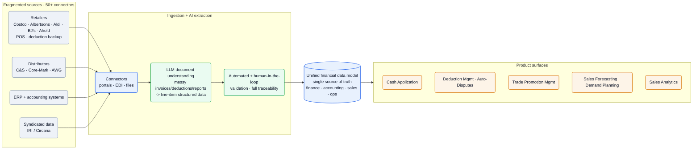
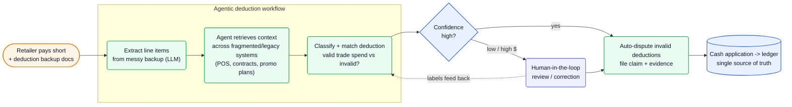

[Confido][home] is *"the AI infrastructure powering CPG brands from deduction to production plan"* — one platform unifying *"cash application, deductions, disputes, trade promotion management, forecasting, demand planning, and analytics"* as *"the single source of truth"* for a consumer-packaged-goods brand's finance, accounting, sales, and ops teams ([Ashby][ashby], [home][home]). The engineering problem isn't a chat box: it's LLM extraction over genuinely messy retailer/distributor paperwork, agentic retrieval across legacy systems with no clean API, and a correctness bar set by the fact that every number is money owed.

**Vitals:** founded 2020 · YC S21 · $15M Series A (Footwork) + seed (Watchfire) · ~28 people · NYC, on-site ([YC][yc], [Series A note][blog-a]).

Business context — founders, funding, customers, moat

- **Founders:** Justin Hunter (CEO — ex-Capital One corporate strategy; Harvard) and Kara Holinski (technical founder — engineering at MIT; ex-APM Schmidt Futures) ([YC][yc]). Head of AI **Matan Friedmann** joined May 2026 (ex Co-Founder/CTO Clearly Labs; ex Nexar; ex Q.ai, acq. Apple; AutoPrompt, 3K★) ([AI hire][blog-ai]).
- **Funding:** $15M Series A led by Footwork, plus a *"previously unannounced seed round led by Watchfire Ventures"* ([Series A note][blog-a]); the combined raise was reported in trade press as ~$20M. Board member Mike Smith (public-retailer + brand board experience).
- **Traction:** *"trusted by 200+ brands managing $20B+ in revenue, including OLIPOP, Simple Mills, Dr. Squatch, Tropicana"* ([Ashby][ashby]) — also DUDE Wipes, Serenity Kids, Cappello's, Rebel Creamery ([Series A note][blog-a], [home][home]).
- **Founding insight:** finance teams managing *"high-growth environments, without often increasing headcount,"* where *"deductions, trade, and planning were all mission critical, but horribly disconnected and manual"* ([Series A note][blog-a]).
- **Moat (inferred):** the per-customer data — learned SOPs, validated extractions, mapped legacy connectors — compounds with tenure and doesn't transfer to a rival; 50+ hard-won retailer/distributor/ERP/accounting integrations raise switching cost.
- **Hiring:** 8 engineering + 4 product roles open at the time of writing, all NYC on-site ([Ashby][ashby]).

## The heavy lifting

- **The AI surface is structured extraction, not chat.** Per-retailer deduction backup, invoices, and reports parse into a fixed line-item schema via a *"format-agnostic"* pipeline — one extractor across sources, not a template per retailer ([ML JD][jd-ml], [AI hire][blog-ai]).
- **Agents substitute for missing APIs.** Retailer/distributor systems often expose no clean API; agents *"retrieve data from legacy systems"* to assemble the context — POS, contracts, promo plans — a deduction needs to be adjudicated ([ML JD][jd-ml]).
- **Human review is the validation gate.** Low-confidence / high-dollar items route to a reviewer, with *"automated and human-in-the-loop validation"* and *"full traceability"* per record — what lets a finance team post AI-extracted figures to the ledger ([AI hire][blog-ai]).

## Stack

The JDs describe *what the systems do* (AI document ingestion, financial data pipelines, analytics) but deliberately don't name languages or frameworks. So this table is the **AI + data stack** that *is* public; the conventional infra (languages, DB, cloud) is unconfirmed and reconstructed in [Likely internals](#likely-internals).

| Layer | Choice | Evidence |
| --- | --- | --- |
| **Document understanding** | **LLM-powered extraction** of structured line items from messy invoices, deductions, retailer reports | [ML JD][jd-ml], [Staff SWE JD][jd-staff], [AI hire][blog-ai] |
| **Agents** | **agentic workflows** that *"retrieve and reason over data across fragmented enterprise systems"* / legacy systems | [ML JD][jd-ml] |
| **Predictive ML** | sales/financial **forecasting**, **anomaly detection** on retail data, promotion-optimization **recommenders** | [ML JD][jd-ml] |
| **Foundation models** | **LLMs/NLP**; fine-tuning *"(Llama, GPT, etc.)"* listed as a hire signal | [ML JD][jd-ml] |
| **Model strategy** | building *"proprietary models and agentic architectures specifically tuned for … CPG"* | [AI hire][blog-ai] |
| **Validation** | **automated + human-in-the-loop** validation; *"comprehensive databases for full traceability"* | [AI hire][blog-ai] |
| **Ingestion** | **50+ connectors** — retailers (Costco, Albertsons, Aldi, BJ's, Ahold), distributors (C&S, Core-Mark, AWG), ERP + accounting | [Integrations][integ] |
| **External data** | syndicated **IRI / Circana**, retailer **POS**, distributor & customer-inventory feeds | [home][home] |
| **Workplace tooling** | MacBooks; 401(k) via **Vestwell**; fully on-site NYC | [SWE JD][jd-swe] |

:::note[Key finding — the AI roadmap is "proprietary models + agentic architectures for CPG"]
The May 2026 hire of Head of AI **Matan Friedmann** is chartered to *"aggressively expand our Applied AI/ML team, focusing on developing proprietary models and agentic architectures specifically tuned for the unique complexities of the CPG space"* ([AI hire][blog-ai]) — a bet on bespoke models over relying solely on general ones.
:::

## Hard problems

The parts an engineer at this company loses sleep over. **Public signal** is cited (verified); **likely approach** is labeled speculation — best-practice fill-in, hedged.

| Problem | Why it's hard | Public signal | Likely approach (speculative) |
| --- | --- | --- | --- |
| **Messy-document extraction** | Every retailer/distributor formats invoices, deductions, and backup differently; layouts shift; scans are noisy | *"extract structured data from complex financial documents"*; *"format-agnostic pipeline"* for *"messy"* docs ([ML JD][jd-ml], [AI hire][blog-ai]) | Multimodal LLM + OCR with per-source templates; confidence scoring; route low-confidence to humans whose corrections fine-tune the extractor |
| **Fragmented / legacy integration** | 50+ sources, many behind retailer portals or EDI with no clean API; data is incomplete and inconsistent | 50+ connectors ([Integrations][integ]); agents that *"retrieve data from legacy systems"* ([ML JD][jd-ml]) | Connector framework + agentic browsing/scraping for portals; FDEs to onboard each brand's source mix; normalize into the unified model |
| **Financial correctness / trust** | Outputs are money owed; a wrong deduction classification or dispute is a real loss and erodes trust | *"automated and human-in-the-loop validation to ensure 100% reliability"*; *"full traceability"* ([AI hire][blog-ai]) | HITL gates on low-confidence/high-dollar items; immutable audit trail per record; reconciliation against the ledger |
| **Forecasting on sparse retail data** | POS and syndicated data are laggy, partial, and noisy across hundreds of SKUs and retailers | forecasting from *"statistical models and live sales data"* ([home][home]); *"anomaly detection,"* *"promotion optimization models"* ([ML JD][jd-ml]) | Hierarchical statistical + ML forecasts blending IRI/Circana + POS; anomaly flags feed planners; promo-lift models for TPM ROI |

## Likely internals

The infrastructure Confido doesn't name publicly, inferred from the stack it does:

| Component | Likely choice | Basis |
| --- | --- | --- |
| Backend / API | TypeScript/Node + Python services | *"backend services and APIs"* ([SWE JD][jd-swe]); ML-heavy product implies Python beside a TS web tier |
| Frontend | React / TypeScript | Senior Frontend + Design-Engineer roles ([Ashby][ashby]) |
| Cloud | AWS | default for a NYC YC B2B SaaS at this stage |
| Primary DB | Postgres | relational financial / ledger data |
| Document AI | multimodal LLM + OCR, per-source templates | *"format-agnostic"* extraction of *"messy"* docs ([AI hire][blog-ai]) |
| LLM providers | OpenAI (GPT) + open-weight Llama fine-tunes | fine-tuning *"(Llama, GPT, etc.)"* named ([ML JD][jd-ml]) |
| Retrieval | managed vector DB for agentic RAG | *"retrieval systems,"* *"agentic workflows"* ([ML JD][jd-ml]) |
| Retailer-portal access | EDI + agentic browsing where no API exists | *"retrieve data from legacy systems"* ([ML JD][jd-ml]); exact mechanism unconfirmed |
| Proprietary models | mostly fine-tuned / prompted today; bespoke is the stated direction | named as a goal, not a shipped fact ([AI hire][blog-ai]) |
| Auth | enterprise SSO (SAML/OIDC) | finance buyers at 200+ brands |

## Architecture

### Fragmented sources → document AI → one source of truth

Confido's spine is an ingestion-and-extraction pipeline that collapses incompatible inputs into a single financial data model. Connectors pull from *"50+ critical data sources"* ([Integrations][integ]); an LLM layer reads the *"messy"* documents those sources emit — *"invoices, deductions, and retailer reports"* — and *"extract[s] structured data from complex financial documents"* ([ML JD][jd-ml], [Staff SWE JD][jd-staff]). The Head of AI's prior work names the pattern exactly: an *"end-to-end, format-agnostic pipeline that transformed unstructured, real-world documents into clean, system-ready insights,"* paired with *"automated and human-in-the-loop validation to ensure 100% reliability"* ([AI hire][blog-ai]). The cleaned data becomes the *"single source of truth"* every product surface reads from.

![Confido data architecture: fragmented sources — retailers (Costco, Albertsons, Aldi, BJ's, Ahold) with POS and deduction backup, distributors (C&S, Core-Mark, AWG), ERP and accounting systems, and syndicated IRI/Circana data — flow through 50+ connectors (portals, EDI, files) into an AI extraction layer where LLM document understanding turns messy invoices, deductions, and reports into line-item structured data, then passes through automated plus human-in-the-loop validation with full traceability; the result populates a unified financial data model that is the single source of truth across finance, accounting, sales, and operations, which in turn powers the product surfaces: Cash Application, Deduction Management and Auto-Disputes, Trade Promotion Management, Sales Forecasting and Demand Planning, and Sales Analytics.](/diagrams/confido/data-architecture.svg)

Mermaid source

### The deduction loop: where document AI, agents, and humans meet

The flagship workflow shows why this is hard. A retailer pays an invoice short and attaches *"deduction backup"* — often a scanned or PDF'd justification in a format unique to that retailer. Confido extracts the line items, an agent *"retrieve[s] data from legacy systems"* to gather the matching context (contracts, promo plans, POS), and the system classifies whether the deduction is valid trade spend or an invalid chargeback to fight. Low-confidence or high-dollar cases route to a human; the rest flow to **Auto-Disputes**, then to cash application against the ledger.

![Confido deduction-to-dispute agentic loop: a retailer pays short and sends deduction backup documents; an agentic workflow extracts line items from the messy backup with an LLM, the agent retrieves context across fragmented and legacy systems (POS, contracts, promo plans), and classifies whether the deduction is valid trade spend or invalid; a confidence gate sends high-confidence cases straight to auto-dispute (filing a claim with evidence) while low-confidence or high-dollar cases go to human-in-the-loop review and correction first, with human labels feeding back into the classifier; disputes then post to cash application and the ledger as the single source of truth.](/diagrams/confido/deduction-loop.svg)

Mermaid source

On top of the data model sit the analytical products: **Trade Promotion Management** (*"plan, track, and analyze trade promotions … with clear visibility into spend and ROI"*), **Sales Forecasting / Demand Planning** (*"statistical models and live sales data"*), and **Sales Analytics** over syndicated + POS feeds ([home][home]). The ML team also builds *"anomaly detection across retailer performance data"* and *"promotion optimization models"* ([ML JD][jd-ml]).

## Team & process

A technical-founder-led, ~28-person team ([YC][yc]) hiring hard in NYC.

| Role | Person | Source |
| --- | --- | --- |
| Co-founder (CEO) | Justin Hunter — ex-Capital One strategy; Harvard | [YC][yc] |
| Co-founder (technical) | Kara Holinski — engineering at MIT; ex-APM Schmidt Futures | [YC][yc] |
| Head of AI | Matan Friedmann — ex Clearly Labs CTO; ex Nexar; ex Q.ai (acq. Apple) | [AI hire][blog-ai] |

The build is **design-partner-driven and forward-deployed**: Confido shipped *"nights and weekends … with our brand partners"* and still spends *"hundreds of hours with our brand partners every week"* ([Series A note][blog-a]), with a dedicated **Forward Deployed Engineer** embedding to wire up each customer's retailer/distributor data ([Ashby][ashby]). The org runs intense and fully in-person — all NYC on-site, *"Nightly Team Dinners for those staying past 6:30pm"* ([SWE JD][jd-swe]); comp spans SWE $170–200K to Staff ML/AI $300–350K + bonus.

## Sources

Reconstructed from public sources only — no insider information. Crawled 2026-06-09 via Chrome MCP (logged-out) + web. First-party (confidotech.com, the Confido Aisle blog, Confido's Ashby JDs) prioritized; YC profile labeled third-party. Claim tiers: **verified** (stated on a public page, linked) · **inferred** (reasoned from a cited signal, confidence flagged) · **speculative** (best-practice fill-in, labeled). Links are live; pages change, so the supporting quote for each claim is kept in this repo's evidence map (`evidence/confido-evidence-map.md`).

| # | Source | Link |
| --- | --- | --- |
| S1 | Homepage | <https://www.confidotech.com/> |
| S2 | About | <https://www.confidotech.com/about> |
| S3 | Careers | <https://www.confidotech.com/careers> |
| S4 | Integrations | <https://www.confidotech.com/integrations> |
| S5 | Blog — Series A founders' note | <https://www.confidotech.com/blogs/a-note-from-our-founders-raising-our-series-a-to-build-the-future-of-cpg-finance> |
| S6 | Blog — Head of AI (Matan Friedmann) | <https://www.confidotech.com/blogs/scaling-ai-in-cpg-matan-friedmann-joins-confido-as-head-of-ai> |
| S7 | Ashby job board | <https://jobs.ashbyhq.com/confido> |
| S8 | Staff Software Engineer (JD) | <https://jobs.ashbyhq.com/confido/b1d615bc-2040-4593-84ba-54039a5a8c75> |
| S9 | Staff ML / AI Engineer (JD) | <https://jobs.ashbyhq.com/confido/c133c8b1-12a9-450d-8fa5-715ae123ee69> |
| S10 | Software Engineer (JD) | <https://jobs.ashbyhq.com/confido/d5520ce5-bc5f-4947-8912-292615b0c5ac> |
| S11 | Y Combinator profile (third-party) | <https://www.ycombinator.com/companies/confido> |

[home]: https://www.confidotech.com/
[about]: https://www.confidotech.com/about
[careers]: https://www.confidotech.com/careers
[integ]: https://www.confidotech.com/integrations
[blog-a]: https://www.confidotech.com/blogs/a-note-from-our-founders-raising-our-series-a-to-build-the-future-of-cpg-finance
[blog-ai]: https://www.confidotech.com/blogs/scaling-ai-in-cpg-matan-friedmann-joins-confido-as-head-of-ai
[ashby]: https://jobs.ashbyhq.com/confido
[jd-staff]: https://jobs.ashbyhq.com/confido/b1d615bc-2040-4593-84ba-54039a5a8c75
[jd-ml]: https://jobs.ashbyhq.com/confido/c133c8b1-12a9-450d-8fa5-715ae123ee69
[jd-swe]: https://jobs.ashbyhq.com/confido/d5520ce5-bc5f-4947-8912-292615b0c5ac
[yc]: https://www.ycombinator.com/companies/confido
