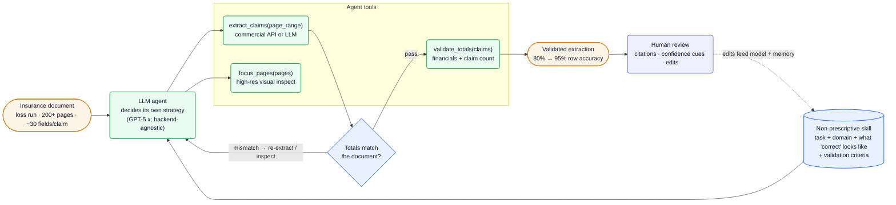
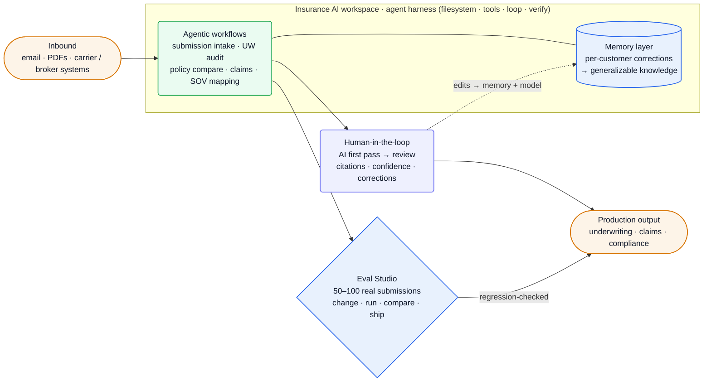

[FurtherAI][home] builds a **domain-specific AI workspace for insurance** — *"AI for Insurers, MGAs, and Brokers that automates busywork"* across submission intake, underwriting audit, policy comparison, claims, FNOL, SOV mapping and more ([home][home]). The technical core is **agentic document extraction that verifies its own work**: rather than tune a prompt per document layout, FurtherAI gives an LLM agent a validation tool and a success criterion, and lets it check its extractions against a document's own summary totals and re-extract until counts and dollars match — a shift that took loss-run accuracy from *"80% to 95% … not by improving the extraction model"* ([extract][extract]). Around it sit a customer-facing **Eval Studio** and a **memory layer** that learns from underwriter corrections.

**Vitals:** founded 2023 (YC W24) · $30M total ($25M Series A a16z, Oct 2025 + $5M seed) · ~36–40 people · San Francisco.

Business context — founders, funding, customers, traction

- **Founders:** **Aman Gour** (CEO) and **Sashank Gondala** (CTO), who *"brings experience from building speech and language models at Apple's AI/ML org"* ([Series A][seriesa], [FDE JD][ashby]). a16z's Joe Schmidt called them *"technical founders whose customers see them as true AI partners."*
- **Funding:** **$25M Series A led by Andreessen Horowitz** (Oct 7 2025) — *"one of the largest Series A ever raised in insurance AI"* — six months after a **$5M seed**, bringing total to **$30M**, with Nexus Venture Partners, Y Combinator, South Park Commons and Converge ([Series A][seriesa], [FDE JD][ashby]).
- **Team pedigree:** *"ex-Apple AI Research, 4 ex-YC founders, and 6 ex-founders"* ([FDE JD][ashby]). Named engineers (from the eng blog): Punyaslok Pattnaik, Frieda Huang, Kshitij Jain, Giancarlo Fissore.
- **Customers:** Accelerant (Risk Exchange), MSI, Leavitt Group, McGowan Excess Casualty, Upland, Grange; *"the largest MGA in the United States"* ($1.5B+ premiums, 20+ programs, 1M+ policyholders); *"recently closed a top 5 insurance company in the world"* ([home][home], [Series A][seriesa], [FDE JD][ashby]).
- **Traction:** *"processes billions in premiums each year,"* *"grown 10x in revenue this year"*; reported 30x faster submissions, audit time −45%, 95%+ policy-comparison accuracy, submission-to-quote +15%, up to 400% ROI ([home][home], [Series A][seriesa]).

## The heavy lifting

- **Self-correcting extraction beats prompt-per-layout.** Instead of prescribing how to read each loss-run format, FurtherAI gives the agent a *"non-prescriptive skill"* (task + what *correct* looks like + verifiable validation criteria) and a `validate_totals` tool; the agent extracts, checks against the document's own summary totals, and re-extracts suspicious sections *"until the numbers match"* — *"80% to 95% row count accuracy … not by improving the extraction model"* ([extract][extract]). The constraint it beats: brittle prompts that improve on seen layouts but don't generalize.
- **The verification loop makes the model swappable.** *"We were surprised by how little the extraction backend mattered once the agent was in the loop"* — commercial extraction service or raw LLM, *"the pattern is the same"* ([extract][extract]). Because correctness comes from the validation loop, not a perfect first pass, the system improves automatically as frontier models do — and isn't hostage to one vendor.
- **Eval Studio turns real submissions into a regression suite.** Customers load *"50 or 100"* real submissions, define *"good,"* and compare workflow versions *"side by side"* before shipping — the production loop is *"change, run, compare, ship,"* weekly ([eval][eval]). The constraint: *"a new model lands every few months,"* and swaps *"break workflows in ways that aren't obvious"*; this catches drift before it reaches an underwriting decision.
- **A memory layer that learns from underwriter corrections.** *"When an underwriter corrects the system or clarifies a preference, that gets stored and applied to future conversations"* — pushing accuracy from *"~80%"* on day zero toward *"~99%"* by day 100 ([hard][hard]). The hard part, stated plainly, is consolidating hundreds of conflicting, stale, context-narrow corrections into *"coherent, generalizable knowledge."*

## Stack

What's publicly evidenced from the engineering posts + the one public eng JD. The board is otherwise GTM-heavy; cloud, framework and the full model roster aren't named — see [Likely internals](#likely-internals).

| Layer | Choice | Evidence |
| --- | --- | --- |
| **Backend** | **Python** | [FDE JD][ashby] |
| **LLMs** | frontier, **model-swappable**; **GPT-5.x** named (*"agentic GPT-5.4 result strongest"*) | [extract][extract], [eval][eval] |
| **Extraction backend** | **pluggable** — commercial extraction API *or* LLMs directly | [extract][extract] |
| **Agent design** | a **harness**: filesystem + tools + loop + verification; tools incl. `extract_claims`, `focus_pages`, `validate_totals` | [hard][hard], [extract][extract] |
| **Memory** | per-customer **memory layer** storing user corrections, applied to future runs | [hard][hard] |
| **Evals** | **Eval Studio** — real-submission test sets, side-by-side version comparison | [eval][eval] |
| **HITL UI** | citations to source, confidence cues, correction tools; edits feed model + memory | [hard][hard] |
| **Product** | insurance AI **workspace**; email + PDF intake; carrier/broker system integrations | [home][home], [Series A][seriesa] |
| **Security** | client prompts/data never used for training; isolated per-firm storage; third-party audited | [home][home] |

:::note[Key finding — correctness is engineered around the model, not into it]
FurtherAI's accuracy gains came from a *"10-line validation function"* and an agent loop, *"worth more than weeks of prompt engineering"* ([extract][extract]). The differentiated asset is the harness + eval discipline (define *correct*, let the agent verify against the document's own evidence), which makes the underlying LLM a swappable, improving dependency.
:::

## Hard problems

The parts an engineer here loses sleep over — drawn largely from FurtherAI's own *"Hard Problems"* post. **Public signal** is cited (verified); **likely approach** is labeled speculation, hedged.

| Problem | Why it's hard | Public signal | Likely approach (speculative) |
| --- | --- | --- | --- |
| **Verifying the agent's *trajectory*, not just its answer** | Two agents reach the same extraction via different traces — one focused, one thrashing; only one generalizes, and *"the agent got it wrong" isn't actionable* | need *"trajectory-level visibility: did it read the wrong document? … have the correct value at step 12 but overwrite it at step 20?"* ([hard][hard]) | Step-level trace logging + a notion of "good trajectory"; score exploration-vs-thrashing; replay traces in evals |
| **Learning from corrections without regressing** | A single fix is easy to store; *"corrections can conflict, go stale, or apply only in narrow contexts"* — and day-0 80% must become day-100 99% | a memory layer exists; consolidating *"hundreds of individual corrections into coherent, generalizable knowledge"* is the open problem ([hard][hard]) | Scoped/typed memories with recency + context keys; periodic consolidation into rules; regression-gated by Eval Studio |
| **Entity linking across messy documents** | One entity's 100 attributes span documents linked only by an address written *"123 Main St"* vs *"123 Main Street, Unit A"* | *"Match too aggressively and you collapse distinct properties … Too conservatively and the same building shows up three times"* ([hard][hard]) | Normalized keys + fuzzy/learned matching with a tunable threshold; human adjudication on low-confidence merges |
| **Training/eval data for insurance** | *"There's no ImageNet for insurance documents"* — no labeled corpora of SOVs, loss runs, bordereaux | synthetic data must capture *"the right distribution of chaos"* — inconsistent formats, typos, missing/conflicting data ([hard][hard]) | Programmatic synthetic-doc generation seeded from real layouts; calibrate noise; reserve real labeled sets for eval |

## Likely internals

What FurtherAI doesn't name, inferred from the eng posts + founder pedigree. Flagged, not fact.

| Component | Likely choice | Basis |
| --- | --- | --- |
| LLM vendors | OpenAI frontier (GPT-5.x) + likely Anthropic/Google, routed & swappable | GPT-5.4 named ([extract][extract]); Eval Studio built around model swaps ([eval][eval]); CTO ex-Apple language models; full roster unstated |
| Agent orchestration | in-house harness (filesystem + tools + loop + verifier), not a named framework | primitives described first-party ([hard][hard], [extract][extract]) |
| Web app | TypeScript/React front end (agentic, adaptive UI) on a Python backend | Python verified ([ashby]); *"agentic UI that adapts"* + Founding Product Designer ([hard][hard]); FE stack unstated |
| Cloud | AWS or GCP | conventional for an SF a16z/YC startup; not stated |
| Retrieval / memory store | a vector index over corrections + document context | memory layer + cross-doc reasoning ([hard][hard]); store unnamed |
| Auth / tenancy | enterprise SSO + per-tenant data isolation | *"completely isolated firm-specific data storage"* ([home][home]); vendor unstated |
| FDE automation | an agent over customer data + workflow builder + eval platform | stated as the *direction* they're "actively working on," not shipped ([hard][hard]) |

## Architecture

### The self-correcting extraction loop

The system that produced the 80%→95% jump. An insurance document (a loss run can be 200+ pages, ~30 fields per claim) and a non-prescriptive *skill* go to an LLM agent that decides its own strategy. It calls `extract_claims` (commercial API *or* an LLM, over optional page ranges), uses `focus_pages` for high-resolution visual inspection of suspicious sections, and `validate_totals` to check extracted financials and claim count against the document's own summary. On a mismatch it re-extracts or re-inspects and loops; on a pass it emits a validated result, which a human reviews with citations and confidence cues — and those edits feed the model and memory layer ([extract][extract], [hard][hard]).

![FurtherAI self-correcting extraction loop: an insurance loss-run document of 200-plus pages with about 30 fields per claim, together with a non-prescriptive skill that states the task and what a correct output looks like plus validation criteria, is handed to an LLM agent (GPT-5.x, backend-agnostic) that decides its own strategy; the agent uses three tools — extract_claims over optional page ranges via a commercial API or an LLM, focus_pages for high-resolution visual inspection, and validate_totals checking financial totals and claim count; a decision gate asks whether the extracted totals match the document, looping back to re-extract or inspect on a mismatch and passing through validation on success, producing a validated extraction that improved row accuracy from 80 to 95 percent; the result goes to human review with citations, confidence cues and edits, and those edits feed back into the model and memory.](/diagrams/furtherai/self-correcting-extraction.svg)

Mermaid source

### The workspace: agents, memory, humans, evals

Extraction is one capability inside a broader insurance workspace. Inbound work (email, PDFs, carrier/broker systems) flows into agentic workflows — submission intake, underwriting audit, policy comparison, claims, SOV mapping — running on the same harness, backed by a per-customer memory layer. AI takes the first pass; humans review with citations and corrections (which feed memory + model); and **Eval Studio** regression-checks any change against real submissions before it ships to production ([home][home], [hard][hard], [eval][eval]).

![FurtherAI workspace platform: inbound work arrives as email, PDFs, and data from carrier or broker systems and enters an insurance AI workspace built on an agent harness of filesystem, tools, loop and verify; inside, agentic workflows for submission intake, underwriting audit, policy comparison, claims and SOV mapping are linked to a per-customer memory layer that turns corrections into generalizable knowledge; outputs go to a human-in-the-loop stage where AI takes the first pass and humans review with citations, confidence and corrections that feed back into memory and the model; in parallel, an Eval Studio runs 50 to 100 real submissions through a change-run-compare-ship loop, and only regression-checked workflows reach production output for underwriting, claims and compliance.](/diagrams/furtherai/workspace-platform.svg)

Mermaid source

:::note[Inference — the forward-deployed model is the wedge, and they want to automate it — confidence: high]
FurtherAI sells via *"forward-deployed engineering"* — an AI engineer works *"side-by-side"* with each insurer to map data and tune workflows ([Series A][seriesa]). Their stated next bet is to *invert* that: an agent with *"access to customer data, the workflow builder, and the eval platform, that builds, tests, and iterates autonomously"* ([hard][hard]) — turning scale from a headcount problem into a compute problem.
:::

## Team & process

A San-Francisco, in-person (5-day) team of technical founders and ex-founders pairing AI research depth with company-building reps ([FDE JD][ashby], [Series A][seriesa]).

| Role | Person | Source |
| --- | --- | --- |
| Co-founder / CEO | Aman Gour | [Series A][seriesa] |
| Co-founder / CTO | Sashank Gondala (ex-Apple AI/ML, speech & language models) | [Series A][seriesa], [FDE JD][ashby] |

The founding team is *"ex-Apple AI Research, 4 ex-YC founders, and 6 ex-founders"* ([FDE JD][ashby]); engineers publish under their own names (Pattnaik on harnesses, Huang on memory, Jain on entity-linking, Fissore on HITL), which doubles as recruiting. The process signal is explicit and unusually mature for the stage: an **eval-first** discipline — *"success criteria over rigid procedures"* and *"rigorous evals"* are stated as the winning formula ([extract][extract]) — productized into Eval Studio's weekly *"change, run, compare, ship"* loop. Distribution runs through **forward-deployed engineers** embedded with customers; the public job board skews GTM/FDE while the core agent/ML work is done by a small, in-person engineering team.

## Sources

Reconstructed from public sources only — no insider information. Crawled 2026-06-10 via Chrome MCP (logged-out) + the Ashby posting API. First-party (furtherai.com — homepage, company, the two engineering posts, the Eval Studio post, the Series A announcement, the Ashby board) prioritized; a16z/press labeled third-party. Claim tiers: **verified** (stated on a public page, linked) · **inferred** (reasoned from a cited signal, confidence flagged) · **speculative** (best-practice fill-in, labeled). Links are live; pages change, so the supporting quote for each claim is kept in this repo's evidence map (`evidence/furtherai-evidence-map.md`).

| # | Source | Link |
| --- | --- | --- |
| S1 | Homepage | <https://www.furtherai.com/> |
| S2 | Company | <https://www.furtherai.com/company> |
| S3 | Engineering index | <https://www.furtherai.com/engineering> |
| S4 | Eng — The Hard Problems at FurtherAI | <https://www.furtherai.com/engineering-blogs/the-hard-problems-at-furtherai> |
| S5 | Eng — The Hardest Document Extraction Problem in Insurance | <https://www.furtherai.com/engineering-blogs/hardest-document-extraction-problem-in-insurance> |
| S6 | Blog — Eval Studio launch | <https://www.furtherai.com/blog/furtherai-eval-studio> |
| S7 | Blog — $25M Series A (a16z) | <https://www.furtherai.com/blog/furtherai-announces-25m-series-a-from-andreessen-horowitz-to-transform-insurance-workflows-with-ai-automating-busywork> |
| S8 | Job board (Ashby) — Forward Deployed Engineer | <https://jobs.ashbyhq.com/furtherai> |

[home]: https://www.furtherai.com/
[company]: https://www.furtherai.com/company
[eng]: https://www.furtherai.com/engineering
[hard]: https://www.furtherai.com/engineering-blogs/the-hard-problems-at-furtherai
[extract]: https://www.furtherai.com/engineering-blogs/hardest-document-extraction-problem-in-insurance
[eval]: https://www.furtherai.com/blog/furtherai-eval-studio
[seriesa]: https://www.furtherai.com/blog/furtherai-announces-25m-series-a-from-andreessen-horowitz-to-transform-insurance-workflows-with-ai-automating-busywork
[ashby]: https://jobs.ashbyhq.com/furtherai
