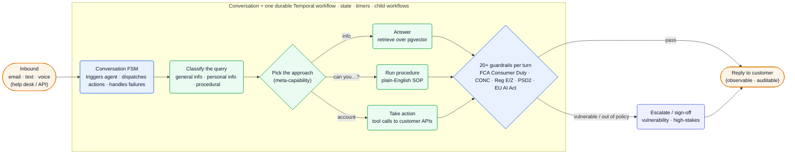
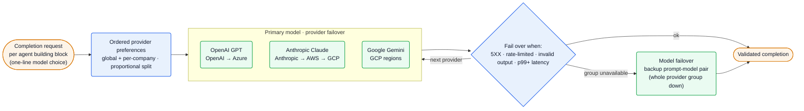

[Gradient Labs][home] builds an **autonomous AI agent for customer operations in financial services** — a *"suite of specialist agents for lending, disputes, and KYC with a platform that runs the operations in between"* ([home][home]). It handles support, collections, onboarding, KYB, disputes and claims over email, text and voice, *"safely and effectively"* in a regulated setting. The engineering bet — laid out in an unusually candid team blog — is **reliability as a first-class problem**: each customer conversation runs as a long-running [Temporal][temporal] workflow, a *blend* of OpenAI, Anthropic and Google models sits behind two layers of failover, and the agent's behaviour is authored by ops experts as plain-English SOPs rather than deterministic dialog trees.

**Vitals:** founded 2023 · Series A raised to $26M (Octopus Ventures + CommerzVentures; orig. $13M Redpoint, Jul 2025) · ~40+ people · London (HQ) + New York.

Business context — founders, funding, customers, traction

- **Founders (all ex-Monzo):** **Dimitri Masin** (CEO, Monzo's 20th employee, led a 100+ data team), **Danai Antoniou** (Chief Scientist, built an *"industry-first fraud detection system"*), **Neal Lathia** (CTO, built Monzo's ML infrastructure) ([About][about]). They *"started and scaled the Data Science and Machine Learning disciplines"* at Monzo before spending **14 months in stealth** and launching the agent in 2024 ([About][about]).
- **Funding:** **£2.8M seed** led by LocalGlobe (Aug 2024); **$13M Series A** led by **Redpoint Ventures** (Jul 2025, w/ Exceptional Capital, Liquid 2, LocalGlobe, Puzzle); Series A later **increased to $26M**, led by **Octopus Ventures and CommerzVentures** (Jun 2026) ([blog][blog], [About][about]).
- **Customers:** **Plum, Zego, SteadyPay, Pockit, LHV Bank** ([home][home], [About][about]).
- **Reported outcomes:** 80–90% peak resolution, 98% CSAT, **32M customers served**; Plum hit a 98.6% QA score and 80% CSAT with a *"30 minutes and no engineering effort"* setup; Zego saw 16% higher CSAT than human agents; SteadyPay's voice agent hit a 60% success rate among engaged customers ([home][home]).
- **Endorsement:** **Tom Blomfield** (former Monzo CEO) is a named ambassador ([About][about]). Team drawn from Monzo, Pleo, Google, Wise, Mastercard, Revolut ([Careers][ashby]).

## The heavy lifting

- **Each conversation is a durable Temporal workflow.** A single agent reply is a chain of LLM calls spanning long durations; rather than retry the whole chain on one failure, *"each conversation … is a long-running Temporal workflow which manages the conversation's state, timers, and runs child workflows to generate responses"* ([incident][incident], [resilient][resilient]) — checkpointed progress out of the box, so a mid-chain failure resumes instead of restarting.
- **Two-layer LLM failover (provider, then model).** Every completion request carries an *"ordered list of API provider preferences"* — GPT via OpenAI→Azure, Claude via Anthropic→AWS→GCP, Gemini via GCP regions — failing over on 5XX errors, rate limits, invalid outputs, or p99+ latency; and for critical components they keep *"tailored prompts for both the primary and backup models"* so a whole provider group going down drops to a backup *model*, not silence ([resilient][resilient]).
- **Behaviour authored as plain-English SOPs, not workflows.** They *"do away with … box & arrow workflows altogether"* in favour of *"an engine for AI agents to safely follow SOPs that are written in plain English"* — a moderate login-troubleshooting flow would need 60–80 workflow elements, but reads as a paragraph an ops expert can edit ([sop][sop]).
- **Per-building-block model choice behind one interface.** AI engineers *"pick the ideal model for the building block they are working on"* and swap models with a one-line edit; provider routing, failover and completion logging live in the internal abstraction, invisible to them ([blend][blend]) — so quality/latency/cost is tuned per component, not committed across the whole agent.

## Stack

A Go backend on Encore.dev + Temporal, deployed on Google Cloud Run, fronting a multi-vendor LLM layer. Rows are from the engineering blog and job board; LLM routing/eval internals aren't fully named — see [Likely internals](#likely-internals).

| Layer | Choice | Evidence |
| --- | --- | --- |
| **Backend language** | **Go** | [Backend Eng][owl], [Backend JD][ashby] |
| **Backend engine** | **Encore.dev** — Go services + Postgres + Pub/Sub to their own cloud account | [Backend Eng][owl] |
| **Durable execution** | **Temporal** (Temporal Cloud) — long-running, fault-tolerant workflows | [Backend Eng][owl], [resilient][resilient], [incident][incident] |
| **Datastore** | **Postgres**, with **pgvector** for similarity search | [Backend Eng][owl] |
| **Deploy / cloud** | **Google Cloud Run**, GCP, Kubernetes | [incident][incident], [Backend JD][ashby] |
| **Analytics** | **Google BigQuery** | [Backend Eng][owl] |
| **Frontend** | **Vercel** (+ Product Engineering) | [Backend Eng][owl], [Product JD][ashby] |
| **Incident mgmt** | **Incident.io** | [Backend Eng][owl] |
| **Conversation core** | a **finite-state machine** that triggers the agent, dispatches actions, handles failures | [Backend Eng][owl] |
| **LLM providers** | **OpenAI** (OpenAI/Azure) · **Anthropic** (Anthropic/AWS/GCP) · **Google** (GCP) — a blend of GPT, Claude, Gemini | [resilient][resilient], [blend][blend], [home][home] |
| **Agent methods** | tool calling, multi-step reasoning, customer-API integration, **eval suites** | [AI Eng JD][ashby], [blend][blend] |
| **Retrieval** | pgvector RAG + procedure execution (beyond standard RAG) | [Backend Eng][owl], [rag][rag] |
| **Compliance** | **SOC 2 Type 2**; SSO, RBAC, audit logs; GDPR | [home][home] |

:::note[Key finding — the LLM is a swappable dependency, not the product]
The differentiated asset is the platform: a durable-execution conversation engine, an in-house model abstraction with two-layer failover, and an SOP-following procedure engine. *"We don't pick one language model; we blend many together"* ([blend][blend]) — models are chosen per building block and swapped in one line.
:::

## Hard problems

The parts an engineer at this company loses sleep over. **Public signal** is cited (verified); **likely approach** is labeled speculation — best-practice fill-in, hedged.

| Problem | Why it's hard | Public signal | Likely approach (speculative) |
| --- | --- | --- | --- |
| **Reliability of long agent chains** | A reply is many LLM calls over long durations; in a bank, *"there's no excuse for [the] AI agent not to be able to reply"* — but retrying the whole chain on one failure is wasteful and slow | conversations are *"long-running Temporal workflow[s]"* with checkpointed state, timers, child workflows ([incident][incident], [resilient][resilient]) | Workflow = unit of durability; idempotent activities per LLM call so partial progress survives crashes, autoscaler kills, and rate limits |
| **LLM provider/model outages & limits** | Frontier models throttle, 5XX, and slow down unpredictably; a single-vendor dependency takes the agent fully offline | provider failover (4 trigger classes) + model failover with *"tailored prompts for both the primary and backup models"* ([resilient][resilient]) | Per-request ordered provider list with a short "unavailable" cache on rate-limit; auto-failover on latency-distribution shifts (an open idea they floated) |
| **Choosing & safely executing the right approach** | Finance queries split into info / personal / procedural; standard RAG can disclose internal-only info or miss that a customer is *vulnerable* | *"the meta-capabilities of knowing when to use which approach"*; vulnerability → *"redirect … not answer"* ([rag][rag]) | A classifier/router picks RAG vs SOP vs tool-call; guardrails gate each turn; abstain/escalate to a human on low confidence or risk |
| **Provably-compliant behaviour per turn** | UK/US/EU rules (FCA Consumer Duty, CONC, Reg E/Z, PSD2, EU AI Act) must hold on *every* turn, not on average | *"20+ guardrails"* that *"run on every turn of conversation"* ([home][home]) | A guardrail layer wrapping each turn — deterministic policy checks + LLM critics — with full audit logging for regulators |

## Likely internals

The infrastructure Gradient Labs doesn't fully name, inferred from the stack it does (Go/Encore/Temporal on GCP, a multi-vendor LLM layer):

| Component | Likely choice | Basis |
| --- | --- | --- |
| LLM router / gateway | in-house orchestrator over OpenAI/Anthropic/Google with provider-preference lists | named *"orchestrator"* / *"internal abstraction"* ([owl][owl], [blend][blend]); routing + failover logic described, no third-party gateway named |
| Eval / simulation | in-house eval suites + conversation **simulation** + LLM-as-judge | *"eval suites"* ([AI Eng JD][ashby]); *"simulations … customer conversation synthesis"* ([blend][blend]); exact tooling unstated |
| Guardrail engine | layered deterministic + LLM policy checks per turn | *"20+ guardrails on every turn"* ([home][home]); implementation unstated |
| Message bus | **GCP Pub/Sub** (via Encore) | *"Pub/Sub"* through Encore ([owl][owl]); GCP-native given the stack |
| Auth / SSO | a vendor (e.g. WorkOS) for SAML/OIDC + RBAC + audit | *"SSO … audit logs … role-based permissions"* ([home][home]); vendor unnamed |
| Frontend framework | **Next.js** on Vercel | Vercel verified ([owl][owl]); conventional pairing; Product Engineering role |
| Voice stack | telephony + STT/TTS vendor for the voice agent | voice product live ([home][home]); vendor unnamed |
| Deployment topology | single-tenant / deploy-into-customer-cloud for some enterprise | Founding Platform JD: *"across our and others' cloud environments"* ([ashby][ashby]); scope unstated |
| Observability | Google Cloud Profiler + custom metrics/alerts; Incident.io | Profiler + latency alerts used in a real incident ([incident][incident]); Incident.io adopted ([owl][owl]) |

## Architecture

### A conversation is a durable workflow

Inbound messages (email, text, voice, via help desks or API) hit a **finite-state machine** that *"models conversations and is responsible for triggering our first AI agent, dispatching actions, and handling failures"* ([owl][owl]). That FSM runs inside a per-conversation Temporal workflow, so state, timers and the LLM-call child workflows all checkpoint. The agent classifies the query (general info / personal info / procedural), picks an approach — RAG over pgvector, a plain-English **SOP**, or **tool calls** to the customer's APIs — and routes the result through **20+ guardrails on every turn** before replying, escalating to a human when a customer looks vulnerable or the action is out of policy ([rag][rag], [sop][sop], [home][home]).

![Gradient Labs conversation pipeline: an inbound message over email, text or voice enters a conversation finite-state machine that runs inside one durable Temporal workflow managing state, timers and child workflows; the agent classifies the query as general information, personal information or procedural, then picks an approach — answering by retrieving over a pgvector store, running a plain-English SOP procedure, or taking action via tool calls to customer APIs; every turn passes through 20-plus financial-services guardrails (FCA Consumer Duty, CONC, Reg E/Z, PSD2, EU AI Act), which either pass the reply to the customer or escalate vulnerable or out-of-policy cases to a human for sign-off before replying.](/diagrams/gradient-labs/conversation-workflow.svg)

Mermaid source

### Two-layer LLM failover

The model layer is where reliability is won. Each completion request — chosen per building block, with the model selectable in one line — starts with an ordered provider-preference list (configurable globally and per-company, with proportional traffic splitting). On 5XX errors, rate limits, invalid outputs, or p99+ latency it **fails over to the next provider** for the same model; if a whole model group's providers are down, it **fails over to a backup model** that has its own tailored prompt ([resilient][resilient], [blend][blend]).

![Gradient Labs two-layer LLM failover: a completion request for one agent building block, with its model chosen in a single line of code, is sent to an ordered list of provider preferences that is configurable globally and per company with proportional traffic splitting; the primary model is tried across provider failover paths — OpenAI GPT via OpenAI then Azure, Anthropic Claude via Anthropic then AWS then GCP, Google Gemini across GCP regions; a decision gate fails over to the next provider on 5XX errors, rate limits, invalid output, or p99-plus latency, returns a validated completion when the call succeeds, and when an entire provider group is unavailable escalates to model failover using a backup prompt-model pair, which also returns a validated completion.](/diagrams/gradient-labs/llm-failover.svg)

Mermaid source

:::note[Inference — resilience is the product wedge for regulated buyers — confidence: high]
The failover architecture was *"the earliest design choice"* ([resilient][resilient]) and the homepage sells *"failover … across multiple cloud and LLM providers"* as enterprise security. For a bank, an agent that goes dark when a model provider hiccups is a non-starter — so the durability layer, not the model, is what closes the deal.
:::

## Team & process

A small (~40+) London-HQ'd team of ex-Monzo / Pleo / Google builders, hybrid 2–3 days/week from the Liverpool Street office, with a New York presence and an ex-finance **AI Delivery** team that takes customers live ([About][about], [Careers][ashby]).

| Role | Person | Source |
| --- | --- | --- |
| Co-founder / CEO | Dimitri Masin | [About][about] |
| Co-founder / Chief Scientist | Danai Antoniou | [About][about] |
| Co-founder / CTO | Neal Lathia | [About][about] |

Engineering splits into a few sharply-scoped tracks: **Backend Engineers** (senior/staff+, *"own systems that matter — from the first architectural decision through to production, scale, and everything that breaks"*), **AI Engineers** (a build-and-ship role turning *"ambiguous customer support problems into reliable, observable AI agents"* and owning eval suites), a **Founding Platform & Security Engineer** reporting to the CTO to *"deploy our agent globally across multiple clouds,"* and **Product Engineers** ([Careers][ashby]). The blog itself is the process tell: the team writes openly about durable-execution design, a memory-leak incident root-caused to the Temporal workflow cache (and the Cloud Run autoscaling pitfall that followed the fix), and why they blend models — the engineering culture is to *"finely tune every single layer … the prompts, the LLM providers, the databases, and all the way through to the containers"* ([incident][incident]).

## Sources

Reconstructed from public sources only — no insider information. Crawled 2026-06-10 via Chrome MCP (logged-out) + the Ashby posting API. First-party (gradient-labs.ai, the engineering blog at blog.gradient-labs.ai, Gradient Labs' Ashby board) prioritized; press labeled third-party. Claim tiers: **verified** (stated on a public page, linked) · **inferred** (reasoned from a cited signal, confidence flagged) · **speculative** (best-practice fill-in, labeled). Links are live; pages change, so the supporting quote for each claim is kept in this repo's evidence map (`evidence/gradient-labs-evidence-map.md`).

| # | Source | Link |
| --- | --- | --- |
| S1 | Homepage | <https://gradient-labs.ai/> |
| S2 | About us | <https://gradient-labs.ai/about> |
| S3 | Marketing blog index | <https://gradient-labs.ai/blog> |
| S4 | Engineering blog — archive | <https://blog.gradient-labs.ai/archive> |
| S5 | Drawing the Rest of the Owl (Backend Engineering) | <https://blog.gradient-labs.ai/p/drawing-the-rest-of-the-owl> |
| S6 | Building resilient agentic systems | <https://blog.gradient-labs.ai/p/building-resilient-agentic-systems> |
| S7 | Anatomy of an AI agent incident | <https://blog.gradient-labs.ai/p/anatomy-of-an-ai-agent-incident> |
| S8 | LLMs at Gradient Labs: the perfect blend | <https://blog.gradient-labs.ai/p/llms-at-gradient-labs-the-perfect> |
| S9 | Are AI agents just RAG in disguise? | <https://blog.gradient-labs.ai/p/are-ai-agents-just-rag-in-disguise> |
| S10 | Making customer support automation as simple as writing a document | <https://blog.gradient-labs.ai/p/making-customer-support-automation> |
| S11 | Job board (Ashby) | <https://jobs.ashbyhq.com/gradient-labs> |

[home]: https://gradient-labs.ai/
[about]: https://gradient-labs.ai/about
[blog]: https://gradient-labs.ai/blog
[eng]: https://blog.gradient-labs.ai/archive
[owl]: https://blog.gradient-labs.ai/p/drawing-the-rest-of-the-owl
[resilient]: https://blog.gradient-labs.ai/p/building-resilient-agentic-systems
[incident]: https://blog.gradient-labs.ai/p/anatomy-of-an-ai-agent-incident
[blend]: https://blog.gradient-labs.ai/p/llms-at-gradient-labs-the-perfect
[rag]: https://blog.gradient-labs.ai/p/are-ai-agents-just-rag-in-disguise
[sop]: https://blog.gradient-labs.ai/p/making-customer-support-automation
[temporal]: https://temporal.io/
[ashby]: https://jobs.ashbyhq.com/gradient-labs
