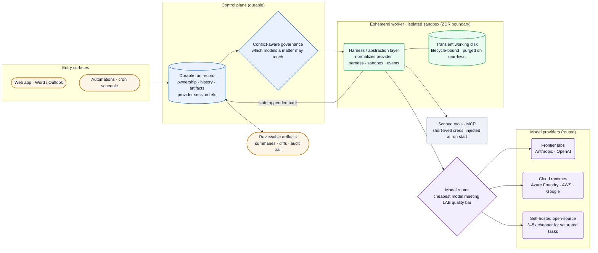
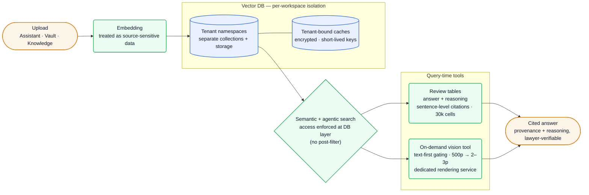

[Harvey][home] is AI software for legal and professional services — Assistant, Vault, Workflows, and Word/Outlook add-ins used by *"1500+ customers in 60+ countries"* who now run *"more than 25,000 custom agents"* on it ([careers][jd-infra], [growth][growth]). The technically interesting part is the shift it describes openly: *"we've moved Harvey from a chat product to cloud agents — from answering a lawyer's question to completing a lawyer's task end to end,"* like reviewing a data room across hundreds of thousands of documents ([runtime][runtime]). To do that for regulated law firms, Harvey built and runs its **own multi-model cloud agent runtime** — because zero data retention, model neutrality, and cost control are blockers no managed agent platform meets yet.

**Vitals:** founded 2022 · $200M growth round at **$11B** (Mar 2026, co-led GIC + Sequoia) · several hundred employees · San Francisco HQ (+ NY, Singapore) ([growth][growth], [careers][jd-infra]).

Business context — founders, funding, customers, moat

- **Founders:** **Winston Weinberg** (CEO, ex-O'Melveny & Myers securities/antitrust litigator) and **Gabriel Pereyra** (President & Chief Scientist, ex-DeepMind / Meta AI) — Pereyra by-lines the runtime and Spectre engineering posts ([Wikipedia][wiki], [runtime][runtime]).
- **Funding:** **$200M growth round at an $11B valuation**, co-led by **GIC and Sequoia** (Mar 25 2026), with a16z, Coatue, Conviction, Elad Gil, Evantic, Kleiner Perkins ([growth][growth]). Preceded by a **$300M Series E at $5B** co-led by Kleiner Perkins + Coatue (Jun 2025), OpenAI Startup Fund and REV (LexisNexis' RELX) among earlier backers ([Series E][seriese]).
- **Traction:** processing *"billions of prompt tokens and millions of daily requests"* ([careers][jd-infra]); customers run *"more than 25,000 custom agents"* ([growth][growth]). Named customers span Deutsche Telekom, Reed Smith, Syngenta, Repsol, Cuatrecasas, Adecco, CMS, Ashurst, Baker Donelson, GSK Stockmann ([home][home], [growth][growth]).
- **Moat (positioning):** deep legal domain integration (former lawyers embedded in engineering), enterprise compliance (SOC 2 II, ISO 27001/27701/42001, GDPR, CCPA), and ownership of the agent runtime itself — which is what makes conflict-aware governance and sovereign/self-host deployments possible ([security][security], [runtime][runtime]).

## The heavy lifting

- **An abstraction layer that turns "which model" into a routing decision.** Every provider exposes a different agent harness — *"different tool-call formats, stop conditions, streaming behavior, and failure modes"* — and a different sandbox, so the same task tuned for one model underperforms on another. Harvey *"built an abstraction layer that normalizes the harness, the sandbox, and the behavioral differences beneath a single interface,"* then routes across frontier labs (Anthropic, OpenAI), cloud runtimes (Azure Foundry, AWS, Google), and self-hosted open-source ([runtime][runtime]). The constraint it beats is structural, not preference: a client that trains its own models *"will not allow its outside counsel to send sensitive legal matters through a competitor's model,"* so multi-model is a conflicts gate, not a feature.
- **Zero data retention designed into the runtime, not bolted on.** The tempting shortcut — store during the run, call a delete endpoint after — *"isn't zero retention; it is retention followed by deletion."* Harvey designs so customer data is *"not written into durable application storage by default"*; the agent's transient working disk is *"lifecycle-bound to the sandbox and automatically cleaned up as part of teardown."* The hard part is that agents are stateful (working memory, checkpoints), and a managed runtime *"earns its keep precisely by persisting all of that for you"* — so *"automatic state persistence and zero retention are mutually exclusive,"* which is exactly why owning the runtime is non-negotiable for privileged work ([runtime][runtime]).
- **A LAB-benchmarked cost router that sends saturated tasks to cheap models.** A single agent run can be *"hundreds of model and tool calls over a large corpus,"* so frontier-only routing doesn't scale economically. Harvey's legal agent benchmark (LAB) shows *"open-source models match frontier quality at a fraction of the cost"* on many task types, so it routes *"to the most efficient model that meets the quality threshold, including open-source models we host ourselves"* — an empirical *"3-5x cost reductions versus a frontier-only approach"* ([runtime][runtime]).
- **Embedding access enforced at the database layer, because embeddings are reversible.** Recent work (Jha et al.) shows *"an attacker can reverse any embedding model"*, so Harvey treats embeddings *"as an extension of your source data"* and partitions the vector DB so each workspace has *"separate collections and storage … segmented along tenant boundaries and tenant IDs rather than filtered after the fact."* It explicitly rejects post-filtering — *"a bug or misconfiguration in the filter logic becomes a complete breach"* and leaks membership — enforcing access *"so that unauthorized vectors are never retrieved in the first place"* ([embeddings][embeddings]).

## Stack

Public signals from engineering JDs and the technical blog. Vendor-unnamed infra (the vector DB, the durable-run engine, OSS model serving) goes to [Likely internals](#likely-internals).

| Layer | Choice | Evidence |
| --- | --- | --- |
| **Languages** | **Python** (AI services) + **Go** (infra/proxy) | core-infra JD ([careers][jd-infra]) |
| **Frontend** | **React + TypeScript + TailwindCSS**, PWA, internal design system | frontend JD ([careers][jd-fe]) |
| **Office surfaces** | **Microsoft Word + Outlook add-ins** + web app | frontend JD ([careers][jd-fe]) |
| **Cloud** | **Multi-cloud: Azure (preferred) + GCP**; multi-region for data residency | core-infra JD ([careers][jd-infra]) |
| **Orchestration** | **Kubernetes** + container management, networking | core-infra JD ([careers][jd-infra]) |
| **IaC** | **Terraform + Pulumi**; all vector-DB paths declared as IaC | core-infra JD ([careers][jd-infra]); embeddings post ([embeddings][embeddings]) |
| **Model access** | **Own model-proxy** routing *"millions of daily inference requests"* across providers | core-infra JD ([careers][jd-infra]); runtime post ([runtime][runtime]) |
| **Models (routed)** | Anthropic + OpenAI + cloud runtimes + **self-hosted open-source**; newest integrated fast (Fable 5, Opus 4.8, GPT-5.5 preview) | runtime post ([runtime][runtime]); product posts ([blog][blog]) |
| **Rate limiting / quota** | **Redis-backed** distributed limiting | core-infra JD ([careers][jd-infra]) |
| **Observability / incident** | **Datadog, Sentry**; **PagerDuty, Incident.io** | core-infra JD ([careers][jd-infra]) |
| **Retrieval** | vector DB with **per-workspace isolation** (separate collections/namespaces); semantic + agentic search | embeddings post ([embeddings][embeddings]) |
| **Internal eng tooling** | **GitHub, Linear, Slack, Datadog** wired into Spectre | Spectre post ([spectre][spectre]) |
| **Compliance** | SOC 2 II, ISO 27001/27701/42001, GDPR, CCPA; SAML SSO, audit logs, IP allow-listing | security page ([security][security]) |

:::note[Key finding — the model is a swappable, routed dependency]
Harvey's runtime exists to make *"the choice of model … just a routing decision"* ([runtime][runtime]). A model-proxy normalizes provider differences and routes each task to the cheapest model clearing a LAB quality bar — including OSS models Harvey hosts itself — for a measured 3–5x cost cut vs frontier-only.
:::

## Hard problems

The parts an engineer here works hardest on. **Public signal** is verified+cited; **likely approach** is hedged speculation.

| Problem | Why it's hard | Public signal | Likely approach (speculative) |
| --- | --- | --- | --- |
| **Multi-model without per-model regression** | Each provider has different tool-call formats, stop conditions, streaming, sandboxes; a task tuned for one underperforms on another | *"an abstraction layer that normalizes the harness, the sandbox, and the behavioral differences beneath a single interface"* ([runtime][runtime]) | Per-provider adapters translate native events to a stable internal shape; route by LAB quality/cost per task type; keep prompts model-portable |
| **ZDR for stateful long-running agents** | Agents accumulate working memory + checkpoints; managed runtimes persist that = customer data at rest off-prem | *"Automatic state persistence and zero retention are mutually exclusive"*; transient disk *"lifecycle-bound to the sandbox"* ([runtime][runtime]) | Own runtime; durable **run record** in control plane holds only refs, worker state scoped to session and purged on teardown |
| **Embedding reversal on privileged matters** | Embeddings preserve structure (reversible); post-filtering leaks membership and is a single point of failure | per-workspace *"separate collections and storage"*, tenant IDs; access enforced *"at the database layer"* ([embeddings][embeddings]) | Tenant-namespaced vector store, short-lived programmatic creds, IaC-declared access, encrypted tenant-bound caches, anomaly monitoring |
| **Citation at table scale** | A 30-col × 1000-doc review table is *"30,000 concurrent cells"* and lawyers stake licenses on provenance | sentence-level citations *"pointing to indices"*; *"answer and reasoning"* fields; benched with *"prompt caching and parallel request handling across different models"* ([review][review]) | Index-anchored sentence citations; per-cell parallelism + caching to hold latency; reasoning surfaced for verifiability |
| **Vision cost at billions of images** | Image processing is *"roughly 50x more expensive"* than text and *"90% of those images are not actually necessary"* | on-demand tool, text-first gating; candidate pages *"narrows a 500-page document down to 2-3 pages in milliseconds"* ([vision][vision]) | Agent-invoked vision tool gated behind text search; dedicated rendering service; tool-description tuning to balance recall vs over-trigger |

## Likely internals

Harvey names its requirements precisely but not always its vendors. Inferred from the stack it does name; uncertainty noted in *Basis*.

| Component | Likely choice | Basis |
| --- | --- | --- |
| Vector DB vendor | a security-first managed vector store (Turbopuffer/Pinecone-class) or self-managed pgvector/Qdrant with per-tenant namespaces | embeddings post specifies isolation + namespacing requirements but not the product ([embeddings][embeddings]) |
| Durable-run control plane | a durable-execution / workflow engine (Temporal-style) backing run records, checkpoints, and session resume | Spectre describes *"durable run"*, checkpoints, *"control plane appends … restores … session context"* — engine unnamed ([spectre][spectre]) |
| OSS model serving | vLLM/TGI on GPU nodes in Azure/GCP Kubernetes | *"open-source models we host ourselves"* + K8s/AI-inference infra; serving stack not stated ([runtime][runtime], [careers][jd-infra]) |
| Backend service framework | Python services (FastAPI-style) for AI; Go for the model proxy / infra plane | Python+Go named; web framework not ([careers][jd-infra]) |
| Control-plane DB / artifact store | Postgres for run records + object storage (Azure Blob / GCS) for artifacts | standard for the described run/artifact model; not stated |
| Enterprise auth | external IdP via SAML SSO (+ SCIM provisioning) | *"SAML SSO"* on security page; vendor not named ([security][security]) |
| Headcount | several hundred | third-party trackers; not stated first-party ([Sacra][sacra]) |

## Architecture

### The cloud agent runtime

A request enters from the web app, a Word/Outlook surface, or a scheduled automation and becomes a **durable run record** in the control plane — the run, not the worker, is the thing that persists (ownership, history, artifacts, provider session refs). Conflict-aware governance gates **which models a matter may even touch**. Execution happens in an **ephemeral worker inside an isolated sandbox**: a harness/abstraction layer normalizes each provider's harness and events, the model router picks the cheapest model clearing the LAB quality bar (frontier, cloud, or self-hosted OSS), and tools/MCP are injected with short-lived scoped credentials. The sandbox's transient disk is the **ZDR boundary** — purged on teardown; durable state is appended back to the run record, never left in the worker. Out come reviewable artifacts and a complete audit trail ([runtime][runtime], [spectre][spectre]).

![Harvey cloud agent runtime: requests from the web app, Word/Outlook, or cron automations create a durable run record in the control plane, which carries ownership, history, artifacts and provider session references; conflict-aware governance gates which models a matter may touch; execution runs in an ephemeral worker inside an isolated sandbox forming the zero-data-retention boundary, where a harness and abstraction layer normalizes each provider's harness, sandbox and events, and a transient working disk is lifecycle-bound and purged on teardown; a model router sends each task to the cheapest model that clears the LAB quality bar across frontier labs (Anthropic, OpenAI), cloud runtimes (Azure Foundry, AWS, Google) and self-hosted open-source models that are 3 to 5 times cheaper for intelligence-saturated tasks; scoped tools and MCP get short-lived credentials injected at run start; worker state is appended back to the durable run, which emits reviewable artifacts and an audit trail.](/diagrams/harvey/cloud-agent-runtime.svg)

Mermaid source

:::note[Inference — Spectre is the runtime, rehearsed internally — confidence: high]
Spectre is Harvey's *internal* collaborative agent platform (durable runs, ephemeral workers, sandboxes, cron automations) — and the team explicitly builds *"the parallel pieces of this architecture inside Harvey's core product and customer-facing cloud agent platform"* ([spectre][spectre]). Reading Spectre is reading the customer runtime's design with the legal mapping: repos/PRs → matters/review workflows; sandbox boundaries → ethical walls and client isolation.
:::

### Document intelligence: isolated RAG with query-time tools

Uploads to Assistant, Vault, or Knowledge are embedded and stored in a **per-workspace-isolated** vector DB (tenant namespaces, separate collections, encrypted tenant-bound caches). Semantic + agentic search enforces access **at the database layer** — unauthorized vectors are never retrieved, so there is no post-filter to misconfigure. On top sit query-time tools: **review tables** (answer + reasoning, sentence-level citations across tens of thousands of concurrent cells) and an **on-demand vision tool** that is gated text-first and renders only the 2–3 candidate pages it needs. The output is a cited answer a lawyer can verify ([embeddings][embeddings], [review][review], [vision][vision]).

![Harvey document intelligence pipeline: uploads from Assistant, Vault and Knowledge are embedded, with embeddings treated as source-sensitive data, and stored in a vector database with per-workspace isolation — tenant namespaces with separate collections and storage, plus tenant-bound caches encrypted under short-lived keys; semantic and agentic search enforces access at the database layer with no post-filtering, so unauthorized vectors are never retrieved; query-time tools include review tables that produce answer plus reasoning with sentence-level citations across roughly thirty thousand concurrent cells, and an on-demand vision tool gated text-first that narrows a 500-page document to two or three pages using a dedicated rendering service; both feed a cited, lawyer-verifiable answer with provenance and reasoning.](/diagrams/harvey/document-intelligence.svg)

Mermaid source

## Team & process

Founder-led by Winston Weinberg (CEO, ex-litigator) and Gabriel Pereyra (President & Chief Scientist, ex-DeepMind/Meta AI), the engineering org is organized around the runtime: Core Infrastructure, Product Engineering, Frontend, Security, DevEx, and Applied Legal Research, across SF (HQ), New York, and Singapore ([careers][jd-infra], [runtime][runtime], [spectre][spectre]).

| Role | Person / team | Source |
| --- | --- | --- |
| CEO, co-founder | Winston Weinberg | [Wikipedia][wiki] |
| President & Chief Scientist, co-founder | Gabriel Pereyra | [runtime][runtime] |
| Core Infrastructure / Security / DevEx / Frontend | named eng teams | [careers][jd-infra], [spectre][spectre] |
| Applied Legal Researchers (ALRs) | former practicing lawyers embedded in eng | [review][review] |

Two process traits stand out. First, **eval is gated by a privacy wall**: *"no one on our team sees real customer queries,"* so former lawyers (ALRs) author evaluation datasets that mirror production, and changes ship on side-by-side preference + latency + reliability metrics rather than vibes ([review][review]). Second, the company **dogfoods its own agent runtime** — Spectre runs internal engineering work (incident investigation in Slack threads, scheduled cleanup/test-gen via cron, PRs) on the same durable-run/ephemeral-worker architecture it sells, which is how it pressure-tests the security and collaboration model before mapping it onto legal matters ([spectre][spectre]). Stated values: *"Decisiveness, Simplicity, and Job's Not Finished,"* in-person/hybrid in SF ([careers][jd-infra]).

## Sources

Reconstructed from public sources only — no insider information. Built primarily from Harvey's own engineering "Technical Deep Dives" and careers JDs, plus the homepage/security page and the funding announcement; crawled 2026-06-10 via Chrome MCP (logged-out), with one web search/fetch for the funding round. Claim tiers: **verified** (stated on a public page, linked) · **inferred** (reasoned from a cited signal) · **speculative** (best-practice fill-in, labeled). Per-claim quotes are in this repo's evidence map (`evidence/harvey-evidence-map.md`).

| # | Source | Link |
| --- | --- | --- |
| S1 | Homepage | <https://www.harvey.ai/> |
| S2 | Why we Built our own Cloud Agent Infrastructure | <https://www.harvey.ai/blog/why-we-built-our-own-cloud-agent-infrastructure> |
| S3 | Building Spectre (internal cloud agent platform) | <https://www.harvey.ai/blog/building-spectre-internal-collaborative-cloud-agent-platform> |
| S4 | How Harvey Secures Embeddings at Scale | <https://www.harvey.ai/blog/how-harvey-secures-embeddings-at-scale> |
| S5 | Rebuilding the Review Algorithm | <https://www.harvey.ai/blog/rebuilding-harveys-review-algorithm> |
| S6 | How we Built Image Understanding for Legal Documents | <https://www.harvey.ai/blog/building-image-understanding-for-legal-documents> |
| S7 | Senior SWE, Core Infrastructure (JD) | <https://www.harvey.ai/company/careers/748edfbe-f819-47fd-85bb-3c4974f8913f> |
| S8 | Senior SWE, Frontend (JD) | <https://www.harvey.ai/company/careers/04e17f81-d0a7-4f83-8526-ec4c9532ddcc> |
| S9 | Security & compliance | <https://www.harvey.ai/security> |
| S10 | Growth round at $11B (GIC + Sequoia) | <https://www.harvey.ai/blog/harvey-raises-growth-round-at-dollar11-billion-valuation-co-led-by-gic-and-sequoia> |
| S11 | Series E ($300M, $5B) | <https://www.harvey.ai/blog/harvey-raises-series-e> |
| S12 | Sacra (third-party — revenue/headcount) | <https://sacra.com/c/harvey/> |

[home]: https://www.harvey.ai/
[security]: https://www.harvey.ai/security
[blog]: https://www.harvey.ai/blog
[runtime]: https://www.harvey.ai/blog/why-we-built-our-own-cloud-agent-infrastructure
[spectre]: https://www.harvey.ai/blog/building-spectre-internal-collaborative-cloud-agent-platform
[embeddings]: https://www.harvey.ai/blog/how-harvey-secures-embeddings-at-scale
[review]: https://www.harvey.ai/blog/rebuilding-harveys-review-algorithm
[vision]: https://www.harvey.ai/blog/building-image-understanding-for-legal-documents
[jd-infra]: https://www.harvey.ai/company/careers/748edfbe-f819-47fd-85bb-3c4974f8913f
[jd-fe]: https://www.harvey.ai/company/careers/04e17f81-d0a7-4f83-8526-ec4c9532ddcc
[growth]: https://www.harvey.ai/blog/harvey-raises-growth-round-at-dollar11-billion-valuation-co-led-by-gic-and-sequoia
[seriese]: https://www.harvey.ai/blog/harvey-raises-series-e
[sacra]: https://sacra.com/c/harvey/
[wiki]: https://en.wikipedia.org/wiki/Harvey_(software)
