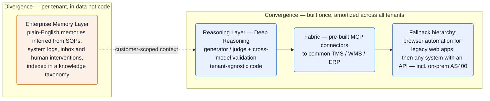
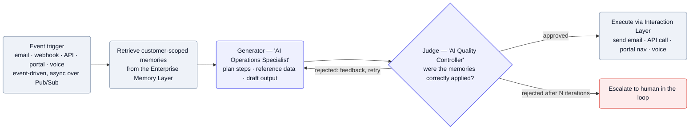

[Pallet][home] sells AI agents that run logistics back-office work — quoting, order entry, load building, appointment setting, POD retrieval, invoice auditing, customs processing — for freight brokers, 3PLs, carriers, and warehouses ([product page][agent], [Forge post][forge]). The wedge: buyers run frozen legacy systems (TMS, WMS, ERP, sometimes on-prem AS400) they won't replace, so Pallet's agents meet each system at whatever interface it offers — *"any system with an API, including on-premise AS400-based databases"* ([product page][agent]). The engineering bet is that per-customer heterogeneity lives in *data, not code*: tenant-agnostic connectors and reasoning, with each customer's SOPs captured as thousands of learned plain-English "memories."

**Vitals:** founded ~2022 (pivoted to AI early 2025) · Series B ($50M) · SF HQ + NYC · headcount unpublished.

<details>
<summary>Business context — founders, funding, customers, product surfaces</summary>

- CEO/founder **Sushanth Raman**; CTO **Nilkanth (Neel) Patel**, who also bylines as Head of Product Engineering ([Core post][core], [JD][jd-pe]).
- **$50M raised**, from General Catalyst, Bessemer Venture Partners, and Bain Capital Ventures ([JD][jd-fdse]); a "Series-B funded supply chain technology company" ([Encore][encore]).
- **70+ logistics organizations in production** — named customers include Mallory Alexander, Knight-Swift, Lineage Logistics, STG Logistics, Prism Logistix ([Core post][core]); **700% revenue growth in under two years** ([JD][jd-fdse]).
- Value prop in one line — labor arbitrage on back-office ops: *"We have to decouple headcount growth from revenue growth … Pallet increases our operating margin by 10%"* — David Radom, CEO, Prism Logistix ([Core post][core]).
- Pivoted early 2025 after ~three years building a traditional TMS — *"made the call to pivot and build an enterprise AI logistics platform"* ([Encore][encore]).
- Four named surfaces — **CoPallet** (the agent), **Forge** (deployment automation / "agent factory"), **Atlas** (network/revenue intelligence), **Pallet Core** (platform + a proprietary logistics-trained model) ([JD][jd-fdse], [Forge post][forge], [Atlas page][atlas], [Core post][core]). The live site now decomposes the platform into Agents, Forge, Memory, Intelligence, Fabric, and Platform; "CoPallet" persists as the agent brand.
</details>

## The heavy lifting

- **Connectors converge, knowledge diverges.** Tenant-agnostic Fabric MCP connectors and the core reasoning are built once and amortized across customers; per-tenant uniqueness lives as *data, not code*, in the Enterprise Memory Layer ([product page][agent], [Forge post][forge], [blog][memory]).
- **SOPs are learned as plain-English "memories," not configured.** Customer tribal knowledge is inferred from the inbox into thousands of discrete facts (*"Auto-approve 5% discounts for Gold customers"*) indexed in a taxonomy — Everest runs on *"more than 20,000 customer-specific memories"* ([blog][memory], [Forge post][forge]).
- **Meet frozen legacy systems at whatever interface they offer.** A fallback hierarchy — native API → built API → driving the legacy web UI via Browserbase/Playwright — reaches *"any system with an API, including on-premise AS400-based databases"* so the customer never migrates ([product page][agent], [Browserbase JD][jd-sec]).

## Stack

A small, deliberately boring, velocity-optimized stack, shaped by one constraint the CTO states plainly: he's a product engineer who doesn't want his team touching infra — *"I've used Terraform, but generally I don't want me or my team to deal with it"* ([Encore][encore]).

| Layer | Choice | Evidence |
| --- | --- | --- |
| **Cloud** | GCP — Cloud SQL (Postgres), Pub/Sub, Cloud Storage buckets, Vertex AI (fine-tuned models) | [Encore][encore], [JD][jd-fdse] |
| **Backend** | Node.js + TypeScript on **Encore.dev**; event-driven with message passing & queues; hosted on GCP | [JDs][jd-fdse], [Encore][encore] |
| **DB** | PostgreSQL (Cloud SQL) | [Encore][encore], [JDs][jd-pe] |
| **Frontend** | Next.js / React / TypeScript on **Vercel** (deploys independently of the GCP backend) | [JD][jd-fdse] |
| **API** | GraphQL appears only as a "bonus" JD skill | [JD][jd-pe] |
| **LLMs** | Foundation models from **OpenAI, Anthropic, Google**; fine-tuned models on Vertex AI; plus a **proprietary model trained on licensed supply-chain datasets** (Pallet Core) | [JDs][jd-fdse], [Core post][core] |
| **Browser automation** | **Browserbase** (managed cloud browsers) and **Playwright** — both appear across JDs | [Browserbase JD][jd-sec], [Playwright JD][jd-fdse] |
| **Observability** | **Datadog** for logging & metrics | [JD][jd-fdse] |
| **Compliance** | SOC 2 Type 2 (and Type 1) | [product page][agent], [trust center][trust] |

:::note[Key finding — Encore is the keystone bet]
Encore (infra-from-code) provisions GCP resources into Pallet's *own* account but manages them — the CTO calls it the team's *"DevOps department"* ([Encore][encore]). Trade infra control for velocity; that's why there are zero DevOps roles.
:::

## Hard problems

The parts an engineer would lose sleep over. **Public signal** is cited (verified); **likely approach** is labeled speculation — best-practice fill-in, hedged.

| Problem | Why it's hard | Public signal | Likely approach (speculative) |
| --- | --- | --- | --- |
| **Integrating fragmented, undocumented carrier/TMS systems** | Each customer runs frozen legacy stacks with no stable API surface; many have no API at all | *"any system with an API, including on-premise AS400-based databases"* and *"where APIs don't exist, Pallet builds them"* ([agent][agent], [forge][forge]) | Likely a Fabric MCP-connector library plus a Browserbase/Playwright browser-automation fallback tier, so undocumented web UIs are driven like a human would |
| **Trusting non-deterministic agents in systems of record** | A wrong action (booking, invoice, load) costs real money or shipments, and the agent acts autonomously ~95% of the time | *"field-level confidence scoring and cross-model validation"*; high-confidence auto-processes, low-confidence flagged — operators handle ~5% ([parallel][parallel]) | Probably per-field confidence thresholds gating auto-execute vs. human review, tuned per action's blast radius |
| **Testing probabilistic agents with no QA org** | The unit under test is a stochastic system acting against external systems Pallet doesn't control; classic test pyramids don't fit | *"Pallet runs thousands of simulations to validate agent performance before deployment"*; memories are *"backtested against historical scenarios"* before going active ([agent][agent], [contint][contint]) | Likely a synthetic + historical-replay simulation harness in Forge that scores agent and memory changes pre-deploy, gating promotion |
| **Learning customer SOPs accurately from messy inboxes** | Tribal knowledge lives in unstructured email; mis-inferred rules silently corrupt every future decision | *"Everest Transportation Systems runs on more than 20,000 customer-specific memories, every one of them inferred from their inbox"* ([forge][forge]) | Probably an extract-then-backtest pipeline that mines plain-English memories from inbox/logs and validates each against history before committing |

## Likely internals

The infrastructure Pallet doesn't name publicly, inferred from the stack it does — Encore on GCP, multi-provider LLMs, and no DevOps/QA roles:

| Component | Likely choice | Basis |
| --- | --- | --- |
| Compute | Cloud Run | Encore's default GCP target for TS services; fits the "no GKE, no infra team" stance |
| Secrets / network | Secret Manager, VPC | GCP defaults Encore provisions; table stakes for SOC 2 |
| LLM routing | a model gateway (OpenRouter / LiteLLM / in-house) | one interface over OpenAI + Anthropic + Google + fine-tuned models, per-task routing |
| Model roster / weighting | OpenAI + Anthropic + Google run independently, consensus-weighted | providers + cross-model validation confirmed ([blog][memory]); exact models/weights not public |
| Proprietary model (Pallet Core) | fine-tuned on licensed supply-chain data via Vertex AI | *"trained on licensed supply chain datasets"* ([Core post][core]); method/scale not public |
| Memory store | pgvector in Cloud SQL Postgres | retrieval over thousands of plain-English memories implies a vector index; Postgres is the confirmed DB |
| Tenant isolation | Postgres row-level security keyed on org id | clearly multi-tenant; RLS the idiomatic Postgres mechanism |
| Auth | a managed IdP (Stytch / WorkOS / Auth0) + service JWTs | "authentication, authorization, secrets management" a named JD duty; no vendor stated |
| Observability | OpenTelemetry → Datadog | Datadog confirmed; OTel the standard feed from an Encore/TS service |
| Compute tiering | light workers for lookups, heavier/GPU for doc processing | "dynamically spins up multiple AI workers" confirmed; tiering the obvious extension |

<details>
<summary>Likely monorepo layout (speculative)</summary>

Encore favors one app with multiple services in one repo, and the CTO treats Encore as the team's "DevOps department" — so a monorepo is the overwhelmingly likely choice. Service names map onto verified product concepts (generator/judge, the Memory Layer + backtesting, Fabric, Forge, Pallet Core); the file layout itself is convention-based.

```text
pallet/                        # single Encore app — monorepo (likely)
├─ encore.app
├─ package.json
├─ tsconfig.json
├─ backend/
│  ├─ ingestion/               # email · webhook · voice · cron intake → Pub/Sub
│  │  ├─ encore.service.ts
│  │  ├─ ingestion.ts
│  │  └─ topics.ts
│  ├─ agents/                  # Deep Reasoning orchestration
│  │  ├─ encore.service.ts
│  │  ├─ orchestrator.ts
│  │  ├─ generator.ts          # "AI Operations Specialist"
│  │  ├─ judge.ts              # "AI Quality Controller"
│  │  └─ confidence.ts         # cross-model scoring
│  ├─ memory/                  # Enterprise Memory Layer
│  │  ├─ encore.service.ts
│  │  ├─ memory.ts
│  │  ├─ taxonomy.ts
│  │  ├─ backtest.ts           # backtest a memory before it goes active
│  │  └─ migrations/
│  ├─ fabric/                  # connectors
│  │  ├─ encore.service.ts
│  │  ├─ mcp/                  # per-system MCP connectors (TMS / WMS / ERP)
│  │  ├─ browser/              # Browserbase + Playwright fallback
│  │  └─ as400/
│  ├─ models/                  # provider routing + Pallet Core client
│  ├─ simulation/              # Forge: sim harness + iteration loop
│  ├─ auth/                    # authn / authz, org scoping
│  └─ shared/                  # shared types, schemas, utils
└─ frontend/                   # Next.js → deployed to Vercel
   ├─ app/
   ├─ components/
   └─ lib/encore-client/       # generated Encore request client
```

</details>

## Architecture

**Event-driven, end to end.** The CTO's stated requirement: *"Everything in the system would be triggered by events"* ([Encore][encore]). Agent execution runs as asynchronous operations over Pub/Sub, orchestrated by Encore ([Encore][encore]). They run four environments — staging, QA, and production among them — and "haven't had to slow down to re-architect anything due to a platform limitation" ([Encore][encore]).

### Connectors converge, knowledge diverges

- **Convergence (shared, built once).** Integration is built on **Fabric** — pre-built MCP connectors to common TMS/WMS/ERP systems — with a documented fallback hierarchy: browser automation for legacy web apps, then "any system with an API, including on-premise AS400-based databases"; "where APIs don't exist, Pallet builds them" ([product page][agent], [Forge post][forge]). This layer and the core reasoning code are tenant-agnostic and amortized across all customers.
- **Divergence (per tenant, in data not code).** Per-customer uniqueness lives in the **Enterprise Memory Layer**: customer SOPs and tribal knowledge are *learned* and stored as thousands of plain-English "memories" — discrete facts like *"Auto-approve 5% discounts for Gold customers"* — indexed into a knowledge taxonomy ([blog][memory]). The headline number: *"Everest Transportation Systems runs on more than 20,000 customer-specific memories, every one of them inferred from their inbox"* ([Forge post][forge]).


<details>
<summary>Mermaid source</summary>



</details>

:::note[Key finding — heterogeneity lives in data, not code]
**LLM + memory absorbs the per-customer variation that used to need bespoke adapter code.** Each deployment's uniqueness is a pile of inferred, backtested memories — which is what lets Forge automate onboarding.
:::

:::note[Inference — multi-tenancy — confidence: medium]
Per-customer rules and memories are pervasive ("20 custom rules per customer across 200 customers", [blog][memory]), so the platform is clearly multi-tenant with customer-scoped data. The isolation *mechanism*, and whether the memory layer physically lives in the confirmed Cloud SQL Postgres ([Encore][encore]), are not stated — see [Likely internals](#likely-internals) for the conventional guess.
:::

A customer-facing **composable agent builder** ("modular action and reasoning nodes") lets customers assemble agents from pre-built use cases ([product page][agent]); Core adds "a flexible agent builder [that] orchestrates workflows across tasks, tool calls, and validation steps" ([Core post][core]).

### Deep Reasoning: generator + judge

Pallet rejects both rigid rule-based flowcharts and one-shot LLM calls in favor of a two-model loop ([Deep Reasoning post][deepreason]):

- **Generator — "your AI Operations Specialist"**: analyzes the situation, picks tools, plans and drafts the steps.
- **Judge — "your AI Quality Controller"**: verifies the draft against the retrieved memories; approves → execute, rejects → feedback and retry, rejects after multiple iterations → escalate to a human.


<details>
<summary>Mermaid source</summary>



</details>

**Confidence is a first-class concern.** Reasoning runs across "multiple models from different providers, including OpenAI, Google, Anthropic, each working independently" ([blog][memory]), and outputs go through "field-level confidence scoring and cross-model validation": high-confidence fields auto-process, low-confidence fields are flagged for human review — operators handle ~5% of inputs, agents the other ~95% ([Parallel Agents post][parallel]). This makes sense when agents take real actions in customers' systems of record.

**Parallel execution.** For high-volume work, Pallet "dynamically spins up multiple AI workers" to run bids, processing, and tracking concurrently, then merges results ([Parallel Agents post][parallel]). Trigger and execution surfaces span email, webhooks, API calls, third-party portal navigation, and voice ([blog][memory], [product page][agent]); Pallet frames voice as a maturing landscape with "vendors like OpenAI, ElevenLabs, Bland, and Cartesia" rather than naming its own in-product vendor ([blog][memory]).

:::note[Inference — guardrailed agency — confidence: medium]
The agents are guardrailed, not free-roaming: a structured agent builder with discrete action/reasoning nodes and explicit "validation steps" ([product page][agent], [Core post][core]), plus the judge gate above. The implementation — typed action contracts, how confidence is computed, how compute is tiered per task — isn't public; the *concepts* (confidence scoring, parallel workers) are confirmed, the code-level shape is a guess.
:::

## Team & process

Founder-led — **CEO Sushanth Raman**, **CTO / Head of Product Engineering Neel Patel** ([Core post][core], [JD][jd-pe]); SF HQ + NYC satellite, headcount unpublished. The open-role mix is the signal: of ~13 roles, **4 engineering, 4 sales, 2 deployment, zero QA/SDET, zero ML-research** ([careers][company]) — a Series-B land-and-expand motion with FDE-led delivery, not an in-house research org. Pedigree advertised is technical, not logistics: leaders from Google, DoorDash, YC; engineers from Scale AI, DoorDash, Rippling ([JD][jd-pe], [Security JD][jd-sec]).

| Role | Person | Source |
| --- | --- | --- |
| Founder / CEO | Sushanth Raman | [Core post][core] |
| CTO / Head of Product Engineering | Nilkanth (Neel) Patel | [JD][jd-pe] |

**Deployment is the Palantir FDE model for logistics:** a Forward Deployed SWE *"reverse engineer[s] undocumented APIs, ERPs, TMS systems,"* sits onsite (~25% travel), and owns go-lives end-to-end, paired with a non-coding Enterprise Deployment Strategist who *"translate[s] complex business processes into executable AI agent workflows"* ([JD][jd-fdse], [JD][jd-eds]). **Forge is the bet to automate that FDE** — an "agent factory" that learns SOPs from historical data, simulates, and ships: Eassons Transport Group went live in 40 days and now runs *"98% touchless,"* and after the first customer, *"every additional customer onboarded in 48 hours"* ([Forge post][forge]).

**Quality is simulation, not a QA org.** With no test team, correctness comes from three mechanisms: Forge *"runs thousands of simulations to validate agent performance before deployment"* ([product page][agent], [Forge post][forge]); every memory is *"backtested against historical scenarios … before that memory becomes active"* ([Continuous Intelligence post][contint]); and Datadog carries prod observability in an *"observability-first,"* small-PR, prod-first culture ([JD][jd-fdse]). CI/CD is largely **Encore** acting as the deploy pipeline. Culture markers: equity at the 80th percentile, **bonuses tied to customer go-lives**, "extreme ownership," and AI tooling encouraged (Claude, Cursor) — *"but you must understand the architecture"* ([JD][jd-fdse], [careers][company]).

## Sources

Reconstructed from public sources only — no insider information. Crawled 2026-06-07. Claim tiers: **verified** (stated on a public page, linked) · **inferred** (reasoned from a cited signal, confidence flagged) · **speculative** (best-practice fill-in, labeled). Links are live; pages change, so the supporting quote for each claim is kept in this repo's evidence map (`evidence/pallet-evidence-map.md`).

| # | Source | Link |
| --- | --- | --- |
| S1 | Homepage | <https://www.pallet.com/> |
| S2 | Product / Agents | <https://www.pallet.com/product/agent> |
| S3 | Product / Atlas | <https://www.pallet.com/product/atlas> |
| S4 | Company / careers | <https://www.pallet.com/company> |
| S5 | Forge announce (Raman, 2026-05-14) | <https://www.pallet.com/blog/pallet-forge> |
| S6 | Deep Reasoning (Kaiser, 2025-09-02) | <https://www.pallet.com/blog/introducing-deep-reasoning> |
| S7 | Real AI Agent vs ChatGPT Wrapper (Patel, 2025-09-05) | <https://www.pallet.com/blog/memory-reasoning-overview> |
| S8 | Pallet Core (Raman, 2026-02-09) | <https://www.pallet.com/blog/pallet-core> |
| S9 | Parallel Agents (Raman, 2025-12-15) | <https://www.pallet.com/blog/parallel> |
| S10 | Continuous Intelligence (Raman, 2026-02-26) | <https://www.pallet.com/blog/continuous-intelligence> |
| S11 | Encore customer story (Kohlberg, 2026-04-07) | <https://encore.dev/customers/pallet> |
| J1 | JD — Forward Deployed SWE | <https://job-boards.greenhouse.io/pallet/jobs/5065850007> |
| J2 | JD — Product Engineer | <https://job-boards.greenhouse.io/pallet/jobs/5149075007> |
| J3 | JD — Platform Engineer, Security | <https://job-boards.greenhouse.io/pallet/jobs/5107230007> |
| J5 | JD — Enterprise Deployment Strategist | <https://job-boards.greenhouse.io/pallet/jobs/5149065007> |
| S12 | CoPallet Trust Center | <https://pallet.safebase.us/> |

[home]: https://www.pallet.com/
[agent]: https://www.pallet.com/product/agent
[atlas]: https://www.pallet.com/product/atlas
[company]: https://www.pallet.com/company
[forge]: https://www.pallet.com/blog/pallet-forge
[deepreason]: https://www.pallet.com/blog/introducing-deep-reasoning
[memory]: https://www.pallet.com/blog/memory-reasoning-overview
[core]: https://www.pallet.com/blog/pallet-core
[parallel]: https://www.pallet.com/blog/parallel
[contint]: https://www.pallet.com/blog/continuous-intelligence
[encore]: https://encore.dev/customers/pallet
[jd-fdse]: https://job-boards.greenhouse.io/pallet/jobs/5065850007
[jd-pe]: https://job-boards.greenhouse.io/pallet/jobs/5149075007
[jd-sec]: https://job-boards.greenhouse.io/pallet/jobs/5107230007
[jd-eds]: https://job-boards.greenhouse.io/pallet/jobs/5149065007
[trust]: https://pallet.safebase.us/
