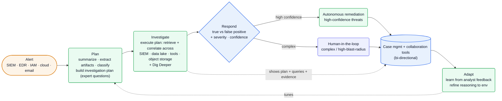
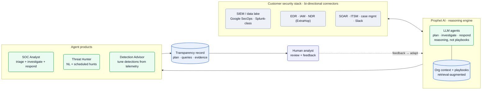

[Prophet Security][home] builds an **agentic AI SOC** — *"a fleet of autonomous AI agents that accelerates Tier 1, Tier 2, and Tier 3 tasks, from alert investigation and response to proactive threat hunting"* ([home][home]). Its agents *"investigate alerts as an experienced human analyst would, using flexible, explainable reasoning, not rigid playbooks"* ([Series A][blog-a]). The engineering bet is **reasoning over playbooks**: for every alert, an LLM agent dynamically builds an investigation plan, pivots across the customer's security stack to gather evidence, and decides true-vs-false-positive — then *shows its work* (plan, queries, evidence) so a human can trust it. Three products ride that engine: **SOC Analyst**, **Threat Hunter**, and **Detection Advisor** ([Series A][blog-a]).

**Vitals:** Menlo Park + NYC (hybrid/remote) · $30M Series A (Accel) + $11M seed (Bain) + strategic (Amex, Citi) · ~50–80 people · SOC 2 Type 2.

Business context — founders, funding, customers, metrics

- Founders: **Kamal Shah** (CEO) and **Vibhav Sreekanti** (CTO); **Grant Oviatt** is VP Product ([About][about], [Series A][blog-a] signed "-Kamal & Vibhav"). Built *"by SecOps experts"* ([home][home]); founders *"previously scal[ed]"* security companies ([About][about]).
- **$30M Series A led by Accel** (Eric Wolford), with **Bain Capital Ventures** and other strategic investors (July 29 2025, [Series A][blog-a]); a reported **$11M seed** (Bain Capital Ventures) preceded it. Later **strategic investments from Amex Ventures and Citi Ventures** (Feb 2026, [Amex/Citi][blog-amexciti]); named to the **Redpoint InfraRed 100**.
- Customers shown publicly: **Instacart, Redis, Penske, Moveworks, Compass, Udemy, IAC, Thirty Madison, JB Poindexter, ETS, Partsource, Upgrade, Cabinetworks** ([home][home], [Series A][blog-a]).
- Reported outcomes: *"10x increase in SOC throughput,"* *"90% reduction in MTTI and MTTR,"* *"75% faster triage and investigation,"* *"100% Alert Coverage across all severities"* ([home][home]).
- Positioning: a **SOAR / MDR replacement** — *"reasoning-based investigation to eliminate playbook maintenance"* and *"role elevation, not role elimination"* ([Series A][blog-a], [blog][blog]).

## The heavy lifting

- **Reasoning replaces playbooks.** For each alert the agent *"dynamically builds an investigation plan, i.e. what are the key questions that an expert analyst would ask,"* then executes it — so coverage doesn't decay the way static SOAR playbooks do as upstream APIs and detections shift ([How it works][how], [blog][blog]).
- **Investigation depth by pivoting across the whole stack.** Agents *"retriev[e], correlat[e], and analyz[e] all … context from multiple data sources (SIEMs, security data lakes, security tools, object storage)"* and offer *"Dig Deeper"* follow-ups — depth, not just faster triage, is the stated accuracy lever ([How it works][how]).
- **Show your work, then gate autonomy.** *"100% transparency"* — every investigation exposes *"the investigative plan, the queries used … and all the evidence gathered"* — and remediation is **autonomous for high-confidence threats, human-in-the-loop for complex cases** ([home][home]).

## Stack

A Python/Go backend, a React/TypeScript frontend, and an in-house agentic-AI platform. Rows are from the job board (R&D) and product pages; the LLM/cloud specifics aren't named — see [Likely internals](#likely-internals).

| Layer | Choice | Evidence |
| --- | --- | --- |
| **Backend languages** | **Python · Go** | [Backend JD][jd-be], [SecOps JD][jd-secops] |
| **Frontend** | **React · TypeScript** | [Full-Stack JD][jd-fs], [Backend JD][jd-be] |
| **AI platform** | in-house **Agentic AI platform** (LLM agents: plan / investigate / respond) | [ML JD][jd-ml], [How it works][how] |
| **AI methods** | **prompt engineering**, **retrieval-based context augmentation**, **fine-tuning**, safety | [ML JD][jd-ml] |
| **Agent work** | *"AI-powered agents, data synthesis and correlation, security tool integration"* | [Backend JD][jd-be] |
| **Data sources read** | **SIEMs, security data lakes, security tools, object storage** | [How it works][how] |
| **Integrations** | **bi-directional** connectors: SIEM/EDR/IAM/SOAR/ITSM + case mgmt; named: **Google Security Operations (Chronicle)**, **ExtraHop** (NDR) | [home][home], [blog][blog] |
| **Outputs** | severity + plain-English findings; remediation steps; dedup; write-back to case mgmt | [How it works][how], [Series A][blog-a] |
| **Compliance** | **SOC 2 Type 2** | [home][home] |

:::note[Key finding — the ML team builds the platform, not a model]
The Senior ML Engineer leads *"the architecture, design, and development of our Agentic AI platform,"* working in *"prompt engineering, and retrieval-based context augmentation methods … fine-tuning techniques, and safety considerations"* ([ML JD][jd-ml]). The differentiated asset is the reasoning/RAG platform over a customer's security data — the foundation model is a (likely multi-vendor) dependency.
:::

## Hard problems

The parts an engineer at this company loses sleep over. **Public signal** is cited (verified); **likely approach** is labeled speculation — best-practice fill-in, hedged.

| Problem | Why it's hard | Public signal | Likely approach (speculative) |
| --- | --- | --- | --- |
| **Investigation accuracy without playbooks** | A missed true positive is a breach; reasoning over noisy, ambiguous alerts must beat both static playbooks and shallow triage | *"flexible, explainable reasoning, not rigid playbooks"*; *"depth of investigation is the holy grail of AI SOC accuracy"* ([Series A][blog-a], [blog][blog]) | Plan-then-investigate agent that enumerates expert questions, gathers evidence per question, and abstains/escalates when inconclusive |
| **Bi-directional integration across every SOC stack** | Each customer runs a different SIEM/EDR/IAM/SOAR mix; ingestion alone isn't enough — the agent must *act* and write back | connectors with *"bi-directional communication to support the full investigation lifecycle, not just simple alert ingestion"* ([home][home]); Google SecOps + ExtraHop named ([blog][blog]) | A connector framework with read (query) + write (respond/case-update) per tool; normalize telemetry into a common investigation schema |
| **Trust + gated autonomous remediation** | Acting in a customer's production security stack has real blast radius; over-trust causes harm, under-trust kills the value | *"100% transparency"* (plan + queries + evidence); autonomous for high-confidence, human-in-the-loop for complex ([home][home]) | Confidence-scored actions gated per blast radius; full reasoning trace persisted per investigation as the audit record |
| **Evaluating a security agent + adapting per env** | Quality across thousands of alert types can't be unit-tested, and each environment's "normal" differs | ML role owns *"safety considerations"*; the Adapt phase *"learns from every analyst feedback"* ([ML JD][jd-ml], [How it works][how]) | Golden-incident eval sets + LLM-as-judge graded on analyst feedback; per-tenant context/policies injected via RAG to tune reasoning |

## Likely internals

The infrastructure Prophet doesn't name publicly, inferred from the stack it does (Python/Go on a cloud, an LLM+RAG agent platform):

| Component | Likely choice | Basis |
| --- | --- | --- |
| LLM providers | OpenAI + Anthropic frontier models, routed | agentic reasoning + *"fine-tuning"* ([ML JD][jd-ml]); Prophet's own blog analyzes Anthropic/Google model behavior; production vendor unnamed |
| RAG / context store | a vector index over org context, prior investigations, and playbooks | *"retrieval-based context augmentation"* + Adapt ingesting *"organizational context"* ([ML JD][jd-ml], [home][home]) |
| Agent orchestration | an in-house planner/executor over a tool/connector layer | *"Agentic AI platform"* + plan→investigate→respond ([ML JD][jd-ml], [How it works][how]); no named framework |
| Cloud | AWS | conventional for a Menlo Park R&D security SaaS; not stated |
| Primary DB | Postgres + an object/evidence store | investigations, evidence, case state; object storage is a named *read* source, write store unstated |
| Eval / observability | golden-incident eval harness + LLM-as-judge | *"safety considerations"* ([ML JD][jd-ml]); explainability is a core claim ([blog][blog]) |
| Auth | enterprise SSO (SAML/OIDC), least-privilege read connectors | SOC 2 Type 2; POV uses *"read-only access to 2-3 data sources"* ([How it works][how]) |

## Architecture

### The investigation loop: Plan → Investigate → Respond → Adapt

Prophet's SOC Analyst runs a four-phase loop per alert ([How it works][how]). **Plan**: *"instantly summarizes incoming alerts, extracts key artifacts, classifies them, and dynamically builds an investigation plan."* **Investigate**: *"emulates an expert analyst, executing the investigation plan by retrieving, correlating, and analyzing all information … from multiple data sources (SIEMs, security data lakes, security tools, object storage),"* with *"Dig Deeper"* for follow-up questions. **Respond**: *"assigns severity … prioritizes critical alerts … delivers concrete remediation steps … deduplicates related alerts,"* integrating with collaboration and case-management tools — autonomous for high-confidence threats, human-in-the-loop for complex ones ([home][home]). **Adapt**: *"learns from every analyst feedback and continuously adapts to your environment."*

![Prophet Security investigation loop: an alert from SIEM, EDR, IAM, cloud or email enters a Plan phase that summarizes, extracts artifacts, classifies, and builds an investigation plan of expert questions; an Investigate phase executes the plan by retrieving and correlating across SIEM, data lake, security tools and object storage, with Dig Deeper follow-ups; a Respond decision determines true-vs-false positive plus severity and confidence, routing high-confidence threats to autonomous remediation and complex or high-blast-radius cases to a human-in-the-loop, both writing back bi-directionally to case management and collaboration tools; an Adapt phase learns from analyst feedback and tunes the planning, while every investigation exposes its plan, queries, and evidence.](/diagrams/prophet-security/investigation-loop.svg)

Mermaid source

### The platform: three agents on one reasoning engine

The same reasoning engine powers three products: **SOC Analyst** (autonomous triage/investigation/response), **Threat Hunter** (natural-language and *"always-on and scheduled"* hunts over a *"curated library of pre-codified hunt templates"*), and **Detection Advisor** (*"improve detection coverage and reduce alert noise based on actual telemetry"*) ([home][home], [Series A][blog-a]). The engine reads and acts through **bi-directional connectors** into the customer's SIEM/EDR/IAM/SOAR/ITSM stack — *"built with bi-directional communication to support the full investigation lifecycle, not just simple alert ingestion"* ([home][home]) — with Google Security Operations (Chronicle) and ExtraHop (NDR) among named integrations ([blog][blog]).

![Prophet Security platform map: a customer security stack (SIEM/data lake such as Google SecOps, EDR/IAM/NDR such as ExtraHop, and SOAR/ITSM/case-management/Slack) connects bi-directionally to the Prophet AI reasoning engine, which runs LLM agents that plan, investigate and respond using reasoning rather than playbooks, augmented by retrieval over organizational context and playbooks; that engine powers three agent products — SOC Analyst, Threat Hunter, and Detection Advisor — which emit a transparency record of plan, queries and evidence to a human analyst whose review and feedback flows back to adapt the engine.](/diagrams/prophet-security/platform-map.svg)

Mermaid source

:::note[Inference — explainability is the trust wedge against SOAR/MDR — confidence: high]
Prophet's whole pitch against incumbents is that the agent *"show[s] their work"* — Accel called it *"a critical differentiator in an industry that runs on trust"* ([Series A][blog-a]). Persisting the plan, queries, and evidence per investigation isn't a feature; it's what lets a CISO let an agent act autonomously at all.
:::

## Team & process

A SecOps-expert-led R&D org — founders **Kamal Shah** (CEO) and **Vibhav Sreekanti** (CTO), with **Grant Oviatt** as VP Product — split between **Menlo Park** (HQ) and **New York**, hybrid/remote ([About][about], [Backend JD][jd-be]).

| Role | Person | Source |
| --- | --- | --- |
| Co-founder / CEO | Kamal Shah | [About][about], [Series A][blog-a] |
| Co-founder / CTO | Vibhav Sreekanti | [About][about], [Series A][blog-a] |
| VP Product | Grant Oviatt | [About][about] |

Engineering is one **R&D** org (Backend, ML, Full-Stack, plus Core-Product and Platform engineering managers), comp **$150–273K + equity**, with a dedicated **Security Operations Engineer** who writes code *"to support investigations or automation"* — practitioners embedded in the build ([Backend JD][jd-be], [ML JD][jd-ml], [SecOps JD][jd-secops]). The product itself is the human-AI process: Prophet frames the analyst's new job as **investigation reviewer** — the agent does *"the burdensome first steps of triage and investigation,"* the human provides feedback during onboarding and per-investigation, and that feedback is the **Adapt** loop ([Series A][blog-a], [How it works][how]). Onboarding is a 30-minute POV on *"read-only access to 2-3 data sources"* ([How it works][how]) — a deliberately low-friction land-and-expand. A heavy practitioner-authored blog (SecOps veterans on staff) doubles as detection/threat content and recruiting signal ([blog][blog]).

## Sources

Reconstructed from public sources only — no insider information. Crawled 2026-06-09 via Chrome MCP (logged-out) + the Ashby posting API. First-party (prophetsecurity.ai, the Prophet blog, Prophet's Ashby board) prioritized; Accel/press labeled third-party. Claim tiers: **verified** (stated on a public page, linked) · **inferred** (reasoned from a cited signal, confidence flagged) · **speculative** (best-practice fill-in, labeled). Links are live; pages change, so the supporting quote for each claim is kept in this repo's evidence map (`evidence/prophet-security-evidence-map.md`).

| # | Source | Link |
| --- | --- | --- |
| S1 | Homepage | <https://www.prophetsecurity.ai/> |
| S2 | How it works (AI SOC Analyst) | <https://www.prophetsecurity.ai/ai-soc-analyst> |
| S3 | About us | <https://www.prophetsecurity.ai/about-us> |
| S4 | Blog index | <https://www.prophetsecurity.ai/blog> |
| S5 | Blog — $30M Series A (Accel) | <https://www.prophetsecurity.ai/blog/prophet-security-raises-30-million-series-a-led-by-accel> |
| S6 | Blog — Amex Ventures + Citi Ventures | <https://www.prophetsecurity.ai/blog/accelerating-the-agentic-ai-soc-movement-with-amex-ventures-and-citi-ventures> |
| S7 | Job board (Ashby) | <https://jobs.ashbyhq.com/prophet-security> |
| S8 | Senior Software Engineer, Backend (JD) | <https://jobs.ashbyhq.com/prophet-security> |
| S9 | Senior Machine Learning Engineer (JD) | <https://jobs.ashbyhq.com/prophet-security> |
| S10 | Software Engineer, Full Stack (JD) | <https://jobs.ashbyhq.com/prophet-security> |
| S11 | Security Operations Engineer (JD) | <https://jobs.ashbyhq.com/prophet-security> |

[home]: https://www.prophetsecurity.ai/
[how]: https://www.prophetsecurity.ai/ai-soc-analyst
[about]: https://www.prophetsecurity.ai/about-us
[blog]: https://www.prophetsecurity.ai/blog
[blog-a]: https://www.prophetsecurity.ai/blog/prophet-security-raises-30-million-series-a-led-by-accel
[blog-amexciti]: https://www.prophetsecurity.ai/blog/accelerating-the-agentic-ai-soc-movement-with-amex-ventures-and-citi-ventures
[ashby]: https://jobs.ashbyhq.com/prophet-security
[jd-be]: https://jobs.ashbyhq.com/prophet-security
[jd-ml]: https://jobs.ashbyhq.com/prophet-security
[jd-fs]: https://jobs.ashbyhq.com/prophet-security
[jd-secops]: https://jobs.ashbyhq.com/prophet-security
