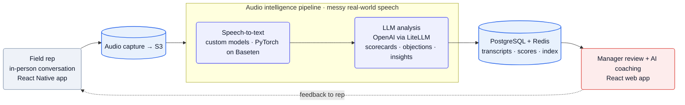
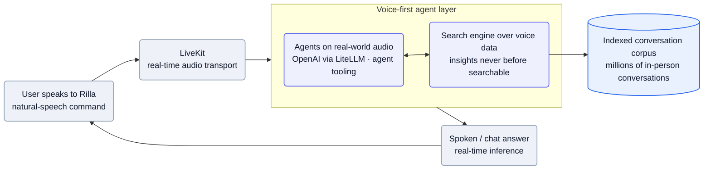

[Rilla][home] builds **conversation intelligence for in-person sales** — the *"virtual ridealong."* Field reps record their face-to-face conversations on a phone; Rilla transcribes and analyzes them, then surfaces coaching so managers can review reps *"100x faster"* without physically riding along ([home][home]). The wedge is data nobody else captures — *"the messy, noisy, wildly unstructured conversations that happen in the real world, not in an online meeting"* ([Applied AI JD][jd-ai]). The engineering bet: own the speech models for that field audio (where the proprietary corpus is the edge), rent frontier LLM reasoning, and grow a voice-native search/agent layer on top.

**Vitals:** founded 2019 · ~$75M raised (Series B) · ~60 people · NYC (in-office).

Business context — founders, funding, customers, roadmap

- Founder/CEO **Sebastian Jimenez**; co-founded (2019) with **Michael Castellanos** and **Christopher Martin** ([NYU profile][nyu], [Crunchbase][cb]) — pivoted out of a political-canvassing app once Jimenez saw *"no scalable way of understanding what was happening in face-to-face sales conversations"* ([NYU profile][nyu]). Mission: *"to index the offline world"* ([Applied AI JD][jd-ai]).
- *"Over 1000 customers, including The Home Depot, KKR, Neighborly, and PulteGroup"* ([Applied AI JD][jd-ai]); outcomes on the site include +40% average close rate and **5,000 ridealongs in 30 days across 130 technicians** at Neighborly ([home][home]). Verticals: home building/improvement/service, automotive, dental, senior living, multifamily ([home][home]).
- Backed by **Google Ventures, Bessemer Ventures, Crew Capital, and Broom Ventures** ([Applied AI JD][jd-ai]); third-party trackers put total funding around **$75M** through a Series B ([Crunchbase][cb]).
- **Roadmap is a platform shift:** today's product is batch coaching (record → analyze → review); the Applied AI team is building *"a voice-first interface,"* *"a search engine that uncovers business-critical insights from voice data that's never been searchable,"* and *"agents that operate natively on real-world audio"* ([Applied AI JD][jd-ai]) — the coaching tool becoming the data moat under a voice-native intelligence layer.

## The heavy lifting

- **Own the speech models for field audio; rent the reasoning.** Custom/fine-tuned ASR runs on PyTorch + Baseten to survive doorstep, showroom, and job-site noise and accents that wreck off-the-shelf ASR; OpenAI behind a LiteLLM router does the language reasoning, both swappable ([Applied AI JD][jd-ai]).
- **The proprietary corpus is the moat under a search index.** Millions of in-person conversations no competitor captures become a queryable corpus — *"voice data that's never been searchable"* — embedded for semantic search ([Applied AI JD][jd-ai], [home][home]).
- **Voice-native real-time layer on LiveKit.** A spoken interface plus agents operating on raw audio run over LiveKit transport with a fast LLM tier — built around streaming speech and turn-taking, not chat with audio bolted on ([Applied AI JD][jd-ai]).

## Stack

A TypeScript + Python monorepo with React/React Native clients, a Python AI surface, and a deliberately managed-infra posture on AWS. Every component below is named in a first-party job description.

| Layer | Choice | Evidence |
| --- | --- | --- |
| **Web frontend** | **React** | [SWE JD][jd-swe] |
| **Mobile** | **React Native** | [SWE JD][jd-swe] |
| **Backend languages** | **TypeScript + Python** | [Applied AI JD][jd-ai], [SWE JD][jd-swe] |
| **API framework** | **FastAPI** | [Applied AI JD][jd-ai] |
| **Runtime / libs** | **Node.js**, **Turborepo**, Lodash, **Zod** | [SWE JD][jd-swe], [FDE JD][jd-fde] |
| **ML framework** | **PyTorch** | [Applied AI JD][jd-ai] |
| **LLM APIs** | **OpenAI** | [Applied AI JD][jd-ai] |
| **Model hosting / inference** | **Baseten** | [Applied AI JD][jd-ai] |
| **LLM gateway / router** | **LiteLLM** | [Applied AI JD][jd-ai] |
| **Real-time voice** | **LiveKit** | [Applied AI JD][jd-ai] |
| **Cloud** | **AWS** | [Applied AI JD][jd-ai] |
| **Datastores** | **PostgreSQL**, **Redis**, **S3** | [Applied AI JD][jd-ai] |
| **IaC / CI** | **Terraform**, **Spacelift**, **GitHub Actions** | [SWE JD][jd-swe], [FDE JD][jd-fde] |
| **Coding agents** | "Unlimited token budget" (engineer perk) | [SWE JD][jd-swe] |

:::note[Key finding — Baseten + LiteLLM is a build-and-buy split]
Rilla self-hosts on **Baseten** with **PyTorch** *and* calls **OpenAI** behind a **LiteLLM** router ([Applied AI JD][jd-ai]). The pattern: own the speech/audio models (where their proprietary in-person data is the edge), rent the reasoning (where frontier LLMs lead), and keep both swappable behind one gateway.
:::

## Hard problems

The parts an engineer would lose sleep over. **Public signal** is cited (verified); **likely approach** is labeled speculation — best-practice fill-in, hedged.

| Problem | Why it's hard | Public signal | Likely approach (speculative) |
| --- | --- | --- | --- |
| **ASR on field audio** | Doorstep/showroom/job-site speech has wind, machinery, crosstalk and accents that wreck off-the-shelf ASR. | Pipeline is built for *"the messy, noisy, wildly unstructured conversations that happen in the real world, not in an online meeting"* ([key][jd-ai]) | Likely a fine-tuned Whisper-class model on Baseten, retrained on Rilla's own field corpus to beat noise/accents. |
| **Evaluating analysis quality** | Scorecards and objection-spotting are probabilistic; a wrong coaching call erodes manager trust with no ground truth. | Role requires *"eval frameworks, agent tooling, and prompt engineering"* for *"AI/LLM systems in production"* ([key][jd-ai]) | Likely golden-set regression evals plus LLM-as-judge over labeled calls, gating prompt/model changes in CI. |
| **Search over the voice corpus** | Making millions of long, noisy transcripts queryable by meaning — not keywords — at acceptable recall and cost is unsolved tooling. | A *"search engine that uncovers business-critical insights from voice data that's never been searchable"* over *"over 1000 customers"* ([key][home]) | Likely transcript chunking + embeddings in a vector store (pgvector or managed), with metadata filters over the existing Postgres. |
| **Real-time voice latency** | A spoken agent must hear, transcribe, reason and reply fast enough to feel conversational, end-to-end. | Voice-first interface spanning *"data acquisition to real-time inference"* on LiveKit ([key][jd-ai]) | Likely streaming ASR + a fast LLM tier via LiteLLM, with LiveKit handling low-latency transport and turn-taking. |

## Likely internals

The infrastructure Rilla doesn't name publicly, inferred from the stack it does:

| Component | Likely choice | Basis |
| --- | --- | --- |
| Backend compute | containers on AWS (ECS/Fargate or EKS) | AWS + Terraform/Spacelift confirmed ([SWE JD][jd-swe]); containers the low-surprise target for a TS+Python service set |
| Speech-to-text | fine-tuned Whisper-class model on Baseten | Baseten + PyTorch confirmed ([Applied AI JD][jd-ai]); a fine-tuned open ASR is the conventional way to beat field noise with a proprietary corpus |
| Search / retrieval | embeddings + a vector store (pgvector or a managed vector DB) | a "search engine over voice data" ([Applied AI JD][jd-ai]) implies vector similarity; pgvector reuses the existing Postgres |
| Agent orchestration | an in-house orchestrator over LiveKit + LiteLLM | voice-first agents described ([Applied AI JD][jd-ai]); the coordinating framework isn't named |
| Auth | a managed IdP (Auth0 / WorkOS / Cognito) | enterprise SSO/SAML table stakes for Home Depot/KKR-scale buyers; no vendor named |
| Async / queues | SQS + workers (or Redis-backed queue) | the batch transcribe→analyze pipeline needs durable job processing; Redis is already present |
| Analytics warehouse | Snowflake or BigQuery | product/coaching analytics over a large corpus usually graduate off Postgres; unstated |

## Architecture

### The coaching pipeline: capture → transcribe → analyze → coach

The core loop turns an in-person conversation into reviewable coaching. A rep records on the **React Native** app; audio lands in **S3**; an **audio intelligence pipeline** transcribes the *"messy, noisy, wildly unstructured"* speech and runs LLM analysis to extract scorecards, objections, and insights; results land in **Postgres/Redis** and surface in the **React** web app where a manager reviews and coaches ([Applied AI JD][jd-ai], [SWE JD][jd-swe]).

Mermaid source

:::note[Inference — speech-to-text is the in-house bet — confidence: medium]
The Applied AI team owns *"the full AI lifecycle—from data acquisition to real-time inference"* and a pipeline for real-world (not online-meeting) audio, with PyTorch + Baseten in the stack ([Applied AI JD][jd-ai]). That points to custom or fine-tuned speech models for field noise/accents — the asset off-the-shelf ASR handles worst and where Rilla's proprietary corpus pays off — though the exact model isn't named.
:::

### The emerging voice-first layer

The new surface is real-time and conversational: users *"command Rilla directly through natural speech,"* a search engine makes the voice corpus queryable, and agents *"operate natively on real-world audio"* — all spanning *"data acquisition to real-time inference and user-facing chat interfaces"* ([Applied AI JD][jd-ai]). **LiveKit** carries the live audio; **OpenAI behind LiteLLM** does the reasoning ([Applied AI JD][jd-ai]).

Mermaid source

:::note[Key finding — eval is treated as production infrastructure]
The Applied AI role requires familiarity with *"eval frameworks, agent tooling, and prompt engineering"* and building *"AI/LLM systems in production"* ([Applied AI JD][jd-ai]). For a probabilistic product scoring sales calls, eval harnesses — not a QA org — are how quality is held as autonomy widens.
:::

## Team & process

Engineers are generalists who *"architect and ship features across the stack at lightning speed"* — **in-office NYC, ~60 hrs/week**, self-described as *"builders who operate like high speed reinforcement learners"* ([SWE JD][jd-swe], [Applied AI JD][jd-ai]). The board shows **23 open roles, 7 in engineering** ([Ashby][ashby]); comp runs $185–260K (SWE), $230–300K (Sr), $200–300K (Applied AI), $170–300K (FDE), plus equity.

| Role | Person | Source |
| --- | --- | --- |
| Co-founder / CEO | Sebastian Jimenez | [NYU profile][nyu] |
| Co-founders | Michael Castellanos, Christopher Martin | [Crunchbase][cb] |

The shape, from the open roles: a **full-stack generalist** core (React/React Native/TS/Python), a dedicated **Applied AI** team (voice, search, agents), a **Platform** track, **Mobile**, and a Palantir-style **Forward Deployed Engineer** who *"own[s] end-to-end execution of high stakes projects,"* travelling *"up to 50%"* to client sites ([FDE JD][jd-fde], [Ashby][ashby]). The AI work is *applied* — deploy LLM systems, build agent tooling and evals over OpenAI + self-hosted PyTorch models — with no advertised research org ([Applied AI JD][jd-ai]). Infra is deliberately managed (Terraform + **Spacelift** + GitHub Actions, nothing hand-rolled), and a *"Don't Work Here"* section gates explicitly on the *"~60 hrs/week in person"* intensity ([SWE JD][jd-swe]) — a small, high-output, agent-augmented in-person team by design.

## Sources

Reconstructed from public sources only — no insider information. Crawled 2026-06-07. Claim tiers: **verified** (stated on a public page, linked) · **inferred** (reasoned from a cited signal, confidence flagged) · **speculative** (best-practice fill-in, labeled). Links are live; pages change, so the supporting quote for each claim is kept in this repo's evidence map (`evidence/rilla-evidence-map.md`).

| # | Source | Link |
| --- | --- | --- |
| S1 | Homepage | <https://www.rilla.com/> |
| S2 | Customer stories | <https://www.rilla.com/customer-stories> |
| S3 | Job board (Ashby) | <https://jobs.ashbyhq.com/rilla> |
| S4 | Software Engineer, Applied AI (JD) | <https://jobs.ashbyhq.com/rilla/fad15157-b4cc-44ff-92b7-4afd4fe3388e> |
| S5 | Software Engineer (JD) | <https://jobs.ashbyhq.com/rilla/37228ca3-4e4a-4e3c-9414-d8a2046ff496> |
| S6 | Forward Deployed Engineer, Integrations (JD) | <https://jobs.ashbyhq.com/rilla/ec768352-6ddb-4d4b-8704-0c04c37fff13> |
| S7 | Senior Software Engineer (JD) | <https://jobs.ashbyhq.com/rilla/6f4e6ca1-efe7-4f25-af69-59f78981ef70> |
| S8 | NYU Entrepreneurship — Sebastian Jimenez profile | <https://entrepreneur.nyu.edu/blog/2025/08/12/how-sebastian-jimenez-built-rilla-from-field-hustle-to-speech-ai-for-sales/> |
| S9 | Crunchbase (third-party — funding/founders) | <https://www.crunchbase.com/organization/rillavoice> |

[home]: https://www.rilla.com/
[stories]: https://www.rilla.com/customer-stories
[ashby]: https://jobs.ashbyhq.com/rilla
[jd-ai]: https://jobs.ashbyhq.com/rilla/fad15157-b4cc-44ff-92b7-4afd4fe3388e
[jd-swe]: https://jobs.ashbyhq.com/rilla/37228ca3-4e4a-4e3c-9414-d8a2046ff496
[jd-fde]: https://jobs.ashbyhq.com/rilla/ec768352-6ddb-4d4b-8704-0c04c37fff13
[jd-sr]: https://jobs.ashbyhq.com/rilla/6f4e6ca1-efe7-4f25-af69-59f78981ef70
[nyu]: https://entrepreneur.nyu.edu/blog/2025/08/12/how-sebastian-jimenez-built-rilla-from-field-hustle-to-speech-ai-for-sales/
[cb]: https://www.crunchbase.com/organization/rillavoice
