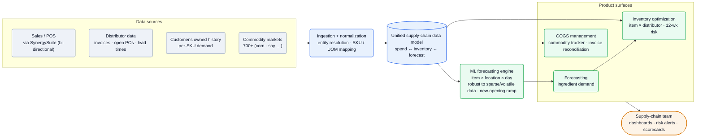
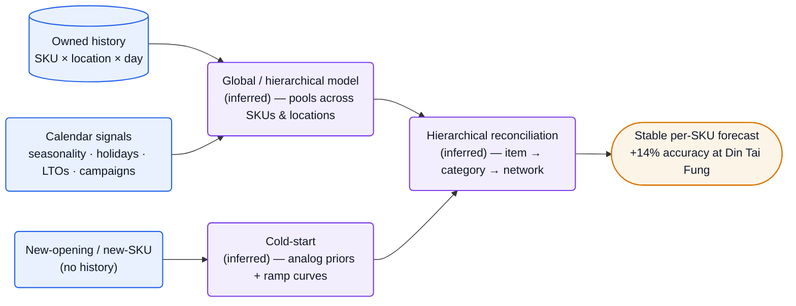

[SightlineOS][home] is an **AI-native supply-chain planning and management platform for restaurant chains** — *"forecasting, inventory optimization, and COGS management"* built for foodservice ([story][story]). The technical core is a machine-learning forecasting engine that *"captures daily ordering cadence, seasonality, holidays, and recent volume shifts while remaining robust to sparse and volatile data"* ([forecasting][fcast]) and predicts the ramp-up for brand-new restaurant openings — then feeds one connected data model that turns demand into 12-week supply-continuity risk and into COGS variance attribution. It came out of stealth in May 2026 after a year in private beta.

**Vitals:** founded ~2024 · seed-stage (amount undisclosed) · ~5–10 people · New York.

:::caution[Low public engineering disclosure — read the tiers]
SightlineOS is a ~5-person, just-out-of-stealth company with **no engineering blog and no public job board**. Product behaviour, founders, and customer results are well-verified; the *engineering internals* (languages, cloud, model architecture) are **labeled inference** from founder pedigree and product behaviour, not first-party fact. The [Stack](#stack) table is intentionally thin; the reasoning lives in [Likely internals](#likely-internals).
:::

Business context — founders, funding, customers, traction

- **Founders:** **Yusha Hu** (CEO) led supply-chain & procurement teams at **Chipotle, sweetgreen, and HelloFresh**; **Derrick Staten** (CTO) was engineer and head of product at **Branch** (*"one of the world's most widely used mobile marketing platforms,"* clients incl. Starbucks, Uber); **Louis Bensard** (Head of Data/AI/ML) was a data-science manager at **Ekimetrics**, building ML for Fortune 500s in retail/finance/aviation ([About][about]). Plus Jake Anderson (Sales, ex-Olo/Cardlytics/Groupon) and Emily Schultz (Marketing, ex-Clover/BentoBox).
- **Funding:** seed-stage; **no figure disclosed first-party**. (A widely-repeated *"~$2M seed, Feb 2026"* traces to a recruiter posting that doesn't name the company — treat as unconfirmed.)
- **Customers:** **Din Tai Fung** (highest US AUV, *"+$27MM average AUV per location"*) and **Bonchon** ([case study][dtf], [home][home]).
- **Din Tai Fung results:** *"14% lift in forecast accuracy"*; within five months a *"25%"* cut in priority-SKU distributor out-of-stocks (13% across all proprietary SKUs) and a *"99.7% fill rate"* ([case study][dtf]). **Bonchon:** sub-3-month, *"hands-off"* rollout ([home][home]).
- Launched out of stealth **May 6 2026** after a year in private beta ([press][pr]).

## The heavy lifting

- **Forecasting that survives sparse, spiky restaurant data.** The ML engine *"captures daily ordering cadence, seasonality, holidays, and recent volume shifts while remaining robust to sparse and volatile data"* ([forecasting][fcast]) — restaurant ingredient demand is intermittent and bursty (LTOs, local events), exactly where naive per-SKU time-series break; the bet is models that stay stable when history is thin.
- **Cold-starting demand for stores that don't exist yet.** It *"predict[s] the ramp-up for new restaurant openings — so your supply chain is ready before the doors open,"* folding new openings, LTOs and campaigns into the forecast from analogous history ([forecasting][fcast]) — beating the formula-based legacy tools that have no signal for a SKU or site with zero sales.
- **One connected data model, not three reports.** Spend is wired *"directly to your inventory and forecasting,"* so a COGS drift can be attributed to a *"pricing issue, a forecasting miss, or a supplier problem"* rather than read off disconnected variance reports ([cogs][cogs]) — the join across forecast/inventory/spend is the product, not a dashboard.
- **Risk detection 12 weeks out at item × distributor.** It *"identifies supply continuity risk up to 12 weeks in advance by looking at open POs, supplier lead times, and expected depletion"* and *"sets optimum inventory levels at the item x distributor level"* ([inventory][inv]) — turning forecasts into a forward-looking, per-supplier action queue instead of a retrospective stock view.

## Stack

Deliberately thin — only what's publicly evidenced. SightlineOS names no languages, frameworks, cloud, or model libraries; the rest is in [Likely internals](#likely-internals).

| Layer | Choice | Evidence |
| --- | --- | --- |
| **Product** | web SaaS platform: forecasting + inventory + COGS modules, dashboards, scorecards | [home][home], [inventory][inv] |
| **ML** | in-house **demand-forecasting engine** (per-customer, continuously retrained on owned data) | [forecasting][fcast], [About][about] |
| **Inbound integration** | **SynergySuite** — bidirectional sales/operations ↔ supply-chain data | [press][pr] |
| **Data ingested** | distributor invoices, open POs, supplier lead times; **700+** commodity market feeds | [inventory][inv], [cogs][cogs] |
| **Outputs** | demand forecasts; 12-week risk alerts; supplier/DC scorecards; invoice reconciliation; dead/excess-stock flags | [inventory][inv], [cogs][cogs] |

:::note[Key finding — the forecasting engine is the moat, and it's an applied-ML problem, not an LLM one]
SightlineOS is built around classical demand forecasting on the customer's *"owned historical data,"* tuned to be *"robust to sparse and volatile data"* ([forecasting][fcast]) — led by a founder (Louis Bensard) whose background is applied ML at Ekimetrics, not generative AI. The defensible asset is forecast accuracy on hard restaurant data (the *"14% lift"* at Din Tai Fung), not a chat interface.
:::

## Hard problems

The parts an engineer here loses sleep over. **Public signal** is cited (verified); **likely approach** is labeled speculation — best-practice fill-in, hedged.

| Problem | Why it's hard | Public signal | Likely approach (speculative) |
| --- | --- | --- | --- |
| **Sparse, volatile per-SKU demand** | Ingredient demand at item × location × day is intermittent and spiky (LTOs, weather, local events); naive per-series models overfit noise | engine *"robust to sparse and volatile data"* capturing *"daily ordering cadence, seasonality, holidays … volume shifts"* ([fcast][fcast]) | A **global/hierarchical** model (e.g. gradient-boosted trees over pooled features) that borrows strength across SKUs and sites, plus intermittent-demand handling — not one ARIMA per SKU |
| **Cold-start: new stores & SKUs** | A new opening or LTO has zero history, yet must be ordered for *before* launch | *"predict the ramp-up for new restaurant openings"*; incorporate LTOs/campaigns from historical data ([fcast][fcast]) | **Analog/pooled priors** — borrow ramp curves from comparable openings & similar SKUs; blend into the forecast as actuals arrive |
| **Forecast → inventory → COGS coherence** | The three modules must agree on one truth so variance can be *attributed*, not just reported | spend wired *"directly to your inventory and forecasting"*; COGS drift traced to pricing vs forecast vs supplier ([cogs][cogs]) | A shared **semantic data model** (item, location, distributor, contract) under all three surfaces; attribution joins over it |
| **Messy distributor/supplier data** | Invoices, POs and distributor buying systems differ per partner; item × distributor needs clean entity resolution; 700+ commodity feeds | item × distributor levels; invoice reconciliation; data that *"couldn't keep pace"* on legacy tools ([inv][inv], [dtf][dtf]) | **ETL + entity resolution** — SKU/UOM normalization across distributors, contract-price repository, commodity-feed joins |

## Likely internals

What SightlineOS doesn't disclose, inferred from product behaviour + founder pedigree (Branch web/product eng; Ekimetrics applied ML). **All speculative/inferred** — flagged, not fact.

| Component | Likely choice | Basis |
| --- | --- | --- |
| Forecasting models | Python; **gradient-boosted trees / global hierarchical time-series** with intermittent-demand handling; reconciliation item→category→network | *"robust to sparse and volatile data"*, item×distributor, network-wide ([fcast][fcast][inv]); Ekimetrics applied-ML pedigree ([About][about]); libraries unnamed |
| Cold-start | pooled/analog priors + ramp curves for new sites & SKUs | *"predict the ramp-up for new restaurant openings"* ([fcast][fcast]) |
| Web app | TypeScript / React (likely Next.js) front end, Node API | Branch consumer-scale web/product pedigree ([About][about]); modern SaaS dashboard; specifics unstated (a recruiter JD suggests this but doesn't name the company) |
| Cloud | AWS | conventional for a NYC seed SaaS; not stated |
| Datastores | Postgres (relational core) + Redis (cache/jobs); a columnar/warehouse layer for analytics | spend/inventory/forecast joins, real-time spend reporting ([cogs][cogs]); engines unnamed |
| Data ingestion | batch ETL + entity resolution; SynergySuite API; commodity-data vendor for 700+ feeds | SynergySuite bidirectional ([pr][pr]); 700+ commodities ([cogs][cogs]); vendor unnamed |
| Tenancy | per-customer models trained on each chain's owned data | *"continuously learns from your owned historical data"* ([fcast][fcast]) |
| Funding / stage | seed; figure undisclosed | no first-party number; the *"~$2M"* figure is from an unattributed recruiter post |

## Architecture

### Platform: many feeds, one data model, three surfaces

The reconstruction below is **verified** at the edges (sources, product surfaces, integration) and **inferred** in the middle (the normalization + unified-model layer). Sales/POS data arrives bidirectionally through **SynergySuite**; distributor invoices, open POs and supplier lead times, the chain's owned demand history, and 700+ commodity market feeds join it. That feeds the ML forecasting engine and a connected data model under all three product surfaces — Forecasting, Inventory Optimization (item × distributor, 12-week risk), and COGS — which surface to the supply-chain team as dashboards, risk alerts and supplier scorecards ([forecasting][fcast], [inventory][inv], [cogs][cogs], [press][pr]).

![SightlineOS platform data flow: four data sources — sales/POS via the bidirectional SynergySuite integration, distributor data (invoices, open POs, supplier lead times), the customer's owned per-SKU demand history, and 700-plus commodity market feeds such as corn and soy — flow into an ingestion and normalization layer that does entity resolution and SKU/UOM mapping; that produces a unified supply-chain data model joining spend, inventory and forecast, which feeds a machine-learning forecasting engine operating at item-by-location-by-day granularity, robust to sparse and volatile data and handling new-opening ramp-up; the model and engine drive three product surfaces — forecasting of ingredient demand, inventory optimization at item-by-distributor level with 12-week risk, and COGS management with the commodity tracker and invoice reconciliation — all presented to the supply-chain team as dashboards, risk alerts and scorecards.](/diagrams/sightline-os/platform-data-flow.svg)

Mermaid source

### Forecasting approach (inferred)

How the engine likely stays accurate on hard data. This diagram is **mostly inference** (purple nodes) anchored to two verified facts: the data signals it consumes and the 14% accuracy lift it produced. The plausible shape is a global/hierarchical model pooling across SKUs and locations, a separate cold-start path for new openings/SKUs, and hierarchical reconciliation so item-level forecasts sum coherently up the network.

![SightlineOS forecasting approach, largely inferred: the customer's owned history at SKU-by-location-by-day and calendar signals (seasonality, holidays, LTOs, campaigns) feed an inferred global or hierarchical model that pools across SKUs and locations; new openings and new SKUs with no history feed an inferred cold-start path using analog priors and ramp curves; both feed an inferred hierarchical reconciliation step from item to category to network, producing a stable per-SKU forecast that delivered a 14% accuracy lift at Din Tai Fung.](/diagrams/sightline-os/forecasting-approach.svg)

Mermaid source

:::tip[Speculation — why classical ML, not an LLM]
The product is point forecasts on numeric, sparse, seasonal series with hard cold-start — squarely the home turf of gradient-boosted trees and hierarchical time-series, not language models. Louis Bensard's Ekimetrics background (econometric/applied ML) points the same way. *Likely* a GBM-or-global-model core with analog-based cold-start; the framework is unstated.
:::

## Team & process

A ~5-person, NYC, supply-chain-operator-led team pairing domain depth with Silicon Valley engineering ([About][about], [story][story]).

| Role | Person | Source |
| --- | --- | --- |
| Co-founder / CEO | Yusha Hu (ex-Chipotle, sweetgreen, HelloFresh) | [About][about] |
| Co-founder / CTO | Derrick Staten (ex-Branch eng & head of product) | [About][about] |
| Co-founder / Head of Data, AI & ML | Louis Bensard (ex-Ekimetrics DS manager) | [About][about] |

The shape is a classic three-founder split — domain (Hu), product/eng (Staten), ML (Bensard) — with sales and marketing leads attached early. Process signal is sparse by design (no eng blog), but the customer evidence is telling: a **white-glove implementation team** lands enterprise chains in **under three months** with a *"hands-off"* experience for the customer ([home][home], [inventory][inv]), and the forecasting engine is explicitly built to *"get smarter the longer they run"* ([About][about]) — i.e. per-customer models that improve on each chain's accumulating data. For an early team selling into operationally exacting brands like Din Tai Fung, implementation speed and forecast accuracy are the whole game.

## Sources

Reconstructed from public sources only — no insider information. Crawled 2026-06-10 via Chrome MCP (logged-out). First-party (sightlineos.com — homepage, About, the forecasting/inventory/COGS pages, the Din Tai Fung case study, the founder-story blog post) prioritized; the PR Newswire launch release and SynergySuite note are third-party. Claim tiers: **verified** (stated on a public page, linked) · **inferred** (reasoned from a cited signal) · **speculative** (best-practice fill-in, labeled). This is a low-disclosure, early-stage company: engineering internals are inference, not fact. Links are live; pages change, so the supporting quote for each claim is kept in this repo's evidence map (`evidence/sightline-os-evidence-map.md`).

| # | Source | Link |
| --- | --- | --- |
| S1 | Homepage | <https://www.sightlineos.com/> |
| S2 | About us | <https://www.sightlineos.com/about-us> |
| S3 | Forecasting | <https://www.sightlineos.com/forecasting> |
| S4 | Inventory optimization | <https://www.sightlineos.com/inventory-optimization> |
| S5 | COGS management | <https://www.sightlineos.com/cogs-management> |
| S6 | Case study — Din Tai Fung | <https://www.sightlineos.com/case-studies/din-tai-fung> |
| S7 | Blog — Our Story (founder note) | <https://www.sightlineos.com/blog> |
| S8 | Press — launches out of stealth (PR Newswire) | <https://www.prnewswire.com/news-releases/sightline-os-launches-out-of-stealth-bringing-the-next-generation-of-ai-powered-supply-chain-management-and-planning-software-to-enterprise-restaurant-teams-302764001.html> |
| S9 | SynergySuite × SightlineOS partnership | <https://www.synergysuite.com/blog/synergysuite-sightline-os-announce-integrative-partnership/> |

[home]: https://www.sightlineos.com/
[about]: https://www.sightlineos.com/about-us
[fcast]: https://www.sightlineos.com/forecasting
[inv]: https://www.sightlineos.com/inventory-optimization
[cogs]: https://www.sightlineos.com/cogs-management
[dtf]: https://www.sightlineos.com/case-studies/din-tai-fung
[story]: https://www.sightlineos.com/blog
[pr]: https://www.prnewswire.com/news-releases/sightline-os-launches-out-of-stealth-bringing-the-next-generation-of-ai-powered-supply-chain-management-and-planning-software-to-enterprise-restaurant-teams-302764001.html
[synergy]: https://www.synergysuite.com/blog/synergysuite-sightline-os-announce-integrative-partnership/
