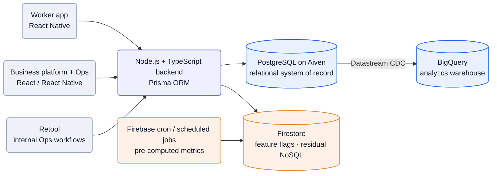
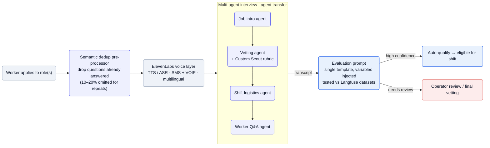

[Traba][home] runs a **light-industrial staffing marketplace**: businesses (warehousing, manufacturing, distribution, logistics, fulfillment) post shifts, and vetted flexible workers claim them from a mobile app ([engineering blog][pg]). The wedge is reliability, not just liquidity — a headline **98% show rate** against a ~30% industry norm ([home][home]). Staffing is the beachhead: the job board now opens *"Traba is the AI operating layer for the industrial supply chain"* ([Ashby][ashby]). The engineering story is three-part — a marketplace that migrated its system of record from Firestore to Postgres, **Scout** (a multi-agent AI phone interviewer on ElevenLabs that now runs 85%+ of vetting), and a founding **Agents team** generalizing that into autonomous supply-chain workflows.

**Vitals:** founded 2021 · Founders Fund · Khosla · General Catalyst · ~12+ eng · NYC + SF (in-person) + offshore ops.

Business context — founders, funding, scale, positioning

- Co-founders: **CEO Mike Shebat** (ex-Uber) and **CTO Akshay Buddiga** ([about][about]). Backed by **Founders Fund, Khosla Ventures, and General Catalyst** ([Ashby][ashby], [careers][careers]); Keith Rabois a visible backer ([press][press]).
- **249K workers on platform**, **996+ light-industrial customers**, **1.0M workers connected to businesses**, across **33 states** ([about][about]); **5X revenue growth** ([careers][careers]); the wedge is a *"$50B labor market"* ([Ashby][ashby]).
- Reliability metrics: **98% show rate** vs ~30% industry norm, **55% less turnover**, **150+ assessed skill attributes** per worker ([home][home]).
- **Positioning is mid-pivot:** marketing still leads with "Labor That Works" staffing, but every engineering role now opens with the *"AI operating layer for the industrial supply chain"* framing ([Ashby][ashby]) — the marketplace becoming the data + distribution layer under an agent platform. *"We started in workforce—temp staffing … and used it to embed ourselves inside their daily operations … by connecting to the systems running across every facility … we are building applied AI"* ([Ashby][ashby]).

## The heavy lifting

- **Thousands of parallel phone interviews via multi-agent transfer.** Scout splits an interview into separate intro / vetting / logistics / Q&A agents to dodge context degradation (*"at a certain threshold of context, they begin to degrade"*), on an ElevenLabs voice layer over SMS/VOIP ([Scout post][scout]).
- **Vetting eval as a versioned, templated artifact.** A single prompt template with variables injected per call is tested against continuously-updated human-annotated Langfuse datasets, turning prompt changes around *"in minutes rather than hours"* — autonomy widened to 85%+ on a measured 15% shift-completion lift ([Scout post][scout]).
- **Trigger-based, zero-downtime Firestore→Postgres migration.** A year-long live cutover via Cloud Function triggers translating documents into Postgres rows, behind per-collection feature flags, with self-healing reconciliation crons and 15+-attempt retry logic, reaching 99.99% replication precision ([pg post][pg]).

## Stack

A pragmatic, TypeScript-centric marketplace stack, with Python reserved for the AI/ML surface and a deliberate "buy the managed thing" bias on infrastructure.

| Layer | Choice | Evidence |
| --- | --- | --- |
| **Web frontend** | React / Node.js (business web app + internal Ops tools platform) | [Ashby][ashby] |
| **Mobile** | React Native (worker app) | [Ashby][ashby] |
| **Backend** | Node.js + TypeScript | [pg post][pg], [Ashby][ashby] |
| **AI / ML services** | Python | [Ashby][ashby] |
| **Primary DB** | PostgreSQL on **Aiven** (managed; chosen over GCP Cloud SQL) | [pg post][pg] |
| **ORM** | **Prisma** (chosen over TypeORM) | [pg post][pg] |
| **Legacy / secondary DB** | **Firestore** — retained for feature flags + remaining NoSQL cases | [pg post][pg] |
| **Cloud** | **GCP** — Firebase, Cloud Functions, Datastream | [pg post][pg] |
| **Analytics warehouse** | **BigQuery** | [pg post][pg] |
| **CDC / ingestion** | GCP **Datastream** (Postgres → BigQuery), routed via Aiven to avoid a ~$500/mo Kafka bill | [pg post][pg] |
| **Batch / scheduled** | Firebase cron jobs + scheduled tasks for pre-computing metrics | [pg post][pg] |
| **Internal tooling** | **Retool** workflows for the Ops team | [pg post][pg] |
| **Load testing** | **Artillery** | [pg post][pg] |
| **Foundation LLMs** | **Anthropic + OpenAI** frontier models (agent reasoning, vetting, eval) | [Ashby][ashby] |
| **Agent stack** | tool use, sub-agents, retrieval, structured outputs, **MCP servers**, orchestration layer | [Ashby][ashby] |
| **Voice AI** | **ElevenLabs** — TTS/ASR, telephony, multi-agent transfer, language detection/switching | [Scout post][scout] |
| **LLM eval / datasets** | **Langfuse** + **Braintrust** — human-annotated ground-truth datasets + prompt testing | [Scout post][scout], [Ashby][ashby] |
| **System integration** | customers' **WMS / TMS / ERP** environments | [Ashby][ashby] |
| **Worker comms** | SMS + VOIP (telephony) | [Scout post][scout] |

:::note[Key finding — managed-DB bet over GCP-native]
Despite living "deep in the GCP ecosystem," Traba put its primary Postgres on **Aiven**, not Cloud SQL — trading granular tuning for a managed pool, backups, and a Datastream→BigQuery path that dodged a Kafka bill ([pg post][pg]). Velocity over control.
:::

## Hard problems

The parts an engineer would lose sleep over. **Public signal** is cited (verified); **likely approach** is labeled speculation — best-practice fill-in, hedged.

| Problem | Why it's hard | Public signal | Likely approach (speculative) |
| --- | --- | --- | --- |
| **Thousands of parallel real-time voice interviews** | Sub-second voice latency, telephony, and language switching at fan-out, with LLM context that *"begin[s] to degrade"* past a threshold | *"an AI recruiter that conducts thousands of real-time interviews in parallel"*; degradation forced a single agent into multi-agent transfer ([scout][scout]) | Likely lean on ElevenLabs' managed telephony/turn-taking for the audio path and cap per-agent context by splitting phases (intro/vetting/logistics/Q&A), as confirmed; concurrency probably scaled horizontally per call |
| **Evaluating a probabilistic vetter** | A non-deterministic interviewer gates real shift assignments — regressions are invisible without ground truth, not a unit test | *"a single prompt template"* tested against continuously-updating human-annotated **Langfuse** datasets, turning prompt changes around *"in minutes rather than hours"* ([scout][scout]) | Likely a versioned dataset + concurrent test harness scoring accuracy and per-question-type breakdowns on every prompt change, gating rollout behind the measured 15% shift-completion lift |
| **Zero-downtime live DB migration** | Cutting the relational system of record over from Firestore to Postgres with no freeze, while features kept shipping into a moving target | one year, zero downtime via trigger-based replication; race conditions met with reconciliation crons and *"custom retry logic, 15+ attempts"*; data-integrity bugs traced to connection-pool exhaustion ([pg][pg]) | Likely per-collection feature flags for incremental read/write cutover plus a prepared rollback script, with self-healing reconciliation as the durable safety net (largely confirmed) |

## Likely internals

The infrastructure Traba doesn't name publicly, inferred from the stack it does — low-surprise choices for a team on GCP + Aiven Postgres running an LLM-driven vetting product:

| Component | Likely choice | Basis |
| --- | --- | --- |
| Backend compute | Cloud Run (containers) | GCP-native, scales to zero, fits a small team avoiding cluster ops; matches the "managed over self-run" pattern |
| LLM gateway / router | thin internal abstraction over Anthropic + OpenAI | the *providers* are confirmed ([Ashby][ashby]); a routing layer that picks model per task/cost is the conventional pattern, but unstated |
| Agent-platform orchestration | in-house orchestrator over MCP + frontier models | *"tool use, sub-agents, retrieval, structured outputs, MCP servers, and the orchestration layer"* ([Ashby][ashby]); the design isn't public |
| Semantic dedup | embeddings + pgvector in Postgres | "semantically similar questions" implies vector similarity; Postgres is already the system of record |
| Auth | a managed IdP (Auth0 / Stytch / Firebase Auth) | Firebase Auth is the zero-friction holdover given the Firebase history; an IdP is the conventional alternative |
| Secrets / config | GCP Secret Manager | GCP-native default; table stakes once off Firebase-only |
| Observability | Datadog or GCP Cloud Monitoring + Langfuse for LLM | Langfuse confirmed for prompt eval; app/infra telemetry unstated but conventional |
| Job / queue | Cloud Tasks / Pub/Sub | already inside GCP; Cloud Functions + triggers are confirmed, so event plumbing exists |

## Architecture

### Core marketplace: out of the Fire(store)

Traba booted in 2021 on Firebase/Firestore — *"with the meeting quickly looming, they scrapped the schema and got set up on Firebase in a day"* ([pg post][pg]). As data turned relational (companies, workers, shifts, shift_signups, associations), Firestore's limits bit: no fuzzy/`LIKE` matching, no counts without full scans, no multiple-inequality queries, no joins — operations like "workers who worked last week, aren't currently busy, and aren't blocked by company X" required pulling documents into Node memory and filtering by hand ([pg post][pg]).

The fix was a **one-year, zero-downtime migration to PostgreSQL on Aiven**, behind per-collection feature flags. Today the system runs **Postgres and Firebase in conjunction** — Postgres as the relational system of record, Firestore retained for feature flags and lightweight NoSQL, Firebase cron jobs still pre-computing metrics, and Datastream replicating Postgres into BigQuery for analytics ([pg post][pg]).

Mermaid source

The migration's engine was **trigger-based replication** (chosen over in-code "shadow writes"): a Firestore document change fires a Cloud Function that translates the document into a Postgres row insert/update/delete ([pg post][pg]). Two race-condition classes had to be solved — out-of-order replications (fixed with per-collection **reconciliation scripts** run on a self-healing cron) and ordering/constraint failures (fixed with **custom retry logic, 15+ attempts**, plus a Slack alert that *"amazingly pinged us a grand total of 0 times"*) ([pg post][pg]). The team backfilled history with the same translation logic, hit **99.99% replication precision** by April, and migrated the riskiest collections (`shifts`, `shift_signups`, `workers`) last — flipping reads and writes simultaneously for `shifts` to avoid replication-lag overfills ([pg post][pg]).

:::note[Key finding — data-integrity bugs came from connection management]
Two of the biggest "unknown unknowns" were both connection-pool issues: `.map()` loops that opened N Postgres connections (fixed by batching), and an 8-months-in refactor consolidating scattered Firestore calls into a dedicated data-access layer ([pg post][pg]). The NoSQL→SQL move's hardest part wasn't queries — it was concurrency.
:::

### Scout: a multi-agent AI interviewer

**Scout** vets workers by phone at scale — *"an AI recruiter that conducts thousands of real-time interviews in parallel"* ([Scout post][scout]). It runs on **ElevenLabs** for the voice/telephony layer (low-latency TTS/ASR, multilingual), reaches workers over **SMS and VOIP**, and hands back **structured, decision-grade evaluations** rather than raw transcripts ([Scout post][scout]).

The design moved from a **single agent** (one large context prompt with role-specific content injected, one holistic evaluation prompt, English-only) to a **multi-agent architecture** with **agent transfer** — separate agents for job intro, vetting, shift-logistics confirmation, and worker Q&A — explicitly to dodge context degradation: *"at a certain threshold of context, they begin to degrade"* ([Scout post][scout]). Around that core sit a **semantic dedup pre-processor** (omits 10–20% of questions for repeat applicants), a **Spanish-capable** agent via ElevenLabs language switching, and **Custom Scout**, an operator-trained per-question good/bad/great rubric ([Scout post][scout]).

Mermaid source

:::note[Key finding — evaluation is a single templated prompt, tested like code]
Assessment isn't N static prompts — it's *"a single prompt template"* with questions and success criteria injected per call, evolved against continuously-updating **Langfuse** datasets of human-annotated ground truths, so prompt changes are tested *"in minutes rather than hours"* ([Scout post][scout]). Eval is treated as a versioned, measurable artifact.
:::

The outcomes Traba reports: **250,000+ AI-led interviews** to date; **85%+ of all vetting now AI-conducted** (targeting ~100% within half a year); and — counterintuitively — **AI-vetted workers are 15% more likely to complete their shifts** than human-vetted ones, attributed to a more consistent, empirically-refined process ([Scout post][scout]).

### The emerging agent layer

Scout is the first agent; the job board describes a founding **Agents team** generalizing the pattern into *"production agent systems on top of frontier LLMs: tool use, sub-agents, retrieval, structured outputs, MCP servers, and the orchestration layer that ties them together,"* integrating with customers' **WMS, TMS, and ERP** environments ([Ashby][ashby]). The reasoning substrate is explicitly **frontier model APIs (Anthropic, OpenAI)**, with evaluation run on **Langfuse / Braintrust** and internal harnesses ([Ashby][ashby]).

:::note[Inference — marketplace data is the moat under the agents — confidence: high]
The agent platform is pitched as synthesizing *"the data flowing through our marketplace"* and operating *"autonomously inside our customers' supply chain workflows"* ([Ashby][ashby]). Staffing produced the proprietary shift data and the MCP/WMS/TMS/ERP connectors; the agents monetize both — the same convergence-vs-divergence shape seen at vertical-AI peers.
:::

## Team & process

**~12 engineers** by the end of the Postgres migration ([pg post][pg]); today the job board lists **24 open roles** across New York City, San Francisco, and offshore ops hubs (Colombia, Ecuador, the Philippines), including a dedicated **AI Agents** track ([Ashby][ashby]). 100% in-person (NYC + SF), *"Olympian's Work Ethic,"* a stated preference for *"motors, not gears"* ([Ashby][ashby], [careers][careers]).

| Role | Person | Source |
| --- | --- | --- |
| Co-founder / CEO | Mike Shebat (ex-Uber) | [about][about] |
| Co-founder / CTO | Akshay Buddiga | [about][about], [pg post][pg] |
| Founding engineer | Moreno Antunes | [pg post][pg] |

The generalist role is full-stack founding-team product engineering — the React Native worker app, the React/Node business web app, and a Retool ops-tools platform — partnering directly with the CTO; a parallel **AI Agents** track ships *"production agent systems on top of frontier LLMs"* and treats *"evaluation as a first-class discipline,"* explicitly FDE-style — *"embed with our customers and operators"* ([Ashby][ashby]). The infra and Scout teams are credited by name in the engineering posts ([pg post][pg], [Scout post][scout]). The house style is **feature-flagged incremental cutover**: both the year-long Postgres migration (per-collection read/write flags, self-healing reconciliation crons, 15+-retry triggers, a prepared rollback script, Artillery load tests) and Scout (operator safety-net → 85%+ autonomy on a *measured* 15% completion lift) ship behind a flag, validate against ground truth, then widen autonomy ([pg post][pg], [Scout post][scout]).

## Sources

Reconstructed from public sources only — no insider information. Crawled 2026-06-07. Claim tiers: **verified** (stated on a public page, linked) · **inferred** (reasoned from a cited signal, confidence flagged) · **speculative** (best-practice fill-in, labeled). Links are live; pages change, so the supporting quote for each claim is kept in this repo's evidence map (`evidence/traba-evidence-map.md`).

| # | Source | Link |
| --- | --- | --- |
| S1 | Homepage | <https://traba.work/> |
| S2 | About | <https://traba.work/company/about> |
| S3 | Careers | <https://traba.work/company/careers> |
| S4 | Press | <https://traba.work/company/press> |
| S5 | Engineering index | <https://traba.work/company/engineering> |
| S6 | Project Scout: Building an AI Interviewer | <https://traba.work/company/engineering/building-scout> |
| S7 | Out of the Fire(store): Traba's Journey to Postgres | <https://traba.work/company/engineering/firestore-postgres-migration> |
| S8 | Job board (Ashby) — incl. Software Engineer (Generalist) and Senior Software Engineer (AI Agents) | <https://jobs.ashbyhq.com/traba> |

[home]: https://traba.work/
[about]: https://traba.work/company/about
[careers]: https://traba.work/company/careers
[press]: https://traba.work/company/press
[eng]: https://traba.work/company/engineering
[scout]: https://traba.work/company/engineering/building-scout
[pg]: https://traba.work/company/engineering/firestore-postgres-migration
[ashby]: https://jobs.ashbyhq.com/traba
