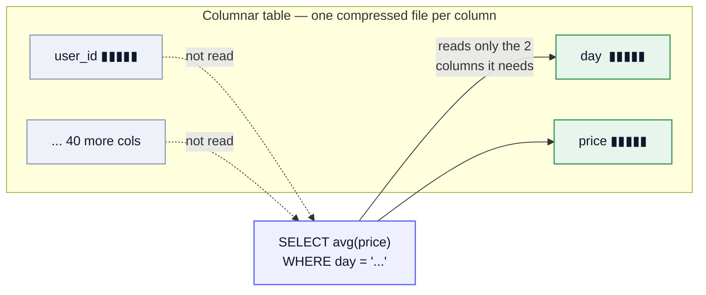
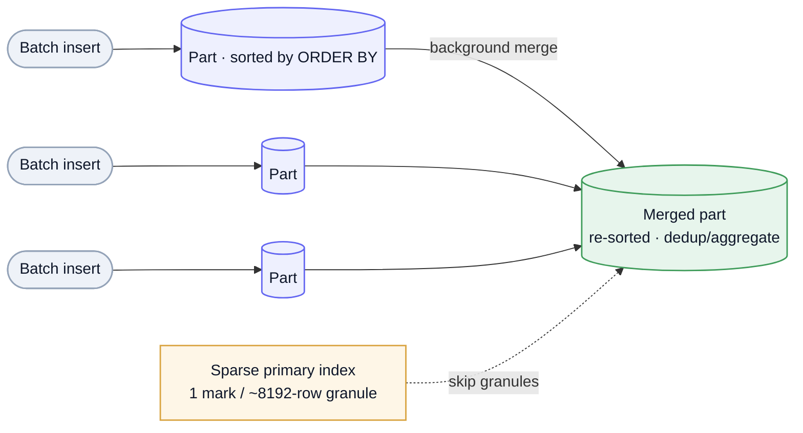

ClickHouse is a **columnar OLAP** database built to scan billions of rows and return aggregations in well under a second. Where [Postgres](/archive/system-design/postgres-internals/) is row-oriented OLTP and [Cassandra](/archive/system-design/cassandra/) is a write-optimized key-value/wide-column store, ClickHouse is for **analytics**: dashboards, observability, event and time-series data, ad-hoc `GROUP BY` over enormous tables. It's the concrete answer to the "analytics / stream aggregation" question pattern — and the store [Momentic](/archive/teardowns/momentic/) leaned on to serve ~2M cache queries/day at ~250ms.

## Columnar storage

The single idea everything else builds on: store data **by column, not by row** — one compressed file per column. Two wins follow directly:

- **Read only what you query.** An aggregation over 2 columns of a 40-column table touches 2 files, not the whole row. A row store reads every row in full.
- **Compression that actually works.** Adjacent values in a column are similar (same type, often sorted/low-cardinality), so LZ4/ZSTD crush them — less disk, less I/O, more rows per cache line. Execution is **vectorized**: operate on whole column blocks with SIMD instead of row-at-a-time.

Mermaid source

## MergeTree — the engine

The default engine family. Data is written as **immutable, sorted parts** and merged in the background — an LSM-flavored design tuned for analytical reads:

- **Sorted by `ORDER BY`.** Each part stores rows sorted by the table's sorting key; this clustering is what makes range scans and the index work.
- **Sparse primary index.** The primary key is **not** unique and doesn't point at rows — it stores one mark per **granule** (~8192 rows). Combined with `PARTITION BY` (usually a month) and **skip indexes** (minmax, set, bloom filter), a query prunes down to a handful of granules before reading anything.
- **Background merges.** Parts are merged into bigger sorted parts over time (reclaiming space, applying engine-specific logic). The cost: **insert in batches** — every insert creates a part, and thousands of tiny inserts make "too many parts" the classic ClickHouse failure mode.

Mermaid source

## Merge engines & materialized views

The merge step is a hook for doing work *as data settles*, which is how ClickHouse fakes updates and pre-aggregates:

- **ReplacingMergeTree** — keeps only the latest row per sorting key at merge time (dedup / "latest value"). The insert-only pattern: never `UPDATE`, just insert a newer version and let merges collapse it — what Momentic used to drop a whole Redis layer.
- **AggregatingMergeTree / SummingMergeTree** — fold rows into running aggregates at merge.
- **Materialized views** — incremental aggregation: each insert into the source table is transformed and written to a pre-aggregated target, so dashboards read a tiny rollup instead of scanning raw events.

Note the trade these reveal: ClickHouse has **no cheap point updates/deletes**. `ALTER ... UPDATE/DELETE` are heavy async **mutations** that rewrite parts. You model around inserts + merge-time collapse, not in-place edits.

## Sharding & replication

Scale-out is two orthogonal axes:

- **ReplicatedMergeTree** (replicas) — copies of a shard for HA and read scaling, coordinated through **ClickHouse Keeper** (a built-in Raft service replacing ZooKeeper). Replication is asynchronous and eventually consistent.
- **Distributed table** (shards) — a thin table that fans a query out across shards and merges the results; rows are placed by a sharding key. Shards add write/scan throughput; replicas add availability.

It's not a transactional store: no multi-row ACID, eventually-consistent replication, async mutations — all the things you'd lean on [Postgres](/archive/system-design/postgres-internals/) for.

## When to use — and not

**Use it for:** analytical aggregation over huge tables, time-series and event data, observability/metrics/logs, real-time dashboards — anything that's *scan-and-aggregate* heavy with append-mostly writes.

**Avoid it for:** OLTP, frequent updates/deletes, point lookups by key (a [row store](/archive/system-design/postgres-internals/) or [KV](/archive/system-design/cassandra/) fits), per-row transactions, or high-concurrency single-record reads. It trades flexible writes and transactions for raw analytical scan speed.

---

These are working notes — ClickHouse as the columnar/OLAP point in the data-store space, beside row-oriented [Postgres](/archive/system-design/postgres-internals/) and wide-column [Cassandra](/archive/system-design/cassandra/). The throughline: columnar layout + sorted parts + sparse index + vectorized execution is *why* it scans billions of rows fast — and why it's the wrong tool for a single-row update.
