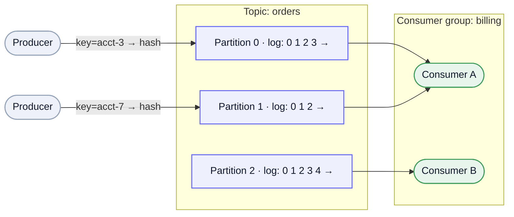
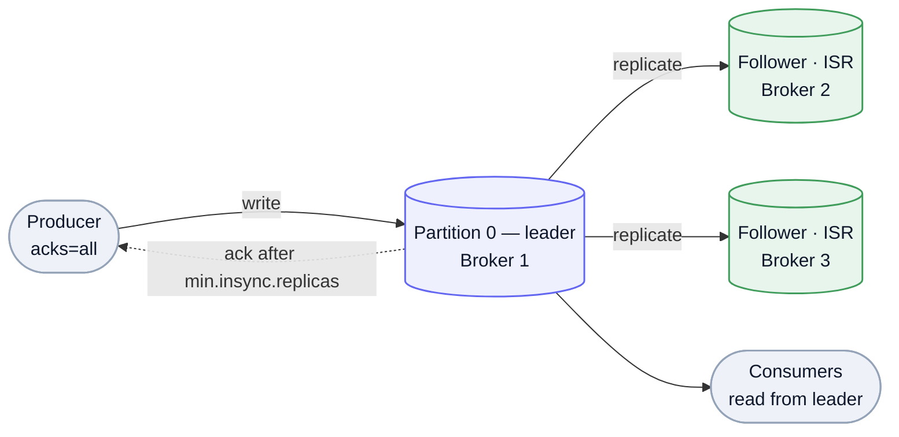

Apache Kafka is a distributed, partitioned, replicated **commit log**. The mental model that unlocks everything else: it's an **append-only log you can replay**, not a queue that deletes on read. Producers append records; each consumer tracks its *own* position, so many independent consumers can read — and re-read — the same stream. That single design choice is why Kafka is the default **event backbone**: decoupling, buffering, pub/sub fan-out, CDC, and stream processing all fall out of "a durable, replayable, partitioned log."

## The log model

A **topic** is a named stream, split into **partitions**. A partition is an ordered, append-only, immutable sequence of records, each addressed by a monotonically increasing **offset**.

- **Ordering is per-partition, not per-topic.** Kafka guarantees order *within* a partition only. So the partition count is simultaneously your **unit of parallelism** and your **ordering boundary** — a key design tension.
- **Key → partition.** The producer hashes a record's **key** to choose a partition, so all records for the same key (e.g. one `account_id`) land in one partition and stay ordered relative to each other. No key → round-robin across partitions.
- **Retention is independent of consumption.** Records are kept for a configured time or size (or forever) whether or not anyone read them. This is what makes replay, late-joining consumers, and multiple independent readers possible — the opposite of a delete-on-ack queue.

Mermaid source

## Producers

Producers append to the partition leader and tune the durability/latency trade with **`acks`**:

| `acks` | Waits for | Trade |
| --- | --- | --- |
| `0` | nothing (fire-and-forget) | lowest latency, can lose data |
| `1` | leader write | fast, loses data if leader dies before replication |
| `all` | leader + in-sync replicas | durable; the default for anything that matters |

Two more producer essentials: the **idempotent producer** dedups retries (a producer id + per-partition sequence number means a re-sent batch isn't written twice), and **batching + compression** (lz4/zstd) is what gets Kafka its throughput — records accumulate into batches before hitting the wire and disk.

## Consumers & consumer groups

A **consumer group** is a set of consumers that *together* read a topic: each partition is consumed by **exactly one** consumer in the group. That's the scaling model — add consumers to a group to parallelize, but **parallelism is capped at the partition count** (extra consumers sit idle).

- **Offsets & semantics** — each consumer commits its position (to the internal `__consumer_offsets` topic). Commit *after* processing → **at-least-once** (a crash replays the last batch); commit *before* → at-most-once. Exactly-once needs more (below).
- **Rebalancing** — when consumers join/leave or partitions change, the group reassigns partitions. Classic rebalancing is stop-the-world; **cooperative** rebalancing reassigns incrementally to avoid pausing everyone.
- **Pub/sub for free** — different groups read the same topic *independently*, each with its own offsets. One topic feeds the billing group, the analytics group, and the search-indexer group at once — fan-out without re-publishing. (The [pub/sub](/archive/system-design/terminology/#async--messaging) pattern, built in.)

## Replication & durability

Every partition has a **leader** and **follower** replicas spread across brokers. Clients read and write the leader; followers pull to stay current.

- **ISR (in-sync replicas)** — the set of replicas caught up to the leader. With `acks=all` and **`min.insync.replicas=2`**, a write is acknowledged only once enough replicas hold it, so a single broker loss can't lose acknowledged data.
- **Leader election** — if a leader fails, a new one is elected from the ISR. **Unclean leader election** (promoting an out-of-sync replica) trades durability for availability — usually left off.

Mermaid source

## Storage: why it's fast

Kafka is fast because the log structure plays to the hardware:

- **Sequential append** — records are appended to on-disk **segment** files; sequential writes are vastly cheaper than random ones.
- **Page cache + zero-copy** — Kafka leans on the OS page cache rather than a heap cache, and ships bytes to consumers with **`sendfile`** (zero-copy), avoiding a trip through user space. Hot data is served straight from cache.
- **Retention by delete or compaction** — *delete* drops whole segments past a time/size bound; **log compaction** keeps only the *latest* record per key, turning a topic into a changelog/snapshot. Compaction is what makes a Kafka topic a durable [CDC](/archive/system-design/terminology/#data--storage) stream and backs stateful stream processing.

## Delivery semantics

- **At-least-once** is the practical default — retries plus commit-after-process mean a record can be processed more than once, so downstream consumers should be **[idempotent](/archive/system-design/terminology/#async--messaging)**.
- **Exactly-once (EOS)** — the idempotent producer plus **transactions** (atomically write output records *and* commit input offsets) make read-process-write pipelines exactly-once *within Kafka*. It's still effectively-once: external side effects (charging a card, sending an email) need their own idempotency key. ([Exactly-once is mostly a myth](/archive/system-design/terminology/#async--messaging) once you cross the boundary.)

## KRaft (no more ZooKeeper)

Kafka historically used **ZooKeeper** for cluster metadata and controller election. Modern Kafka replaces it with **KRaft** — a built-in **Raft** quorum that stores metadata in an internal log and runs the controller in-process. Fewer moving parts, faster failover, and one system to operate instead of two.

## Kafka in system design

When a design calls for an event backbone, this is usually the reach — and *why*:

- **Decoupling** — producers and consumers evolve independently; new consumers attach without touching producers.
- **Buffering & backpressure** — Kafka absorbs bursts; a slow consumer simply **lags** (its offset falls behind) instead of dropping data or stalling the producer. (See [backpressure](/archive/system-design/terminology/#async--messaging).)
- **Fan-out** — N consumer groups each get the full stream (billing, analytics, search index…).
- **Stream processing** — Kafka Streams, Flink, or ksqlDB do windowed aggregation and joins directly on topics — the engine behind ad-click aggregation / metrics pipelines.
- **Replay & event sourcing** — a retained or compacted log can rebuild state or backfill a brand-new consumer from offset 0 ([event sourcing](/archive/system-design/terminology/#distributed-transactions--consistency)).

**When *not* to reach for it.** Low-volume or request/response work (use RPC or a plain task queue); workloads needing per-message priority, arbitrary TTLs, or selective acks (a broker like SQS/RabbitMQ fits better); and small apps where Kafka's operational weight isn't worth it. Kafka shines at high-throughput, ordered, replayable streams — not as a general-purpose job queue. The next section is *why*.

## Event vs task — Kafka vs a queue

The recurring confusion is "Kafka or a task queue?" — and it's settled by **what the message is**, not by throughput. An **event** is a *fact* ("OrderPlaced", past tense) that anyone may observe; a **task/command** is an *instruction* ("SendEmail") for exactly one worker to execute once. That difference drives every other property:

| | Event → **log** (Kafka) | Task / command → **queue** (SQS, RabbitMQ) |
| --- | --- | --- |
| The message is | a **fact**: "X happened" | an **instruction**: "do X" |
| Consumed by | **many** independent consumers, each at its own offset | **one** worker, then deleted (competing consumers) |
| Producer expects | nothing — fire-and-forget fan-out | the work to get *done* |
| Lifecycle | **retained & replayable**, immutable | **ephemeral**: ack → delete, redeliver on failure |
| Needs | ordering, replay, fan-out | per-message ack / retry / visibility / priority / DLQ |

**The test:** is the message a *fact for anyone to observe* (event → Kafka), or a *unit of work for one worker to run once* (task → queue)? Kafka is a retained, replayable log with per-consumer offsets — it has no per-message ack/delete, redelivery, visibility timeout, or priority, which are exactly what a job queue is built around. (You *can* bend each into the other — a consumer group is competing consumers; a fanout exchange is pub/sub — but the natural fit and failure modes are as above.)

**Same occurrence, both framings — the difference is intent.** One moment ("documents are in S3") can produce *both*: emit `DocumentsUploaded` (an **event** — for whoever cares) *and* send `ArchiveDocuments` (a **command** — because you specifically want it done). An event **announces a fact** and lets the receiver decide what's next; a command **requests an action** the sender already decided on. Many/unknown reactors → event; one action you require → command. (Watch the disguise: a `DocumentsUploaded` "event" that secretly depends on exactly one consumer archiving is really a command — hidden coupling that bites later.)

**Can a queue carry events?** Yes, but it's a stretch. A plain queue **deletes on ack** and hands each message to **one** consumer — so it can't natively do an event's two traits: **many independent readers** and **replay**. You fake fan-out with a queue *per consumer* (SNS→SQS, a fanout exchange → one queue each), but there's still **no retained history**: once acked it's gone, and a new consumer can't read the past. A **log** keeps every record so anyone can read *or re-read* at their own offset. In short — a queue is *deliver-then-forget*; a log is *keep-it, anyone can replay*. Use a queue for events only when you need neither history nor wide fan-out.

## Kafka vs Temporal — moving data vs moving work

A close cousin of the queue confusion: gluing microservices into a **multi-step process** with Kafka. Event-driven *choreography* (services react to each other's events) is a legitimate pattern for simple flows — but the moment you find yourself hand-rolling **retries, timeouts, correlation IDs, compensation, and process state** across topics, that's no longer messaging. That's **workflow orchestration**, and a [durable-execution](/archive/system-design/terminology/#async--messaging) engine like [Temporal](/archive/system-design/temporal/) is built for exactly it: it persists each step, owns the retries/timeouts/compensation, and lets you write the flow as ordinary code instead of reconstructing it from event soup.

**Kafka moves data; Temporal moves work.** Kafka is the backbone for events and streams; once you're tracking *the state of a process* spanning services, reach for orchestration — not more glue code on the log.

---

These are working notes — a model and a map, not a substitute for the [Kafka docs](https://kafka.apache.org/documentation/). The "append-only, replayable, partitioned log" idea is the one thing to internalize; topics, groups, replication, and EOS all follow from it. The one-liner terms (pub/sub, exactly-once, backpressure, CDC) live in the [Terminology](/archive/system-design/terminology/#async--messaging).
