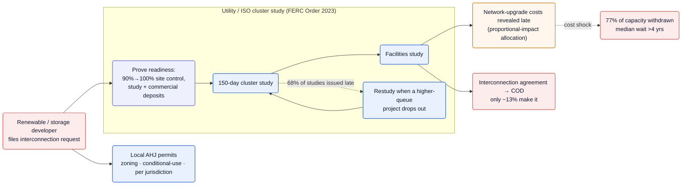
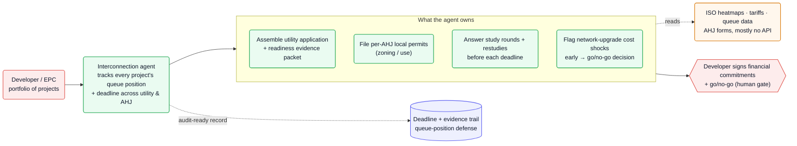

Before a wind, solar, or battery project can sell a single megawatt, it has to clear a utility interconnection study queue — and that queue is the single biggest bottleneck on the U.S. clean-energy build-out. As of the end of 2025, **over 2,060 GW of generation and storage were waiting in line** ([LBNL][lbnl]); of all the capacity that requested interconnection from 2000–2019, **only 13% had reached commercial operation by end-2024 — 77% was withdrawn** ([LBNL][lbnl]). The median wait from request to operation has doubled to **over four years** ([LBNL][lbnl]), and [FERC's 2023 overhaul][ferc] just raised the bar with new readiness, site-control, and deposit requirements. The agent opportunity is to own the developer's side of that gauntlet: assemble the application and readiness packet, file the local permits, answer each study round on deadline, and flag the network-upgrade cost shocks that kill projects — across a whole portfolio.

**Vitals:** market: 2,060+ GW queued, much of clean-energy capex bottlenecked here · `multi-year, per-utility + per-AHJ` · buyer: developers / EPCs / installers · model: per-project or subscription · whitespace: ★★★

Market context — the scale of the bottleneck

- **The queue is enormous and growing structurally.** At end-2024 there were **~10,300 active projects — 1,400 GW of generation plus ~890 GW of storage** ([LBNL][lbnl]); the dataset spans all seven ISOs/RTOs and 50 non-ISO utilities, ~98% of U.S. generating capacity, so this is the whole market, not a sample ([LBNL][lbnl]).
- **Most of it never gets built.** "Most projects that apply for interconnection are ultimately withdrawn" ([LBNL][lbnl]); **408 GW already holds a draft or executed interconnection agreement but still isn't operational** ([LBNL][lbnl]) — capital committed, megawatts stranded.
- **Demand is climbing into the bottleneck.** The old serial process was overwhelmed by the surge of wind/solar/storage requests ([FERC][ferc]); electrification and a new wave of data-center load are now pushing demand up after decades flat — more pressure on the same clogged pipe.

## The mess

- **The queue is a multi-year, multi-round study gauntlet.** A project enters a **150-day cluster study, then a facilities study, before any interconnection agreement** — and gets **restudied whenever a higher-queue project drops out** ([FERC][ferc]). Utilities are so backed up that **68% of the interconnection studies completed in 2022 were issued late** ([FERC][ferc]).
- **The cost-killer arrives late and unpredictably.** Network-upgrade costs are allocated across a cluster by a "proportional impact method," and **affected-system upgrade costs surface late in the process, triggering late-stage withdrawals** ([FERC][ferc]) — which is a large part of why 77% of capacity never makes it ([LBNL][lbnl]).
- **FERC Order 2023 raised the documentation bar.** Developers must now prove **90% site control at request and 100% by the facilities-study agreement, post study and commercial-readiness deposits, and face withdrawal penalties** ([FERC][ferc]) — far more evidence to assemble and keep current, per project.
- **Local permitting is a parallel, per-jurisdiction track.** Zoning, conditional-use, and AHJ approvals run on their own forms and calendars alongside the utility queue — another deadline-driven document pipeline the developer must carry simultaneously.

## Why now

The bottleneck is structural and worsening — over four-year median waits, a queue that grew past 2,000 GW, and a build-out being pushed harder by electrification and data-center load ([LBNL][lbnl]). That alone makes the pain acute, but the sharper catalyst is regulatory: **FERC Order 2023's shift to first-ready, first-served cluster studies** ([FERC][ferc]) deliberately front-loads the burden onto developers — more readiness evidence, more site control, more financial commitment, all on firm deadlines with penalties for dropping out. The reform makes a developer's *paperwork discipline* a gating factor for whether a project survives.

It stayed unsolved because the work is split awkwardly: utilities run the studies (and were until recently under no real deadline — FERC only just eliminated the "reasonable efforts" standard — [FERC][ferc]), while developers juggle applications, permits, and study responses by hand. An agent can now read the tariffs, ISO heatmaps, and study results, assemble compliant packets, and track every deadline across utility and AHJ — turning a reactive scramble into a managed pipeline at exactly the moment the rules demand one.

## The money

| Signal | Figure | Basis |
| --- | --- | --- |
| Capacity queued (end 2025) | **2,060+ GW** | LBNL ([lbnl]) — VERIFIED |
| Reaches operation | **only 13%** of 2000–19 requests | LBNL ([lbnl]) — VERIFIED |
| Withdrawn | **77%** of that capacity | LBNL ([lbnl]) — VERIFIED |
| Median request → operation | **>4 years** (doubled) | LBNL ([lbnl]) — VERIFIED |
| Capital stranded mid-process | **408 GW** with an IA, not yet operational | LBNL ([lbnl]) — VERIFIED |
| Studies issued late (2022) | **68%** | FERC ([ferc]) — VERIFIED |

:::caution[Value is real but timing isn't fully in the agent's hands]
A stalled project burns development capital and lost-revenue every month, so willingness to pay is high. But the agent can't control the *utility's* study clock — only the developer's readiness and responsiveness. The honest model is per-project assembly + a subscription to manage a portfolio's deadlines, with success tied to reaching an interconnection agreement, not a pure found-money contingency.
:::

## How it works today

A developer files into a utility's cluster study and then spends years feeding it: proving readiness, answering study rounds, absorbing restudies when neighbors drop out, and discovering network-upgrade costs late — all while running local permits on a separate track. Most projects don't survive it.

![Energy interconnection today: a renewable or storage developer files an interconnection request into a utility/ISO cluster study governed by FERC Order 2023. The developer must prove readiness (90% to 100% site control, study and commercial deposits), then the project goes through a 150-day cluster study and a facilities study, with restudies triggered whenever a higher-queue project drops out — and 68% of studies are issued late. In parallel the developer must obtain local AHJ permits (zoning, conditional-use) per jurisdiction. Network-upgrade costs are revealed late via proportional-impact allocation, causing cost shocks; the result is that 77% of capacity is withdrawn with a median wait over four years, and only about 13% reaches an interconnection agreement and commercial operation.](/diagrams/opportunities/energy-interconnection-today.svg)

Mermaid source

## Where an agent fits

Make the developer's side of the queue a managed pipeline instead of a manual scramble. The agent tracks every project's queue position and deadline across both the utility and the AHJ; assembles the interconnection application and the FERC-Order-2023 readiness packet (site-control evidence, deposits, modeling data); files the per-jurisdiction local permits; answers each study and restudy round before its deadline; and — reading ISO heatmaps and study results — flags network-upgrade cost shocks early enough for a real go/no-go instead of a late-stage forced withdrawal. The developer keeps the financial commitments and the kill decision; the agent owns the document-and-deadline labor that currently sinks projects.

This is the playbook in miniature: [an agent that acts on deadlines rather than waiting to be asked](/playbook/agent-assistant-to-actor/); [per-utility and per-AHJ tariffs, forms, and study rules encoded as a domain layer](/playbook/encoding-domain-rules/) instead of tracked by hand; and [reading ISO heatmaps, tariffs, and permit portals that mostly expose no clean API](/playbook/integrating-systems-without-apis/).

![Energy interconnection with an agent: a developer or EPC with a portfolio of projects delegates to an interconnection agent that tracks every project's queue position and deadline across both utility and AHJ. The agent owns assembling the utility application plus the readiness-evidence packet, filing per-AHJ local permits, answering study rounds and restudies before each deadline, and flagging network-upgrade cost shocks early to drive a go/no-go decision — reading ISO heatmaps, tariffs, queue data, and AHJ forms that mostly have no API. The developer signs the financial commitments and makes the go/no-go as the human gate, and the agent maintains a deadline and evidence trail as queue-position defense.](/diagrams/opportunities/energy-interconnection-agent.svg)

Mermaid source

## Whitespace & incumbents

There's real activity here — but it clusters at the two ends, leaving the developer's document-and-deadline middle open:

- **Utility-side queue & study automation** — **GridUnity** (formerly Qado Energy) runs the "End-to-End Interconnection Life Cycle" with "real-time insights and automation," and reportedly "can shave 12 months from the sluggish interconnection process," backed by a **$50M DOE grant** ([GridUnity][gridunity], [Canary Media][canary]). **Pearl Street Technologies** sells study-simulation software (SUGAR, Interconnect) "to mitigate the interconnection backlog" ([Pearl Street][pearl]). These primarily serve the utilities/ISOs running the studies.
- **Developer-side siting & screening** — **Nira Energy** helps developers "find the most profitable interconnection points on the electrical grid" ([Nira][nira]); peers like Paces work the same pre-application siting problem. They tell a developer *where* to apply, not run the application.

:::note[Why this is ★★★ whitespace]
The tools either help the utility process the queue or help the developer pick a site. The empty slot is the developer's *operator* — the thing that assembles each application and readiness packet, files the AHJ permits, and answers every study round on deadline. That paperwork-and-deadline labor, across a portfolio, is exactly what the 77% withdrawal rate is made of.
:::

## Hard problems

| Problem | Why it's hard here | Signal | Likely approach (speculative) |
| --- | --- | --- | --- |
| Per-utility, per-ISO, per-AHJ rules | Each transmission provider's tariff and each AHJ's permit process differs and changes; FERC Order 2023 compliance varies provider-to-provider | Order 2023 lets providers file deviations under "independent entity" / "consistent with or superior to" standards ([ferc]) | Likely a maintained per-jurisdiction rules/forms DSL — see [encoding domain rules](/playbook/encoding-domain-rules/) — versioned as tariffs and compliance filings change |
| Predicting cost-shock withdrawals | Network-upgrade costs surface late and are allocated by proportional impact across a shifting cluster; they're the main project-killer | "late-stage project withdrawals when affected system network upgrades are identified late" ([ferc]); 77% withdrawn ([lbnl]) | Probably modeling over ISO heatmaps + study outputs to forecast likely upgrade exposure and surface a go/no-go before the deposit is sunk |
| Engineering-grade study inputs | Interconnection studies need accurate modeling data (esp. for non-synchronous wind/solar/storage), not just form-filling | Order 2023 imposes new modeling/"ride-through" data requirements ([ferc]) | Likely human/engineer-in-the-loop: the agent assembles and validates the packet; a licensed engineer signs the technical models |
| Timing is utility-controlled | The agent governs the developer's readiness and responsiveness, but not the utility's study clock | 68% of 2022 studies issued late ([ferc]); reform impact "too early to measure" ([lbnl]) | Probably value-capture on what the developer *can* control — never missing a deadline, never being the one to stall — billed per-project + portfolio subscription |

## Sources

- [LBNL — Queued Up][lbnl] — queue size, withdrawal rate, wait times, capacity with signed IAs
- [FERC — Interconnection Final Rule explainer][ferc] — the cluster-study process, Order 2023 readiness/deposit/penalty reforms, late-study data
- [GridUnity][gridunity] · [Canary Media][canary] · [Pearl Street Technologies][pearl] · [Nira Energy][nira] — incumbent tooling

Reconstructed from public sources; claims are tier-labeled (VERIFIED / INFERRED / SPECULATIVE) — see [how to read the tiers](/opportunities/about/). Supporting quotes live in this repo's evidence map (`evidence/opp-energy-interconnection-evidence-map.md`).

[lbnl]: https://emp.lbl.gov/queues
[ferc]: https://www.ferc.gov/explainer-interconnection-final-rule
[gridunity]: https://www.gridunity.com
[canary]: https://www.canarymedia.com
[pearl]: https://pearlstreettechnologies.com
[nira]: https://www.niraenergy.com
