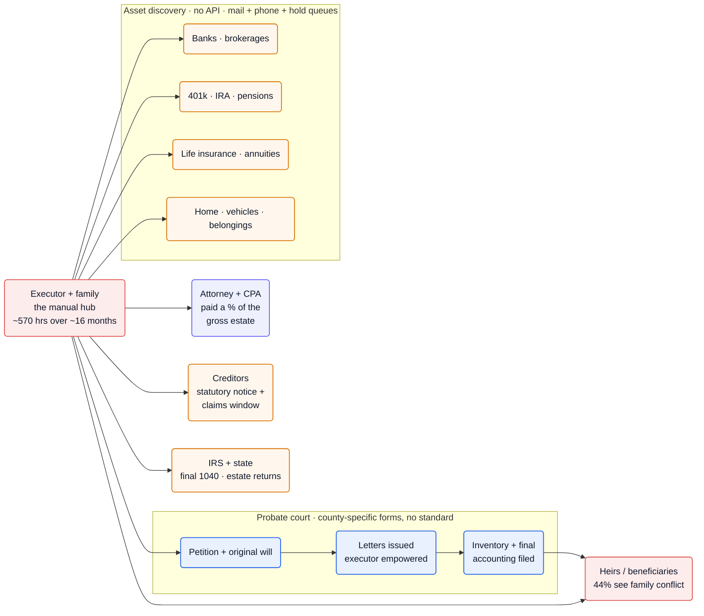
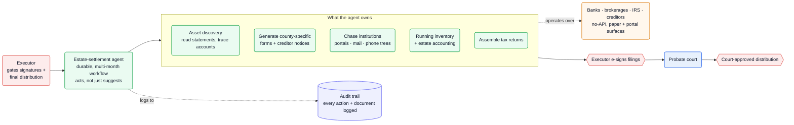

Every death hands one person — usually a grieving relative with no legal training — a months-long, multi-party paper chase: open a case in the county probate court, track down every account across dozens of institutions that expose no API, notice creditors, file the final tax returns, and distribute what's left to heirs. It runs an average of **~16 months and ~570 hours of executor effort per estate** ([EstateExec][ee]), on near-universal, non-cyclical volume. The agent opportunity is to own the discovery → forms → institutional-chase → accounting loop end to end, while the executor keeps the signature and the court keeps the gate.

**Vitals:** market: $84T+ wealth transfer through 2045 ([Cerulli][cer]) · `~2.6M US probate cases/yr` · buyer: executors / estate attorneys / fiduciaries / banks · model: per-estate fee or % of estate · whitespace: ★★

Market context — size, money flow, who profits today

- **The wave:** Cerulli projects **$84.4T transferred through 2045 — $72.6T to heirs, $11.9T to charity** ([Cerulli][cer]). Most of it passes through, or just around, the estate-settlement process.
- **The volume:** ~2.6M probate cases are filed annually in US state courts (NCSC, 2023, reported via [secondary source][pcb]); academic estimates put **15–40% of all deaths** into probate ([same][pcb]), against ~3M+ US deaths a year.
- **Who pays today:** fees flow to estate attorneys and CPAs (the average estate spends **$12.4K on legal + accounting** alone; executors take **~$18K** in compensation — [EstateExec][ee]), and to corporate fiduciaries (bank trust departments) on larger estates.
- **Tax is rarely the issue:** only estates **>$13M** owe federal estate tax — **<0.1%** of estates ([EstateExec][ee]). The work is administrative, not tax-planning; the pain is process, not liability.

## The mess

- **Asset discovery has no API.** The executor reconstructs the deceased's financial life by mail and phone — every bank, brokerage, 401(k), IRA, pension, life policy, and utility — through hold queues and notarized-letter requirements. Alix, an AI-native entrant, markets exactly this gap: it "did a wonderful job of finding different assets that otherwise would have gone unnoticed" ([Alix][alix]).
- **Court forms are county-specific with no standard.** Filing the petition, getting Letters issued, and filing the inventory and final accounting vary by jurisdiction — which is why incumbents sell "state-specific guidance" as the product ([EstateExec][ee]) rather than a generic form-filler.
- **The clock is long and the effort is brutal.** ~16 months to settle, ~570 hours of executor work, and **80% finish within 18 months** ([EstateExec][ee]) — a multi-month, stateful, deadline-bound workflow (creditor-claim windows, tax deadlines) running on spreadsheets and a filing cabinet.
- **Fees scale with the gross estate, not the work.** In statutory-fee states the attorney *and* the personal representative each draw a percentage of the **gross** estate — in California, 4% of the first $100K, 3% of the next, 2% of the next $800K, so a $1M estate pays roughly **$23K each, ~$46K total** ([Cal. Probate Code schedule][caf]), regardless of how mechanical the administration was.

## Why now

The demographic wave is once-in-history — the largest wealth transfer ever recorded is moving through an artisanal, paper-bound process built for a fraction of the volume. What changed on the supply side is capability: an agent can now read wildly varied institutional documents (statements, beneficiary forms, deeds, court notices), reason about what's missing, and drive a long-running, multi-party workflow with deadlines and dependencies — the two things estate settlement is made of.

Why it stayed unsolved is structural and is exactly why it's defensible: the process is fragmented county-by-county with no APIs, it's emotionally loaded, and it's *low-frequency per person* — almost nobody settles two estates, so no consumer ever climbs the learning curve, and the knowledge stays locked in solo attorneys' heads. The arcaneness is the moat ([see Opportunities thesis](/opportunities/about/)).

## The money

| Signal | Figure | Basis |
| --- | --- | --- |
| Generational wealth transfer | **$84.4T** through 2045 ($72.6T to heirs) | Cerulli ([cer]) — VERIFIED |
| Probate volume | **~2.6M** cases/yr in US state courts | NCSC 2023, reported ([pcb]) — INFERRED (secondary) |
| Time to settle | **~16 months**; 80% within 18 | EstateExec study ([ee]) — VERIFIED |
| Executor effort | **~570 hours** per estate | EstateExec ([ee]) — VERIFIED |
| Legal + accounting spend | **~$12.4K** avg per estate | EstateExec ([ee]) — VERIFIED |
| Total settlement cost | **4–7% of gross estate** (national) | Multiple firms ([caf]) — VERIFIED |
| CA statutory fee | **~$46K** on a $1M estate (attorney + PR, on gross) | Cal. Probate Code schedule ([caf]) — VERIFIED |

:::note[The business model is fee-for-administration, not clean contingency]
Unlike property-tax appeals or subrogation, there's no pool of "found money" to bill against — value capture is a per-estate fee (Alix ≈1% of estate / $9K min, [reported][swift]; EstateExec a flat $199, [ee]). Debt-negotiation savings are an upside, not the core meter.
:::

## How it works today

The executor is the single manual hub. Everything routes through one untrained person coordinating the court, every financial institution, creditors, the IRS, and the heirs — sequentially, on paper and phone, for over a year.

![Estate settlement today: the executor and family sit at the center as the manual hub, spending ~570 hours over ~16 months. They engage an attorney and CPA (paid a percentage of the gross estate); file a petition and original will with the county probate court, which issues Letters empowering the executor and later takes the inventory and final accounting; perform asset discovery across banks, brokerages, retirement accounts, life insurance, and physical property — all with no API, by mail, phone, and hold queues; handle creditors' statutory notice and claims window; file final and estate tax returns with the IRS and state; and finally distribute to heirs and beneficiaries, 44% of whom experience family conflict.](/diagrams/opportunities/probate-estate-settlement-today.svg)

Mermaid source

## Where an agent fits

The agent owns the labor and the state; the human owns the judgment and the signature. It runs the discovery sweep (read statements, trace dormant accounts), generates the county-specific filings and creditor notices, works the no-API institutional surfaces over months, keeps a running inventory and estate accounting, and assembles the tax returns — surviving the multi-month timeline with its deadlines intact. The executor gates anything legally binding: e-signing court filings and approving the final distribution. Every action and document is logged, which doubles as the court accounting and the defense against the [44% odds of family conflict][ee].

This is squarely the playbook's territory: [an agent that acts, not suggests](/ai-playbook/agent-assistant-to-actor/); a [durable, long-running workflow](/ai-playbook/durable-long-running-workflows/) that can't lose state across 16 months; [integration with systems that have no API](/ai-playbook/integrating-systems-without-apis/) (portals, mail, phone trees); and [per-jurisdiction rules encoded as a domain layer](/ai-playbook/encoding-domain-rules/) rather than hand-held per county.

![Estate settlement with an agent: the executor delegates to a durable, multi-month estate-settlement agent that acts rather than suggests. The agent owns asset discovery (reading statements, tracing accounts), generating county-specific forms and creditor notices, chasing institutions across portals, mail, and phone trees, maintaining a running inventory and estate accounting, and assembling tax returns — operating over the no-API bank, brokerage, IRS, and creditor surfaces. Legally binding steps gate back to the human: the executor e-signs filings that go to the probate court, and the court approves the final distribution. The agent logs every action and document to an audit trail.](/diagrams/opportunities/probate-estate-settlement-agent.svg)

Mermaid source

## Whitespace & incumbents

The seed thesis called this a near-empty blue ocean. The deep dive corrects that: **the AI-native wave arrived in 2025**, so this is now a real-but-shallow field, not an empty one — hence ★★, not ★★★. The competitive map sorts into three bands:

- **DIY executor software** — [EstateExec][ee] ("the #1 Software for Estate Executors," a flat **$199/estate**, "TurboTax for executors," with "state-specific guidance with AI software") and [Atticus][att] ("the #1 DIY software for executors," pairing software with an in-house expert team). These *guide* the executor; they don't do the work.
- **Service + platform** — [ClearEstate][ce] ("our platform and experts will handle the entire settlement process") and **Alix**, the one to watch: an AI-native settlement service with human Settlement Specialists, **$20M Series A in July 2025** (Acrew, Charles Schwab, Edward Jones Ventures, [reported][swift-news]), proven "across estates from $20K to $20M," whose "AI agents… [scan] documents, [extract] data, [pre-populate] legal forms" ([Alix][alix]).
- **B2B fiduciary tooling** — [Estateably][eb] ("the first cloud-based platform for estate administrators," fiduciary accounting and "intelligent automation"), sold to the professionals rather than the family.

:::caution[The gap is autonomy depth, not absence]
Most incumbents are checklist/guidance software or human-led services with AI assist; the durable, *act-not-suggest* agent that runs the full institutional chase with the audit trail as the artifact is still [nascent](/notes/startup-gtm-terms/#strategy--positioning). The bet is now execution depth against Alix-class competition — no longer a land grab on empty space.
:::

## Hard problems

| Problem | Why it's hard here | Signal | Likely approach (speculative) |
| --- | --- | --- | --- |
| Asset discovery with no API | Accounts are scattered across institutions that expose no programmatic access; the agent works mail, portals, and phone trees, and must reason about what's *missing* | "found different assets that otherwise would have gone unnoticed" ([Alix][alix]) | Probably browser/RPA + document-extraction agents over institutional portals, plus heuristics that flag implied-but-unfound accounts (1099s without a matching account, etc.) — see [integrating systems without APIs](/ai-playbook/integrating-systems-without-apis/) |
| Per-jurisdiction court rules | Forms, deadlines, and accounting formats vary by county/state with no standard; getting one wrong restarts a clock | Incumbents sell "state-specific guidance" as the product ([ee]) | Likely a per-jurisdiction rules/templates layer (a DSL of forms + deadlines) rather than prompt-per-county — see [encoding domain rules](/ai-playbook/encoding-domain-rules/) |
| 16-month durable state | The workflow spans deadlines and dependencies across >a year; losing state or missing a creditor window is unrecoverable | ~16 mo avg; 80% within 18 ([ee]) | Probably a durable execution engine (Temporal-style) with timers for statutory windows — see [durable long-running workflows](/ai-playbook/durable-long-running-workflows/) |
| Trust + the conflict surface | Money + grief + 44% family-conflict rate makes every action contestable; errors aren't just costly, they're litigated | "Over 44% of respondents had experienced or were aware of … family conflict" ([ee]) | Likely human-gated signatures + a complete, court-grade audit log of every action and document as the defensible artifact |

## Sources

- [Cerulli][cer] — $84.4T wealth transfer through 2045
- [EstateExec statistics][ee] — settlement time, effort, cost, conflict, estate-size data (vendor study, n>1,200)
- [Alix][alix] · [Series A coverage][swift-news] · [pricing comparison][swift] — AI-native estate-settlement entrant
- [Atticus][att] · [ClearEstate][ce] · [Estateably][eb] — incumbent software/services
- [California statutory probate-fee schedule][caf] — % of gross estate
- [Probate statistics (NCSC, reported)][pcb] — case volume, % of deaths

Reconstructed from public sources; claims are tier-labeled (VERIFIED / INFERRED / SPECULATIVE) — see [how to read the tiers](/opportunities/about/). Supporting quotes live in this repo's evidence map (`evidence/opp-probate-estate-settlement-evidence-map.md`).

[cer]: https://www.cerulli.com/press-releases/cerulli-anticipates-84-trillion-in-wealth-transfers-through-2045
[ee]: https://www.estateexec.com/Docs/General_Statistics
[alix]: https://www.meetalix.com/
[swift-news]: https://finance.yahoo.com/news/alix-secures-20m-series-transform-130000000.html
[swift]: https://www.swiftprobate.com/compare
[att]: https://www.weareatticus.com/
[ce]: https://www.clearestate.com/
[eb]: https://www.estateably.com/
[caf]: https://flasllp.com/how-much-does-probate-cost-in-california/
[pcb]: https://www.probatecourtbond.com/
