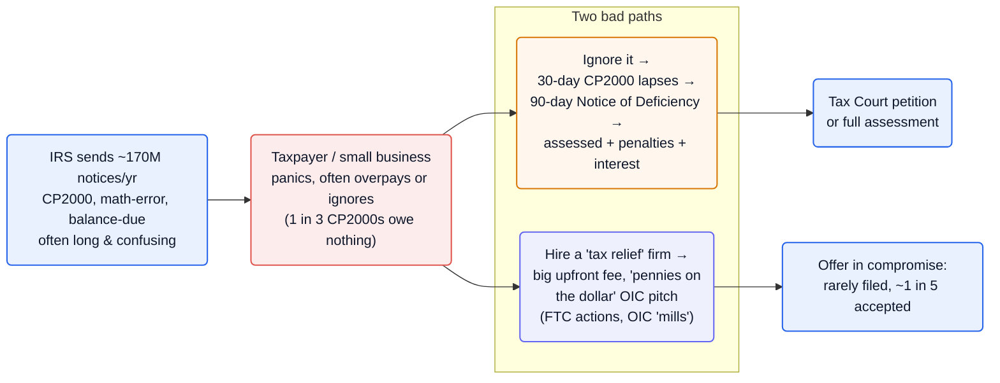
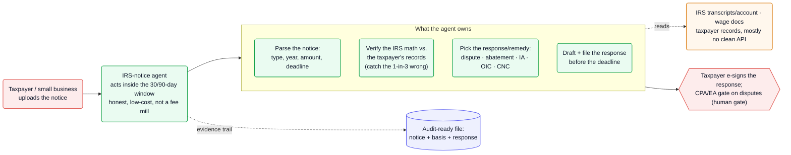

The IRS sends **about 170 million notices to individual taxpayers every year** ([IRS Pub 4054][irspub]) — and the agency itself concedes they're long and confusing enough to warrant a "Simple Notice Initiative" to fix them ([Treasury][treasury]). For the recipient it's a deadline-driven panic: a CP2000 underreporter notice gives **30 days** to respond, and ignoring it escalates to a **90-day Notice of Deficiency** after which the tax, penalties, and interest are simply assessed ([TAS][tas]). Most people either overpay out of fear or hand the problem to a high-fee "tax relief" firm — even though **one in three CP2000 notices results in no additional tax owed at all** ([H&R Block][hrblock]). The agent opportunity is to read the notice, check the IRS's own math, pick the correct response, and file it on time — at software cost, without the fee-mill baggage.

**Vitals:** market: ~20M taxpayers owed ~$539B in back taxes ([Jackson Hewitt][jh]) · `deadline-driven, ~170M notices/yr` · buyer: individuals / small businesses / their CPAs · model: low per-notice fee + subscription · whitespace: ★★☆

Market context — the distressed population and the resolution gap

- **The population in distress is enormous.** In 2019, **~20 million taxpayers owed ~$539 billion in back taxes** ([Jackson Hewitt][jh]); on top of that, ~170M notices a year flow to individuals ([IRS Pub 4054][irspub]), the bulk of them routine adjustments, balance-due, and math-error letters.
- **The headline remedy barely functions at scale.** Of those 20M who owed, only **54,225 even applied for an Offer in Compromise and just 17,890 were accepted** ([Jackson Hewitt][jh]); OIC acceptance was **~21% in FY2024** ([Omni][omni]). The "settle for pennies on the dollar" pitch fits a tiny minority — yet it's the industry's main advertisement.
- **The buyer is self-funding under duress.** A taxpayer facing penalties and interest, or a small business with a payroll-tax notice, has acute willingness to pay for a correct, on-time response — today they overpay the IRS or overpay a firm.

## The mess

- **The notice is confusing and the clock is already running.** Notices are long and often don't even explain the reason for the change — the IRS launched a "Simple Notice Initiative" precisely because they're hard to parse ([Treasury][treasury]); meanwhile a CP2000 is a **30-day letter** ([Jackson Hewitt][jh]) and a Notice of Deficiency a **90-day** hard deadline to petition Tax Court ([TAS][tas]).
- **The IRS is often wrong, and silence is treated as agreement.** **One in three CP2000s results in no extra tax** ([H&R Block][hrblock]), but if the taxpayer doesn't respond in time the proposed amount is assessed by default — so inaction converts an IRS error into a real, collectible debt.
- **Choosing the right remedy is technical.** Dispute the notice, request penalty abatement, set up an installment agreement, file an Offer in Compromise, or seek currently-not-collectible status — each has its own eligibility math and forms, and the wrong choice wastes the only window the taxpayer gets.
- **The "help" is the second trap.** The tax-relief industry has a documented fraud record — the FTC has repeatedly acted against firms that "bilked consumers… by falsely claiming they could reduce their tax debts" ([FTC][ftc]) — and regulators now warn about Offer-in-Compromise "mills" ([Tax Notes][taxnotes]).

## Why now

Reading an IRS notice, reconciling its numbers against a taxpayer's wage and income records, choosing among the statutory remedies, and drafting the response on the right form is a parse-records-and-apply-rules task — exactly what an LLM grounded in the IRS's own rules can now do per-notice, cheaply, at the scale of 170 million letters a year. What used to require a paid professional's hour per notice can be triaged in minutes.

The honest framing of the gap: AI is already arriving here, but as a **copilot for tax professionals** — Canopy's "Coworker" automates notice workflows for firms, and tools like CPA Pilot help firms "stay fast" on notice response ([Canopy][canopy], [CPA Pilot][cpapilot]). What's missing is the taxpayer-facing version: an agent the distressed individual or small business points at their own notice, that acts honestly and at low cost rather than selling a "pennies on the dollar" dream. The incumbents' trust deficit is the opening.

## The money

| Signal | Figure | Basis |
| --- | --- | --- |
| Notices to individuals per year | **~170 million** | IRS Pub 4054 / Treasury ([irspub], [treasury]) — VERIFIED |
| Taxpayers owing back taxes (2019) | **~20M, ~$539B** | Jackson Hewitt ([jh]) — VERIFIED |
| CP2000s with no added tax | **1 in 3** | H&R Block ([hrblock]) — VERIFIED |
| CP2000 / deficiency deadlines | **30-day / 90-day** | Jackson Hewitt, TAS ([jh], [tas]) — VERIFIED |
| OICs accepted (2019) | **17,890 of 54,225 applied** | Jackson Hewitt ([jh]) — VERIFIED |
| OIC acceptance rate (FY2024) | **~21%** | Omni ([omni]) — VERIFIED |

:::caution[The differentiator is honesty + cost, not a clever billing model]
There's no clean contingency: you can bill on penalties/interest avoided or tax wrongly proposed (the 1-in-3 case), but the natural model is a low per-notice fee plus a subscription. The wedge against a distrusted, high-fee industry is precisely the opposite of that industry — transparent pricing, no "pennies on the dollar" promises, and a correct answer fast.
:::

## How it works today

A notice arrives, the clock starts, and the taxpayer takes one of two bad paths: freeze and overpay (or miss the deadline and get assessed), or hand it to a tax-relief firm that charges a large upfront fee against a remedy most people don't qualify for.

![Tax resolution today: the IRS sends roughly 170 million notices a year — CP2000 underreporter, math-error, balance-due — that are often long and confusing. The taxpayer or small business panics and often overpays or ignores them, even though one in three CP2000s owe nothing. That leads to two bad paths: ignoring it, so the 30-day CP2000 window lapses into a 90-day Notice of Deficiency and the tax is assessed with penalties and interest leading to a Tax Court petition or full assessment; or hiring a tax-relief firm that charges a big upfront fee and pitches a pennies-on-the-dollar Offer in Compromise (an area of FTC actions and OIC mills), where an OIC is rarely filed and only about one in five is accepted.](/diagrams/opportunities/tax-resolution-today.svg)

Mermaid source

## Where an agent fits

Collapse the panic into a fast, correct response. The taxpayer uploads the notice; the agent parses it (type, tax year, amount, deadline), reconciles the IRS's figures against the taxpayer's own records — catching the one-in-three case where nothing is actually owed — selects the right move (dispute, penalty abatement, installment agreement, OIC, or currently-not-collectible), and drafts and files the response inside the 30- or 90-day window. The taxpayer e-signs; a CPA or EA gates genuine disputes. The product is the response plus an audit-ready file of notice → basis → response.

This is the playbook in miniature: [an agent that acts on the deadline rather than waiting to be asked](/playbook/agent-assistant-to-actor/); [the IRS's notice types, deadlines, and remedy-eligibility rules encoded as a domain layer](/playbook/encoding-domain-rules/); and [reading IRS transcripts and a taxpayer's own records that mostly lack a clean API](/playbook/integrating-systems-without-apis/).

![Tax resolution with an agent: a taxpayer or small business uploads the notice to an IRS-notice agent that acts inside the 30- or 90-day window, honestly and at low cost rather than as a fee mill. The agent owns parsing the notice (type, year, amount, deadline), verifying the IRS's math against the taxpayer's records to catch the one-in-three that are wrong, picking the response or remedy (dispute, abatement, installment agreement, OIC, or currently-not-collectible), and drafting and filing the response before the deadline — reading IRS transcripts and account data plus the taxpayer's wage documents and records, which mostly have no clean API. The taxpayer e-signs the response and a CPA or EA gates disputes as the human gate, and the agent keeps an audit-ready file of notice, basis, and response.](/diagrams/opportunities/tax-resolution-agent.svg)

Mermaid source

## Whitespace & incumbents

The field is occupied at the edges, but the honest, autonomous, taxpayer-facing middle is open:

- **High-fee human "tax relief" firms** — Optima and peers are the loudest incumbents, advertising "pennies on the dollar" settlements; the category carries a documented fraud record (the FTC has forced tax-relief scammers to pay millions for false debt-reduction claims — [FTC][ftc]) and regulators warn of OIC "mills" ([Tax Notes][taxnotes]). High upfront fees, low trust.
- **DIY consumer tax-prep** — TurboTax/H&R Block-style products handle filing and bolt on limited audit/notice support, but don't autonomously diagnose and answer an arbitrary notice for the user.
- **AI copilots for tax pros** — Canopy's "Coworker" automates notice workflows and transcript summaries for firms; CPA Pilot and IRS Solutions serve practitioners ([Canopy][canopy], [CPA Pilot][cpapilot]). These make the *professional* faster; they aren't a self-serve agent for the 20M distressed taxpayers.

:::note[Why ★★☆, not higher]
This isn't greenfield — AI notice tooling exists, just pointed at tax professionals, and consumer tax-prep brands have distribution. The defensible wedge is the autonomous, honestly-priced, taxpayer-facing agent that the fee-mill incumbents can't credibly become and the pro-copilots aren't built to be.
:::

## Hard problems

| Problem | Why it's hard here | Signal | Likely approach (speculative) |
| --- | --- | --- | --- |
| Getting the answer right under penalty | A wrong response can forfeit the only window or create real liability; the IRS itself is wrong ~1/3 of the time on CP2000 | 1 in 3 CP2000s owe nothing ([hrblock]); silence = assessment ([tas]) | Probably reconcile IRS figures against pulled transcripts/records, with a confidence threshold routing disputes to a CPA/EA before filing |
| Accessing the taxpayer's data | The case needs IRS transcripts, wage/income records, and the taxpayer's own docs — fragmented, sensitive, mostly no clean API | IRS notices reference data the taxpayer must assemble; AUR is an income-mismatch engine | Likely transcript retrieval + document ingestion under the taxpayer's authorization (e.g., Form 8821/2848), normalized per notice type |
| Choosing the right remedy | Dispute vs. abatement vs. IA vs. OIC vs. CNC each have distinct eligibility math; OIC fits very few | OIC accepted ~21% and filed by a tiny fraction ([jh], [omni]) | Probably an eligibility model that recommends the highest-value *qualifying* path and refuses to oversell OIC |
| Earning trust in a scam-stained category | The incumbent brand is "tax relief scam"; users are primed for distrust | FTC enforcement; OIC "mills" warnings ([ftc], [taxnotes]) | Likely transparent flat/low pricing, no settlement promises, and a verifiable evidence trail as the anti-fee-mill posture |

## Sources

- [IRS Publication 4054][irspub] · [U.S. Treasury — Simple Notice Initiative][treasury] — ~170 million notices a year; the IRS's own admission they're confusing
- [Taxpayer Advocate Service — 90-Day Notice of Deficiency][tas] — the deadline chain
- [H&R Block][hrblock] · [Jackson Hewitt][jh] · [Omni][omni] — CP2000 error rate, back-taxes population, OIC reality
- [FTC — press releases][ftc] · [Tax Notes][taxnotes] — the tax-relief fraud record and OIC "mills"
- [Canopy][canopy] · [CPA Pilot][cpapilot] — AI notice tooling aimed at tax professionals

Reconstructed from public sources; claims are tier-labeled (VERIFIED / INFERRED / SPECULATIVE) — see [how to read the tiers](/opportunities/about/). Supporting quotes live in this repo's evidence map (`evidence/opp-tax-resolution-evidence-map.md`).

[irspub]: https://www.irs.gov/pub/irs-pdf/p4054.pdf
[treasury]: https://home.treasury.gov/news/press-releases
[tas]: https://www.taxpayeradvocate.irs.gov/notices/90-day-notice-of-deficiency/
[hrblock]: https://www.hrblock.com/tax-center/irs/audits-and-tax-notices/
[jh]: https://www.jacksonhewitt.com/tax-help/back-taxes/
[omni]: https://www.omnitaxhelp.com/
[ftc]: https://www.ftc.gov/news-events/news/press-releases
[taxnotes]: https://www.taxnotes.com/
[canopy]: https://www.getcanopy.com/tax-resolution
[cpapilot]: https://www.cpapilot.com/
