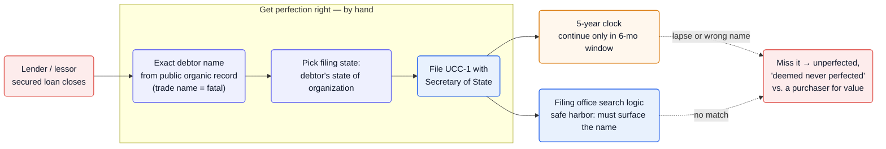
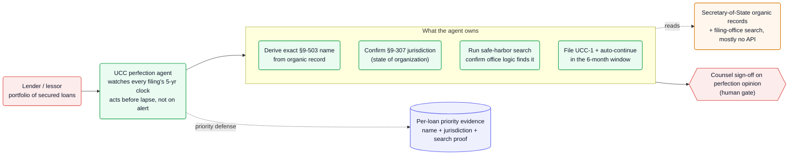

A secured lender's claim on collateral is only as good as a correctly filed UCC-1 financing statement — and Article 9 is unforgiving about "correctly." Use anything but the debtor's exact name from its public organic record and the filing is **"seriously misleading"** and ineffective ([UCC §9-506][u9506], [§9-503][u9503]); file in the wrong state, or let the five-year clock lapse without a continuation in the **narrow six-month window**, and the security interest is **"deemed never to have been perfected"** against a later purchaser ([UCC §9-515][u9515]). The stakes are concrete: a single mistaken filing once left **JPMorgan an unsecured creditor on a $1.5 billion loan** ([Hinshaw][hinshaw]). The agent opportunity is to own the exact-name → jurisdiction → file → monitor → continue loop across a lender's whole portfolio.

**Vitals:** market: millions of UCC filings/yr (CSC alone processes ~7M — [CSC][csc]) · `deadline-driven, recurring` · buyer: lenders / lessors / law firms · model: per-filing + monitoring subscription · whitespace: ★★

Market context — volume and where priority is won or lost

- **The volume is industrial.** Millions of UCC-1 financing statements are filed each year in the U.S. ([Crestmont][crest]); **CSC alone processes ~7 million UCCs annually, with ~3,000 of its 5,000 UCC customers being banks** ([CSC][csc]). Every secured loan, equipment lease, and floor-plan financing rides on one.
- **The downside is loss of the collateral itself.** Perfection determines priority in bankruptcy; an unperfected lender drops behind perfected creditors and the trustee. The GM/JPMorgan case — a mistaken UCC-3 termination that rendered a **$1.5B** term loan unsecured ([Hinshaw][hinshaw]) — is the canonical example, but defects routinely void smaller liens too (e.g. a bank that lost a **$7.6M** lien on an inadequate statement — [Lewis Rice][lewisrice]).
- **The buyer is self-evident and recurring.** Lenders, lessors, and the law firms that serve them carry standing portfolios of filings that each need continuing every five years — a permanent monitoring obligation, not a one-time task.

## The mess

- **The name has to be exact, or the lien silently fails.** For a registered organization the financing statement must use the name on its **public organic record**; a trade name is explicitly insufficient ([§9-503][u9503]). Get it wrong and the filing is "seriously misleading" and ineffective — *unless* the filing office's own **standard search logic** would still surface it under the correct name ([§9-506][u9506]). Perfection thus hinges on matching a search algorithm, not human judgment of "close enough."
- **Jurisdiction is a separate trap.** You must file where the debtor is "located" — for a registered organization, its **state of organization**; for a multi-office company, its chief executive office ([§9-307][u9307]). File in the wrong state and there is no perfection at all.
- **The five-year clock is retroactive when missed.** A financing statement is effective for five years; on lapse the interest becomes unperfected and is **"deemed never to have been perfected as against a purchaser of the collateral for value"** ([§9-515][u9515]) — the priority doesn't just stop, it's erased. Continuations can only be filed in a **six-month window** before expiration ([§9-515][u9515]).
- **It compounds across a portfolio.** One lender holds thousands of these, each with its own debtor, jurisdiction, and lapse date — and debtors change names, reincorporate, and merge, any of which can quietly break an existing filing.

## Why now

The rules have always been this exacting; what's new is that the judgment they require is now automatable. Deriving the exact §9-503 name means pulling a debtor's organic record from a Secretary of State; confirming §9-307 jurisdiction means reasoning about where an entity is organized; clearing the §9-506(c) safe harbor means running the search and confirming the office's logic surfaces the filing. That's a read-records-and-apply-rules problem an agent can now do continuously and portfolio-wide, rather than a paralegal doing it filing by filing.

This space is *not* greenfield — established lien-management platforms already automate filing and monitoring (see below). What they don't do is supply the legal judgment: they file the name you give them and alert you to a lapse, leaving a human to get the name right, pick the jurisdiction, read the search, and act on the alert. The opening is to close that judgment-and-action loop, which is exactly the part the GM/JPMorgan-class failures live in.

## The money

| Signal | Figure | Basis |
| --- | --- | --- |
| UCCs processed by one vendor (CSC) | **~7 million/yr** | CSC ([csc]) — VERIFIED |
| UCC-1s filed in the US | **millions/yr** | Crestmont ([crest]) — VERIFIED |
| Effective life of a filing | **5 years**, then lapse | §9-515 ([u9515]) — VERIFIED |
| Continuation window | only **6 months** pre-lapse | §9-515 ([u9515]) — VERIFIED |
| Cost of one defect (GM/JPMorgan) | **$1.5B** loan rendered unsecured | Hinshaw ([hinshaw]) — VERIFIED |
| Cost of a smaller defect | **$7.6M** lien lost | Lewis Rice ([lewisrice]) — VERIFIED |

:::caution[The model is per-filing + monitoring, not contingency]
There's no pot of recovered money to take a cut of — the value is insurance-like (priority preserved, collateral not lost). Willingness to pay is real but the natural model is per-filing fees plus a recurring monitoring/continuation subscription, the way incumbents already charge. The differentiation has to be accuracy and autonomy, not a novel billing model.
:::

## How it works today

A lender (or its counsel, or a filing-service vendor on instruction) gets the name and jurisdiction right by hand, files the UCC-1, and then has to remember to continue it within a six-month window five years later — across every loan in the book.

![UCC lien perfection today: when a secured loan closes, the lender or lessor must get perfection right by hand — determine the exact debtor name from the public organic record (a trade name is fatal), pick the correct filing state (the debtor's state of organization), and file a UCC-1 with the Secretary of State. The filing office's search logic provides a safe harbor only if a search under the correct name surfaces the filing. A five-year clock then runs, and a continuation can only be filed in a six-month window before lapse. Missing the deadline or using the wrong name leaves the interest unperfected and 'deemed never perfected' against a purchaser for value.](/diagrams/opportunities/ucc-lien-perfection-today.svg)

Mermaid source

## Where an agent fits

Own the judgment and the clock. The agent derives the exact §9-503 debtor name straight from the Secretary-of-State organic record, confirms the §9-307 filing jurisdiction, files the UCC-1, then runs the §9-506(c) safe-harbor search to verify the filing office's own logic surfaces it — and tracks every filing's five-year clock to auto-file the continuation inside the six-month window. Instead of alerting a human that a lapse is coming, it acts; instead of trusting a hand-typed name, it proves the match. Counsel keeps the gate where a perfection opinion is needed; the agent produces the per-loan evidence (name source, jurisdiction basis, search proof) that defends priority later.

This is the playbook in miniature: [an agent that acts on the deadline rather than waiting to be asked](/playbook/agent-assistant-to-actor/); [Article 9's name, jurisdiction, and timing rules encoded as a domain layer](/playbook/encoding-domain-rules/); and [reading Secretary-of-State organic records and filing-office search systems that mostly expose no clean API](/playbook/integrating-systems-without-apis/).

![UCC lien perfection with an agent: a lender or lessor with a portfolio of secured loans delegates to a UCC perfection agent that watches every filing's five-year clock and acts before lapse rather than on an alert. The agent owns deriving the exact section 9-503 debtor name from the organic record, confirming the section 9-307 jurisdiction (state of organization), running the safe-harbor search to confirm the filing office's logic finds it, and filing the UCC-1 plus auto-continuing within the six-month window — reading Secretary-of-State organic records and filing-office search systems that mostly have no API. Counsel signs off on the perfection opinion as the human gate, and the agent maintains per-loan priority evidence: name, jurisdiction, and search proof.](/diagrams/opportunities/ucc-lien-perfection-agent.svg)

Mermaid source

## Whitespace & incumbents

This is the most contested of the Wave-1 candidates — the category exists and has a heavyweight. The honest map:

- **Entrenched lien-management SaaS** — **Wolters Kluwer Lien Solutions (iLien / CT Lien Solutions)** is the 800-lb incumbent: "nationwide lien searches, intelligent automated filing, and lien management services through our award-winning SaaS platform," with "automated validation, jurisdiction-ready workflows," and monitoring that delivers "timely alerts on any changes to the status of your UCC filings" plus online UCC-3 continuations ([Wolters Kluwer][wk]). **CSC** processes ~7M UCCs a year and sells search "to avoid mistakes in filings and fines" ([CSC][csc]); **First Corporate Solutions** offers nationwide monitoring and is "the filing service for the lien" ([FCS][fcs]).
- **What they don't do** — these are powerful but *human-operated* tools. The lender's team still supplies the debtor name, decides the jurisdiction, interprets the search, and acts on the lapse alert. None auto-derives the exact §9-503 name from the organic record, confirms §9-307 jurisdiction, reads the §9-506(c) safe-harbor match, and *acts* rather than alerting.

:::caution[Whitespace is ★★, not ★★★ — demoted on the evidence]
The seed thesis assumed sleepy incumbents and a near-empty field. That's wrong: filing, monitoring, and auto-continuation are already productized by Wolters Kluwer and peers. The remaining AI-native wedge is narrow but real — the *judgment and autonomy* layer on top of (or inside) those workflows — and a credible entry likely partners with or rides the existing filing rails rather than rebuilding them.
:::

## Hard problems

| Problem | Why it's hard here | Signal | Likely approach (speculative) |
| --- | --- | --- | --- |
| Exact-name derivation | The legal name must match the organic record well enough that the filing office's *search logic* finds it; "close" silently fails | trade name insufficient ([u9503]); seriously-misleading + standard-search-logic safe harbor ([u9506]) | Probably auto-pull the organic record from the SoS, generate the §9-503 name, then *prove* it by running the office's search and confirming the hit before relying on the filing |
| Entity changes break filings | Debtor name changes, reincorporations, and mergers can render a once-good filing seriously misleading mid-term | §9-507/§9-508 turn on post-filing name changes; portfolio debtors mutate constantly | Likely continuous re-checking of each debtor's organic record against the filed name, flagging drift for an amendment |
| Incumbents already own the rails | Wolters Kluwer/CSC/FCS hold the filing integrations, customer base, and monitoring features | "award-winning SaaS," ~7M UCCs/yr ([wk], [csc]) | Probably integrate/partner rather than rebuild filing plumbing; differentiate on autonomous judgment, not on filing access |
| Liability for a missed lien | If the agent acts autonomously and a lien fails, the loss is the collateral itself | $1.5B ([hinshaw]); $7.6M ([lewisrice]) | Likely a counsel-in-the-loop gate for perfection opinions plus an auditable per-loan evidence trail to defend priority and allocate responsibility |

## Sources

- [UCC §9-503][u9503] · [§9-506][u9506] · [§9-515][u9515] · [§9-307][u9307] (Cornell LII) — debtor-name rule, seriously-misleading/safe-harbor, lapse + continuation, location/jurisdiction
- [Hinshaw & Culbertson][hinshaw] · [Lewis Rice][lewisrice] — what a single filing defect costs
- [CSC][csc] · [Crestmont][crest] — filing volume
- [Wolters Kluwer Lien Solutions][wk] · [First Corporate Solutions][fcs] — incumbent lien-management platforms

Reconstructed from public sources; claims are tier-labeled (VERIFIED / INFERRED / SPECULATIVE) — see [how to read the tiers](/opportunities/about/). Supporting quotes live in this repo's evidence map (`evidence/opp-ucc-lien-perfection-evidence-map.md`).

[u9503]: https://www.law.cornell.edu/ucc/9/9-503
[u9506]: https://www.law.cornell.edu/ucc/9/9-506
[u9515]: https://www.law.cornell.edu/ucc/9/9-515
[u9307]: https://www.law.cornell.edu/ucc/9/9-307
[hinshaw]: https://www.hinshawlaw.com/en/insights/lawyers-for-the-profession-alert/paralegals-mistake-costs-lender-jpmorgan-chase-a-dollar15-billion-security-interest-in-loan
[lewisrice]: https://www.lewisrice.com/publications/
[csc]: https://www.cscglobal.com/
[crest]: https://www.crestmontcapital.com/
[wk]: https://www.wolterskluwer.com/en/solutions/lien-solutions
[fcs]: https://ficoso.com/
