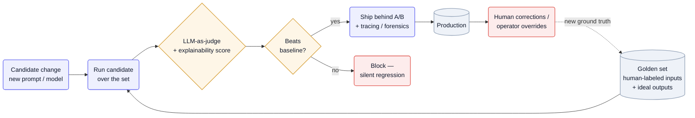

The same prompt run twice can return different text, so there's no fixed expected output a normal assertion can check — a `assertEquals` has nothing to equal. Yet a prompt tweak or model swap can quietly halve quality with no stack trace to catch it. Across the teardowns the answer is the same: replace the unit test with an **eval** — a scored run over a labeled dataset — and make it the rail that gates every change.

## Why it's hard

There's no ground truth to diff against, and "correct" is usually a graded judgement, not a boolean — often a subjective one, which means the grader itself is an LLM that needs calibrating. Regressions are silent: nothing throws when a change makes the agent 10% worse, so without a measured baseline you ship the regression and find out from users. And the failures hide *inside* long runs — an agent that takes thousands of steps over hours can be wrecked by one bad reasoning step, so a pass/fail on the final answer tells you nothing about *where* it broke. [Basis](/teardowns/basis/) names exactly this as its open frontier: "how do we attribute outcomes back to specific reasoning steps? how do we tune eval judges when the judgement includes subjectivity?"

## Patterns

**Golden sets graded by an LLM judge** — Curate a dataset of representative inputs with human-graded ideal outputs, then have an LLM score each new run against them; the score, not an exact match, is what passes or fails. The dataset grows from real production corrections, so the rail sharpens as the product runs. — [Traba](/teardowns/traba/), [Basis](/teardowns/basis/), [Rilla](/teardowns/rilla/), [Glean](/teardowns/glean/)

**Eval-as-code** — Version the prompt, the dataset, and the judge together and run them in CI like a build; a candidate that doesn't beat baseline doesn't merge. Traba tests "a single prompt template" against continuously-updated Langfuse datasets and ships changes "in minutes rather than hours" because the eval is automated, not a manual QA pass. — [Traba](/teardowns/traba/), [Basis](/teardowns/basis/)

**Gate on downstream lift, not raw accuracy** — Score on the metric the business actually cares about, since a golden-set number is only a proxy. Traba promotes a prompt change behind a measured **15% shift-completion lift**, not just judge accuracy. — [Traba](/teardowns/traba/)

**Explainability as a first-class eval metric** — Benchmark not just whether the answer is right but how clearly the agent can justify it, and gate go-live on explanation quality. Basis benchmarks models on "how clearly the model can explain its reasoning" and ships a workflow only when the model both performs and emits the lineage a CPA will sign off on; Glean has agents self-reflect on confidence before answering. — [Basis](/teardowns/basis/), [Glean](/teardowns/glean/)

**Agent-scored assertions over a learned baseline** — When the surface under test is itself non-deterministic, let an agent evaluate the assertion against multi-modal signals instead of string-matching, and cache the successful trajectory to replay. Momentic's `assert`/`assertVisually` are agent-evaluated, and its intent-based cache (95%+ hit rate) re-resolves only when the *intent* changes, not the DOM — turning a flaky target into a stable pass/fail. — [Momentic](/teardowns/momentic/)

## Tools & popular choices

| Decision | Common choice | Notes |
| --- | --- | --- |
| Eval / dataset platform | **Langfuse** and **Braintrust** | Confirmed at [Traba](/teardowns/traba/) and [Basis](/teardowns/basis/) — store human-annotated datasets, run scored evals, version prompts. The de-facto pair for applied-AI eval. |
| The grader | LLM-as-judge over a golden set | The consensus mechanism. The judge is itself non-deterministic, so it needs tuning and human-agreement checks when the judgement is subjective. |
| What gates a release | An internal benchmark suite re-run per model candidate | [Basis](/teardowns/basis/) scores every model candidate against its own suite before promotion; the suite is the release gate, not a calendar date. |
| Online signal | A/B + production tracing (OpenTelemetry) | Offline eval can't see distribution shift; [Glean](/teardowns/glean/) measures relevance online (+24%) and keeps tracing, dashboards, and production forensics as the second rail. |
| Capturing ground truth | Human corrections / operator overrides, versioned as datasets | Traba's operator final-check and Basis's CPA sign-off both become next-run ground truth — see [Graduating an agent from assistant to actor](/playbook/agent-assistant-to-actor/). |

## Reference architecture

Eval is a loop, not a gate you pass once. A candidate change — a new prompt or model — runs over a **golden set** of human-labeled inputs; an LLM judge scores the output (often including an explainability score), and a comparison against baseline decides whether the change ships or is blocked as a regression. Shipped changes go out behind an online A/B with production tracing, because the offline set can't see every real-world input. Production then feeds the loop back: human corrections and operator overrides become new ground truth that grows the golden set, so the rail gets stronger every cycle.

Mermaid source

## Best practices

- **Build the golden set before you tune the model.** Eval quality is capped by dataset quality; capture corrections and overrides from day one so the set exists when you need to gate the first change.
- **Version evals like code.** Prompt + dataset + judge under source control, run in CI. A candidate that doesn't beat baseline doesn't merge — that's what lets Traba ship in minutes instead of holding a manual QA pass.
- **Calibrate the judge.** An LLM grader is itself non-deterministic; measure its agreement with human labels and re-tune it, especially where the judgement is subjective — don't treat the judge's score as truth.
- **Gate on the downstream metric, not the proxy.** Golden-set accuracy is a proxy for value; where you can, gate on the business outcome (Traba's shift-completion lift) so you don't optimize the number while the product gets worse.
- **Keep an online rail.** Offline eval can't see distribution shift, so pair it with A/B and production tracing — the regressions the golden set missed surface there first.

## Seen in

- [Traba](/teardowns/traba/) — a single templated prompt tested against continuously-updated Langfuse datasets, shipped in minutes and gated on a measured 15% shift-completion lift.
- [Basis](/teardowns/basis/) — an internal benchmark suite re-run on every model candidate; explainability is a scored gate, and trajectory-level credit assignment across hours-long runs is the named open frontier.
- [Glean](/teardowns/glean/) — relevance measured online (+24%), agents self-reflect on confidence, and OpenTelemetry tracing carries production forensics as the second rail.
- [Rilla](/teardowns/rilla/) — treats eval frameworks as production infrastructure rather than a QA org; eval is how a small team gates prompt and model changes on a probabilistic coaching product.
- [Momentic](/teardowns/momentic/) — agent-scored assertions and intent-based replay make a non-deterministic UI pass or fail reliably; the test product itself is the pattern made into a tool.
