A system design interview is, mostly, **applied distributed systems** — the deep-dive questions live here. This page holds the conceptual core that doesn't fit the [Study List](/system-design/study-list/)'s one-liners: why distribution is hard, the consistency spectrum, consensus, time, replication, and coordination under failure. The concrete systems elsewhere in this section ([Postgres](/system-design/postgres-internals/), [Kafka](/system-design/kafka/), [Kubernetes](/system-design/kubernetes/)) are these ideas made real.

## Why "distributed" is hard

Three truths separate a distributed system from a program on one machine — every hard part traces back to them:

- **Partial failure.** A node, disk, or network link can fail *independently* while the rest runs on. You can't tell "crashed" from "slow" from "unreachable" — a timeout is ambiguous. Most of the machinery below exists to cope with this ambiguity.
- **No global clock.** Wall clocks on different machines drift and skew, so "which event happened first" has no free answer. Ordering must be *constructed*, not read off a clock.
- **Concurrency across machines.** Independent actors mutate shared state at once, with no shared memory or lock to lean on. Coordination costs round-trips.

## CAP & PACELC

**CAP**: under a network **partition**, you must choose **Consistency** *or* **Availability** — you can't keep both, and partition tolerance isn't optional in a distributed system. (See [CAP in the Study List](/system-design/study-list/#data--storage).) The catch most people miss: CAP only speaks to the *partition* case. **PACELC** completes it — *if Partitioned, choose A or C; **E**lse (normal operation), choose **L**atency or **C**onsistency.* Even with no failure, stronger consistency costs round-trips. That latency-vs-consistency dial is the *real*, everyday trade; CAP is just its failure-mode corner.

## Consistency models

"Consistency" isn't binary — it's a spectrum from a single global real-time order down to "the replicas agree eventually." Stronger is easier to reason about but needs coordination (latency, lower availability); weaker is cheap and available but pushes the hard thinking onto you.

```mermaid
flowchart LR
  classDef strong fill:#eef0fe,stroke:#6366f1,stroke-width:1.5px,color:#0f172a;
  classDef mid fill:#eef2f8,stroke:#94a3b8,stroke-width:1.5px,color:#0f172a;
  classDef weak fill:#e7f5ec,stroke:#3f9c5a,stroke-width:1.5px,color:#0f172a;
  classDef note fill:#fef6e7,stroke:#d9a441,stroke-width:1.5px,color:#0f172a;
  CostL{{"more coordination<br/>higher latency · CP under partition"}}:::note
  Lin["Linearizable<br/>one real-time global order"]:::strong
  Seq["Sequential<br/>one global order, not real-time"]:::strong
  Caus["Causal<br/>cause precedes effect;<br/>concurrent ops may differ"]:::mid
  Eve["Eventual<br/>replicas converge, given time"]:::weak
  CostR{{"highly available<br/>cheaper · AP under partition"}}:::note
  CostL -.- Lin
  Lin -->|weaker| Seq -->|weaker| Caus -->|weaker| Eve
  Eve -.- CostR
```

Mermaid source

- **Linearizable** — every operation appears to happen instantly at a single point between its call and return; reads always see the latest committed write. The strongest, and what consensus buys you. (etcd, ZooKeeper, a single-leader DB read from the leader.)
- **Sequential** — all nodes agree on *one* order of operations, but it needn't match real time. Weaker than linearizable, no real-time guarantee.
- **Causal** — operations that are causally related (cause → effect) are seen in order everywhere; *concurrent* operations may be seen in different orders. Often the sweet spot: preserves "the reply appears after the message" without global coordination.
- **Eventual** — replicas converge to the same value *given time*; reads may be stale in between. Cheapest and most available (Dynamo-style stores, DNS, CDNs). (See [eventual consistency](/system-design/study-list/#data--storage).)

**Session guarantees** sit *inside* eventual and are what make it usable: **read-your-writes** (you see your own updates), **monotonic reads** (you never see time go backwards), **monotonic writes**. They're cheap to provide (sticky routing, version tokens) and fix the most jarring eventual-consistency surprises.

## Consensus

How a set of nodes **agree on one value** (or one ordered log of values) despite failures and message loss. **Paxos/Multi-Paxos** is the original (correct, famously hard to implement — Chubby, Spanner); **Raft** won on understandability (explicit leader election + a replicated log — etcd, Consul, CockroachDB, TiKV); **Zab** is ZooKeeper's atomic-broadcast variant; **Viewstamped Replication** is an older cousin of Raft. The recipe is always a **quorum** — a majority must agree — so the cluster survives a minority failing.

You rarely implement consensus; you *recognize where it already runs*:

- **etcd / ZooKeeper** — consensus-backed coordination stores (the control plane of [Kubernetes](/system-design/kubernetes/#architecture) leans on etcd).
- **Kafka KRaft** — a Raft quorum for cluster metadata and controller election ([Kafka](/system-design/kafka/#kraft-no-more-zookeeper)).
- **Postgres HA** — Patroni uses a consensus store (etcd/Consul) to elect a single primary and avoid split-brain ([Postgres](/system-design/postgres-internals/#scaling-postgres)).

Consensus is the expensive tool — use it for the *one* thing that must be globally agreed (who's leader, the commit order), not for every write.

## Membership & gossip

The other coordination family. When nodes only need an *eventually-consistent* view of who's alive and who owns what — not strict agreement — **gossip** beats consensus: each node periodically swaps state with a few random peers, information spreads epidemically, and there's no coordinator and no quorum, so it scales to thousands of nodes where Raft would choke.

- **SWIM** — the dominant modern membership protocol (Scalable Weakly-consistent Infection-style Membership); separates failure detection from membership dissemination. Powers HashiCorp's `memberlist` (Serf, Consul).
- **Cassandra / DynamoDB gossip** — spreads node membership, token ranges, and schema versions; Cassandra pairs it with a [phi-accrual detector](#coordination--failure). [Redis Cluster](/system-design/core-concepts/#sharding)'s bus is the same family — pure gossip even for slot ownership, with lightweight failover voting instead of full Raft, trading strict consistency for availability and speed.

**The split in practice:** large systems run *both* — gossip for membership and failure detection (cheap, scalable, eventual), consensus for the few things that must be agreed exactly (leader, config, slot/range ownership), because running Raft across thousands of nodes doesn't scale but gossiping liveness does. Rule of thumb: **gossip when approximate/eventual membership is fine; consensus when everyone must agree on exactly one answer.**

## Time & ordering

Since wall clocks lie, ordering is built logically:

- **Lamport clocks** — a per-node counter that gives a total order consistent with **happens-before**; if A → B then `clock(A) < clock(B)` (but not the converse — equal-ish counters don't imply causality).
- **Vector clocks** — a vector of per-node counters that can actually *detect concurrency* (tell "A caused B" from "A and B are concurrent") — the basis for conflict detection in leaderless stores.
- **Hybrid logical clocks (HLC)** — combine a physical timestamp with a logical counter, so ordering is causal *and* close to real time. Used by Spanner-style and CockroachDB-style systems (Spanner's TrueTime bounds clock error with GPS/atomic clocks instead).

## Replication & partitioning

The two axes of scaling state — and where consistency choices bite:

- **Replication** — copies for durability and read-scaling. **Single-leader** (writes to one node, simplest, the Postgres default) → **multi-leader** (writes anywhere, conflict resolution required) → **leaderless** (Dynamo-style: write/read [quorums](/system-design/study-list/#data--storage), `R + W > N`). The more leaders, the more available — and the more conflicts you must merge.
- **Partitioning (sharding)** — split the keyspace across nodes so no one node holds it all. Key choice decides hot spots; **[consistent hashing](/system-design/study-list/#data--storage)** keeps rebalancing cheap when nodes come and go.

## Coordination & failure

- **Failure detection** — heartbeats with timeouts; **phi-accrual** detectors output a *suspicion level* instead of a binary up/down, tuning to network conditions. Remember: you're detecting "unresponsive," never truly "dead."
- **Split-brain & fencing** — after a partition heals, two nodes may both think they're leader. **Fencing tokens** (a monotonically increasing number checked by downstream resources) stop a stale leader from doing damage. Consensus-based leader election is the prevention.
- **Idempotency & retries** — because timeouts are ambiguous, clients retry, so operations must be **[idempotent](/system-design/study-list/#async--messaging)** (an idempotency key) or you double-apply.
- **CRDTs** — Conflict-free Replicated Data Types merge concurrent updates *deterministically* with no coordination (counters, sets, sequences), so multi-leader/offline edits converge without conflict resolution — the engine under collaborative editing.

## Building fluency

Fluency here comes from **building, breaking, and then explaining** — not from reading. Run one drill at a time on a real (if small) system, and pair each with the write-up. The code lives in a companion repo, [aillusions/distributed-systems](https://github.com/aillusions/distributed-systems); these notes are the explanation half. The plan, grouped by what each kind teaches:

**Build it — internalize the mechanism**

1. **Raft from scratch (Go)** — election, log replication, then kill nodes and watch it recover. Nothing crystallizes [consensus](#consensus) like debugging your own split-brain.
2. **A replicated KV store** — leader/follower with a WAL, then add failover. A mini-Aurora; you feel every consistency choice as a line of code.
3. **[MIT 6.824 / 6.5840](https://pdos.csail.mit.edu/6.824/) labs** — graded, test-hardened versions of the above with brutal failure-injection tests already written for you. Do the labs; the lectures are optional.

**Break it — meet partial failure for real**

4. **Chaos drills on your own staging stack** — one scenario a day: kill the primary, fill a disk, PITR restore, partition the network with `iptables`. Failure stops being theoretical.
5. **Break Postgres replication by hand** — stand up streaming replication on 2–3 boxes with *no operator*, then induce lag, drop WAL segments, promote the wrong node, and repair. (Pairs with [Scaling Postgres](/system-design/postgres-internals/#scaling-postgres).)
6. **Operate a real cluster and break it** — run CockroachDB / Cassandra / etcd as a multi-node cluster, then kill nodes and watch quorum loss, re-election, and rebalancing — [consensus](#consensus) and [quorum](/system-design/study-list/#data--storage) behavior without building it yourself.
7. **Reproduce a famous outage** — take a Cloudflare/AWS/GitHub postmortem and recreate the failure mode in miniature. The best ones teach a failure you'd never have imagined.

**Verify it — prove the guarantees (the dimension build-and-break misses)**

8. **[Jepsen](https://jepsen.io/)-style consistency testing** — partition a datastore (yours or a real one) under load and check the history with a linearizability/serializability checker (Elle, Knossos). This is how you find out whether a system's *claimed* consistency actually holds — the gap between the docs and reality.
9. **Model-check a protocol with [TLA+](https://learntla.com/)** — spec a commit protocol, a lock, or your Raft in TLA+/PlusCal and let TLC find the interleaving you'd never hit by hand. Verifies the *design* before you write code. (Deterministic simulation testing — à la FoundationDB/TigerBeetle — is the runtime cousin: a simulated clock + network that makes failures reproducible.)

**Explain it — the multiplier**

10. **Teach-back writing** — after every drill, write the explanation you couldn't give fluently before. Publishing forces precision, and the gaps you hit while writing are your next drill.

---

These are working notes — the conceptual spine, with the concrete realizations on the [Postgres](/system-design/postgres-internals/), [Kafka](/system-design/kafka/), and [Kubernetes](/system-design/kubernetes/) pages and the one-liner terms in the [Study List](/system-design/study-list/#data--storage). The throughline: every mechanism here is a way to cope with partial failure and the absence of a global clock.
