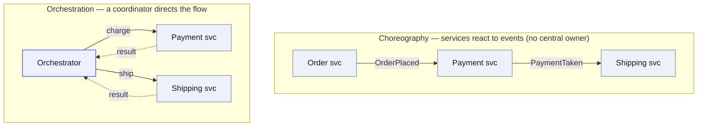

The layer *above* the transports ([Kafka](/system-design/kafka/), [queues](/system-design/queues/), [Temporal](/system-design/temporal/)): how services actually talk. In **event-driven architecture (EDA)** — the standard name for this — services communicate by **asynchronous messages** instead of direct synchronous calls, which buys loose coupling, isolation, and resilience (a slow or dead consumer doesn't take the producer down).

The messages are mostly **events** — facts like `OrderPlaced` — which is where the name comes from, but the same pipes also carry **commands** (instructions like `ChargeCard`):

- **Event** — announces a fact; the producer doesn't know or care who reacts. Maximally decoupled.
- **Command** — directs a specific handler to do something.

Same messages on the wire; the difference is [intent](/system-design/terminology/#async--messaging). (The Reactive Manifesto calls the underlying async-messaging foundation "message-driven" — a less-common synonym you'll occasionally see.)

## Choreography vs orchestration

The big structural fork — *who owns the multi-step flow?*

Mermaid source

- **Choreography** — each service reacts to others' events; no central controller. Maximally decoupled and easy to extend (add a consumer without touching anyone), but the end-to-end flow is **emergent** — nobody owns it, and "what happened across the whole order?" is reconstructed from event soup. Great for simple, loosely-related reactions.
- **Orchestration** — a coordinator issues commands, collects results, and owns the state. The flow is **explicit and visible**, failure/compensation is centralized — at the cost of a component that knows about the others. This is where an [orchestrator](/system-design/temporal/) (Temporal) earns its place; the [queue request-reply trap](/system-design/queues/#returning-a-result-and-why-it-gets-brittle) is what pushes you here.

Rule of thumb: **choreography for a few independent reactions; orchestration once you must track the state of a process.**

**Where Temporal fits:** it doesn't replace EDA — it's an abstraction layer *over* it. At runtime [Temporal](/system-design/temporal/) compiles ordinary sequential code into a durable, event-driven state machine: every completed step is appended to an event history, and state is rebuilt by replaying that log. So you write the flow as straight-line code, but get orchestration's payoff — the workflow state is **centralized and observable** instead of reconstructed from event soup, while async events can still trigger steps. The resilience that choreography makes you hand-roll — retries, timeouts, dead-letter queues, state durability — the engine owns. Reach for it when a flow spans time and must be tracked end-to-end (a payment saga, a long-running agent task), not for a couple of fire-and-forget reactions.

## EDA patterns

Common shapes once you're event-driven:

- **Event notification** — a thin "X happened, go look" ping; the consumer calls back for details. Lowest coupling, but chatty.
- **Event-carried state transfer** — the event carries the data the consumer needs, so it doesn't call back. Decoupled and fast, at the cost of duplicated/denormalized data.
- **[Event sourcing](/system-design/terminology/#distributed-transactions--consistency)** — the event log *is* the source of truth; state is a fold over events. Full audit + replay, harder to query.
- **[CQRS](/system-design/terminology/#distributed-transactions--consistency)** — split the write model from read models kept in sync via events; often paired with event sourcing.

## In an interview: what to name (and why)

Interviewers grade the *justification*, not the brand — lead with the requirement, then the pick. "I need fan-out to many independent consumers with replay, so Kafka" scores; "Kafka because it's popular" doesn't. The menu by role:

| Role | Default pick | Alternatives | Reach for it when |
| --- | --- | --- | --- |
| Event log / streaming backbone | **[Kafka](/system-design/kafka/)** | Kinesis (AWS-native), Pulsar (tiered storage, multi-tenant), Redpanda (Kafka-API, lower latency) | replay, multiple independent consumers, high throughput, event sourcing |
| Task / work queue | **[SQS](/system-design/queues/)** (managed) / RabbitMQ | — | point-to-point, competing consumers, "do this job once," decoupled offload |
| Async background jobs | SQS + workers | Celery + Redis/RabbitMQ (Python), Sidekiq (Ruby) | email, image processing, anything off the request path |
| Workflow orchestration | **[Temporal](/system-design/temporal/)** | AWS Step Functions | durable multi-step flows with retries, compensation, sagas |
| Pub/sub fan-out | SNS (AWS) | Kafka topics, Redis Pub/Sub (ephemeral), Google Pub/Sub | notify many subscribers of one event |

The 90% answer for a generic design: **Kafka for the event backbone, SQS/RabbitMQ for task queues, and call out the [outbox pattern](/system-design/terminology/#async--messaging) for reliable publishing.** Then bend it to the problem: replay/multiple consumers → Kafka; simple decoupled jobs → SQS; long stateful flows → Temporal/Step Functions.

Patterns worth name-dropping (they signal you've shipped this):

- **Outbox** — write the event to a DB table in the same transaction as the state change, relay it out-of-band; closes the dual-write gap between DB commit and publish.
- **CDC / Debezium** — capture DB changes as a stream instead of dual-writing at all.
- **Dead-letter queue** — where poison messages go after N failed retries, so one bad message doesn't wedge the consumer.
- **[Event sourcing + CQRS](/system-design/terminology/#distributed-transactions--consistency)** — when the domain genuinely wants an audit log and split read/write models; don't reach for it by default.

## The tradeoffs

Message-/event-driven isn't free — know what you're buying:

- **Wins:** loose coupling, independent scaling and deployment, resilience (absorb bursts, survive a down consumer), and easy extension (new consumers attach without touching producers).
- **Costs:** **eventual consistency** (no synchronous "it's done"), much harder **debugging and observability** (a request's path is spread across services and time — lean on [tracing](/system-design/otel/)), ordering and duplicate handling ([idempotency](/system-design/terminology/#async--messaging)), and — in pure choreography — **no single owner** of the flow.

Reach for it when components must scale and fail independently and reactions are many/unknown. Keep a plain synchronous call when you need an immediate answer and the coupling is fine.

---

These are working notes — the architecture that composes the messaging transports. The throughline: async messages decouple services; *events* let many react, *commands* direct one, and the choreography-vs-orchestration choice decides **who owns the flow**. Transports on the [Kafka](/system-design/kafka/), [Queues](/system-design/queues/), and [Temporal](/system-design/temporal/) pages; vocabulary in the [Terminology](/system-design/terminology/#async--messaging).
