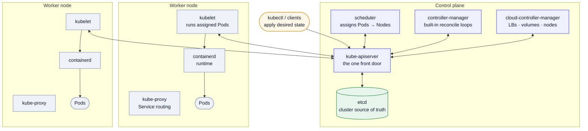
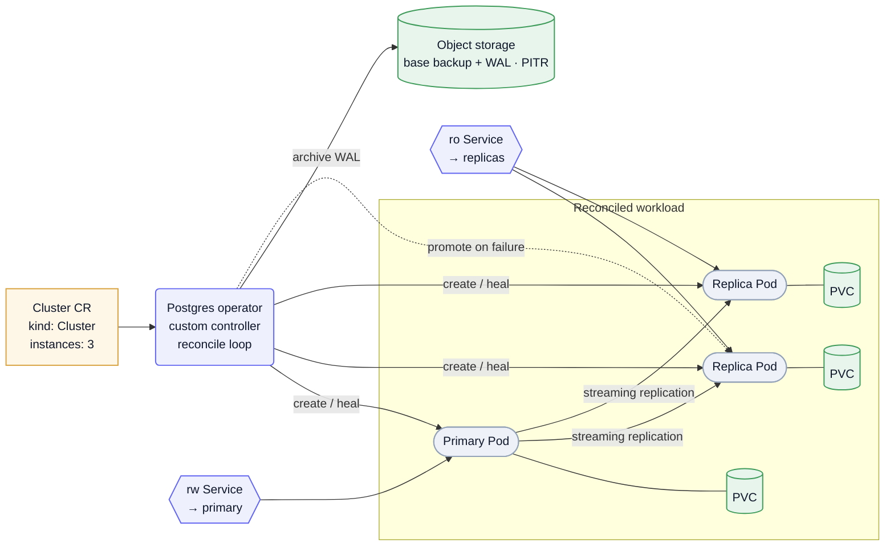

Container **orchestration** is the problem of running many containers across many machines without hand-placing them: scheduling, healing, scaling, networking, rollout. **Kubernetes (K8s)** is the de-facto answer, and its one big idea is **declarative reconciliation** — you describe the *desired* state, and control loops continuously drive *actual* state toward it. Everything below is a consequence of that idea. The page ends on a worked architecture: a Postgres cluster managed by an Operator, which ties straight back to the [Postgres Internals](/system-design/postgres-internals/) page (replication, WAL/PITR) and the DBaaS-shaped drills in the [Study List](/system-design/study-list/#advanced--infra-deep-dives).

## The core idea: reconciliation loops

You don't tell Kubernetes *how* to do things; you declare *what* you want (a YAML manifest), and a **controller** makes it so. Each controller runs a loop:

> **observe** actual state → **diff** against desired (`spec`) → **act** to converge → record `status` → repeat.

Two properties matter:

- **Declarative, not imperative** — "I want 3 replicas," not "start a container." If one dies, the loop notices the diff (2 ≠ 3) and creates a replacement. Self-healing is just reconciliation.
- **Level-triggered, not edge-triggered** — the loop re-reads the *whole* current state every time rather than reacting to individual events, so a missed or duplicated event can't corrupt it. It's eventually consistent by design.

This is the same control-loop pattern as a thermostat, and it's the mental model for *everything* in K8s — including the Operators you write yourself.

## Architecture

A cluster splits into a **control plane** (the brain — decides what should run) and **worker nodes** (the muscle — actually run containers). Every component talks *only* to the API server; nothing talks directly to anything else.


| Component | Plane | Role |
| --- | --- | --- |
| **kube-apiserver** | control | The single front door — validates every request, the only thing that reads/writes etcd. All other components are clients of it. |
| **etcd** | control | Consistent, replicated key-value store; the cluster's **source of truth**. (Raft-based — this is your CP store.) |
| **scheduler** | control | Watches for unassigned Pods and binds each to a Node by resources, affinity, taints. |
| **controller-manager** | control | Runs the built-in reconcile loops (Deployment, ReplicaSet, Node, Job…). |
| **cloud-controller-manager** | control | Bridges to the cloud provider — provisions load balancers, volumes, node lifecycle. |
| **kubelet** | node | Per-node agent; ensures the containers in its assigned PodSpecs are running and healthy. |
| **kube-proxy** | node | Programs node networking so a Service's virtual IP load-balances to its Pods. |
| **container runtime** | node | `containerd`/CRI-O — actually pulls images and runs containers. |

Note the design: a **declarative API server backed by a consistent store, with stateless reconcilers as clients.** That's a clean system-design pattern in its own right — control plane / data plane separation, single source of truth, level-triggered convergence.

<details>
<summary>Mermaid source</summary>



</details>

## The objects you'll actually name

The nouns the reconcilers manage. The hierarchy is the useful part: a Deployment owns ReplicaSets which own Pods.

| Object | What it is |
| --- | --- |
| **Pod** | Smallest deployable unit — one or more co-located containers sharing network/storage. Treated as cattle, not pets. |
| **ReplicaSet** | Keeps *N* identical Pods running. Rarely managed directly. |
| **Deployment** | Manages ReplicaSets to give **rolling updates** + rollback for stateless apps. |
| **StatefulSet** | Like a Deployment but with **stable identity + stable storage** per Pod (`pg-0`, `pg-1`…) — what databases need. |
| **DaemonSet** | One Pod per node (log shippers, agents). |
| **Job / CronJob** | Run-to-completion / scheduled work. |
| **Service** | Stable virtual IP + DNS name load-balancing to a set of Pods (Pods are ephemeral; Services are not). |
| **Ingress** | HTTP(S) routing from outside the cluster to Services. |
| **ConfigMap / Secret** | Externalized config and credentials. |
| **PersistentVolume / PVC** | Durable storage decoupled from any Pod's lifetime. |
| **Namespace** | A scope for isolating and grouping resources. |

## Extending the API: CRDs & Operators

Kubernetes lets you add your *own* object types and your own reconcilers — that's how you teach the cluster to run a thing it didn't ship with.

- **CRD (CustomResourceDefinition)** — registers a new `kind` (e.g. `PostgresCluster`) with the API server. From then on it's a first-class API object: stored in etcd, gettable with `kubectl get postgrescluster`, RBAC-controlled — just no behavior yet.
- **Custom controller** — a reconcile loop *you* write that watches your custom resources and makes reality match them.
- **Operator** = CRD + custom controller that encodes **operational domain knowledge**. Instead of a human running the runbook ("primary died → promote a replica → repoint the service"), the controller does it. The Operator pattern turns "how to operate X" into code.

**kubebuilder / controller-runtime** are the Go toolchain for this. `controller-runtime` gives you a **Manager** (wires up shared caches/clients), **informers/watches** that feed a work queue, and a `Reconciler` interface — you implement one method:

```go
// Called per object key; K8s handles the watching, queueing, and retries.
func (r *Reconciler) Reconcile(ctx context.Context, req ctrl.Request) (ctrl.Result, error) {
    // 1. fetch the desired state (the custom resource)
    // 2. fetch actual state (the Pods/Services/PVCs it owns)
    // 3. create/update/delete to converge
    // 4. update .status
    return ctrl.Result{RequeueAfter: time.Minute}, nil // re-check later (level-triggered)
}
```

`kubebuilder` scaffolds the project, the CRD types, and the RBAC. You write the diff-and-converge logic; everything else (caching, leader election, requeue with backoff) is the framework's.

## Worked architecture: Postgres on Kubernetes

Stateful workloads are the hard case for orchestration — identity and storage must be stable, and failover is domain-specific. This is exactly what a database **Operator** (e.g. CloudNativePG, Zalando's postgres-operator) exists for. You declare a small custom resource…

```yaml
kind: Cluster
spec:
  instances: 3          # 1 primary + 2 replicas
  storage: { size: 100Gi }
  backup: { target: s3://…, wal: true }   # continuous WAL archiving → PITR
```

…and the operator reconciles it into the full topology below — and keeps reconciling it, which is what makes failover and rolling upgrades automatic rather than a 3am runbook.


What the operator owns, mapped to the DBaaS drills:

- **Topology** — a primary + replica Pods (each with its own PVC), streaming-replicated. Stable identity comes from a StatefulSet.
- **Services** — a read-write Service pointing at the primary, a read-only Service spread across replicas. Clients use the stable names; Pods churn underneath.
- **Automated failover** — if the primary's health checks fail, the controller **promotes a replica** and repoints the rw Service. (Leader election, split-brain avoidance, RTO/RPO — the [HA drill](/system-design/study-list/#advanced--infra-deep-dives).)
- **Backup + PITR** — base backups plus continuous **[WAL](/system-design/postgres-internals/#wal-write-ahead-log) archiving** to object storage, enabling point-in-time recovery.
- **Zero-downtime upgrades** — the operator does rolling minor-version changes: upgrade replicas, switch over, upgrade the old primary.

This is a managed-database control plane in miniature — the same control-plane/data-plane split as RDS, just built on K8s primitives.

<details>
<summary>Mermaid source</summary>



</details>

## Is Kubernetes the right base for a cloud product?

Worth knowing because it's a live debate — and the operator example above is exactly where it bites. A managed cloud product *is itself a control plane*, so building it on Kubernetes means **stacking control planes**: your operator reconciles your CRD into K8s objects, K8s reconciles those into containers on nodes, and the cloud's own control plane schedules those nodes onto hardware. Critics call this **wrapping a wrapper** — each layer is a general-purpose, leaky abstraction you must operate, debug, and pay for, even though you run *one* known workload that doesn't need K8s's generality (arbitrary scheduling, the CNI/CSI plugin matrix, the cluster-upgrade treadmill). Their pitch: orchestrate VMs (or microVMs) **directly**, with automation built for your single workload — fewer layers, tighter control of networking/storage/placement, and failure modes that belong to *your* product rather than to Kubernetes.

The counter is plain build-vs-buy. K8s hands you a hardened reconciliation engine, self-healing, rollouts, and a whole ecosystem (operators, CSI storage, service mesh) you'd otherwise reinvent — plus multi-cloud portability. For a team that can't afford to build and run its own control plane, that's a decade of solved problems for free, and the operator pattern maps cleanly onto "encode our ops knowledge." The trade is **generality-overhead vs. build-it-yourself cost**, and it splits real companies:

| Built **on** Kubernetes | Deliberately **not** K8s — VMs / own orchestrator |
| --- | --- |
| Confluent Cloud (Kafka) | AWS — its own services run on EC2 + decades of homegrown automation |
| ClickHouse Cloud (pods + object storage) | MongoDB Atlas — VMs + a homegrown automation agent across clouds |
| …and many newer data/infra clouds | Snowflake — VM-based compute clusters, own architecture |
| | Fly.io — Firecracker microVMs, own orchestrator (famously, loudly anti-K8s) |
| | Railway — built their own orchestrator |
| | Oxide — own stack down to the hardware |

Two names sit on the seam: **Supabase** ships official K8s **Helm charts** for self-hosting (its managed platform leans on dedicated per-project instances), and **Temporal** ships a Helm chart and is commonly run on K8s by its users — both *support* K8s without it being the whole story of their hosted product.

Rule of thumb: if orchestration *is* your product's hard part and you have the engineers, rolling your own wins control (Fly, Railway, Oxide); if orchestration is incidental and you want to ship a managed service fast, K8s buys you the most. It's the same build-vs-bolt-on call as the [Postgres extensions](/system-design/postgres-internals/#extensions-worth-knowing) trade-off, one layer down.

---

These are from-zero working notes — a map and a mental model, not a substitute for the [Kubernetes docs](https://kubernetes.io/docs/concepts/) or the [kubebuilder book](https://book.kubebuilder.io/). The reconciliation/control-loop pattern is the one thing worth internalizing; the rest follows from it.
