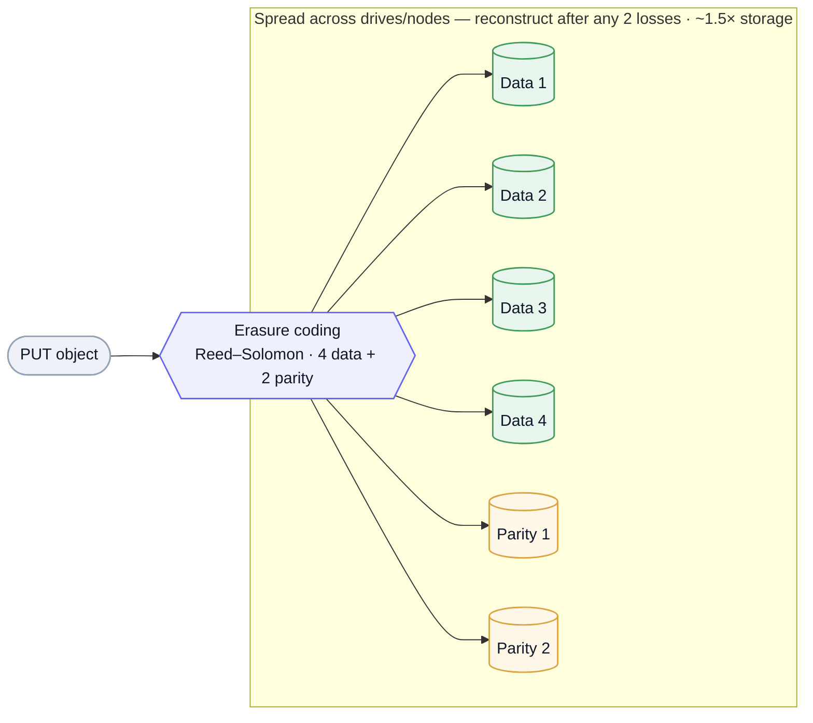

Object storage is the **blob layer** of almost every system — images, video, backups, logs, data-lake files, [WAL](/system-design/postgres-internals/#wal-write-ahead-log) archives for [PITR](/system-design/postgres-internals/#wal-write-ahead-log). The reference is **Amazon S3** (its API is the de-facto standard); **MinIO** is the open-source, S3-compatible implementation you can self-host, read, and break — so it's the vehicle here for *how object storage is actually built*. It completes the data-store shelf: relational ([Postgres](/system-design/postgres-internals/)) · wide-column ([Cassandra](/system-design/cassandra/)) · columnar ([ClickHouse](/system-design/clickhouse/)) · **object (this)**.

## The object model — not a filesystem

An object store is a **flat namespace** of immutable **objects**: a key, the bytes, and metadata, grouped into **buckets**. That's the whole model, and the differences from a filesystem are the point:

- **No real hierarchy.** The `/` in `2026/06/report.pdf` is just part of the key; there are no directories to traverse. A "list with prefix" fakes folders. This flatness is *why* it scales to trillions of objects — there's no directory tree to lock or rebalance.
- **Immutable, whole-object writes.** You `PUT` or `GET` an entire object (or a byte range); there's **no in-place edit** of a stored object. Updating means replacing. This is what lets the store be append-and-replace simple and massively parallel.
- **Rich metadata + cheap.** Each object carries metadata; storage is the cheapest tier per byte, optimized for **throughput and durability**, not low-latency small reads.

## The API & access patterns

- **Core verbs** — `PUT` / `GET` / `DELETE` / `LIST` (with prefix + pagination). Simple HTTP.
- **Multipart upload** — large objects are uploaded in parts (parallel, resumable) and assembled server-side; the standard way to move multi-GB blobs.
- **[Presigned URLs](/system-design/study-list/#data--storage)** — a time-limited signed URL lets a client upload/download *directly* to the store, keeping big files off your app servers (the upload/download path most designs reach for). Pair with a **CDN** for read fan-out.

The system-design move: **store the blob in the object store, keep only the key (+ metadata) in your database.** Never stream large files through your app tier.

## How it scales & survives failure

This is where MinIO earns its place as a teaching vehicle — the durability trick is **erasure coding**, not plain replication:

Mermaid source

- **Erasure coding (Reed–Solomon)** — split each object into *K* data shards + *M* parity shards spread across drives/nodes; any *K* of the *K+M* can reconstruct it. A `4+2` scheme survives **2** simultaneous losses at **~1.5×** storage overhead — versus **3×** for triple replication for similar durability. That storage efficiency at scale is the whole reason erasure coding wins for cold/large data.
- **Sharding + healing** — objects distribute across nodes; on a drive/node failure the store **heals** by rebuilding lost shards from the survivors. (A great [torture-lab](https://github.com/aillusions/distributed-systems) drill: run a MinIO cluster, kill a node, watch it heal.)
- **Tiering & lifecycle** — hot → cold → archive tiers, with lifecycle rules to expire or down-tier objects automatically.

## Consistency

Modern S3 gives **strong read-after-write consistency** for new objects (a `GET` right after a `PUT` returns the latest) — historically it was eventual, and many S3-compatible stores still are, so it's worth confirming per system. Listing can still lag. There are **no multi-object transactions**: each object operation is independent.

## When to use — and not

**Use it for:** large blobs (images, video, documents), backups and archives, data-lake / analytics files, static assets behind a CDN, and anything write-once-read-many at scale.

**Avoid it for:** small, low-latency, frequently-mutated records (a [database](/system-design/postgres-internals/) or [KV](/system-design/cassandra/) store fits); anything needing partial in-place updates or transactions; or as a general filesystem (no efficient rename/append, listing is not free).

---

These are working notes — object storage as the blob point on the data-store shelf, with S3 as the API reference and MinIO as the open implementation that shows the internals (erasure coding, healing). The throughline: a flat namespace of immutable objects, made durable by erasure coding rather than replication — cheap, throughput-oriented, and the wrong place for small mutable records.
