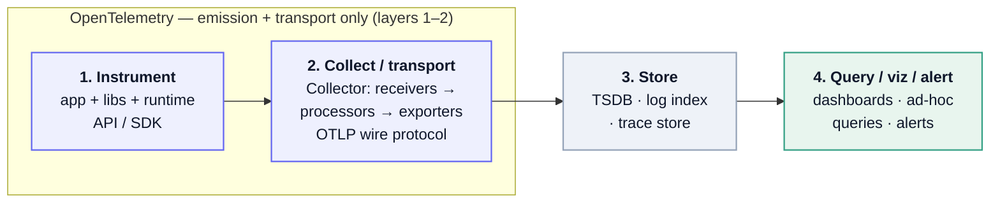

## The telemetry pipeline

Same four layers for all three signals:


<details>
<summary>Mermaid source</summary>



</details>

1. **Instrument** — code emits telemetry (your app + libraries + runtime).
2. **Collect / transport** — shipped and processed *in flight*: batched, filtered, enriched, sampled.
3. **Store** — a backend persists it: TSDB for metrics, search index or object store for logs, a trace store for traces.
4. **Query / viz / alert** — dashboards, ad-hoc queries, alerts.

In the canonical stack: **Collector = transport, Prometheus = storage (+ its own scrape-collection), Grafana = pure query/viz (stores nothing — it queries data sources).**

## What OpenTelemetry actually is

**OTel is layers 1–2, and nothing else** — not a backend, not storage, not a UI. It's the OpenTracing + OpenCensus merger. Four parts:

- **API / SDK** per language — instrument code.
- **OTLP** — the wire protocol.
- **Collector** — a pipeline binary structured as **receivers → processors → exporters**.
- **Semantic conventions** — standardized attribute names (`http.request.method`, `service.name`).

The whole pitch is **vendor-neutral emission**: instrument once, then point at Jaeger / Datadog / Tempo / whatever without touching app code.

**Signals:** traces, metrics, logs — plus **profiling** as the official **fourth** signal (newest; OTLP profiles support is still relatively recent and less mature than the other three).

**The Collector is signal-agnostic.** `receiver → processor → exporter` is one architecture; you wire **separate pipelines per signal** (`traces:`, `metrics:`, `logs:`, `profiles:`) under `service.pipelines` — same binary, same shape, just different data flowing through.

**Emission path.** The SDK exports **OTLP (gRPC/HTTP)** to a Collector endpoint — but:

- The Collector is **optional** — the SDK can export straight to a backend (Jaeger, Datadog, …).
- When used, the common shape is **two tiers**: an **agent** Collector local to the app (same host / sidecar / daemonset) that the app talks to → a central **gateway** Collector it forwards to. So "the app contacts the Collector" usually means the local agent, not the central one.

**Why a Collector** (vs SDK → backend direct):

- **Decoupling** — app exports to one local endpoint; swap/add/fan-out backends via Collector config, no app redeploy.
- **Batch / buffer / retry** — Collector owns the queue and backend-down retries instead of burning app memory.
- **Processing** — filter noisy spans, drop/redact PII, **tail-based sampling** (needs the whole trace — impossible in one app instance), enrich (k8s/host metadata).
- **Translation** — receive OTLP, also scrape Prometheus / tail log files; export whatever each backend speaks. App only emits OTLP.
- **Offload** — keeps instrumentation overhead out of the app process.

*Local/dev: usually skip it* — only worth running to mirror prod topology or for multi-backend fan-out.

**Storage:** none by default — **in-memory only** (receive → process → batch in RAM → export). Crash = in-flight data lost (an optional file-backed persistent queue can guard against this).

**One event ≠ one network call.** The SDK **batches** in-process (BatchSpanProcessor + metric/log equivalents) and flushes one OTLP request per batch on a size or timer trigger (~5s); metrics export on an interval (~60s). One-to-one only with a simple/sync processor — dev-only, kills throughput in prod.

### App side — Node SDK end to end

The whole app contract in one file: configure a `resource` (who am I), wire one exporter per signal at one endpoint (the local Collector), `start()`, then emit a span / counter / log. Batching, periodic metric export, and graceful flush-on-shutdown are all here.

<details open>
<summary>Node SDK example — traces + metrics + logs → Collector</summary>

```ts
import { NodeSDK } from '@opentelemetry/sdk-node';
import { resourceFromAttributes } from '@opentelemetry/resources';
import { ATTR_SERVICE_NAME } from '@opentelemetry/semantic-conventions';

// gRPC exporters (port 4317). Alternative: swap each `-grpc` for `-http`
// (port 4318) — same API, just HTTP/protobuf transport.
import { OTLPTraceExporter } from '@opentelemetry/exporter-trace-otlp-grpc';
import { OTLPMetricExporter } from '@opentelemetry/exporter-metrics-otlp-grpc';
import { OTLPLogExporter } from '@opentelemetry/exporter-logs-otlp-grpc';

import { PeriodicExportingMetricReader } from '@opentelemetry/sdk-metrics';
import { BatchLogRecordProcessor } from '@opentelemetry/sdk-logs';
import { trace, metrics } from '@opentelemetry/api';
import { logs } from '@opentelemetry/api-logs';

// One endpoint = the local Collector. Alternative: point straight at a
// backend (Tempo/Datadog/etc.) and skip the Collector entirely.
const ENDPOINT = 'http://localhost:4317';

const sdk = new NodeSDK({
  // Identifies the emitting service to the backend. Add more attrs here
  // (deployment.environment, service.version) for richer filtering.
  resource: resourceFromAttributes({
    [ATTR_SERVICE_NAME]: 'my-app',
  }),

  // TRACES — batched by default (BatchSpanProcessor under the hood).
  traceExporter: new OTLPTraceExporter({ url: ENDPOINT }),

  // METRICS — periodic export. Tune the interval to taste.
  metricReader: new PeriodicExportingMetricReader({
    exporter: new OTLPMetricExporter({ url: ENDPOINT }),
    exportIntervalMillis: 60000,
    // Alternative: add `views: [...]` here to override histogram buckets.
  }),

  // LOGS — batched. Alternative: SimpleLogRecordProcessor (dev only,
  // one-call-per-record, kills throughput in prod).
  logRecordProcessors: [
    new BatchLogRecordProcessor(new OTLPLogExporter({ url: ENDPOINT })),
  ],
});

sdk.start();

// Graceful shutdown — flushes the final batch before exit. Without this a
// short run loses its last interval of data.
process.on('SIGTERM', async () => {
  await sdk.shutdown();
});

// --- emit ---

// TRACE
const tracer = trace.getTracer('my-app');
tracer.startActiveSpan('handleRequest', (span) => {
  // Semantic-convention attribute name — standardized key.
  span.setAttribute('http.request.method', 'GET');
  span.end();
});

// METRIC (push: Counter). Alternatives: createHistogram (latency) or
// createObservableGauge (pull/callback, e.g. event-loop utilization).
const meter = metrics.getMeter('my-app');
const counter = meter.createCounter('requests.count');
counter.add(1, { route: '/checkout' });

// LOG
logs.getLogger('my-app').emit({
  severityText: 'INFO',
  body: 'order placed',
  attributes: { 'order.id': 123 },
});
```

</details>

**Why only three signals here:** profiling has **no stable OTel JS SDK** — no `NodeSDK` knob or `exporter-profiling-*` to drop in like the other three. For profiling in Node today you go *outside* this pipeline (Pyroscope/Grafana's own SDK or a vendor agent).

## Monitoring vs observability

- **Monitoring** — predefined dashboards + alerts for failure modes you *predicted* → **known-unknowns**.
- **Observability** — ask *new* questions of a running system without shipping code → **unknown-unknowns**. Term borrowed from control theory: a system is observable if you can infer internal state from its outputs.

## Logs

- **Structured vs unstructured** is the dividing line. `log.info("user 123 failed")` vs `{"event":"login_failed","user_id":123,"trace_id":"…"}`. Structured (JSON) is the modern default — queryable without regex archaeology.
- **`trace_id` in every log line** is the bridge to tracing: jump from "error in logs" to the full distributed trace of that request. *The single highest-value habit in this whole topic.*
- **Cost is the dominant constraint** — logs are the most expensive signal at volume (full-text indexing). Drives sampling and cheaper-backend choices.
- OTel has a **logs signal** but it's the least mature of the three — usually you *bridge* existing loggers into it rather than emit natively.

| Tool | Note |
| --- | --- |
| **CloudWatch Logs** | AWS-integrated, low-effort, expensive, weak ad-hoc query |
| **ELK / Elastic** | Elasticsearch + Logstash + Kibana; full-text index, powerful, costly |
| **OpenSearch** | AWS fork of Elastic post license-change (Dashboards = Kibana fork) |
| **Grafana Loki** | "Prometheus for logs" — indexes only labels, chunks in object storage, **LogQL**; cheap (no full-text index) |
| **Splunk** | enterprise heavyweight; **Datadog Logs / Sumo Logic / Graylog** adjacent |
| *Forwarders* | **Fluent Bit** (lightweight C, k8s-daemonset default), **Fluentd** (older Ruby), **Logstash**, **Vector** (Datadog's Rust pipeline) — distinct from backends; the OTel Collector also handles logs |

## Metrics

**Metric types** — the "quantitative/time measurements" made precise:

- **Prometheus model:** *counter* (monotonic, resets on restart), *gauge* (up/down), *histogram* (pre-defined buckets → `_bucket` / `_sum` / `_count`; quantiles computed server-side via `histogram_quantile`), *summary* (client-computed quantiles — **cannot aggregate across instances**).
- **OTel model:** seven instruments, maps onto Prometheus but not identical. Three **synchronous/push** (you call `.add()` / `.record()` inline) + a sync Gauge, and three **asynchronous/observable/pull** (register a callback, SDK runs it at export):
  - **Counter** — push, monotonic (only up); e.g. requests served.
  - **UpDownCounter** — push, non-monotonic; e.g. active connections, queue size.
  - **Histogram** — push, value distribution → percentiles; e.g. request latency.
  - **Gauge** — push, current-value snapshot at a point in code (sync, newer).
  - **ObservableCounter** — pull, monotonic via callback; e.g. cumulative CPU time.
  - **ObservableUpDownCounter** — pull, non-monotonic via callback; e.g. memory usage.
  - **ObservableGauge** — pull, snapshot via callback; e.g. event-loop utilization.

**Push vs pull** (SDK-internal collection timing — distinct from the Collector→backend network leg):

- **Push** (sync instruments) — *your code* decides when: call `.add()`/`.record()` at the moment the event happens. Use for counting discrete events as they occur.
- **Pull** (observable instruments) — *the SDK* decides when: it invokes your callback on each export tick and reads the current value; nothing fires at event time. Use for sampling a current state on a schedule (CPU, memory, ELU).

The concepts that actually trip people:

- **Cardinality is *the* constraint.** One time series = one unique combo of metric name + label values. Put `user_id` / `request_id` in a label → millions of series → TSDB blows up. **Rule: metrics = low-cardinality aggregates; high cardinality belongs in traces/logs.** (Cleanest dividing line for *which signal to reach for*.)
- **Pull vs push.** Prometheus is **pull** — scrapes targets' `/metrics` endpoints on an interval via service discovery. Short-lived/batch jobs that die before a scrape use the **Pushgateway** (overused — an anti-pattern). The OTel Collector is **push** (OTLP in, remote-write out). Hybrid is common: SDK → Collector → Prometheus remote-write, *or* Prometheus scrapes the Collector.
- **Percentile gotcha:** you can't average percentiles, and can't aggregate summary quantiles across instances. Histograms exist for exactly this — aggregate the buckets, *then* compute the quantile.
- **PromQL** = query language; **TSDB** = storage engine. Local TSDB doesn't scale horizontally or retain long-term → add **Thanos**, **Grafana Mimir** (Cortex successor), or **VictoriaMetrics**.
- **OTel↔Prom friction:** *temporality.* OTel can emit *delta* metrics; Prometheus is *cumulative* — delta→Prom needs conversion. Real papercut.

CW vs this world: CloudWatch is push, integrated, low-effort — but expensive, weak at ad-hoc query and cardinality. Prometheus/Grafana is more powerful and cheaper to run, but you operate it.

## Tracing

- A **trace** is a tree/DAG of **spans** for one request's path across services. One **root span**; child spans per operation, each with start/end, **attributes** (tags), **events**, **status**, **links**.
- **Context propagation** is what makes it *distributed*: the trace context (trace ID + parent span ID) crosses service boundaries, normally via HTTP headers. Standard = **W3C Trace Context** (`traceparent`, `tracestate`); older = **B3** (from Zipkin).
- **Instrumentation:** *auto* (OTel hooks common libraries with zero code) vs *manual* (you wrap your own logic in spans).
- **Sampling** — can't keep every trace at scale, and *where* you decide matters:
  - **Head-based** — decide at trace start, propagate the decision. Cheap, but may drop exactly the slow/error traces you wanted.
  - **Tail-based** — the Collector buffers all spans of a trace and decides *after* completion (keep all errors, anything >1s). Keeps the interesting traces, but needs memory **and forces all spans of a trace to the same collector instance** — a load-balancing constraint.

| Tool | Note |
| --- | --- |
| **Jaeger** | CNCF, default OSS choice; stores in Cassandra / ES / Badger |
| **Zipkin** | the original (Twitter) |
| **Grafana Tempo** | object-storage-backed, cheap (barely indexes — find by ID or correlation); **TraceQL** |
| **Honeycomb** | columnar, high-cardinality, built for unknown-unknowns |
| **AWS X-Ray / Datadog APM** | managed/commercial |

## Correlation — the real product

The "three pillars" framing's value isn't three silos, it's **correlation**:

- **`trace_id` in logs** (logs → trace) and **exemplars** — attach a trace ID to a specific metric sample, so you click a latency spike in a Grafana histogram and jump to an example trace that caused it (metrics → trace). This glue *is* the product.
- Reach-for-which-signal follows cardinality: aggregates → metrics; one request's path → traces; detailed events → logs.

## What to measure

| Framework | Measures | Scope | Origin |
| --- | --- | --- | --- |
| **RED** | **R**ate, **E**rrors, **D**uration | per service (request-driven) | Tom Wilkie |
| **USE** | **U**tilization, **S**aturation, **E**rrors | per resource (CPU, disk, queue) | Brendan Gregg |
| **Four Golden Signals** | Latency, Traffic, Errors, Saturation | per service | Google SRE |

## SLI / SLO / SLA + error budgets

- **SLI** — the measurement (% requests < 200 ms).
- **SLO** — the target (99.9%).
- **SLA** — the contract with penalties (external).
- **Error budget = 1 − SLO** — governs release velocity: burn it slowly → ship; budget exhausted → freeze and stabilize. Pure Google SRE.

## Emerging signals

- **Continuous profiling** — CPU/memory flame graphs in prod; OTel's official fourth signal (above). Tools: **Grafana Pyroscope**, **Parca**.
- **eBPF** — zero-code auto-instrumentation by hooking the kernel instead of editing app code: **Grafana Beyla**, **Pixie**.

## The OSS anchor — LGTM

The clean OTel-native counterpart to the CloudWatch / Datadog / Elastic worlds:

**L**oki (logs) · **G**rafana (viz) · **T**empo (traces) · **M**imir (metrics) — all fed by **OTel / OTLP**.
