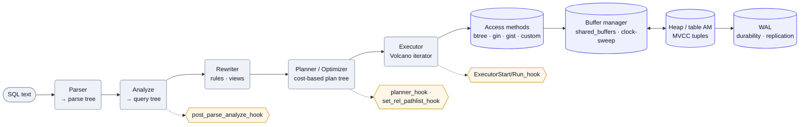

Not "I use Postgres" — *how Postgres works inside.* The query lifecycle and the hooks that let you intercept it, the access-method API that lets you add an index type, MVCC and tuple visibility, the WAL, and the buffer manager. This is the layer that explains the things you reason about in a design deep dive — why replication and CDC work the way they do ([WAL](/system-design/study-list/#data--storage)), what an isolation level actually *is* (MVCC snapshots), and why `shared_buffers` behaves like a cache. The page ends with a hands-on track: write a toy extension and a from-scratch search index in [pgrx](https://github.com/pgcentralfoundation/pgrx).

## Query lifecycle & hooks

A statement flows through fixed stages, each a tree transformation. Postgres exposes **C function-pointer hooks** at most stages — set them in a shared-preloaded library's `_PG_init()`, and you can observe or rewrite what the engine does without patching core. This is how `pg_stat_statements`, `auto_explain`, and `pg_hint_plan` work.


| Stage | What it does | Hook(s) |
| --- | --- | --- |
| Parser | SQL text → raw parse tree (syntax only) | — |
| Analyze | Parse tree → query tree; resolve names/types | `post_parse_analyze_hook` |
| Rewriter | Apply rules and expand views | — |
| Planner / Optimizer | Query tree → cost-based **plan tree**: access paths, join order, join methods | `planner_hook`, `set_rel_pathlist_hook`, `set_join_pathlist_hook`, `get_relation_info_hook` |
| Executor | Run the plan tree — **Volcano/iterator** model (each node: `init` → `next`* → `end`) | `ExecutorStart/Run/Finish/End_hook` |
| Utility (DDL) | Non-plannable commands (`CREATE`, `VACUUM`, …) | `ProcessUtility_hook` |

The planner is **cost-based**: it enumerates candidate paths (seq scan vs. index scan vs. bitmap scan; nested-loop vs. hash vs. merge join), estimates each with statistics from `pg_statistic` (via `ANALYZE`), and picks the cheapest. `EXPLAIN` prints the chosen plan tree; `EXPLAIN ANALYZE` runs it and shows estimate-vs-actual — the first place to look when the planner picks wrong.

<details>
<summary>Mermaid source</summary>



</details>

## Access methods

How Postgres stays extensible at the storage layer: the engine talks to indexes and tables through **access-method APIs** (structs of function pointers), so new index types and storage engines plug in behind the same interface.

- **Index access methods** (`IndexAmRoutine`) — the built-ins are **btree, hash, GiST, SP-GiST, GIN, BRIN**. An index AM implements `ambuild`, `aminsert`, `ambeginscan`, `amgettuple`/`amgetbitmap`, `amrescan`, `amcostestimate`, and friends. You register one with `CREATE ACCESS METHOD … TYPE INDEX HANDLER …` — this is the seam through which extensions like `pgvector` (HNSW/IVFFlat) and `rum` add entirely new index types.
- **Operator classes / families** — an AM is generic; an **opclass** binds it to a data type by supplying the strategy operators and support functions (e.g. btree needs a comparator). This is why one btree serves `int`, `text`, and your custom type alike.
- **Table access methods** (`TableAmRoutine`, since PG12) — pluggable *storage*. `heap` is the default; the API is what makes columnar (Citus `columnar`, Hydra) and alternative MVCC layouts (zheap) possible without forking.

## MVCC (multi-version concurrency control)

Postgres never updates a row in place for readers — it keeps **multiple versions** so readers never block writers and vice versa. Every tuple header carries `xmin` (inserting transaction id), `xmax` (deleting/updating xid), and `ctid` (pointer to the next version).

- **Visibility** — a tuple is visible to a transaction if its `xmin` committed before the transaction's **snapshot** and its `xmax` hasn't committed (or is null). Commit status lives in `pg_xact` (clog); **hint bits** cache it on the tuple to avoid repeat lookups.
- **Updates make new tuples** — an `UPDATE` writes a new version and sets the old tuple's `xmax`; the old version survives until no snapshot can still see it. This is why high-churn tables **bloat**.
- **HOT (heap-only tuple)** — if no indexed column changed and the new version fits on the same page, Postgres chains it on the page and skips new index entries — a major write optimization.
- **VACUUM** — reclaims dead tuples and updates the visibility map and statistics; **autovacuum** runs it automatically. **Freezing** rewrites very old xids to a sentinel so the 32-bit xid counter can't **wrap around** (`relfrozenxid`) — the failure mode behind "must vacuum to prevent wraparound" outages.
- **Isolation = snapshot timing** — *Read Committed* takes a fresh snapshot per statement; *Repeatable Read* takes one per transaction; *Serializable* adds **SSI** (predicate locking to detect dangerous read/write skew). The [write-skew](/system-design/study-list/#storage-internals-deeper-shelf) anomaly is exactly what SSI catches and Repeatable Read does not.

## WAL (write-ahead log)

The durability and replication backbone: **every change is written to the WAL before the data page is flushed.** On crash, Postgres replays WAL from the last checkpoint to recover.

- **LSN** (log sequence number) — a monotonic byte offset into the WAL; the unit of "how far has replay/replication gotten."
- **Checkpoints** flush all dirty buffers to disk and record a redo point, bounding crash-recovery time and letting old WAL be recycled. `full_page_writes` protects against torn pages by logging the whole page on first touch after a checkpoint.
- **Physical replication** ships raw WAL to standbys (streaming replication, `pg_basebackup`). **Logical replication / decoding** reads WAL and reconstructs *row-level* changes (`pgoutput`, `wal2json`) — this is the engine behind Postgres-based **[CDC](/system-design/study-list/#data--storage)** into Kafka/Debezium.
- **PITR (point-in-time recovery)** — the same WAL stream is what lets you restore to *any moment*, not just the last backup. Take a **base backup** (`pg_basebackup`) and continuously **archive WAL** (`archive_command` → object storage); to recover, restore the base backup and replay archived WAL up to a chosen `recovery_target_time`. So your RPO is "how recent is the last archived WAL segment," and PITR turns "oops, a bad migration at 14:32" into a restore to 14:31 — the capability the [DBaaS backup drill](/system-design/study-list/#advanced--infra-deep-dives) and the [Postgres operator](/system-design/kubernetes/#worked-architecture-postgres-on-kubernetes) automate.

## Buffer manager

Postgres caches 8 KB pages in a shared-memory array (`shared_buffers`) and mediates all heap/index access through it.

- **Buffer tag** — `(relation, fork, block#)` identifies a page; a hash table maps tags to buffer slots.
- **Eviction** — **clock-sweep** (an approximate LRU): each buffer has a `usage_count` decremented on each sweep; the first unpinned, zero-count buffer is evicted. **Pinning** (a refcount) protects a buffer in active use.
- **Dirty pages** are written by the **background writer** and the **checkpointer**, not by the query that dirtied them (WAL already guarantees durability).
- **Double caching** — pages also sit in the OS page cache, so `shared_buffers` is typically sized to ~25% of RAM rather than "as big as possible." **Ring buffers** keep bulk ops (seq scans, `VACUUM`, `COPY`) from evicting the whole working set.

## Scaling Postgres

A single Postgres instance goes *very* far — so the order of moves matters more than the menu. Climb this ladder; don't jump to sharding because it sounds impressive.

| Rung | Move | Buys you | Cost |
| --- | --- | --- | --- |
| 1 | **Scale up** (bigger box, tuned config) | Most workloads, with zero architecture change | Hits a ceiling; one failure domain |
| 2 | **Connection pooling** | Survive many clients — Postgres is **process-per-connection**, so 10k app connections will OOM it | A pooler to run (PgBouncer) |
| 3 | **Read replicas** | Read scaling + a failover target | Replication lag; reads can be stale |
| 4 | **Partitioning** | Big tables stay fast on *one* node | Schema work; partition-key choice |
| 5 | **Sharding** | Write scaling beyond one node | Big jump in complexity; cross-shard queries hurt |


**Connection pooling.** Each connection is a backend *process* with real memory overhead, so a few hundred is plenty and thousands will tip the box over. A pooler — **PgBouncer** (transaction-mode is the sweet spot) — multiplexes many client connections onto a small pool of server connections. This is usually the *first* scaling problem you hit, before any of the data-distribution moves below.

**Replication & read replicas.** Physical **streaming replication** ships the [WAL](#wal-write-ahead-log) to standbys that replay it, giving read-scaling replicas and a failover target. The catch is **replication lag**: async replication means a replica can serve slightly stale data, so a read right after a write may not see it (the **read-your-writes** problem) — route those reads to the primary, or use synchronous replication for the rows that can't be stale (at a write-latency cost). A pooler/proxy like **pgcat** or app-level logic does the read/write split. **Logical** replication (decoding the WAL into row changes) is the other flavor — selective, cross-version, and the basis of [CDC](/system-design/study-list/#data--storage).

**Partitioning (one node, big table).** Declarative partitioning splits one logical table into child partitions by **range** (time-series: a partition per month), **list**, or **hash**. The planner does **partition pruning** — skipping partitions a query can't match — and old partitions drop in O(1) (`DROP` the December table) instead of a slow bulk `DELETE`. It's a single-instance technique: it keeps a huge table's indexes and `VACUUM` manageable, but doesn't add machines.

**Sharding (many nodes).** Postgres has **no native sharding** — spreading writes across instances takes one of: **[Citus](https://github.com/citusdata/citus)** (an extension: a coordinator distributes tables across worker nodes by a shard key and routes/aggregates queries), **`postgres_fdw`** foreign tables stitched together, or **application-level** routing. The shard-key choice is the whole game (co-locate what you join; avoid cross-shard fan-out), and it's the rung with by far the steepest complexity jump — which is why you exhaust 1–4 first.

**HA & automatic failover.** Replicas only help availability if promotion is automatic. **Patroni** (with etcd/Consul for leader election) or **repmgr** handle failover for self-managed clusters; on Kubernetes an [operator](/system-design/kubernetes/#worked-architecture-postgres-on-kubernetes) does it. The hard parts are the usual distributed-systems ones: avoiding split-brain (two primaries) and meeting **RTO/RPO** targets.

## Hands-on: pgrx

[pgrx](https://github.com/pgcentralfoundation/pgrx) is a Rust framework for building Postgres extensions — it handles the C ABI, `PG_FUNCTION_INFO_V1` boilerplate, memory contexts, and gives you `cargo pgrx run` to compile-install-and-`psql` against a throwaway instance.

**1 — A toy extension.** Scaffold and ship a SQL-callable function:

```rust
use pgrx::prelude::*;
pgrx::pg_module_magic!();

#[pg_extern]
fn tokenize(text: &str) -> Vec<String> {
    text.to_lowercase()
        .split(|c: char| !c.is_alphanumeric())
        .filter(|t| !t.is_empty())
        .map(|t| t.to_string())
        .collect()
}
```

```sh
cargo pgrx new search_demo && cd search_demo
cargo pgrx run            # builds, installs, opens psql
# in psql:  CREATE EXTENSION search_demo;  SELECT tokenize('Hello, Postgres!');
```

**2 — A from-scratch search index.** Build the simplest thing that *is* a search index — an **inverted index** as a table — before reaching for a real access method:

```sql
-- postings: term -> document, populated by tokenize()
CREATE TABLE postings (term text, doc_id bigint);
CREATE INDEX ON postings (term);

-- index a document
INSERT INTO postings
SELECT t, $1 FROM unnest(tokenize($2)) AS t;   -- (doc_id, body)

-- query: docs containing all query terms (AND)
SELECT doc_id FROM postings WHERE term = ANY(tokenize('postgres internals'))
GROUP BY doc_id HAVING count(DISTINCT term) = 2;
```

That already demonstrates tokenization → postings → boolean retrieval. **The graduation step** — and the reason this lives on an *internals* page — is to stop storing postings in a heap table and instead implement a real **index access method** (`IndexAmRoutine`) in pgrx, so `WHERE body @@ 'query'` is served by your own `amgettuple`. That's the same seam `pgvector` uses; building a minimal one is the most direct way to understand how GIN's posting lists actually work.

## Extensions worth knowing

The same machinery above — access methods, hooks, background workers, WAL — is what lets extensions add capabilities that used to mean standing up a *separate* system. Two that fold whole categories of infrastructure back into Postgres:

- **[ParadeDB](https://github.com/paradedb/paradedb)** — Elastic-quality **full-text search and analytics** as a Postgres extension. Its `pg_search` ships a real **BM25 index access method** (built on the Tantivy search library), so ranked relevance search runs *inside* Postgres on your live tables — no Elasticsearch to provision, sync, and keep consistent. It's the production answer to the from-scratch inverted index above: the same `IndexAmRoutine` seam, done properly.
- **[pgvector](https://github.com/pgvector/pgvector)** — **vector similarity search** for embeddings, as an extension. Adds a `vector` column type and **HNSW / IVFFlat index access methods** (the AMs the page opened with), so nearest-neighbour queries (`ORDER BY embedding <-> $1 LIMIT k`) run inside Postgres. It's why RAG and semantic-search systems often need no dedicated vector DB — the embeddings live beside the rows they describe.
- **[pg_durable](https://github.com/microsoft/pg_durable)** (Microsoft) — **durable execution inside Postgres**: workflows that survive restarts and are auditable in SQL, living right next to the data they touch. It puts the [durable-execution](/system-design/study-list/#async--messaging) pattern (the Temporal idea) *in the database* — a fit for runbooks that must be crash-safe, or data/AI pipelines that need durable, resumable work per row, document, or batch.

The pattern to take away: **"just use Postgres" stretches further than people expect** — search, analytics, queues, vectors, and durable workflows are increasingly extensions, not separate services. Fewer moving parts, one consistency model, one backup. The system-design trade-off is the usual one (a single store is simpler but scales as one unit); knowing the extension exists changes the build-vs-bolt-on decision.

**One catch — managed Postgres.** "Bolt on an extension" assumes you control the instance. On a managed DBaaS (RDS/Aurora) you only get the provider's **allowlist** — `pgvector` yes; Citus, ParadeDB, and `pg_durable` no — plus whatever you can express in *trusted languages* via TLE (logic, not C access methods). See below.

## Managed Postgres on AWS (RDS & Aurora)

Because you have **no superuser and no filesystem** on a managed instance, RDS and Aurora only run extensions from **AWS's curated allowlist** — broad, but fixed. Anything needing custom C that AWS hasn't packaged simply can't be installed.

**See what's available / installed:**

```sql
SELECT name, default_version, installed_version
FROM pg_available_extensions ORDER BY name;
```

**Most extensions — just create them** (no preload needed):

```sql
CREATE EXTENSION IF NOT EXISTS vector;   -- pgvector
```

**Extensions that need preloading** (`pg_stat_statements`, `pg_cron`, …):

1. In the DB's **parameter group**, add the library to `shared_preload_libraries` (comma-separated).
2. **Reboot** the instance — `shared_preload_libraries` is a static parameter.
3. `CREATE EXTENSION pg_stat_statements;`

**Roughly what's on the allowlist:** `pgvector`, PostGIS, `pg_stat_statements`, `pg_trgm`, `pgcrypto`, `hstore`, `uuid-ossp`, `postgres_fdw`, `pg_cron`, `pg_partman`, PL/v8, and `pg_tle`. **Not** available: Citus, ParadeDB / `pg_search`, `pg_durable`, TimescaleDB — anything that needs C AWS doesn't ship. (Always confirm against `pg_available_extensions` for your engine version — the list grows.)

**Bring your own, the trusted way (TLE).** [Trusted Language Extensions](https://github.com/aws/pg_tle) let you install extensions AWS hasn't packaged — but only in **trusted languages** (SQL, PL/pgSQL, PL/v8, PL/Perl), never C:

1. Add `pg_tle` to `shared_preload_libraries` (parameter group) → reboot → `CREATE EXTENSION pg_tle;`.
2. Register your extension, then create it like any other:

```sql
SELECT pgtle.install_extension(
  'my_ext', '1.0', 'what it does',
  $_pg_tle_$
    CREATE FUNCTION my_ext_hello() RETURNS text LANGUAGE sql
    AS $$ SELECT 'hi from TLE'::text $$;
  $_pg_tle_$
);
CREATE EXTENSION my_ext;
```

TLE buys you custom functions, aggregates, triggers, and a few auth hooks (e.g. password-check) — **not** new index access methods, background workers, or anything that does I/O. So the table-as-inverted-index from the hands-on section is expressible in TLE/PL/v8; a real `IndexAmRoutine` (or pgvector/ParadeDB) is not — that lives in C, which is exactly what a managed engine won't run.

---

These are working notes — a map of the subsystems and a starting path, not a substitute for the [Postgres docs](https://www.postgresql.org/docs/current/internals.html) or the source. See also the [Study List](/system-design/study-list/) for the WAL/MVCC/buffer-manager terms in one-liner form.
