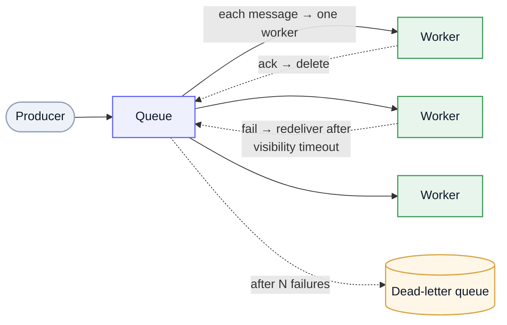

A message queue is a durable buffer that hands each message to **one** worker and **deletes it on success**. That one sentence is the whole difference from a [log](/system-design/kafka/): a queue is *deliver-then-forget*, built for **tasks** — units of work to run once, retry on failure, and scale across workers. It's the counterpart to the Kafka page; reach for it when the message is a **command** ("do this"), not an event for many to observe (see [event vs task](/system-design/kafka/#event-vs-task--kafka-vs-a-queue)).

## The model: competing consumers

Many workers read the *same* queue, but each message goes to exactly **one** of them — so adding workers scales throughput. The lifecycle of a message is the part worth knowing:

Mermaid source

- **Ack-and-delete** — a worker pulls a message, processes it, and **acknowledges**; only then is it removed. No ack → it comes back.
- **Visibility timeout** — while a worker holds a message it's hidden from others; if the worker dies or doesn't ack in time, the message **reappears** and another worker retries. This is what makes a queue survive worker crashes — and why processing must be **[idempotent](/system-design/study-list/#async--messaging)** (at-least-once delivery means retries can double-fire).
- **Dead-letter queue (DLQ)** — after *N* failed deliveries, the message is shunted to a DLQ instead of poisoning the queue forever — inspect and replay later.
- **Knobs queues give you (and a log doesn't):** per-message **retry/backoff**, **priority**, **delay/TTL**, selective ack. These are exactly what job processing needs.

## Ordering

Most queues are **best-effort order** — fine for independent jobs. Strict order costs throughput: **FIFO** modes (SQS FIFO, a single-consumer RabbitMQ queue) guarantee order within a group but cap parallelism, since order and competing-consumers pull against each other. Need strict per-key order *and* high throughput? That's a [log's](/system-design/kafka/) partition, not a queue.

## The landscape

| System | What it is | Notes |
| --- | --- | --- |
| **RabbitMQ** | Self-hosted AMQP broker | **Exchanges** (direct / topic / fanout / headers) route to **queues** via bindings — flexible routing, can do work-queues *and* pub/sub. Push-based, acks, dead-letter exchanges. |
| **Amazon SQS** | Fully-managed queue | **Standard** (at-least-once, best-effort order, near-infinite throughput) vs **FIFO** (ordered, exactly-once processing, limited throughput). Visibility timeout, DLQ, long polling. Pair with **SNS** for fanout. |
| **Task queues** (Celery, Sidekiq, BullMQ) | App-level job frameworks | Sit *on top* of a broker (Redis/RabbitMQ) and add scheduling, retries, concurrency, result tracking — the everyday "background job" workhorse. |

## Queue vs log vs orchestrator

Three tools, three jobs — don't force one into another's role:

- **Queue** (this page) — *do this once*: a task for one worker, with retry/visibility/priority/DLQ. (SQS, RabbitMQ.)
- **Log** ([Kafka](/system-design/kafka/)) — *this happened*: a retained, replayable event stream many consumers read at their own offset.
- **Orchestrator** ([Temporal](/system-design/temporal/)) — *run this multi-step process*: durable state, the workflow owns the flow and the result. When you're hand-rolling retries + correlation + state across queue messages, you've outgrown the queue.

## When to use — and not

**Use it for:** background jobs, task distribution across workers, decoupling a slow step from the request path, buffering/smoothing bursty work, and rate-limited processing.

**Avoid it for:** broadcasting an event to many independent consumers or needing replay/history (use a [log](/system-design/kafka/)); strict ordering at high throughput (a log's partition); and multi-step stateful processes with compensation (use an [orchestrator](/system-design/temporal/)).

---

These are working notes — the queue half of the messaging picture, paired with the [Kafka](/system-design/kafka/) log page. The one idea to keep: a queue **delivers a unit of work to one worker and forgets it on ack** — everything else (visibility timeout, DLQ, FIFO) follows from making *that* reliable. One-liners in the [Study List](/system-design/study-list/#async--messaging).
