```mermaid
flowchart LR
  classDef ok fill:#e7f5ec,stroke:#3f9c5a,stroke-width:1.5px,color:#0f172a;
  classDef gap fill:#fdeaea,stroke:#d9534f,stroke-width:1.5px,color:#0f172a;
  classDef step fill:#eef2f8,stroke:#94a3b8,stroke-width:1.5px,color:#0f172a;
  classDef fault fill:#fef6e7,stroke:#d9a441,stroke-width:1.5px,color:#0f172a;

  subgraph HA["High availability — brief failover gap"]
    direction LR
    h0["serving"]:::ok --> h1["fault"]:::fault --> h2["detect<br/>(health check timeout)"]:::gap --> h3["promote standby<br/>+ repoint traffic"]:::gap --> h4["serving again"]:::ok
  end

  subgraph FT["Fault tolerance — no gap"]
    direction LR
    f0["serving<br/>(N replicas in parallel)"]:::ok --> f1["fault in one"]:::fault --> f2["peers already serving<br/>voter masks the fault"]:::ok
  end

  HA ~~~ FT
```

These words get used interchangeably and they shouldn't be. **Reliability** is the umbrella — "the system does the right thing, keeps doing it, and survives things going wrong." Underneath it sit several *distinct* properties that people blur together: **availability** (is it up?), **high availability** (up *almost* always, recovering fast), **fault tolerance** (stays up *through* a failure with no gap), **durability** (data survives), and **disaster recovery** (you can come back from a catastrophe). They trade off differently and cost differently. This page pulls them apart, then shows how you actually build for each.

## The vocabulary, untangled

| Term | The question it answers | What it really means |
| --- | --- | --- |
| **Reliability** | Does it work correctly, consistently? | Umbrella property: correct behavior over time, including under failure. The others are facets of it. |
| **Availability** | Is it up right now? | Fraction of time the system serves requests successfully. Measured in **nines** (below). |
| **High availability (HA)** | How little downtime? | *Minimizes* downtime via redundancy + **automated failover** — but accepts a **brief interruption** while it detects the failure and brings a standby online. |
| **Fault tolerance (FT)** | Any downtime at all? | Keeps running *continuously through* a component failure with **no noticeable gap**, because redundant components run **in parallel** — a peer is already serving. |
| **Durability** | Will my data survive? | Committed data is not lost even through failures (replication, WAL, erasure coding). Orthogonal to availability — data can be safe while the system is briefly down. |
| **Resilience** | Can it absorb *and recover* from trouble? | Broadest term: graceful degradation, self-healing, and bouncing back from faults of any kind — not just hardware. |
| **Disaster recovery (DR)** | Can we come back from a catastrophe? | Recovering from *large-scale* loss (a whole datacenter/region), graded by **RTO/RPO** (below). |

The two most-confused are **HA** and **FT** — so start there.

## HA vs FT: it's the failover gap

The difference is **what happens in the instant a component fails**.

- **High availability** keeps a standby ready, but it has to be *brought into service*: detect the failure (health-check timeout), elect/promote a replacement, repoint traffic. That sequence is fast — seconds — but **non-zero**. There is a small window where requests fail or hang. HA's job is to make that window short and automatic.
- **Fault tolerance** runs redundant components **in parallel**, all live. When one fails, the others are *already serving* the same work — a voter or load balancer simply stops counting the failed one. There is **no failover step and no gap**. This is what "zero downtime" really means.

Mermaid source

:::note[The one-line distinction]
**HA minimizes downtime; FT eliminates the gap.** A clustered database that promotes a replica in 10s is *highly available*. Two engines flying the same plane in lockstep is *fault-tolerant*.
:::

**Why not always FT?** Cost and complexity. True fault tolerance means paying for fully redundant capacity that runs idle-but-live, plus the machinery to keep replicas perfectly in sync and vote on results. HA gets you "99.99% up" for a fraction of that. So you reserve FT for the parts where *any* interruption is unacceptable (payments authorization, flight control, telecom switching) and use HA for everything else.

## The redundancy ladder

HA and FT aren't binary — they're the top rungs of a ladder of redundancy postures. Each rung shortens the failover gap and raises the cost.

```mermaid
flowchart LR
  classDef bad fill:#fdeaea,stroke:#d9534f,stroke-width:1.5px,color:#0f172a;
  classDef mid fill:#eef2f8,stroke:#94a3b8,stroke-width:1.5px,color:#0f172a;
  classDef good fill:#e7f5ec,stroke:#3f9c5a,stroke-width:1.5px,color:#0f172a;
  classDef note fill:#fef6e7,stroke:#d9a441,stroke-width:1.5px,color:#0f172a;
  CostL{{"failure = outage<br/>data loss possible · cheapest"}}:::note
  SPOF["No redundancy<br/>(single point of failure)"]:::bad
  Cold["Cold standby<br/>boot + restore on failure"]:::mid
  Warm["Warm standby<br/>running, promote on failure"]:::mid
  Hot["Hot standby / active-passive<br/>live replica, instant promote"]:::good
  AA["Active-active<br/>all nodes serve at once"]:::good
  FT["Fault tolerant<br/>parallel / lockstep + voter"]:::good
  CostR{{"no failover gap<br/>highest cost & complexity"}}:::note
  CostL -.- SPOF
  SPOF -->|"add redundancy"| Cold -->|"keep it warm"| Warm -->|"keep it live"| Hot -->|"serve from all"| AA -->|"vote, don't fail over"| FT
  FT -.- CostR
```

Mermaid source

| Posture | Backup state | Failover time | Data loss risk | Typical use |
| --- | --- | --- | --- | --- |
| **No redundancy (SPOF)** | none | full outage until rebuilt | high | dev, throwaway |
| **Cold standby** | provisioned but off | minutes–hours (boot + restore) | up to last backup | cheap DR for non-critical |
| **Warm standby** | running, syncing, not serving | seconds–minutes (promote) | seconds (replication lag) | most "HA" databases (Patroni/RDS Multi-AZ) |
| **Hot standby (active-passive)** | live replica, ready instantly | sub-second to seconds | ~zero (sync replication) | latency-sensitive HA |
| **Active-active** | all nodes serving | none — just lost capacity | ~zero | stateless web tiers, multi-region reads |
| **Fault tolerant** | parallel/lockstep + voter | none — fault is masked | zero | payments, avionics, telecom |

The jump that matters: **warm/hot standby = HA** (there's a promote step), **active-active and lockstep = FT** (there's no promote step — work was already happening elsewhere).

## Measuring it: nines, SLA, RTO/RPO

You can't design reliability without a number to design *to*.

**Availability is a percentage of uptime, quoted in nines** — and each nine is 10× less downtime:

| Availability | "Nines" | Downtime / year | Downtime / day |
| --- | --- | --- | --- |
| 99% | two | 3.65 days | ~14 min |
| 99.9% | three | 8.76 hours | ~1.4 min |
| 99.99% | four | ~52 min | ~8.6 s |
| 99.999% | five | ~5.3 min | ~0.86 s |

Each nine roughly multiplies cost and complexity, so **name the target before designing for it** — chasing five nines on a system that only needs three burns money for downtime nobody would notice.

**The underlying math** — availability is uptime over total time, which you can express with two operational metrics:

- **MTBF** (mean time *between* failures) — how often it breaks.
- **MTTR** (mean time *to* recover) — how fast you fix it.
- **Availability = MTBF / (MTBF + MTTR).** The lever you usually pull is **MTTR**: cutting recovery time (automated failover, fast restarts) raises availability without making hardware fail less often. This is exactly why HA exists — it attacks MTTR.

**Redundancy multiplies availability.** If one node is 99% available, two *independent* nodes in parallel fail only when *both* are down: `1 − (0.01 × 0.01) = 99.99%`. That's the whole reason redundancy works — and why **independence** matters (two nodes in the same rack sharing one power feed aren't independent; the shared feed is the real SPOF).

:::caution[Serial dependencies multiply *downward*]
A request that needs three services each at 99.9% is only `0.999³ ≈ 99.7%` available — chains of dependencies erode availability fast. Parallel redundancy adds nines; serial dependencies subtract them.
:::

**SLA / SLO / SLI** — the contract language around the number:

- **SLI** (indicator) — the actual measurement (e.g. % of requests under 200 ms).
- **SLO** (objective) — your internal target for that SLI (e.g. 99.9%).
- **SLA** (agreement) — the customer-facing promise with penalties if missed; always *looser* than the SLO so you have headroom.

**RTO / RPO** — the two DR targets, and they're different questions:

- **RTO** (recovery *time* objective) — how long until you're back up. "We can be serving again within 1 hour."
- **RPO** (recovery *point* objective) — how much data you can afford to lose. "We lose at most 5 minutes of writes." RPO is set by your backup/replication frequency.

## How you actually make a system fault-tolerant

There's no single FT switch — it's **redundancy + automatic failure detection + failover/voting**, assembled at every layer.

| Layer | Technologies that buy fault tolerance |
| --- | --- |
| **Hardware** | ECC memory, redundant power supplies, dual NICs, hot-swap drives (N+1/2N); **RAID / erasure coding** for disks; **lockstep CPUs / triple-modular redundancy + voter** for true FT (HPE NonStop, Stratus, avionics). |
| **Data / storage** | **Replication** (sync/semi-sync copies); **consensus (Raft/Paxos) + quorum** so a *minority* can fail with no data loss and a new leader is elected automatically; **WAL** for durable recovery/replay. The hardest layer — state can't just be restarted. |
| **Compute / app** | **Stateless services behind a load balancer** (any instance can die; health checks route around it); **orchestration (Kubernetes)** reschedules pods and restarts containers; **auto-scaling groups** replace dead VMs with no human in the loop. |
| **Network / geography** | **Multi-AZ / multi-region**, **anycast/BGP**, **global load balancing + DNS failover** — tolerate a whole datacenter or region loss. |

The throughline: **redundancy provides spare capacity; consensus, health checks, and voting are what let the system *use* it automatically and instantly.** That automation is the line between FT (no gap) and plain HA (a brief one).

:::note[The key stateful primitive]
A **replicated state machine** — N replicas applying the *same* ordered command log agreed by [consensus](/system-design/distributed-systems/#consensus) — is what makes a *stateful* service fault-tolerant: it survives a minority failing, re-elects a leader automatically, and avoids split-brain. It's the engine under etcd, Spanner, CockroachDB, and Kafka's metadata.
:::

## Failure-mode behavior: how a system *fails* matters

Reliability isn't only about not failing — it's about **failing well**. These are orthogonal to the redundancy ladder.

- **Fail-fast** — detect a bad state and stop immediately rather than limp on with corrupt data. Surfaces problems early.
- **Fail-soft / graceful degradation** — shed non-essential features and keep the core serving. The feed still loads when recommendations are down; checkout works even if the "you might also like" panel doesn't.
- **Fail-safe / fail-secure** — fall back to a *safe* (or locked-down) default on failure. A door controller that unlocks on power loss is fail-safe; one that locks is fail-secure.

**Resilience patterns** that contain a partial failure so it doesn't cascade into a total one (usually at the service-call boundary, often via a service mesh):

- **Timeouts** — never wait forever on a dependency; bound every call.
- **Retries with backoff + idempotency** — recover from transient blips without double-applying (an [idempotency key](/system-design/study-list/#async--messaging) makes the retry safe).
- **Circuit breaker** — after repeated failures, stop calling a sick dependency for a cooldown so it can recover and you fail fast instead of piling on.
- **Bulkhead** — isolate resources (thread pools, connection pools) per dependency so one slow downstream can't exhaust everything and sink the whole service.
- **Backpressure / load shedding** — when overloaded, reject or queue rather than collapse; protects the system from a thundering herd.

## Disaster recovery: surviving the whole-region failure

DR is fault tolerance at the *catastrophe* scale — a datacenter fire, a region outage, a botched deploy that corrupts production. The AWS-style tiers, cheapest to costliest, map onto the redundancy ladder:

| DR tier | What's running elsewhere | RTO | RPO |
| --- | --- | --- | --- |
| **Backup & restore** | backups only | hours | hours (last backup) |
| **Pilot light** | core data replicated, minimal infra idle | tens of minutes | minutes |
| **Warm standby** | scaled-down live copy of the stack | minutes | seconds |
| **Multi-site active-active** | full stack serving in multiple regions | ~zero | ~zero |

Multi-site active-active is the only tier with effectively no RTO/RPO — and, predictably, the most expensive. Pick the tier by what an outage actually costs the business.

## Choosing a target

Reliability is **per-subsystem, not global.** You don't make the whole system five-nines fault-tolerant — you ask, for each part, *what does failure here cost?*

- **Money/safety on the line** (payments auth, inventory decrement, anything regulated) → fault tolerant, strong consistency, sync replication.
- **User-facing but recoverable** (the app's request path) → HA: multi-AZ, active-passive or active-active, automated failover, 99.9–99.99%.
- **Best-effort** (analytics, recommendations, batch) → graceful degradation; let it lag or drop without taking the core down.

State the target in nines and RTO/RPO, design the redundancy posture that hits it, then spend nothing on the nines you don't need. Reliability work is the discipline of matching the posture to the cost of being wrong.

---

*Related: [consensus and replication](/system-design/distributed-systems/#consensus) (the mechanics), [replication & failover](/system-design/core-concepts/#replication) (the moving parts), and the [availability-nines numbers](/system-design/core-concepts/#numbers-to-know).*
