The one distinction that trips everyone up: **high availability *minimizes* downtime; fault tolerance *eliminates* it.** Everything else here hangs off that. The rest of the vocabulary — availability, durability, disaster recovery, resilience — gets used interchangeably and shouldn't be:

| Term | In one line |
| --- | --- |
| **Availability** | Fraction of time the system serves successfully, quoted in **nines** (99.9% → 99.99% → …). |
| **High availability (HA)** | Stays up *almost* always: on failure a standby is **promoted automatically** — fast, but a **brief gap**. |
| **Fault tolerance (FT)** | Stays up *through* a failure with **no gap**: redundant parts run **in parallel**, so one dying changes nothing. |
| **Durability** | Committed data isn't lost, even through failures. Separate from uptime — data can be safe while the system is briefly down. |
| **Disaster recovery (DR)** | Coming back from a *large-scale* loss (a whole region), graded by **RTO/RPO**. |
| **Resilience** | The umbrella: degrade gracefully and recover from faults of any kind. |

## HA vs FT: it's the failover gap

The difference is what happens the instant a component dies.

- **HA** keeps a standby that must be *brought into service* — detect the failure, promote a replacement, repoint traffic. Fast (seconds), but **non-zero**: a brief window where requests fail. HA's whole job is making that window short and automatic.
- **FT** runs redundant components **in parallel**, all live. One fails, the others were *already serving* — a voter or load balancer just stops counting it. **No failover step, no gap.** That's what "zero downtime" actually means.

```mermaid
flowchart LR
  classDef ok fill:#e7f5ec,stroke:#3f9c5a,stroke-width:1.5px,color:#0f172a;
  classDef gap fill:#fdeaea,stroke:#d9534f,stroke-width:1.5px,color:#0f172a;
  classDef step fill:#eef2f8,stroke:#94a3b8,stroke-width:1.5px,color:#0f172a;
  classDef fault fill:#fef6e7,stroke:#d9a441,stroke-width:1.5px,color:#0f172a;

  subgraph HA["High availability — brief failover gap"]
    direction LR
    h0["serving"]:::ok --> h1["fault"]:::fault --> h2["detect<br/>(health check timeout)"]:::gap --> h3["promote standby<br/>+ repoint traffic"]:::gap --> h4["serving again"]:::ok
  end

  subgraph FT["Fault tolerance — no gap"]
    direction LR
    f0["serving<br/>(N replicas in parallel)"]:::ok --> f1["fault in one"]:::fault --> f2["peers already serving<br/>voter masks the fault"]:::ok
  end

  HA ~~~ FT
```

Mermaid source

FT costs far more — fully redundant capacity running idle-but-live, plus the machinery to keep replicas in lockstep — so you reserve it for where *any* interruption is unacceptable (payments auth, flight control, telecom) and use HA for everything else.

## The grades between them

HA and FT are the top two rungs of a redundancy ladder. Each rung shortens the gap and raises the cost; the line between HA and FT is whether failover has a **promote step** or not.

| Posture | Backup state | Failover | Data loss | |
| --- | --- | --- | --- | --- |
| **No redundancy (SPOF)** | none | full outage | high | |
| **Cold standby** | off | minutes–hours (boot + restore) | to last backup | DR for non-critical |
| **Warm standby** | running, not serving | seconds–minutes (promote) | seconds (lag) | **HA** |
| **Hot standby (active-passive)** | live, ready | sub-second (promote) | ~zero (sync) | **HA** |
| **Active-active** | all nodes serving | none — just lost capacity | ~zero | **FT** |
| **Lockstep + voter** | parallel, in sync | none — fault masked | zero | **FT** |

## Measuring a target

You can't design reliability without a number to design *to*.

- **Nines** — the downtime budget: 99.9% ≈ 8.8 h/yr, 99.99% ≈ 52 min/yr, 99.999% ≈ 5 min/yr ([full ladder](/system-design/core-concepts/#numbers-to-know)). Each nine ≈ 10× less downtime and roughly an order more cost — so name the target before chasing it.
- **Availability = MTBF / (MTBF + MTTR)** — the lever is usually **MTTR** (recover faster), which is exactly what HA's automated failover attacks.
- **Redundancy multiplies it** — two *independent* 99% nodes fail only together: 99.99%. The catch is **independent**: two nodes sharing one power feed have a hidden SPOF. Conversely, **serial dependencies erode it** — a request through three 99.9% services is only ~99.7%.
- **RTO / RPO** — recovery *time* (how fast you're back) vs recovery *point* (how much data you can lose); RPO is set by backup/replication frequency.

## How you build for it

No single switch — it's **redundancy + automatic failure detection + failover/voting**, at every layer:

| Layer | What buys reliability |
| --- | --- |
| **Hardware** | redundant PSUs/NICs, ECC, hot-swap (N+1); RAID/erasure coding; lockstep CPUs + voter for true FT |
| **Data** | replication; **consensus (Raft/Paxos) + quorum** so a minority can fail with no data loss and a leader is re-elected automatically; WAL for recovery |
| **Compute** | stateless services behind a load balancer (health checks route around dead ones); Kubernetes reschedules pods; autoscaling replaces dead VMs |
| **Geography** | multi-AZ / multi-region, anycast, DNS failover — survive a datacenter loss |

The key stateful primitive is the **[replicated state machine](/system-design/distributed-systems/#consensus)** — N replicas applying the same consensus-ordered log — which is what makes a *stateful* service fault-tolerant (survives a minority, re-elects automatically, no split-brain). It runs under etcd, Spanner, CockroachDB, and Kafka's metadata.

## Failing well

Reliability is also about *how* you fail. Two orthogonal toolkits:

- **Failure modes** — **fail-fast** (stop on a bad state, don't corrupt), **fail-soft / graceful degradation** (shed non-essentials, keep the core — the feed loads even when recommendations don't), **fail-safe / fail-secure** (fall to a safe vs locked-down default).
- **Containment patterns** (at the call boundary, often a service mesh) — **timeouts** (never wait forever), **retries + [idempotency](/system-design/study-list/#async--messaging)** (recover from blips safely), **circuit breaker** (stop calling a sick dependency), **bulkhead** (isolate pools so one slow dependency can't sink everything), **backpressure** (shed load instead of collapsing).

## Choosing the target

Reliability is **per-subsystem, not global** — for each part, ask what failure there costs:

- **Money / safety** (payments, inventory, regulated) → FT, strong consistency, sync replication.
- **User-facing but recoverable** (the request path) → HA: multi-AZ, automated failover, 99.9–99.99%.
- **Best-effort** (analytics, recommendations, batch) → graceful degradation; let it lag without taking the core down.

Then spend nothing on the nines you don't need.
