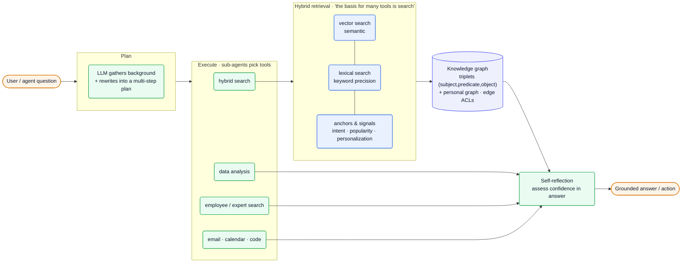
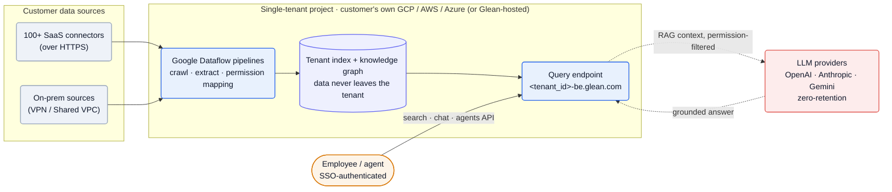

## What they do

[Glean][home] builds "Work AI" — one permissioned index over a company's apps that powers *"intelligent Search, an AI Assistant, and scalable AI agents"* across *"100+ enterprise SaaS connectors"* ([Backend JD][jd-backend]). Ask in natural language; Glean retrieves the right document, person, or action — filtered to what *you* are allowed to see — and increasingly *acts*, not just answers.

Founded **2019** by **Arvind Jain** (a Distinguished Engineer on Google Search who went on to co-found Rubrik) with three other ex-Google engineers — Vishwanath T R, Tony Gentilcore, Piyush Prahladka ([Fortune][fortune]). The DNA is Google web search, retargeted at the messy, permission-bounded corpus inside a single company.

This is a **mature, late-stage build**, not an early-stage scramble — and that is the interesting part. The engineering story is how a search engine *hardens* into enterprise infrastructure: single-tenant isolation, ACL-faithful retrieval, multi-provider model routing, and an eval-gated agent runtime.

- **Series F: $150M at a $7.2B valuation**, led by Wellington Management — *"Glean today announced it raised $150 million in Series F financing, bringing its valuation to $7.2 billion"* (June 10 2025, [press release][press-f]).
- *"Glean rapidly surpassed $100 million in annual recurring revenue (ARR) in its last fiscal year"* ([press release][press-f]).
- *"The platform is already powering more than 100 million agent actions annually,"* with a stated goal of *"one billion agent actions by the end of the year"* ([press release][press-f]).
- ~$768M raised total; third-party trackers put headcount near ~1,600 ([Sacra][sacra]).

## Stack

A Go-leaning backend, a Bazel monorepo, Kubernetes on a major cloud, and a deliberately **model-neutral** AI layer. Every row is named in a first-party JD, doc, or repo.

| Layer | Choice | Evidence |
| --- | --- | --- |
| **Backend languages** | **Go** (preferred), Python, Java, C++ | [Runtime JD][jd-runtime], [Context JD][jd-context], [Backend JD][jd-backend] |
| **Client / SDK languages** | TypeScript, **Python, TypeScript, Java, Go** SDKs | [Dev platform][dev], [Context JD][jd-context] |
| **Build system** | **Bazel monorepo** — custom rules/macros, remote execution | [Dev Productivity JD][jd-devprod] |
| **CI/CD** | **GitHub Actions** on Kubernetes + cloud runners | [Dev Productivity JD][jd-devprod] |
| **Containers / orchestration** | **Docker · Kubernetes** | [Dev Productivity JD][jd-devprod], [Runtime JD][jd-runtime] |
| **Cloud** | **GCP / AWS / Azure** (single-tenant, in customer's cloud) | [Security][security], [Runtime JD][jd-runtime] |
| **Ingestion** | **Google Dataflow** pipelines | [Data flow][dataflow] |
| **Event / streaming** | **Pub/Sub, Kafka** | [Runtime JD][jd-runtime] |
| **Caching** | **Redis** + low-latency data stores | [Runtime JD][jd-runtime] |
| **Observability** | **OpenTelemetry** tracing, metrics, dashboards | [Runtime JD][jd-runtime] |
| **LLM providers** | **OpenAI · Anthropic · Google Gemini** + model routing | [Runtime JD][jd-runtime] |
| **Agent interop** | **MCP** — single HTTP endpoint into 20+ hosts | [Dev platform][dev] |
| **Agent frameworks** | LangChain, OpenAI Agents SDK, Google ADK, CrewAI | [Dev platform][dev], [Toolkit repo][toolkit-gh] |
| **Internal coding AI** | GitHub Copilot, Cursor, Claude | [Dev Productivity JD][jd-devprod] |

:::note[Key finding — the AI layer is model-neutral by design]
The runtime targets *"leading LLM providers (e.g., OpenAI, Anthropic, Google Gemini)"* and builds *"model selection/routing"* as a first-class service ([Runtime JD][jd-runtime]). Glean bets on owning the *context and retrieval* layer, not a single model — the LLM is a swappable, zero-retention dependency.
:::

The retrieval index, embedding models, and knowledge-graph store aren't named — reconstructed in [Likely internals](#likely-internals).

## Architecture

### Retrieval is the substrate; agents sit on top

Glean's core is a **hybrid search engine**: *"the precision of lexical search and the nuanced understanding of vector search—all powered by the additional context and nuance provided by the signals and anchors within our knowledge graph"* ([hybrid search][hybrid-blog]). Ranking is driven by *"countless anchors and signals"* — *"normalization … synonymy … intent classification … document understanding … popularity"* and personalization ([hybrid search][hybrid-blog]).

The **knowledge graph** is the moat. It's a triplet store — *"at the core of a knowledge graph is the triplet structure: (subject, predicate, object)"* — where *"edge properties—such as timestamps, access control, confidence scores, or provenance—can be attached to each relationship"* ([knowledge graph][kg-blog]). It's built automatically (*"automated noun extraction,"* *"frequency and prominence filtering,"* signals like *"presence in the titles of key documents"*), plus a **personal graph** that *"captures employee activity,"* clustering *"each atomic action into subtasks"* then *"higher-level tasks."* Glean's name for the whole thing: *"the system of context."*

On top, **agentic reasoning**: *"agents decompose questions into multi-step plans. Each step is executed by agents using tools, such as search, reasoning, data analysis, employee search, and expert search"* ([agentic reasoning][agentic-blog]). The plan phase *"run[s] a series of initial questions to the LLM to gather background information"* then *"rewrite[s] the query into a multi-step plan"*; sub-agents *"reason about the tools to use"* and the system *"self-reflect[s]"* on *"its own confidence in its answer."* Crucially: *"the basis for many tools in Glean is search."* The claimed payoff is *"a significant increase of 24% in the relevance of responses and actions."*

![Glean retrieval + agentic-reasoning pipeline: a user or agent question enters a Plan phase where an LLM gathers background and rewrites the query into a multi-step plan; sub-agents then pick tools (hybrid search, data analysis, employee/expert search, email/calendar/code); the hybrid-search tool combines vector search, lexical search, and anchors-and-signals ranking, all reading from a knowledge graph of (subject, predicate, object) triplets plus a personal graph with edge-level ACLs; results pass through a self-reflection step that assesses confidence before returning a grounded answer or action.](/diagrams/glean/retrieval-agents.svg)

Mermaid source

The runtime that hosts this is owned by the **Agents Runtime** team — *"the low-latency, reliable, and secure foundation that powers Glean's AI agents and assistant experiences at scale,"* providing *"core runtime services for multi-turn orchestration, tool calling, model routing, memory, streaming, and safety"* ([Runtime JD][jd-runtime]). The **Context Platform** team exposes it outward — SDKs, *"agent SDKs and integrations, MCP servers,"* and platform actions *"such as Code Search, Code Writer, and Memory"* built as *"reusable platform primitives on top of Glean's horizontal layers (connectors, security/governance, knowledge graph, memory, model orchestration)"* ([Context JD][jd-context]).

### Deployment: a search engine that runs inside your cloud

The architectural bet that separates Glean from a generic RAG SaaS: each customer gets *"a fully isolated, single-tenant environment,"* *"either Glean-hosted or in your own AWS, Azure, or GCP cloud"* ([Security][security]). Ingestion and indexing happen in the customer's project — *"all data processing occurs within your tenant's project using Google Dataflow pipelines. Your data never leaves your tenant's environment"* ([Data flow][dataflow]). Queries hit a tenant-specific endpoint, *"`<tenant_id>-be.glean.com`,"* after SSO auth, and model calls run under *"zero-retention agreements with model providers"* ([Data flow][dataflow], [Security][security]).

![Glean single-tenant deployment and data flow: customer data sources — 100+ SaaS connectors over HTTPS and on-prem sources over VPN/Shared VPC — feed Google Dataflow pipelines that crawl, extract, and map permissions inside a single-tenant project in the customer's own GCP/AWS/Azure cloud (or Glean-hosted); the pipelines build a tenant index plus knowledge graph that never leaves the tenant; an SSO-authenticated employee or agent calls the tenant query endpoint <tenant_id>-be.glean.com via the search/chat/agents API; that endpoint sends permission-filtered RAG context to external LLM providers (OpenAI, Anthropic, Gemini) under zero-retention terms and returns a grounded answer.](/diagrams/glean/deployment.svg)

Mermaid source

:::note[Key finding — permissions are the product, not a feature]
Connectors *"map and maintain access controls"* from each source ([Data flow][dataflow]) and Glean ships *"single-tenant connectors, enforced data permissions, and a RAG architecture that minimizes LLM data exposure"* ([Security][security]). For enterprise search the hard problem isn't recall — it's never surfacing a document the user can't open. The whole single-tenant design exists to make ACL-faithful retrieval auditable.
:::

## Team

Founder-led by ex-Google search engineers; ~1,600 people ([Sacra][sacra]). The engineering org, read off the job board, is organized by **horizontal platform layer** rather than product vertical.

| Role | Person | Source |
| --- | --- | --- |
| Co-founder / CEO | Arvind Jain (ex-Google Search; Rubrik co-founder) | [Fortune][fortune] |
| Co-founders | Vishwanath T R, Tony Gentilcore, Piyush Prahladka (ex-Google) | [Fortune][fortune] |

The team shape, from the JDs: **Agents Runtime** (orchestration, routing, memory, streaming, safety — [Runtime JD][jd-runtime]); **Context Platform** (SDKs, MCP, Code Search/Writer, Memory — [Context JD][jd-context]); **Backend/Infrastructure** (*"a highly performant, scalable, secure, permissions-aware system,"* *"6+ years … distributed systems"* — [Backend JD][jd-backend]); and a dedicated **Developer Productivity** org owning the Bazel monorepo and CI ([Dev Productivity JD][jd-devprod]). Engineering is global, with a *"Software Engineer, Product Backend (India)"* track ([Careers][careers]). Posted backend/dev-productivity comp runs roughly **$140K–$265K** base ([Dev Productivity JD][jd-devprod]).

## Process

**A monorepo run like Google's.** Developer Productivity *"develop[s] and maintain[s] our Bazel monorepo with support for multiple languages,"* chasing *"hermeticity, caching, reproducibility, and dependency management"* and cutting *"CI latency through remote execution, caching, and parallelization"* ([Dev Productivity JD][jd-devprod]). CI is *"GitHub Actions, Kubernetes, and cloud runners."* The Bazel-monorepo-plus-remote-execution choice is the founders' Google muscle memory applied at ~1,600 engineers.

**AI-native engineering, assessed at the door.** The same team is chartered to *"enable engineers to integrate AI-powered coding assistants (e.g. Github Copilot, Cursor, Claude) into daily workflows"* ([Dev Productivity JD][jd-devprod]), and interviews include *"an AI-focused exercise or discussion"* ([Runtime JD][jd-runtime], [Backend JD][jd-backend]).

:::note[Inference — they dogfood Work AI — confidence: medium]
A company selling an enterprise assistant and agent platform, that also wires Copilot/Cursor/Claude into its own monorepo workflow, almost certainly runs Glean on its own corpus. The public JDs show the *coding-assistant* half explicitly; internal use of the product itself is the obvious, unstated other half.
:::

## Notable bets

1. **Own the context layer, rent the model.** The knowledge graph and permissioned index are the durable asset; LLMs are multi-provider, routed, and zero-retention ([Runtime JD][jd-runtime], [Security][security]). Glean is structurally insulated from "which model won this quarter."
2. **A knowledge graph, not just a vector store.** Triplets with ACL-bearing edges plus a personal graph give multi-hop reasoning and personalization that raw embeddings can't — *"the system of context"* ([knowledge graph][kg-blog]).
3. **Single-tenant in the customer's cloud.** Heavy operational cost (Dataflow pipelines and a full deployment per tenant) traded for the enterprise's hardest requirement: *"your data never leaves your tenant's environment"* ([Data flow][dataflow]).
4. **Permissions as the core invariant.** Source ACLs are mapped, maintained, and enforced so retrieval is faithful to what each user may see ([Data flow][dataflow], [Security][security]).
5. **Open the platform via MCP.** Rather than a closed app, Glean exposes agents and tools through *"a single HTTP endpoint"* into *"20+ MCP hosts"* and every major agent framework ([Dev platform][dev]) — meet developers in Claude, Cursor, ChatGPT.
6. **Google search discipline at startup speed.** Bazel monorepo, remote-execution CI, hybrid ranking with hand-built signals — the founders rebuilt web-search engineering for the enterprise corpus.

## Hard problems

The parts an engineer would lose sleep over. **Public signal** is cited (verified); **likely approach** is labeled speculation — best-practice fill-in, hedged.

| Problem | Why it's hard | Public signal | Likely approach (speculative) |
| --- | --- | --- | --- |
| **Testing agents** | Non-deterministic, no shared ground truth; per-tenant isolation means customer queries can't be pooled into one eval set | +24% relevance benchmark; runtime self-reflects on *"its own confidence"*; Runtime owns *"safety"* ([agentic][agentic-blog], [Runtime JD][jd-runtime]) | Offline golden-set + LLM-as-judge on synthetic corpora; online confidence-gating and per-tenant A/B |
| **Inference cost** | Multi-step plans multiply LLM calls against a ~10× action ramp (100M→1B/yr) | *"model selection/routing"* + multi-provider; Redis cache; RAG *"minimizes LLM data exposure"* ([Runtime JD][jd-runtime], [Security][security], [press][press-f]) | Tiered routing (small classifier gates frontier calls); semantic caching of repeated queries; cap plan depth/fan-out |
| **Observability** | Reproducing *why* spans a rewritten plan, sub-agents, and many tool calls; isolation limits what Glean can inspect | *"tracing (OpenTelemetry), metrics, dashboards, and production forensics"* ([Runtime JD][jd-runtime]) | One trace per run, a span per step/tool; retain reasoning traces + confidence per tenant; aggregates leave, raw data doesn't |

## Unknowns

:::caution[What the public record can't confirm]
Genuinely open questions; best-practice guesses for the infra live in [Likely internals](#likely-internals).

- **Retrieval engine** — hybrid vector+lexical search is confirmed ([hybrid search][hybrid-blog]); the underlying index (custom vs. a named vector DB / Lucene-class engine) is not stated.
- **Embedding & ranking models** — a *"self-learning language model"* and a signal stack are described ([hybrid search][hybrid-blog]); whether embeddings/rankers are in-house, provider, or both is unconfirmed.
- **Knowledge-graph store** — triplets with edge properties are described ([knowledge graph][kg-blog]); whether it's a standalone graph DB or materialized over the index is unknown.
- **Memory backing store** — "memory" is named as both a runtime and a platform primitive ([Runtime JD][jd-runtime], [Context JD][jd-context]); its persistence layer isn't public.
- **Permission-enforcement timing** — index-time filtering vs. request-time ACL checks (or both) isn't specified.
- **Engineering headcount / exact org size** — only a third-party total (~1,600) is available ([Sacra][sacra]).
:::

## Sources

Reconstructed from public sources only — no insider information. Crawled 2026-06-08 (web search + page fetch; Chrome MCP browsing was declined this session, so no login-walled JDs). Claim tiers: **verified** (stated on a public page, linked) · **inferred** (reasoned from a cited signal, confidence flagged) · **speculative** (best-practice fill-in, labeled). Links are live; pages change, so the supporting quote for each claim is kept in this repo's evidence map (`evidence/glean-evidence-map.md`).

| # | Source | Link |
| --- | --- | --- |
| S1 | Homepage (Work AI platform) | <https://www.glean.com/> |
| S2 | Security & deployment | <https://www.glean.com/security> |
| S3 | Developer platform | <https://developers.glean.com/> |
| S4 | Knowledge graph (blog) | <https://www.glean.com/blog/knowledge-graph-agentic-engine> |
| S5 | Hybrid search (blog) | <https://www.glean.com/blog/hybrid-vs-rag-vector> |
| S6 | Agentic reasoning (blog) | <https://www.glean.com/blog/agentic-reasoning-future-ai> |
| S7 | Data flow (docs) | <https://docs.glean.com/security/architecture/data-flow> |
| S8 | SWE, Agentic Runtime (JD) | <https://job-boards.greenhouse.io/gleanwork/jobs/4616929005> |
| S9 | SWE, Context Platform (JD) | <https://job-boards.greenhouse.io/gleanwork/jobs/4638008005> |
| S10 | SWE, Developer Productivity (JD) | <https://job-boards.greenhouse.io/gleanwork/jobs/4614706005> |
| S11 | SWE, Backend (JD) | <https://job-boards.greenhouse.io/gleanwork/jobs/4006731005> |
| S12 | Careers | <https://www.glean.com/careers> |
| S13 | glean-agent-toolkit (GitHub) | <https://github.com/gleanwork/glean-agent-toolkit> |
| S14 | Series F press release | <https://www.glean.com/press/glean-raises-150m-series-f-at-7-2b-valuation-to-accelerate-enterprise-ai-agent-innovation-globally> |
| S15 | Sacra (third-party — revenue/headcount) | <https://sacra.com/c/glean/> |
| S16 | Fortune (third-party — founder) | <https://fortune.com/2025/03/27/glean-ceo-arvind-jain-lessons-from-an-ai-unicorn/> |

## Speculative reconstruction

:::tip[Best-practice reconstruction, not fact]
Nothing here is stated on a public page. It's what a team with *this* stack — ex-Google-Search founders, a Go/Bazel backend, a hybrid vector+lexical engine, a triplet knowledge graph, and a single-tenant Dataflow deployment — would *typically* reach for. Read every dashed box in the diagram as "likely," not confirmed.
:::

### Likely internals

| Component | Likely choice | Why |
| --- | --- | --- |
| Index / retrieval engine | a proprietary inverted index + embedding store, not a named third-party vector DB | *"anchors and signals,"* *"self-learning language model"* ([hybrid search][hybrid-blog]); no vendor named; ex-Google-Search team would build, not buy |
| Embedding models | fine-tuned in-house embeddings alongside provider embeddings | hybrid/self-learning search ([hybrid search][hybrid-blog]) + multi-provider posture ([Runtime JD][jd-runtime]) |
| Knowledge-graph store | a graph materialized over the tenant index rather than a standalone graph DB | triplets + edge properties derived from indexed content ([knowledge graph][kg-blog]); no graph DB named |
| Ranking model | learning-to-rank over the anchor/signal features | *"self-learning language model"* + the explicit signal list ([hybrid search][hybrid-blog]) |
| Memory store | per-tenant store keyed to the knowledge graph | "memory" is a named runtime + platform primitive ([Runtime JD][jd-runtime], [Context JD][jd-context]); backing store unstated |
| Auth | enterprise SSO (SAML / OIDC) | SSO is confirmed at the query boundary ([Data flow][dataflow]); IdP breadth not enumerated |

[home]: https://www.glean.com/
[security]: https://www.glean.com/security
[dev]: https://developers.glean.com/
[kg-blog]: https://www.glean.com/blog/knowledge-graph-agentic-engine
[hybrid-blog]: https://www.glean.com/blog/hybrid-vs-rag-vector
[agentic-blog]: https://www.glean.com/blog/agentic-reasoning-future-ai
[dataflow]: https://docs.glean.com/security/architecture/data-flow
[jd-runtime]: https://job-boards.greenhouse.io/gleanwork/jobs/4616929005
[jd-context]: https://job-boards.greenhouse.io/gleanwork/jobs/4638008005
[jd-devprod]: https://job-boards.greenhouse.io/gleanwork/jobs/4614706005
[jd-backend]: https://job-boards.greenhouse.io/gleanwork/jobs/4006731005
[careers]: https://www.glean.com/careers
[toolkit-gh]: https://github.com/gleanwork/glean-agent-toolkit
[press-f]: https://www.glean.com/press/glean-raises-150m-series-f-at-7-2b-valuation-to-accelerate-enterprise-ai-agent-innovation-globally
[sacra]: https://sacra.com/c/glean/
[fortune]: https://fortune.com/2025/03/27/glean-ceo-arvind-jain-lessons-from-an-ai-unicorn/
