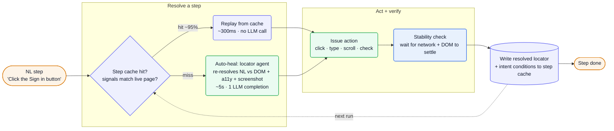
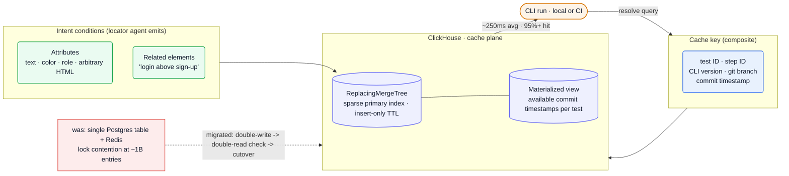

## What they do

[Momentic][home] is AI-native end-to-end testing: you *"describe test behavior in natural language,"* and *"an AI agent turns your prompts into reliable steps, runs them against your app, and auto-heals brittle locators"* ([Docs][docs]). Tests live in your repo as **YAML**, run locally or in CI against web, iOS, and Android. The pitch is the *"modern alternative to Selenium, Cypress, and Playwright"* — *"reliable end-to-end tests that write themselves"* ([YC][yc]).

Founded **2023**, **YC Winter 2024**, San Francisco, by **Wei-Wei Wu** (CEO — ex-Assembled, founding engineer at Nashi, staff engineer at Density) and **Jeff An** (ex-Splunk/Google, led testing at Robinhood and enterprise quality at Retool) ([YC][yc]). Two engineers who *"dreaded testing so much we founded a company to do it for us."*

The interesting part is not the natural-language front door — every competitor has one. It's the **caching substrate** underneath. Momentic's whole cost, speed, and reliability story rests on an *intent-based* step cache that lets it call an LLM on roughly 1 step in 20 and replay the other 19 deterministically. That engine is the most documented part of the public record, so it's where this teardown spends its weight.

- **Series A: $15M led by Standard Capital**, with Dropbox Ventures and existing investors (Y Combinator, FCVC, Transpose Platform, Karman Ventures), on top of a **$3.7M seed** in March 2025 (Nov 24 2025, [TechCrunch][tc]).
- **2,600 users** across *"1000+ engineer organizations"* — Notion, Xero, Bilt, Webflow, Retool, Quora, plus Pocus, Nuvo, Mutiny, CoverGo, Coframe, GPTZero ([TechCrunch][tc], [intent blog][blog-intent], [home][home]).
- Wu estimates Momentic *"automated more than 200 million test steps"* in the last month ([TechCrunch][tc]).
- **~12 people** at the Series A ([YC][yc]) — a very small team running a very large cache plane.

:::note[Key finding — the product is a cache, wrapped in an agent]
Momentic *"runs an AI agent that controls a real browser or emulator,"* but the cache is what makes it viable: a *"95%+ cache hit rate … execute steps in 300ms on average, while a completely uncached step takes over 5s due to LLM latency"* ([intent blog][blog-intent]). AI is the fallback, not the hot path.
:::

## Stack

A TypeScript-first CLI, tests as YAML in git, and a ClickHouse cache plane. Every row is named in a first-party doc, repo, or engineering post.

| Layer | Choice | Evidence |
| --- | --- | --- |
| **Languages** | **TypeScript** (primary), Python | [GitHub org][gh] top languages |
| **Distribution** | **npm CLI** — `npx momentic`, CLI-first; cloud authoring deprecated | [Docs][docs], [config][cfg] |
| **Test format** | **YAML in the repo** (`*.test.yaml`, `*.module.yaml`) | [How it works][how], [config][cfg] |
| **Editor** | **CodeMirror + TypeScript** (low-code local editor) | [codemirror-ts fork][gh-cm] |
| **Cache store** | **ClickHouse** (`ReplacingMergeTree`, sparse PK, materialized view) — migrated off **Postgres + Redis** | [ClickHouse blog][blog-ch] |
| **Browser automation** | **Chromium** driver (Playwright-class), local or managed runner | [Docs][docs], [Playwright cmp][cmp-pw] |
| **Mobile** | iOS simulators · Android emulators, **remote-hosted** (regioned) | [Docs][docs], [config][cfg] |
| **LLM layer** | **managed, multi-provider with cross-provider failover** (models unnamed) | [Playwright cmp][cmp-pw], [AI config][cfg-ai] |
| **Coding-agent integration** | **Claude Agent SDK** skill (`npx skills add momentic-ai/skills`) + MCP | [GitHub skills][gh-skills], [Docs][docs] |
| **CI targets** | **GitHub Actions · CircleCI** (orb) **· Bitrise** | [Docs][docs], [orb repo][gh-orb] |
| **Execution** | managed, **multi-region** runner | [Playwright cmp][cmp-pw] |

The in-product agents run on *"latest 2025 models"* but Momentic never names the provider — the model layer is *"managed; cross-provider failover handled by the platform"* ([Playwright cmp][cmp-pw], [AI config][cfg-ai]). The one verified Anthropic touchpoint is the open-source **skills** repo, *"Claude Agent SDK with a E2E testing tool"* ([GitHub][gh-skills]).

:::note[Key finding — five specialized agents, each versioned independently]
Momentic doesn't run one generalist agent. It runs **locator**, **assertion**, **visual-assertion**, **text-extraction**, and **failure-recovery** agents, each pinned to a prompt+model version (`v1`/`v2`/`v3`) you can bump one at a time ([AI config][cfg-ai]). Decomposing by task is what lets them tune (and cache) each independently.
:::

## Architecture

### The agent loop: cache first, LLM on miss

A step's life is **prompt → context → action → verify → cache → replay → heal**. The agent *"reads the page (DOM, accessibility tree, screenshot),"* picks an element, acts, waits for *"the network and DOM to settle,"* then writes the resolved locator to cache. *"On the next run, Momentic replays from cache, no LLM call, until something changes"* — and only when *"the cached locator misses, auto-heal uses the AI agent to find the element again and updates the cache"* ([How it works][how]). This is the inversion that controls both cost and latency: the LLM is invoked *"only when it's actually needed."*

![Momentic step lifecycle: a natural-language step enters resolution where Momentic checks whether the step cache hits — if the stored signals still match the live page (~95% of the time) it replays from cache in ~300ms with no LLM call; on a miss the locator agent re-resolves the description against DOM, accessibility tree, and screenshot in ~5s using one LLM completion; either way the action is issued, a stability check waits for network and DOM to settle, and the resolved locator plus intent conditions are written back to the step cache for the next run.](/diagrams/momentic/agent-loop.svg)

Mermaid source

A cached step *"stores more than one way to find its target: where the element sits on screen, what it looks like, what text it contains, and the accessibility and structural attributes around it"* — a **multi-modal locator**. Which signals matter *"is inferred from the step's natural-language description"*: *"the red Cancel button below the Order Summary header"* leans visual+positional; *"the Sign in button"* leans accessibility+text ([step cache][cache], [Playwright cmp][cmp-pw]). Step-based tests are *"deterministic and fast"*; the `act` primitive runs **agentic** flows where *"you give Momentic a goal, and an AI agent figures out the steps on the fly"* — and the V3 `act` agent is *"planner-style … drafts the full flow up front, caches the resolved steps … and self-heals"* ([agentic][agentic]).

### The cache plane: an OLAP database doing OLTP work

The hard engineering is in the cache store. Adding signals to the key took Momentic from *"around 80k active cache entries to now approximately 1B"*, and the original *"single table in Postgres … started to show cracks"*: *"lock contention from queries trying to read and write to the cache concurrently"* ([ClickHouse blog][blog-ch]). They moved the store to **ClickHouse**, exploiting its **sparse primary index**: the cache is keyed by *"test ID, step ID, Momentic version, git branch, and commit timestamp,"* so a known-key lookup *"narrow[s] down the search space to just a few granules"* instead of a B-tree scan that grows with data.

![Momentic cache plane: a CLI run issues a resolve query against a composite cache key of test ID, step ID, CLI version, git branch and commit timestamp; the locator agent also emits intent conditions — required attributes (text, color, role, arbitrary HTML) and related elements — that are stored alongside each entry; the store is ClickHouse using a ReplacingMergeTree with a sparse primary index and insert-only TTL extension, plus a materialized view of available commit timestamps per test to bound main-branch scans; it serves ~250ms average lookups at a 95%+ hit rate, having replaced an earlier single Postgres table plus Redis that hit lock contention at ~1B entries, migrated via double-write then double-read consistency check then cutover.](/diagrams/momentic/cache-store.svg)

Mermaid source

Two ClickHouse-native moves carry the design. **Main-branch scans** still read *"500k+ rows,"* so they added *"a materialized view to precompute all of the available commit timestamps for a given test ID,"* narrowing back to *"one or two parts."* And because *"2/3 queries are updates, which aren't very performant"* in ClickHouse, they went **insert-only**: `SELECT`, re-`INSERT` used caches to extend TTL, `INSERT` new caches, *"and let ClickHouse take care of deduplicating entries asynchronously"* via `ReplacingMergeTree` — *"such an improvement that we were able to fully eliminate the Redis layer."* The cutover was a careful **double-write → double-read consistency check → gradual cutover** ([ClickHouse blog][blog-ch]). Result: *"over two million cache queries per day, processing almost 20 billion cache entries every day while maintaining ~250ms resolution latency on average."*

### Intent, not selectors

The reliability claim hinges on caching **user intent** rather than a DOM snapshot. The earlier *"does this look like the element we saw before?"* check failed four ways at scale: cross-branch pollution, cross-version pollution, false misses (randomized classnames bust the cache), and false hits (`nth-child` selectors grab the wrong row when order changes) ([intent blog][blog-intent]). The fix: the locator agent now *"classif[ies] which attributes it used in its reasoning"* and emits two condition types — **attributes** (*"text, color, or any arbitrary HTML attribute"*) and **related elements** (*"the login button above the sign up button"*). The question became *"does this element still match what the user meant?"* — so *"the blue button"* strictly enforces blue. Branch/version isolation was solved by **git-aware cache seeding**: new branches *"seed from the cache at their merge base,"* and merges fold the branch cache back into main ([step cache][cache], [intent blog][blog-intent]).

:::note[Inference — Momentic is, in effect, a learned-locator compiler — confidence: high]
The locator agent compiles a natural-language description into a portable, multi-signal matcher plus validity conditions, then ClickHouse serves that matcher at OLTP latency. The "AI testing" surface is real, but the durable asset is the per-step intent record accumulated across *"200M resolutions"* ([intent blog][blog-intent]).
:::

### Healing as a code change

Two healing tiers: **in-run** auto-heal re-resolves locators and waits for stability, persisting fixes only as cache entries when the run is eligible to save cache ([auto-heal][heal]). The **post-run triage agent** (`momentic ai triage` / `heal`) *"permanently rewrites the failing tests, and opens a pull request (or emits a patch)"* — respecting the repo's `PULL_REQUEST_TEMPLATE.md`. A separate **app graph** models coverage from run traces: each UI state is *"fingerprinted (canonical URL plus a normalized, minhashed view of the DOM),"* a semantic summary is *"embedded,"* and states cluster into *"product areas, features, journeys, variants"* to show which flows are Covered / Partial / Missing ([app graph][graph]).

## Team

Two founders, **~12 people** at the Series A ([YC][yc]). San Francisco, on-site.

| Role | Person | Source |
| --- | --- | --- |
| Co-founder / CEO | Wei-Wei Wu (ex-Assembled; founding eng at Nashi → acq. Density 2021; staff eng at Density) | [YC][yc] |
| Co-founder | Jeff An (ex-Splunk, Google; led testing at Robinhood, enterprise quality at Retool; U. Waterloo) | [YC][yc] |
| Engineering | Henry Haefliger (author of the caching engineering posts) | [ClickHouse blog][blog-ch], [intent blog][blog-intent] |

The founder DNA is **testing and reliability at scale** — Jeff An *"led testing at Robinhood and enterprise quality at Retool"*; Wei-Wei Wu led *"product reliability"* at Density ([YC][yc]). Open roles at the time of writing are GTM (founding AE/SDR, San Francisco, on-site) plus a *"Founding Engineer (Frontend)"* ([Ashby][ashby], [YC][yc]) — a sales-led growth phase on a still-tiny eng team.

## Process

**Tests are code, owned by engineers.** Momentic is *"CLI-first. Authoring and running tests in the cloud is deprecated"*; `app.momentic.ai` survives only as a dashboard for *"results, settings, API keys, and integrations"* ([Docs][docs]). Tests are YAML in the repo, *"run locally or in CI,"* and the company actively markets *"a migration guide to go from outsourced QA to engineering-owned tests"* ([blog][blog]). Cache eligibility is **git-aware**: CI runs always save cache; local runs save only off `main`/protected branches, so shared branches don't get polluted ([step cache][cache]).

The stated engineering philosophy is *"truth-driven development"* — *"you cannot verify what you cannot reason"* — pairing fast AI-coding velocity with behavioral tests that *"keep quality high at Cursor speed"* ([blog][blog]). Healing is wired into the SCM workflow: a successful heal can open a PR, a draft PR, commit directly, emit a patch, or leave changes on disk, configured per org ([auto-heal][heal]).

## Notable bets

1. **Cache-first, LLM-on-miss.** Invert the cost model: replay deterministically ~95% of the time at ~300ms; pay for an LLM completion (~5s) only on a miss ([intent blog][blog-intent]). This is the core economic bet — AI quality without AI cost on the hot path.
2. **Cache *intent*, not selectors.** Store the attributes and related elements the locator agent actually reasoned over, and validate *"does this still match what the user meant?"* — the answer to flaky `nth-child` selectors and randomized classnames ([intent blog][blog-intent]).
3. **ClickHouse as an OLTP cache plane.** Use an OLAP engine's sparse index + `ReplacingMergeTree` for a high-write key-value lookup, eliminating Postgres lock contention *and* the Redis layer ([ClickHouse blog][blog-ch]).
4. **Specialized, independently-versioned agents.** Five task-specific agents (locator/assertion/visual/extraction/recovery), each pinned to a prompt+model version ([AI config][cfg-ai]) — tune and cache each in isolation.
5. **Tests-as-YAML-in-repo; deprecate the cloud authoring UI.** Bet that buyers (1000+ engineering orgs) want tests in version control, not a SaaS recorder ([Docs][docs]).
6. **Provider-neutral model layer.** *"Cross-provider failover handled by the platform"* ([Playwright cmp][cmp-pw]) insulates Momentic from any single model's price or outage.
7. **Meet coding agents where they are.** A Claude Agent SDK skill and an MCP loop let Cursor/Claude author and heal Momentic tests ([GitHub skills][gh-skills], [Docs][docs]).

## Hard problems

The parts an engineer at this company loses sleep over. **Public signal** is cited (verified); **likely approach** is labeled speculation — best-practice fill-in, hedged.

| Problem | Why it's hard | Public signal | Likely approach (speculative) |
| --- | --- | --- | --- |
| **Flaky tests / cache correctness** | NL intent is ambiguous; a cache too strict busts on cosmetic change, too loose grabs the wrong element; branches and CLI versions pollute a shared cache | Four documented failure modes; *"1M potential flakes across 200M resolutions"* (Feb 2026); 95%+ hit rate ([intent blog][blog-intent]) | Intent conditions (attributes + related elements) from the locator agent; per-branch/version isolation with merge-base seeding — already shipped, now tuning SVG/icon and relativity checks |
| **Inference cost + latency** | An LLM per step is ~5s and expensive across 2M+ resolves/day | *"300ms cached vs over 5s uncached"*; LLM fires only on cache miss ([intent blog][blog-intent], [how it works][how]) | Aggressive caching as the default path; small specialized agents per task; cap agentic plan depth — only the heal path pays for inference |
| **Cache storage at scale** | ~20B entry-touches/day, high concurrent read+write, query cost must not grow with data | Postgres lock contention at ~1B entries → ClickHouse; ~250ms avg ([ClickHouse blog][blog-ch]) | ClickHouse `ReplacingMergeTree` + sparse PK + materialized-view of commit timestamps; insert-only TTL; async dedupe |
| **Testing non-deterministic apps** | Gen-AI products don't return the same output twice, so string-match assertions fail | Poe/Quora case: validate *"AI chatbot responses, even when they weren't deterministic"* ([home][home]); `assert`/`assertVisually` are agent-scored ([Playwright cmp][cmp-pw]) | Assertion + visual-assertion agents reason over *intent* (*"chart is visible and not cut off"*) rather than literal text; never-cache AI-evaluated steps |

## Unknowns

:::caution[What the public record can't confirm]
Genuinely open questions; best-practice guesses for the infra live in [Likely internals](#likely-internals).

- **LLM providers / models** — agents run *"latest 2025 models"* with *"cross-provider failover,"* but no provider is named ([AI config][cfg-ai], [Playwright cmp][cmp-pw]). Anthropic is confirmed only for the coding-agent *skill* ([GitHub skills][gh-skills]).
- **App-graph embedding model** — semantic state summaries are *"embedded"* ([app graph][graph]); the embedding model/store isn't stated.
- **Current headcount** — YC lists *"12"* at the Series A ([YC][yc]); growth since the $15M round is unconfirmed.
- **Mobile runner hosting** — emulators are *"remote-hosted"* and regioned ([config][cfg]); the underlying device/cloud infra isn't public.
- **Run-artifact storage** — videos, traces, and network logs surface in the dashboard ([Playwright cmp][cmp-pw]); the object store isn't named.
- **Cloud / hosting** — no first-party statement of AWS vs GCP for the control plane or ClickHouse deployment.
:::

## Sources

Reconstructed from public sources only — no insider information. Crawled 2026-06-08 via Chrome MCP (logged-out browsing) + the public docs, engineering blog, GitHub org, Ashby board, and YC profile. Claim tiers: **verified** (stated on a public page, linked) · **inferred** (reasoned from a cited signal, confidence flagged) · **speculative** (best-practice fill-in, labeled). Links are live; pages change, so the supporting quote for each claim is kept in this repo's evidence map (`evidence/momentic-evidence-map.md`).

| # | Source | Link |
| --- | --- | --- |
| S1 | Homepage | <https://momentic.ai/> |
| S2 | Docs — Welcome | <https://momentic.ai/docs> |
| S3 | Docs — How Momentic works | <https://momentic.ai/docs/get-started/how-momentic-works> |
| S4 | Docs — Step caching | <https://momentic.ai/docs/reliability/step-cache> |
| S5 | Docs — Auto-healing | <https://momentic.ai/docs/reliability/auto-heal> |
| S6 | Docs — Agentic testing | <https://momentic.ai/docs/core-concepts/agentic-testing> |
| S7 | Docs — Finding elements | <https://momentic.ai/docs/core-concepts/finding-elements> |
| S8 | Docs — App graph | <https://momentic.ai/docs/ai/app-graph> |
| S9 | Docs — Memory | <https://momentic.ai/docs/ai/memory> |
| S10 | Docs — momentic.config.yaml | <https://momentic.ai/docs/configuration/momentic-config> |
| S11 | Docs — AI configuration | <https://momentic.ai/docs/configuration/ai> |
| S12 | Docs — vs Playwright | <https://momentic.ai/docs/comparisons/playwright> |
| S13 | Blog — Postgres → ClickHouse | <https://momentic.ai/blog/postgres-to-clickhouse-migration> |
| S14 | Blog — Intent-based caching | <https://momentic.ai/blog/teaching-browser-agents-user-intent> |
| S15 | Blog index | <https://momentic.ai/blog> |
| S16 | GitHub org (momentic-ai) | <https://github.com/momentic-ai> |
| S17 | GitHub — skills (Claude Agent SDK) | <https://github.com/momentic-ai/skills> |
| S18 | Ashby job board | <https://jobs.ashbyhq.com/momentic> |
| S19 | Y Combinator profile | <https://www.ycombinator.com/companies/momentic> |
| S20 | TechCrunch — $15M Series A | <https://techcrunch.com/2025/11/24/momentic-raises-15m-to-automate-software-testing/> |

## Speculative reconstruction

:::tip[Best-practice reconstruction, not fact]
Nothing here is stated on a public page. It's what a team with *this* stack — a TypeScript CLI, a ClickHouse cache plane, multi-provider model routing, and a coding-agent integration — would *typically* reach for. Read each row as "likely," not confirmed.
:::

### Likely internals

| Component | Likely choice | Why |
| --- | --- | --- |
| LLM providers | OpenAI + Anthropic + Google, routed | *"cross-provider failover"* ([Playwright cmp][cmp-pw]); Anthropic confirmed for the skill ([GitHub skills][gh-skills]); failover implies ≥2 frontier vendors |
| App-graph embeddings | a hosted embedding API (OpenAI/Cohere-class) over minhashed DOM summaries | states are *"embedded"* and clustered ([app graph][graph]); no in-house model signal on a ~12-person team |
| Run-artifact store | S3-class object storage for videos/traces | dashboard serves *"run videos, traces, network"* ([Playwright cmp][cmp-pw]); object storage is the default for this |
| Control-plane DB | Postgres (retained for app/org/auth data after the cache moved to ClickHouse) | they *"eliminate[d] the Redis layer"* but only moved *cache* off Postgres ([ClickHouse blog][blog-ch]); relational data likely stays |
| Hosting | a major cloud (AWS or GCP) with managed ClickHouse | multi-region runner + ClickHouse at this scale ([Playwright cmp][cmp-pw], [ClickHouse blog][blog-ch]); managed ClickHouse Cloud is the low-ops path for ~12 people |
| Auth | enterprise SSO (SAML/OIDC), API keys | *"custom SSO"* offered ([YC][yc]); `MOMENTIC_API_KEY` for CLI auth ([config][cfg]) |

[home]: https://momentic.ai/
[docs]: https://momentic.ai/docs
[how]: https://momentic.ai/docs/get-started/how-momentic-works
[cache]: https://momentic.ai/docs/reliability/step-cache
[heal]: https://momentic.ai/docs/reliability/auto-heal
[agentic]: https://momentic.ai/docs/core-concepts/agentic-testing
[graph]: https://momentic.ai/docs/ai/app-graph
[cfg]: https://momentic.ai/docs/configuration/momentic-config
[cfg-ai]: https://momentic.ai/docs/configuration/ai
[cmp-pw]: https://momentic.ai/docs/comparisons/playwright
[blog]: https://momentic.ai/blog
[blog-ch]: https://momentic.ai/blog/postgres-to-clickhouse-migration
[blog-intent]: https://momentic.ai/blog/teaching-browser-agents-user-intent
[gh]: https://github.com/momentic-ai
[gh-skills]: https://github.com/momentic-ai/skills
[gh-cm]: https://github.com/momentic-ai/codemirror-ts
[gh-orb]: https://github.com/momentic-ai/momentic-circleci-orb
[ashby]: https://jobs.ashbyhq.com/momentic
[yc]: https://www.ycombinator.com/companies/momentic
[tc]: https://techcrunch.com/2025/11/24/momentic-raises-15m-to-automate-software-testing/
