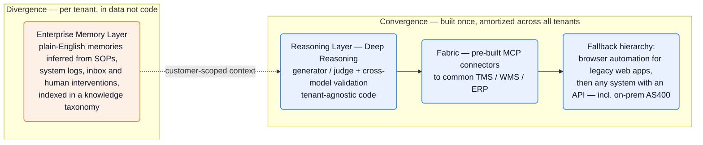
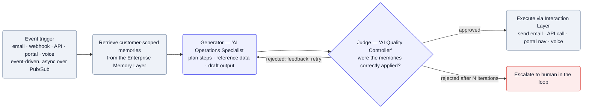
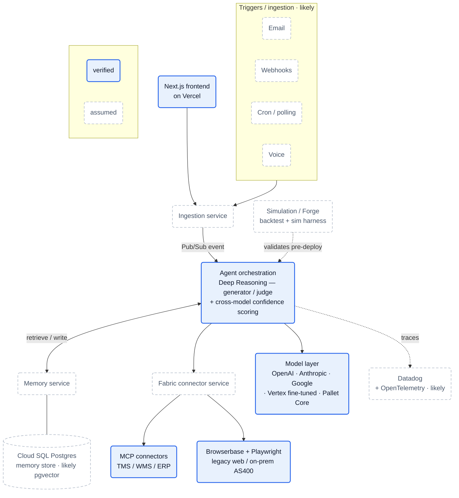

## What they do

[Pallet][home] sells AI agents that run logistics back-office work — quoting, order entry, load building, appointment setting, POD retrieval, invoice auditing, customs processing — for freight brokers, 3PLs, carriers, and warehouses ([product page][agent], [Forge post][forge]). The wedge: these buyers run frozen, often legacy systems (TMS, WMS, ERP, sometimes on-prem AS400) they can't or won't replace, so Pallet's agents meet each system at whatever interface it offers rather than asking the customer to migrate — "any system with an API, including on-premise AS400-based databases" ([product page][agent]).

The buyer's motivation, in a customer's own words: *"We have to decouple headcount growth from revenue growth, and the only way to do that is to accelerate AI. Pallet increases our operating margin by 10%"* — David Radom, CEO of Prism Logistix ([Pallet Core post][core]). That is the value prop in one line: labor arbitrage on back-office ops.

The numbers Pallet states publicly:

- **$50M raised**, from General Catalyst, Bessemer Venture Partners, and Bain Capital Ventures ([JD][jd-fdse]); a "Series-B funded supply chain technology company" per Encore ([Encore][encore]).
- **70+ logistics organizations in production** — named customers include Mallory Alexander, Knight-Swift, Lineage Logistics, STG Logistics, and Prism Logistix ([Core post][core]).
- **700% revenue growth in under two years** ([JD][jd-fdse]).
- CEO/founder **Sushanth Raman** ([Core post][core]); CTO **Nilkanth (Neel) Patel**, who also bylines as Head of Product Engineering ([JD][jd-pe], [blog][memory]).

The company pivoted into this in early 2025: it spent ~three years building a traditional TMS, then "made the call to pivot and build an enterprise AI logistics platform" ([Encore][encore]). Today the product spans four named surfaces — **CoPallet** (the agent) ([JD][jd-fdse]), **Forge** (deployment automation / "agent factory") ([Forge post][forge]), **Atlas** (network/revenue intelligence over operational data) ([Atlas page][atlas]), and **Pallet Core** (the platform plus a proprietary logistics-trained model) ([Core post][core]).

:::note[Platform naming is in flux — confidence: high]
The live site decomposes the platform into **Agents, Forge, Memory, Intelligence, Fabric, and Platform** ([product page][agent]), with Atlas as a sibling product. "CoPallet" persists as the agent brand (job descriptions, the footer CTA, and the trust-center name) but the top-nav now reads "Agents." The four-surface framing above still holds; the platform is just described in finer-grained parts now.
:::

## Stack

A small, deliberately boring, velocity-optimized stack, shaped by one constraint the CTO states plainly: he's a product engineer who doesn't want his team touching infra — *"I've used Terraform, but generally I don't want me or my team to deal with it"* ([Encore][encore]).

| Layer | Choice | Evidence |
| --- | --- | --- |
| **Cloud** | GCP — Cloud SQL (Postgres), Pub/Sub, Cloud Storage buckets, Vertex AI (fine-tuned models) | [Encore][encore], [JD][jd-fdse] |
| **Backend** | Node.js + TypeScript on **Encore.dev**; event-driven with message passing & queues; hosted on GCP | [JDs][jd-fdse], [Encore][encore] |
| **DB** | PostgreSQL (Cloud SQL) | [Encore][encore], [JDs][jd-pe] |
| **Frontend** | Next.js / React / TypeScript on **Vercel** (deploys independently of the GCP backend) | [JD][jd-fdse] |
| **API** | GraphQL appears only as a "bonus" JD skill | [JD][jd-pe] |
| **LLMs** | Foundation models from **OpenAI, Anthropic, Google**; fine-tuned models on Vertex AI; plus a **proprietary model trained on licensed supply-chain datasets** (Pallet Core) | [JDs][jd-fdse], [Core post][core] |
| **Browser automation** | **Browserbase** (managed cloud browsers) and **Playwright** — both appear across JDs | [Browserbase JD][jd-sec], [Playwright JD][jd-fdse] |
| **Observability** | **Datadog** for logging & metrics | [JD][jd-fdse] |
| **Compliance** | SOC 2 Type 2 (and Type 1) | [product page][agent], [trust center][trust] |

:::note[Key finding — Encore is the keystone bet]
Encore (infra-from-code) provisions GCP resources into Pallet's *own* account but manages them — the CTO calls it the team's *"DevOps department"* ([Encore][encore]). Trade infra control for velocity; that's why there are zero DevOps roles.
:::

The unstated-but-conventional pieces of this stack — LLM routing, auth vendor, secrets, observability internals, the memory store — are reconstructed in [Likely stack & infra choices](#likely-stack--infra-choices).

## Architecture

**Event-driven, end to end.** The CTO's stated requirement: *"Everything in the system would be triggered by events"* ([Encore][encore]). Agent execution runs as asynchronous operations over Pub/Sub, orchestrated by Encore ([Encore][encore]). They run four environments — staging, QA, and production among them — and "haven't had to slow down to re-architect anything due to a platform limitation" ([Encore][encore]).

**The core shape: connectors converge, knowledge diverges.**

- **Convergence (shared, built once).** Integration is built on **Fabric** — pre-built MCP connectors to common TMS/WMS/ERP systems — with a documented fallback hierarchy: browser automation for legacy web apps, then "any system with an API, including on-premise AS400-based databases"; "where APIs don't exist, Pallet builds them" ([product page][agent], [Forge post][forge]). This layer and the core reasoning code are tenant-agnostic and amortized across all customers.
- **Divergence (per tenant, in data not code).** Per-customer uniqueness lives in the **Enterprise Memory Layer**: customer SOPs and tribal knowledge are *learned* and stored as thousands of plain-English "memories" — discrete facts like *"Auto-approve 5% discounts for Gold customers"* — indexed into a knowledge taxonomy ([blog][memory]). The headline number: *"Everest Transportation Systems runs on more than 20,000 customer-specific memories, every one of them inferred from their inbox"* ([Forge post][forge]).


<details>
<summary>Mermaid source</summary>



</details>

:::note[Key finding — heterogeneity lives in data, not code]
**LLM + memory absorbs the per-customer variation that used to need bespoke adapter code.** Each deployment's uniqueness is a pile of inferred, backtested memories — which is what lets Forge automate onboarding.
:::

:::note[Inference — multi-tenancy — confidence: medium]
Per-customer rules and memories are pervasive ("20 custom rules per customer across 200 customers", [blog][memory]), so the platform is clearly multi-tenant with customer-scoped data. The isolation *mechanism*, and whether the memory layer physically lives in the confirmed Cloud SQL Postgres ([Encore][encore]), are not stated — see [Likely stack & infra choices](#likely-stack--infra-choices) for the conventional guess.
:::

A customer-facing **composable agent builder** ("modular action and reasoning nodes") lets customers assemble agents from pre-built use cases ([product page][agent]); Core adds "a flexible agent builder [that] orchestrates workflows across tasks, tool calls, and validation steps" ([Core post][core]).

## Agent execution

**Deep Reasoning — generator + judge.** Pallet rejects both rigid rule-based flowcharts and one-shot LLM calls in favor of a two-model loop ([Deep Reasoning post][deepreason]):

- **Generator — "your AI Operations Specialist"**: analyzes the situation, picks tools, plans and drafts the steps.
- **Judge — "your AI Quality Controller"**: verifies the draft against the retrieved memories; approves → execute, rejects → feedback and retry, rejects after multiple iterations → escalate to a human.


<details>
<summary>Mermaid source</summary>



</details>

**Confidence is a first-class concern.** Reasoning runs across "multiple models from different providers, including OpenAI, Google, Anthropic, each working independently" ([blog][memory]), and outputs go through "field-level confidence scoring and cross-model validation": high-confidence fields auto-process, low-confidence fields are flagged for human review — operators handle ~5% of inputs, agents the other ~95% ([Parallel Agents post][parallel]). This makes sense when agents take real actions in customers' systems of record.

**Parallel execution.** For high-volume work, Pallet "dynamically spins up multiple AI workers" to run bids, processing, and tracking concurrently, then merges results ([Parallel Agents post][parallel]).

**Trigger and execution surfaces.** Email, webhooks, API calls, third-party portal navigation, and voice ([blog][memory], [product page][agent]). Pallet frames voice as a maturing landscape with "vendors like OpenAI, ElevenLabs, Bland, and Cartesia" rather than naming its own in-product vendor ([blog][memory]).

:::note[Inference — guardrailed agency — confidence: medium]
The agents are guardrailed, not free-roaming: a structured agent builder with discrete action/reasoning nodes and explicit "validation steps" ([product page][agent], [Core post][core]), plus the judge gate above. The implementation — typed action contracts, how confidence is computed, how compute is tiered per task — isn't public; the *concepts* (confidence scoring, parallel workers) are confirmed, the code-level shape is a guess.
:::

## Team

Thirteen open roles, and the mix is the signal ([careers][company]):

| Function | Count | Roles |
| --- | --- | --- |
| Engineering | 4 | Forward Deployed SWE; Product Engineer (Sr/Staff); two near-identical Security/Platform Engineer postings |
| Operations / Deployment | 2 | Agent Product Manager; Enterprise Deployment Strategist |
| Sales | 4 | Sales Engineer; 2× Senior Enterprise AE; Strategic Sales |
| G&A | 2 | Chief of Staff; Workplace Experience Manager |
| Marketing | 1 | GTM Strategy (Founding) |

Two absences speak loudly: **zero QA/SDET roles** and **zero dedicated ML-research / eval / data-engineering roles**. The model work is routing, prompting, inference, and consensus over third-party + fine-tuned models — not an in-house research org. And quality is not owned by a test team (see [Process](#process)).

**The deployment pod is the Palantir FDE model applied to logistics.** A Forward Deployed Software Engineer owns technical execution — "reverse engineer undocumented APIs, ERPs, TMS systems," "sit onsite with customer teams (~25% travel)," "own customer go-lives end-to-end" ([JD][jd-fdse]) — paired with a non-coding Enterprise Deployment Strategist who owns process translation: "translate complex business processes into executable AI agent workflows" and "partner with Agent Delivery Engineers to validate assumptions and execute technically" ([JD][jd-eds]).

:::note[Inference — internal role naming — confidence: medium]
The Strategist JD references "Agent Delivery Engineers" as its engineering counterpart, but no role by that title is posted — the posted engineering-delivery role is the Forward Deployed SWE, so "Agent Delivery Engineer" reads as an internal alias for it ([JD][jd-eds], [careers][company]).
:::

The pedigree Pallet advertises is technical, not logistics: "leaders from Google, DoorDash, YC" and engineers "from Scale AI… DoorDash… Rippling" ([JD][jd-pe], [Security JD][jd-sec]). It runs an SF HQ plus a NYC satellite; it does not publish a headcount.

Heavy sales relative to engineering, plus FDE-led delivery, is a textbook Series-B "land and expand" enterprise motion. Culture markers: equity at 80th percentile, **bonuses tied to customer go-lives**, "extreme ownership," and AI tooling encouraged (Claude, Cursor) — "but you must understand the architecture" ([JD][jd-fdse], [careers][company]).

## Process

**Simulation replaces the test pyramid.** With no QA org, correctness comes from three mechanisms:

1. **Simulation** — "Pallet runs thousands of simulations to validate agent performance before deployment" ([product page][agent]); Forge "runs thousands of simulations, diagnoses failures, and iterates automatically," driving "5-6x faster iteration" ([Forge post][forge]).
2. **Memory backtesting** — "before that memory becomes active, it is backtested against historical scenarios to ensure consistent outcomes and prevent unintended accuracy regression"; only validated memories are committed ([Continuous Intelligence post][contint]).
3. **Production observability** — Datadog for logging and metrics ([JD][jd-fdse]), in an "observability-first," small-PR, prod-first culture ([JD][jd-fdse]).

:::note[Inference — observe-in-prod + simulate, no QA org — confidence: high]
Reasoned from the three verified mechanisms above plus the absence of any QA/SDET req. Characteristic of agent companies where the unit under test is a probabilistic system acting against external systems you don't control.
:::

**CI/CD is largely Encore.** Encore's platform implicitly acts as the deploy pipeline; no GitHub Actions/CircleCI signal appears. The cadence is fast and prod-first — "your first week might involve wiring a new integration into production… this isn't demo work" ([JD][jd-fdse]).

**Forge is the attempt to automate the FDE.** The expensive, travel-heavy human deployment pod is exactly what Forge compresses — an "agent factory" that learns SOPs from historical data, simulates, and ships ([Forge post][forge]). The proof point: Eassons Transport Group went live in 40 days and now runs "98% touchless," and after the first customer, "every additional customer onboarded in 48 hours" — *"We sent over a couple examples late Wednesday… our customer was ready to go live"* (Cody Arsenault, Director of IT, Eassons) ([Forge post][forge]).

## Notable bets

1. **Infra-from-code (Encore) over control.** Maximize a tiny team's velocity by outsourcing DevOps to the framework. Cost: platform lock-in and ceiling risk — though they claim no forced re-architecture over a year in ([Encore][encore]).
2. **Heterogeneity in data, not code.** Per-customer uniqueness = inferred memories, not bespoke modules. This is what makes deployment automatable.
3. **Model-agnostic + cross-model validation, plus a proprietary core.** Run multiple providers independently, validate across them, and keep a logistics-trained model for the domain core — confidence is engineered, not assumed.
4. **Guardrailed agency.** A structured agent builder + generator/judge gate — let the LLM reason, but box it. The answer to "how do you trust an agent in a system of record."
5. **FDE-led GTM, then automate the FDE.** Win messy enterprise deployments with humans on-site; race to replace that motion with Forge before it caps growth.
6. **Quality via simulation, not QA headcount.** Bet that sims + memory backtesting + prod observability beat a traditional test org for probabilistic agents.

## Unknowns

:::caution[What the public record can't confirm]
Open questions where even a best-practice guess would be a stretch (the conventional infra guesses live in [Likely stack & infra choices](#likely-stack--infra-choices)):

- **Exact model roster & weighting** — the providers (OpenAI/Anthropic/Google) and a proprietary model are confirmed; the specific models and how they're weighted in consensus are not.
- **Proprietary-model training** — "trained on licensed supply chain datasets" is the only public statement; no method, data scale, or training infra.
- **Repo & CI specifics** — a monorepo is likely but unconfirmed; GitHub vs Bitbucket, per-PR ephemeral environments, PR gating beyond Encore, and on-call have no signal.
- **The two near-identical security postings** — word-for-word identical in body, stack, and salary; two headcount or a relist is unclear.
- **Headcount** — not published (SF HQ + NYC satellite confirmed).
- **Privacy regulations beyond SOC 2** — SOC 2 Type 2/Type 1 confirmed; GDPR/CCPA not stated.
:::

## Sources

Reconstructed from public sources only — no insider information. Crawled 2026-06-07. Claim tiers used above: **verified** (stated on a public page, linked) · **inferred** (reasoned from a cited signal, confidence flagged) · **speculative** (best-practice fill-in, labeled). Links are live; pages change, so the supporting quote for each claim is kept in this repo's evidence map (`evidence/pallet-evidence-map.md`).

| # | Source | Link |
| --- | --- | --- |
| S1 | Homepage | <https://www.pallet.com/> |
| S2 | Product / Agents | <https://www.pallet.com/product/agent> |
| S3 | Product / Atlas | <https://www.pallet.com/product/atlas> |
| S4 | Company / careers | <https://www.pallet.com/company> |
| S5 | Forge announce (Raman, 2026-05-14) | <https://www.pallet.com/blog/pallet-forge> |
| S6 | Deep Reasoning (Kaiser, 2025-09-02) | <https://www.pallet.com/blog/introducing-deep-reasoning> |
| S7 | Real AI Agent vs ChatGPT Wrapper (Patel, 2025-09-05) | <https://www.pallet.com/blog/memory-reasoning-overview> |
| S8 | Pallet Core (Raman, 2026-02-09) | <https://www.pallet.com/blog/pallet-core> |
| S9 | Parallel Agents (Raman, 2025-12-15) | <https://www.pallet.com/blog/parallel> |
| S10 | Continuous Intelligence (Raman, 2026-02-26) | <https://www.pallet.com/blog/continuous-intelligence> |
| S11 | Encore customer story (Kohlberg, 2026-04-07) | <https://encore.dev/customers/pallet> |
| J1 | JD — Forward Deployed SWE | <https://job-boards.greenhouse.io/pallet/jobs/5065850007> |
| J2 | JD — Product Engineer | <https://job-boards.greenhouse.io/pallet/jobs/5149075007> |
| J3 | JD — Platform Engineer, Security | <https://job-boards.greenhouse.io/pallet/jobs/5107230007> |
| J5 | JD — Enterprise Deployment Strategist | <https://job-boards.greenhouse.io/pallet/jobs/5149065007> |
| S12 | CoPallet Trust Center | <https://pallet.safebase.us/> |

## Speculative reconstruction

:::tip[Best-practice reconstruction, not fact]
Nothing in this section is stated on a public page. It is what a Series-B team with *this* stack — Encore.ts on GCP, event-driven over Pub/Sub, Next.js on Vercel, multi-provider LLMs plus a proprietary model, and **no** DevOps or QA roles — would *typically* build. It is here to complete the picture. In the diagram, solid boxes are verified anchors carried up from the sections above; everything dashed is assumed. Read every dashed box as "likely," not confirmed.
:::

### Likely stack & infra choices

None of these appear on a public page, but for a Series-B team on Encore + GCP running multi-provider LLMs, they're the low-surprise choices:

| Component | Likely choice | Why |
| --- | --- | --- |
| Compute | Cloud Run | Encore's default GCP target for TS services; fits the "no GKE, no infra team" stance |
| Secrets / network | Secret Manager, VPC | GCP defaults Encore provisions; table stakes for SOC 2 |
| LLM routing | a model gateway (OpenRouter / LiteLLM / in-house) | one interface over OpenAI + Anthropic + Google + fine-tuned models, with per-task routing |
| Auth | a managed IdP (Stytch / WorkOS / Auth0) + signed service-to-service JWTs | "authentication, authorization, secrets management" is a named JD duty, but no vendor is stated |
| Observability | OpenTelemetry → Datadog | Datadog is confirmed; OTel is the standard way to feed it from an Encore/TS service |
| Memory store | pgvector in Cloud SQL Postgres | retrieval over thousands of plain-English memories implies a vector index; Postgres is the confirmed DB |
| Tenant isolation | Postgres row-level security keyed on org id | clearly multi-tenant; RLS is the idiomatic Postgres mechanism |
| Compute tiering | light workers for lookups, heavier/GPU workers for doc processing | "dynamically spins up multiple AI workers" is confirmed; resource tiering is the obvious extension |

### Full system architecture

A team this size on Encore would most likely split the backend into a handful of services that talk over Pub/Sub rather than run one monolith — Encore makes per-service infra cheap, and the stated "everything is triggered by events" design pushes that way. The verified spine is real: the generator/judge orchestration, the model layer, the Fabric connectors, and the Vercel frontend. Reconstructed here are the *service decomposition*, the memory store internals (a vector index such as pgvector is the obvious choice for retrieval, but unconfirmed), and OpenTelemetry instrumentation feeding the confirmed Datadog sink.


<details>
<summary>Mermaid source</summary>



</details>

### Likely monorepo structure

Encore strongly favors a single app with multiple services in one repo, and the CTO explicitly treats Encore as the team's "DevOps department" — so a **monorepo is the overwhelmingly likely choice** (still listed under [Unknowns](#unknowns) as unconfirmed). The service names map onto verified product concepts (the generator/judge, the Memory Layer + backtesting, Fabric, Forge, Pallet Core); the file layout itself is convention-based — folder granularity, whether `models` and `auth` are services or shared libraries, and the exact frontend↔backend boundary are guesses. A plausible layout, following Encore.ts conventions (one folder per service, each with an `encore.service.ts`) with the Next.js app alongside:

```text
pallet/                        # single Encore app — monorepo (likely)
├─ encore.app
├─ package.json
├─ tsconfig.json
├─ backend/
│  ├─ ingestion/               # email · webhook · voice · cron intake → Pub/Sub
│  │  ├─ encore.service.ts
│  │  ├─ ingestion.ts
│  │  └─ topics.ts
│  ├─ agents/                  # Deep Reasoning orchestration
│  │  ├─ encore.service.ts
│  │  ├─ orchestrator.ts
│  │  ├─ generator.ts          # "AI Operations Specialist"
│  │  ├─ judge.ts              # "AI Quality Controller"
│  │  └─ confidence.ts         # cross-model scoring
│  ├─ memory/                  # Enterprise Memory Layer
│  │  ├─ encore.service.ts
│  │  ├─ memory.ts
│  │  ├─ taxonomy.ts
│  │  ├─ backtest.ts           # backtest a memory before it goes active
│  │  └─ migrations/
│  ├─ fabric/                  # connectors
│  │  ├─ encore.service.ts
│  │  ├─ mcp/                  # per-system MCP connectors (TMS / WMS / ERP)
│  │  ├─ browser/              # Browserbase + Playwright fallback
│  │  └─ as400/
│  ├─ models/                  # provider routing + Pallet Core client
│  ├─ simulation/              # Forge: sim harness + iteration loop
│  ├─ auth/                    # authn / authz, org scoping
│  └─ shared/                  # shared types, schemas, utils
└─ frontend/                   # Next.js → deployed to Vercel
   ├─ app/
   ├─ components/
   └─ lib/encore-client/       # generated Encore request client
```

[home]: https://www.pallet.com/
[agent]: https://www.pallet.com/product/agent
[atlas]: https://www.pallet.com/product/atlas
[company]: https://www.pallet.com/company
[forge]: https://www.pallet.com/blog/pallet-forge
[deepreason]: https://www.pallet.com/blog/introducing-deep-reasoning
[memory]: https://www.pallet.com/blog/memory-reasoning-overview
[core]: https://www.pallet.com/blog/pallet-core
[parallel]: https://www.pallet.com/blog/parallel
[contint]: https://www.pallet.com/blog/continuous-intelligence
[encore]: https://encore.dev/customers/pallet
[jd-fdse]: https://job-boards.greenhouse.io/pallet/jobs/5065850007
[jd-pe]: https://job-boards.greenhouse.io/pallet/jobs/5149075007
[jd-sec]: https://job-boards.greenhouse.io/pallet/jobs/5107230007
[jd-eds]: https://job-boards.greenhouse.io/pallet/jobs/5149065007
[trust]: https://pallet.safebase.us/
