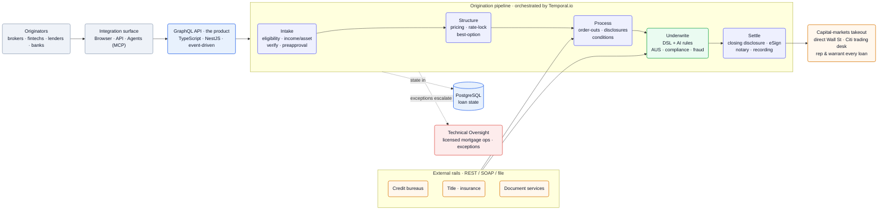
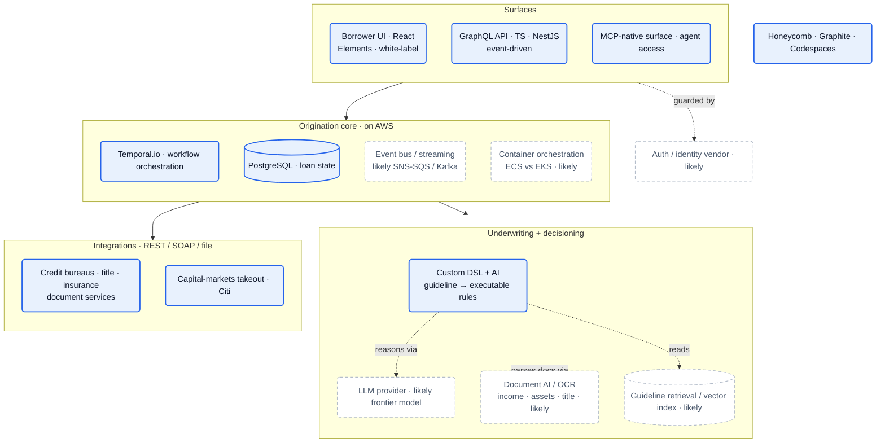

## What they do

[Pylon][home] is *"the first AI-native infrastructure platform to deliver autonomous mortgages at scale,"* handling *"everything from application to capital markets settlement"* ([home][home]). The thesis is stated bluntly: *"Mortgages are the last major financial product that are not programmable"* — so Pylon *"started from zero and created the first vertically integrated mortgage platform that turns origination into a single API"* ([about][about]). The pitch is the whole strategy: *"Out with the mortgage factory. In with the mortgage rails."*

:::note[The build order is the bet — confidence: high]
Pylon re-wired the stack *"from capital markets to initial application (in that order)"* ([introducing][intro]). Owning the takeout first — Pylon *"reps & warrants every loan into the capital markets"* ([fintechs][fintechs]) — is what lets it collapse the rest of the chain into an API instead of reselling someone else's pipeline.
:::

What it's built on:

- Founded ~2022; the team *"primarily comes from Stripe and Better"* ([introducing][intro]). HQ in **Palo Alto** (engineering), with **New York** (GTM/Product) ([careers][careers], [Ashby][ashby]); ~40 people ([Paraform tracker][paraform]).
- **$45M raised** ([about][about]) — seed ~$8M led by **Conversion Capital** (Dec 2022, [FinTech Global][ftc]); institutional backers **Conversion Capital, Peter Thiel, QED, Citi, Allegis Capital, Fifth Wall** ([introducing][intro]), plus angels including the founders of **Ramp, Mercury, Blend, DoorDash, Wealthfront** and **Naval Ravikant** ([about][about]).
- **Citi** connected its *"mortgage trading desk to the Pylon platform alongside a strategic minority ownership investment"* ([introducing][intro]).
- Claimed results: **74% lower cost to originate** vs. the Freddie Mac 2024 study, **75–200bps better pricing**, **~102bps more per loan**, **2× MoM revenue growth** ([home][home], [careers][careers]).

The product is **five composable products** on the API — **Decisioning, Capital, Command Center, Elements, Compliance** ([introducing][intro]) — sold to **brokers, fintechs, lenders, and banks** ([home][home]).

## Stack

A single-language TypeScript shop: TS everywhere, GraphQL as the contract, NestJS services, Postgres for state, and **Temporal.io** orchestrating every long-running mortgage workflow — on AWS. Every row below is named in a first-party JD or shown on the product site.

| Layer | Choice | Evidence |
| --- | --- | --- |
| **Backend language** | **TypeScript** (everywhere) | every eng JD ([API][jd-api], [Infra][jd-infra], [Underwriting][jd-uw], [Integrations][jd-int], [Fullstack][jd-fs]) |
| **API contract** | **GraphQL** — *"this is the product"* | [API JD][jd-api]; `createBorrower` mutation w/ query-complexity limits on [home][home] |
| **Backend framework** | **NestJS** | [API][jd-api], [Underwriting][jd-uw], [Integrations][jd-int], [Fullstack][jd-fs] |
| **Frontend** | **React** | [Fullstack JD][jd-fs] |
| **Primary datastore** | **PostgreSQL** | every eng JD |
| **Workflow orchestration** | **Temporal.io** | every eng JD |
| **Architecture pattern** | **event-driven** | [API][jd-api], [Infra][jd-infra] |
| **Cloud** | **AWS** (*"our cloud home"*) | [Infra JD][jd-infra] |
| **Code review / dev flow** | **Graphite** (stacked PRs) | [Infra JD][jd-infra] |
| **Observability** | **Honeycomb** | [Infra JD][jd-infra] |
| **Dev environments** | **GitHub Codespaces** | [Infra JD][jd-infra] |
| **Underwriting rules** | **custom DSLs + AI** (guideline → executable logic) | [Underwriting JD][jd-uw] |
| **External integrations** | credit bureaus, title, insurance, doc services via **REST / SOAP / file** | [Integrations JD][jd-int] |
| **Agent access** | **MCP-native** infrastructure | [home][home], [fintechs][fintechs], [developers][dev] |
| **AI in product + dev** | *"AI-driven development tooling and agentic infrastructure"* | every eng JD |
| **Marketing site** | Next.js, HubSpot, GTM | network trace ([careers][careers]) |

:::note[Key finding — Temporal is the backbone, GraphQL is the product]
A mortgage is a multi-day, multi-party, failure-prone workflow — exactly Temporal's sweet spot, and it appears in *every* engineering JD. On top sits a GraphQL API the team *"treat[s] as a product … Multiple customers build directly on top of it"* ([API JD][jd-api]). The Stripe-style prefixed IDs in the sample (`borr_…`, deal `morwor_…`) are the ex-Stripe DNA showing through.
:::

The LLM provider, document-AI/OCR pipeline, and guideline retrieval index aren't named — reconstructed in [Likely stack & infra choices](#likely-stack--infra-choices).

## Architecture

One GraphQL API fronts a five-stage, Temporal-orchestrated pipeline — **Intake → Structure → Process → Underwrite → Settle** — that reaches out to external mortgage rails for data and lands every loan in the capital markets. Customers reach it three ways: browser, API, or agents over MCP.

![Pylon architecture: originators (brokers, fintechs, lenders, banks) hit an integration surface (browser, API, agents over MCP) that fronts a GraphQL API (TypeScript, NestJS, event-driven); the API drives a Temporal.io-orchestrated origination pipeline — Intake (eligibility, income/asset verification, preapproval), Structure (pricing, rate-lock), Process (order-outs, disclosures, conditions), Underwrite (DSL + AI rules, AUS, compliance, fraud), and Settle (closing disclosure, eSign, notary, recording); external rails (credit bureaus, title, insurance, document services) feed Process and Underwrite over REST/SOAP/file; loan state lives in PostgreSQL; Settle hands off to capital-markets takeout via direct Wall Street and the Citi trading desk, rep-and-warranting every loan; exceptions escalate to licensed Technical Oversight mortgage-ops staff.](/diagrams/pylon-lending/architecture.svg)

Mermaid source

**The API encodes the domain, not a wizard.** Pylon models mortgage as *"path-dependent"* and *"nonlinear"* — *"the choices you make early in a loan constrain what's possible later … different borrower situations branch into wildly different flows"* — and bets that the API should *"encode choice, branching, and path-dependence natively"* rather than *"paper over that complexity"* ([API JD][jd-api]). They are moving it toward **event-driven**: an API that *"doesn't just respond to requests — it tells you what happened, why, and what you can do next"* ([API JD][jd-api]).

**Underwriting is a compiler, not a checklist.** The underwriting team *"takes human judgment out of mortgage origination and replaces it with systems that are faster, more consistent, and more accurate"* ([Underwriting JD][jd-uw]). The mechanism: *"Encode natural language rules into code … with DSLs and novel techniques — including AI — to translate dense regulatory guidelines into executable logic … compiling English into a system that makes six-figure decisions,"* built *"side-by-side with mortgage experts."*

:::note[Key finding — correctness is a money problem, not a UX problem]
*"An incorrectly modeled rule can cost the company tens of thousands of dollars on a single loan"* ([Underwriting JD][jd-uw]). That economic asymmetry — Pylon rep-and-warrants the loan, so a bad rule is *its* liability — is why underwriting is encoded as a tested DSL and humans become exception handlers, not the assembly line.
:::

**Integrations are the connective tissue.** A dedicated team plugs Pylon into *"credit bureaus, title companies, insurance providers, document services"* — *"mortgage touches everything"* — across *"REST, SOAP, file-based — the full spectrum"* ([Integrations JD][jd-int]). The pipeline's order-outs, disclosures, AUS, and fraud checks all ride these connectors, and **Settle** hands the finished loan to the **capital-markets takeout** (the Citi trading desk and direct Wall Street access).

## Team

Small, senior, and pointedly from outside mortgage: *"We don't come from the mortgage industry. We came in from the outside, got obsessed with the problem"* ([careers][careers]). **30% are former founders** and *"many of us are former founders"*; the engineering bio reads *"Many ex-Stripes"* ([careers][careers], [API JD][jd-api]).

| Role | Person | Background |
| --- | --- | --- |
| CEO | **Trent Hedge** | ex-founder, Atmos ([about][about], [introducing][intro]) |
| CTO & Head of Pylon Labs | **Josh Kuhn** | Stripe, Theorem ([about][about]) |
| VP Engineering | **Yves Bourelle** | Stripe, Box ([about][about]) |

Engineering is organized by mortgage subsystem, all Palo Alto / hybrid at **$130–220K + equity** ([Ashby][ashby]): **API** (the GraphQL product surface), **Integrations** (external rails), **Underwriting** (the DSL/AI decision engine), **Foundation** (infra — *"keep the platform stable and developers productive"*), **Customer Success** (fullstack), and **SRE**. Engineers *"own entire systems, not tickets,"* leveraging *"AI+ML and operations research"* ([careers][careers]).

:::note[Inference — humans moved from the line to oversight — confidence: high]
A separate **Platform** department staffs remote **"Technical Oversight"** roles for Processing, Underwriting, Closing & Funding, and Post-Closing ([Ashby][ashby]) — filled by veterans of Better, ICE Mortgage, Mr. Cooper, and loanDepot ([about][about]). Licensed mortgage pros don't manufacture loans here; they supervise the automation and handle exceptions.
:::

## Process

**Operations research as a first-class tool.** Beyond *"AI+ML,"* Pylon explicitly leverages **operations research** to *"solve the messy, real-world challenges everyone else calls impossible"* ([careers][careers]) — fitting for pricing, loan structuring (*"surface the best option … lowest monthly payment, out-of-pocket cost, or best interest rate"* ([fintechs][fintechs])), and capital allocation.

**A modern, AI-native dev loop.** The Foundation team runs **Graphite** (stacked PRs), **GitHub Codespaces** (dev environments), and **Honeycomb** (observability), with the explicit job of keeping *"highly available systems"* that *"process millions of dollars in mortgage transactions"* reliable ([Infra JD][jd-infra]). Every JD lists *"AI-driven development tooling and agentic infrastructure"* — agents are in the engineering loop, not just the product.

**Values steer toward contrarian bets.** The stated values — *"outcomes over optics,"* *"contrarian and correct"* (*"bias toward questioning industry consensus"*), and *"craftsmanship in everything"* (*"every pixel and every line of code matters"*) — match a team that *"built something the industry said couldn't be built"* ([careers][careers]).

## Notable bets

1. **Vertically integrate the whole stack.** *"Billions have been poured into vertical SaaS, point solutions, and digital front ends. None of it touched the real problem"* ([careers][careers]) — Pylon owns Intake-to-Settle instead of integrating others.
2. **Capital markets first, application last.** Build the takeout, then collapse origination into an API on top of it ([introducing][intro]).
3. **The GraphQL API *is* the product.** Treat versioning, DX, and domain modeling as the core deliverable, not an afterthought ([API JD][jd-api]).
4. **Compile underwriting, don't staff it.** Encode guidelines as tested DSLs + AI so a rule is executable and auditable, with humans as exception handlers ([Underwriting JD][jd-uw]).
5. **Own the risk to earn the margin.** Rep & warrant every loan into the capital markets — the liability that justifies removing the middlemen ([fintechs][fintechs]).
6. **Crypto as a wedge product.** *"The only provider with a crypto-asset depletion underwriting model"* — staking income and crypto-backed mortgages for HNW users ([fintechs][fintechs]).

## Unknowns

:::caution[What the public record can't confirm]
Open questions where even a best-practice guess would be a stretch (conventional infra guesses live in [Likely stack & infra choices](#likely-stack--infra-choices)):

- **LLM provider** — *"AI-driven … agentic infrastructure"* and AI-assisted guideline compilation are described ([Underwriting JD][jd-uw]); no model/vendor named.
- **The DSL itself** — *"custom DSLs for rule encoding"* ([Underwriting JD][jd-uw]); whether it's a standalone language, an embedded TypeScript DSL, or a rules engine is unstated.
- **Document AI / OCR** — *"verifies income and assets"* and reads title/insurance docs ([home][home]); the extraction pipeline isn't named.
- **Pylon Labs** — Josh Kuhn's group is named but its scope (applied-AI research? new products?) isn't described ([about][about]).
- **Container orchestration** — AWS is confirmed ([Infra JD][jd-infra]); ECS vs. EKS is not.
- **Headcount, ARR, cumulative loan volume, valuation** — only *"tens of millions in live beta"* (Nov 2024) and *"2× MoM"* are first-party ([introducing][intro], [careers][careers]).
:::

## Sources

Reconstructed from public sources only — no insider information. Crawled 2026-06-07. Claim tiers used above: **verified** (stated on a public page, linked) · **inferred** (reasoned from a cited signal, confidence flagged) · **speculative** (best-practice fill-in, labeled). Links are live; pages change, so the supporting quote for each claim is kept in this repo's evidence map (`evidence/pylon-lending-evidence-map.md`). Note: this is **Pylon Lending** (pylonlending.com), not the unrelated "Pylon" customer-support SaaS.

| # | Source | Link |
| --- | --- | --- |
| S1 | Homepage — "America's mortgage rails" | <https://www.pylonlending.com/> |
| S2 | About — investors + team | <https://www.pylonlending.com/about/> |
| S3 | Fintechs & crypto | <https://www.pylonlending.com/fintechs/> |
| S4 | Developers | <https://www.pylonlending.com/developers/> |
| S5 | Careers | <https://www.pylonlending.com/careers/> |
| S6 | "Introducing Pylon" (Trent Hedge, 11/26/2024) | <https://www.pylonlending.com/resources/introducing/> |
| S7 | Job board (Ashby) | <https://jobs.ashbyhq.com/pylon> |
| S8 | Backend Engineer, API (JD) | <https://jobs.ashbyhq.com/pylon/d1ef993a-9d43-432c-8700-f185de00a1e4> |
| S9 | Backend Engineer, Integrations (JD) | <https://jobs.ashbyhq.com/pylon/23ee52df-cd68-42c9-bf27-5b844ae8e2c6> |
| S10 | Backend Engineer, Underwriting (JD) | <https://jobs.ashbyhq.com/pylon/2ed1cad6-d4c7-48a4-bf8a-f66ce884a0ea> |
| S11 | Infrastructure Engineer, Foundation (JD) | <https://jobs.ashbyhq.com/pylon/5e3de934-d746-4753-8436-ea70143baeae> |
| S12 | Fullstack Engineer, Customer Success (JD) | <https://jobs.ashbyhq.com/pylon/fd573bb0-d06c-401f-97b5-b73d030662d4> |
| S13 | FinTech Global (third-party — Dec 2022 seed) | <https://fintech.global/2022/12/09/> |
| S14 | Paraform (third-party tracker — headcount/founding) | <https://www.paraform.com/company/pylon-lending> |

## Speculative reconstruction

:::tip[Best-practice reconstruction, not fact]
Nothing in this section is stated on a public page. It is what a team with *this* stack — TypeScript/NestJS/GraphQL/Postgres, Temporal on AWS, a custom underwriting DSL with AI, and direct capital-markets takeout — would *typically* reach for. In the diagram, solid boxes are verified anchors carried up from the sections above; everything dashed is assumed. Read every dashed box as "likely," not confirmed.
:::

### Likely stack & infra choices

| Component | Likely choice | Why |
| --- | --- | --- |
| Reasoning LLM | a frontier model behind a provider abstraction, used for guideline compilation + doc understanding | *"including AI"* in the underwriting DSL ([Underwriting JD][jd-uw]); no model named |
| Document AI / OCR | a managed doc-extraction service or in-house ML for paystubs, bank statements, title | Intake *"verifies income and assets"* ([home][home]); extraction is implied, not named |
| Guideline retrieval | embeddings + vector index over investor guidelines | *"mapping file to guidelines"* ([home][home]); retrieval over dense rulebooks is the natural fit |
| Event backbone | AWS-native (SNS/SQS/EventBridge) or Kafka feeding the event-driven API | *"event-driven architecture"* on AWS ([API][jd-api], [Infra][jd-infra]) |
| Container orchestration | ECS or EKS on AWS | AWS confirmed ([Infra JD][jd-infra]); orchestrator not stated |
| Auth / identity | a managed IdP for platform + embedded borrower flows | enterprise/regulated buyers; white-label Elements; no vendor named |

### Full system architecture

The verified spine is real: a React/Elements front end and an MCP-native GraphQL API (TypeScript, NestJS, event-driven) over a Temporal-orchestrated, Postgres-backed core on AWS; a custom DSL + AI underwriting engine; REST/SOAP/file integrations to credit, title, insurance, and document partners; capital-markets takeout via Citi; and a Honeycomb/Graphite/Codespaces dev platform. Reconstructed here are the **LLM provider**, **document AI/OCR**, **guideline vector index**, **event/streaming bus**, **container orchestration**, and **auth**.

Mermaid source

[home]: https://www.pylonlending.com/
[about]: https://www.pylonlending.com/about/
[fintechs]: https://www.pylonlending.com/fintechs/
[dev]: https://www.pylonlending.com/developers/
[careers]: https://www.pylonlending.com/careers/
[intro]: https://www.pylonlending.com/resources/introducing/
[ashby]: https://jobs.ashbyhq.com/pylon
[jd-api]: https://jobs.ashbyhq.com/pylon/d1ef993a-9d43-432c-8700-f185de00a1e4
[jd-int]: https://jobs.ashbyhq.com/pylon/23ee52df-cd68-42c9-bf27-5b844ae8e2c6
[jd-uw]: https://jobs.ashbyhq.com/pylon/2ed1cad6-d4c7-48a4-bf8a-f66ce884a0ea
[jd-infra]: https://jobs.ashbyhq.com/pylon/5e3de934-d746-4753-8436-ea70143baeae
[jd-fs]: https://jobs.ashbyhq.com/pylon/fd573bb0-d06c-401f-97b5-b73d030662d4
[paraform]: https://www.paraform.com/company/pylon-lending
[ftc]: https://fintech.global/2022/12/09/
