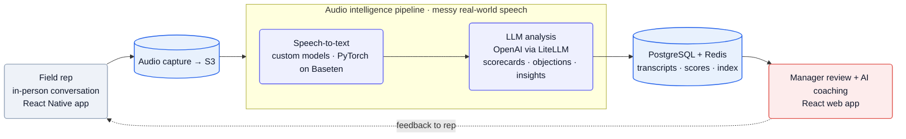
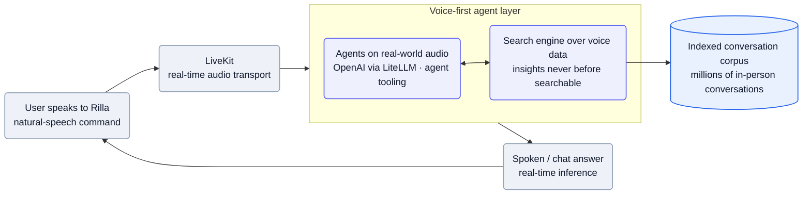
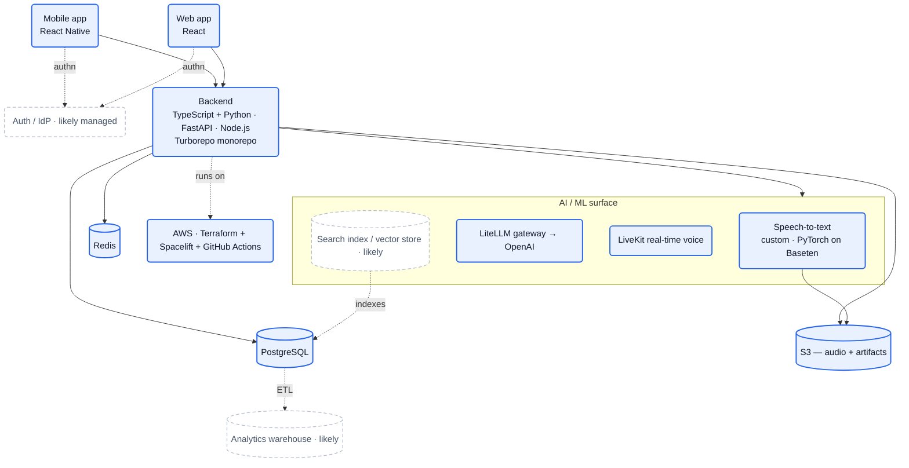

## What they do

[Rilla][home] builds **conversation intelligence for in-person sales** — the "virtual ridealong." Field reps record their face-to-face conversations on a phone; Rilla transcribes and analyzes them, then surfaces coaching so managers can review reps *"100x faster"* without physically riding along ([home][home]). The company frames it bigger than coaching: *"Rilla is on a mission to index the offline world … the leading sales coaching software for organizations doing sales offline"* ([Applied AI JD][jd-ai]).

The wedge is a category of data nobody else captures — *"the messy, noisy, wildly unstructured conversations that happen in the real world, not in an online meeting"* ([Applied AI JD][jd-ai]). Gong and Chorus index *online* sales calls; Rilla indexes the doorstep, the showroom floor, and the job site, in industries *"untouched by modern software"* — home building/improvement/service, automotive, dental, senior living, multifamily ([home][home], [SWE JD][jd-swe]).

The numbers Rilla states publicly:

- *"Over 1000 customers, including The Home Depot, KKR, Neighborly, and PulteGroup"* ([Applied AI JD][jd-ai]); customer outcomes on the site include +40% average close rate and **5,000 ridealongs in 30 days across 130 technicians** at Neighborly ([home][home]).
- Backed by **Google Ventures, Bessemer Ventures, Crew Capital, and Broom Ventures** ([Applied AI JD][jd-ai]); third-party trackers put total funding around **$75M** through a Series B ([Crunchbase][cb]).
- Founder/CEO **Sebastian Jimenez**; co-founded (2019) with **Michael Castellanos** and **Christopher Martin** ([NYU profile][nyu], [Crunchbase][cb]) — the product pivoted out of a political-canvassing app once Jimenez saw *"a critical blind spot … no scalable way of understanding what was happening in face-to-face sales conversations"* ([NYU profile][nyu]).

:::note[The roadmap is a platform shift — confidence: high]
Today's product is batch coaching (record → analyze → review). The Applied AI team is building three new surfaces — *"a voice-first interface,"* *"a search engine that uncovers business-critical insights from voice data that's never been searchable,"* and *"agents that operate natively on real-world audio"* ([Applied AI JD][jd-ai]). The coaching tool is becoming the data moat under a voice-native intelligence layer.
:::

## Stack

A TypeScript + Python monorepo with React/React Native clients, a Python AI surface, and a deliberately managed-infra posture on AWS. Every component below is named in a first-party job description.

| Layer | Choice | Evidence |
| --- | --- | --- |
| **Web frontend** | **React** | [SWE JD][jd-swe] |
| **Mobile** | **React Native** | [SWE JD][jd-swe] |
| **Backend languages** | **TypeScript + Python** | [Applied AI JD][jd-ai], [SWE JD][jd-swe] |
| **API framework** | **FastAPI** | [Applied AI JD][jd-ai] |
| **Runtime / libs** | **Node.js**, **Turborepo**, Lodash, **Zod** | [SWE JD][jd-swe], [FDE JD][jd-fde] |
| **ML framework** | **PyTorch** | [Applied AI JD][jd-ai] |
| **LLM APIs** | **OpenAI** | [Applied AI JD][jd-ai] |
| **Model hosting / inference** | **Baseten** | [Applied AI JD][jd-ai] |
| **LLM gateway / router** | **LiteLLM** | [Applied AI JD][jd-ai] |
| **Real-time voice** | **LiveKit** | [Applied AI JD][jd-ai] |
| **Cloud** | **AWS** | [Applied AI JD][jd-ai] |
| **Datastores** | **PostgreSQL**, **Redis**, **S3** | [Applied AI JD][jd-ai] |
| **IaC / CI** | **Terraform**, **Spacelift**, **GitHub Actions** | [SWE JD][jd-swe], [FDE JD][jd-fde] |
| **Coding agents** | "Unlimited token budget" (engineer perk) | [SWE JD][jd-swe] |

:::note[Key finding — Baseten + LiteLLM is a build-and-buy split]
Rilla self-hosts on **Baseten** with **PyTorch** *and* calls **OpenAI** behind a **LiteLLM** router ([Applied AI JD][jd-ai]). The pattern: own the speech/audio models (where their proprietary in-person data is the edge), rent the reasoning (where frontier LLMs lead), and keep both swappable behind one gateway.
:::

The specific speech-to-text model, the search index/vector store, and the auth vendor aren't stated — reconstructed in [Likely stack & infra choices](#likely-stack--infra-choices).

## Architecture

### The coaching pipeline: capture → transcribe → analyze → coach

The core loop turns an in-person conversation into reviewable coaching. A rep records on the **React Native** app; audio lands in **S3**; an **audio intelligence pipeline** transcribes the *"messy, noisy, wildly unstructured"* speech and runs LLM analysis to extract scorecards, objections, and insights; results land in **Postgres/Redis** and surface in the **React** web app where a manager reviews and coaches ([Applied AI JD][jd-ai], [SWE JD][jd-swe]).

Mermaid source

:::note[Inference — speech-to-text is the in-house bet — confidence: medium]
The Applied AI team owns *"the full AI lifecycle—from data acquisition to real-time inference"* and a pipeline for real-world (not online-meeting) audio, with PyTorch + Baseten in the stack ([Applied AI JD][jd-ai]). That points to custom or fine-tuned speech models for field noise/accents — the asset off-the-shelf ASR handles worst and where Rilla's proprietary corpus pays off — though the exact model isn't named.
:::

### The emerging voice-first layer

The new surface is real-time and conversational: users *"command Rilla directly through natural speech,"* a search engine makes the voice corpus queryable, and agents *"operate natively on real-world audio"* — all spanning *"data acquisition to real-time inference and user-facing chat interfaces"* ([Applied AI JD][jd-ai]). **LiveKit** carries the live audio; **OpenAI behind LiteLLM** does the reasoning ([Applied AI JD][jd-ai]).

Mermaid source

:::note[Key finding — eval is treated as production infrastructure]
The Applied AI role requires familiarity with *"eval frameworks, agent tooling, and prompt engineering"* and building *"AI/LLM systems in production"* ([Applied AI JD][jd-ai]). For a probabilistic product scoring sales calls, eval harnesses — not a QA org — are how quality is held as autonomy widens.
:::

## Team

Engineers are generalists who *"architect and ship features across the stack at lightning speed"* ([SWE JD][jd-swe]). The org is **in-office in NYC, ~60 hrs/week**, self-described as *"builders who operate like high speed reinforcement learners"* ([Applied AI JD][jd-ai]). The job board shows **23 open roles, 7 in engineering**, almost all NYC (one London GTM seat) ([Ashby][ashby]).

| Role | People | Source |
| --- | --- | --- |
| Co-founder / CEO | Sebastian Jimenez | [NYU profile][nyu] |
| Co-founders | Michael Castellanos, Christopher Martin | [Crunchbase][cb] |

The engineering shape, from the open roles: a **full-stack generalist** core (React/React Native/TS/Python), a dedicated **Applied AI** team (voice, search, agents), a **Platform** track, **Mobile** specialization, and a **Forward Deployed Engineer** function ([Ashby][ashby]). The FDE role is explicitly Palantir-style: *"strikingly similar to those of a startup CTO: you'll work in small teams, often solo, and own end-to-end execution of high stakes projects,"* integrating customer data with Rilla and traveling *"up to 50%"* to client sites ([FDE JD][jd-fde]). Comp bands run $185–260K (SWE), $230–300K (Sr), $200–300K (Applied AI), $170–300K (FDE), all plus equity ([Ashby][ashby]).

:::note[Inference — applied-AI org, no public research function — confidence: medium]
Even the AI roles are *applied*: deploy LLM systems, build agent tooling and evals over OpenAI + self-hosted PyTorch models on Baseten ([Applied AI JD][jd-ai]). The reasoning is bought; the differentiated work is the audio pipeline, the proprietary corpus, and product — consistent with no advertised ML-research org.
:::

## Process

**Generalist, full-stack, high-velocity.** The house style is one engineer owning a feature *"end-to-end … to production"* across the whole stack, with early hires *"setting patterns that cement a world-class engineering culture as we scale"* ([SWE JD][jd-swe]). C++ and Rust are welcomed alongside JS/Python, signalling comfort dropping to lower-level code for the audio path ([SWE JD][jd-swe]).

**Managed infra, not a platform team's empire.** Terraform + **Spacelift** (managed Terraform CI) + GitHub Actions is the whole IaC/CI story named ([SWE JD][jd-swe], [FDE JD][jd-fde]) — infra-as-code with a managed runner rather than a hand-rolled platform, fitting a lean team optimizing for shipping speed.

**Customer-embedded by design.** Both the FDE function (50% travel, solo ownership) and the stated values — *"Constantly talking to and visiting customers in the field,"* *"Extreme empathy. Our customers are not tech companies"* — push engineers into the field with non-technical buyers ([FDE JD][jd-fde], [SWE JD][jd-swe]).

:::note[Inference — intensity is an explicit filter — confidence: high]
The JDs include a *"Don't Work Here"* section gating on *"Working ~60 hrs/week in person"* and *"the intensity required"* to *"build a generational company"* ([SWE JD][jd-swe]). Combined with the "unlimited token budget" perk, the bet is a small, high-output, agent-augmented in-person team over a larger distributed one.
:::

## Notable bets

1. **Index the offline world.** Build the dataset no one else has — in-person conversations — and treat coaching as the wedge into a broader voice-intelligence platform ([Applied AI JD][jd-ai]).
2. **Own the audio, rent the reasoning.** Self-host speech models (PyTorch on Baseten) where proprietary field data is the edge; call OpenAI behind LiteLLM for language reasoning, both swappable ([Applied AI JD][jd-ai]).
3. **Voice-native, not text-bolted-on.** A voice-first interface + agents on raw audio + LiveKit real-time transport — interaction designed around speech, not chat with audio attached ([Applied AI JD][jd-ai]).
4. **Make the corpus searchable.** A *"search engine … from voice data that's never been searchable"* turns the archive into a queryable product surface ([Applied AI JD][jd-ai]).
5. **Forward-deployed GTM.** CTO-style FDEs embed with non-tech customers (50% travel) to wire integrations and expand into new verticals ([FDE JD][jd-fde]).
6. **Lean, intense, agent-augmented.** Generalists, 60-hour in-person weeks, unlimited token budgets, managed infra — output per head over headcount ([SWE JD][jd-swe]).

## Unknowns

:::caution[What the public record can't confirm]
Open questions where even a best-practice guess would be a stretch (conventional infra guesses live in [Likely stack & infra choices](#likely-stack--infra-choices)):

- **Speech-to-text specifics** — Baseten hosting + PyTorch are confirmed ([Applied AI JD][jd-ai]); whether the ASR is trained in-house, fine-tuned from an open model (Whisper-class), or a hybrid isn't stated.
- **Search index design** — the "search engine over voice data" ([Applied AI JD][jd-ai]) implies embeddings + a vector index, but the store and retrieval design aren't public.
- **Agent orchestration** — LiveKit handles transport; the framework coordinating the voice-first agents isn't named.
- **Analytics path** — Postgres/Redis/S3 are confirmed for operational data; any warehouse/BI layer is unstated.
- **Auth vendor** — multi-tenant enterprise product clearly needs SSO/authz; no vendor is named.
- **Exact scale** — ARR, retention, headcount, and total raised come from third-party trackers, not first-party pages.
:::

## Sources

Reconstructed from public sources only — no insider information. Crawled 2026-06-07. Claim tiers used above: **verified** (stated on a public page, linked) · **inferred** (reasoned from a cited signal, confidence flagged) · **speculative** (best-practice fill-in, labeled). Links are live; pages change, so the supporting quote for each claim is kept in this repo's evidence map (`evidence/rilla-evidence-map.md`).

| # | Source | Link |
| --- | --- | --- |
| S1 | Homepage | <https://www.rilla.com/> |
| S2 | Customer stories | <https://www.rilla.com/customer-stories> |
| S3 | Job board (Ashby) | <https://jobs.ashbyhq.com/rilla> |
| S4 | Software Engineer, Applied AI (JD) | <https://jobs.ashbyhq.com/rilla/fad15157-b4cc-44ff-92b7-4afd4fe3388e> |
| S5 | Software Engineer (JD) | <https://jobs.ashbyhq.com/rilla/37228ca3-4e4a-4e3c-9414-d8a2046ff496> |
| S6 | Forward Deployed Engineer, Integrations (JD) | <https://jobs.ashbyhq.com/rilla/ec768352-6ddb-4d4b-8704-0c04c37fff13> |
| S7 | Senior Software Engineer (JD) | <https://jobs.ashbyhq.com/rilla/6f4e6ca1-efe7-4f25-af69-59f78981ef70> |
| S8 | NYU Entrepreneurship — Sebastian Jimenez profile | <https://entrepreneur.nyu.edu/blog/2025/08/12/how-sebastian-jimenez-built-rilla-from-field-hustle-to-speech-ai-for-sales/> |
| S9 | Crunchbase (third-party — funding/founders) | <https://www.crunchbase.com/organization/rillavoice> |

## Speculative reconstruction

:::tip[Best-practice reconstruction, not fact]
Nothing in this section is stated on a public page. It is what a team with *this* stack — a TypeScript/Python Turborepo, React/React Native clients, custom speech models on Baseten, OpenAI via LiteLLM, LiveKit, and Postgres/Redis/S3 on AWS — would *typically* build. It's here to complete the picture. In the diagram, solid boxes are verified anchors carried up from the sections above; everything dashed is assumed. Read every dashed box as "likely," not confirmed.
:::

### Likely stack & infra choices

| Component | Likely choice | Why |
| --- | --- | --- |
| Backend compute | containers on AWS (ECS/Fargate or EKS) | AWS + Terraform/Spacelift are confirmed ([SWE JD][jd-swe]); containers are the low-surprise target for a TS+Python service set |
| Speech-to-text | fine-tuned Whisper-class model on Baseten | Baseten + PyTorch are confirmed ([Applied AI JD][jd-ai]); a fine-tuned open ASR is the conventional way to beat field noise with a proprietary corpus |
| Search / retrieval | embeddings + a vector store (pgvector or a managed vector DB) | a "search engine over voice data" ([Applied AI JD][jd-ai]) implies vector similarity; pgvector reuses the existing Postgres |
| Auth | a managed IdP (Auth0 / WorkOS / Cognito) | enterprise SSO/SAML is table stakes for Home Depot/KKR-scale buyers; no vendor named |
| Async / queues | SQS + workers (or Redis-backed queue) | the batch transcribe→analyze pipeline needs durable job processing; Redis is already present |
| Observability | Datadog or Sentry + Grafana | conventional for an AWS service team; unstated |
| Analytics warehouse | Snowflake or BigQuery | product/coaching analytics over a large corpus usually graduate off Postgres; unstated |

### Full system architecture

The verified spine is real: React + React Native clients, a TypeScript + Python backend (FastAPI, Node.js, Turborepo), the Baseten/PyTorch speech models, OpenAI via LiteLLM, LiveKit, Postgres/Redis/S3, and AWS with Terraform + Spacelift + GitHub Actions. Reconstructed here are the **compute target**, the **search/vector store**, the **auth layer**, and an **analytics warehouse**.

Mermaid source

[home]: https://www.rilla.com/
[stories]: https://www.rilla.com/customer-stories
[ashby]: https://jobs.ashbyhq.com/rilla
[jd-ai]: https://jobs.ashbyhq.com/rilla/fad15157-b4cc-44ff-92b7-4afd4fe3388e
[jd-swe]: https://jobs.ashbyhq.com/rilla/37228ca3-4e4a-4e3c-9414-d8a2046ff496
[jd-fde]: https://jobs.ashbyhq.com/rilla/ec768352-6ddb-4d4b-8704-0c04c37fff13
[jd-sr]: https://jobs.ashbyhq.com/rilla/6f4e6ca1-efe7-4f25-af69-59f78981ef70
[nyu]: https://entrepreneur.nyu.edu/blog/2025/08/12/how-sebastian-jimenez-built-rilla-from-field-hustle-to-speech-ai-for-sales/
[cb]: https://www.crunchbase.com/organization/rillavoice
