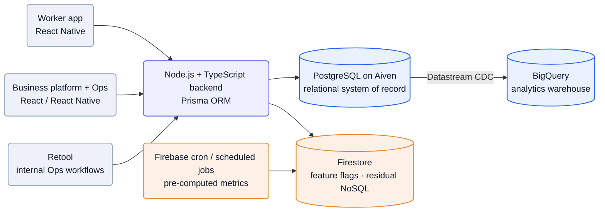
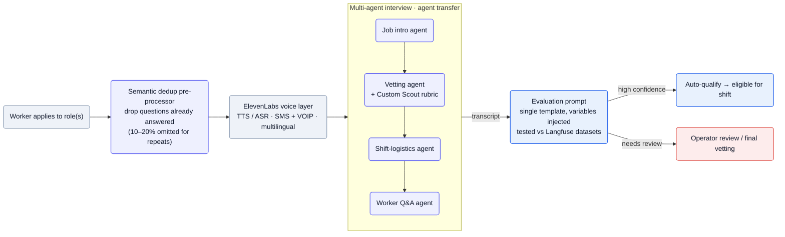
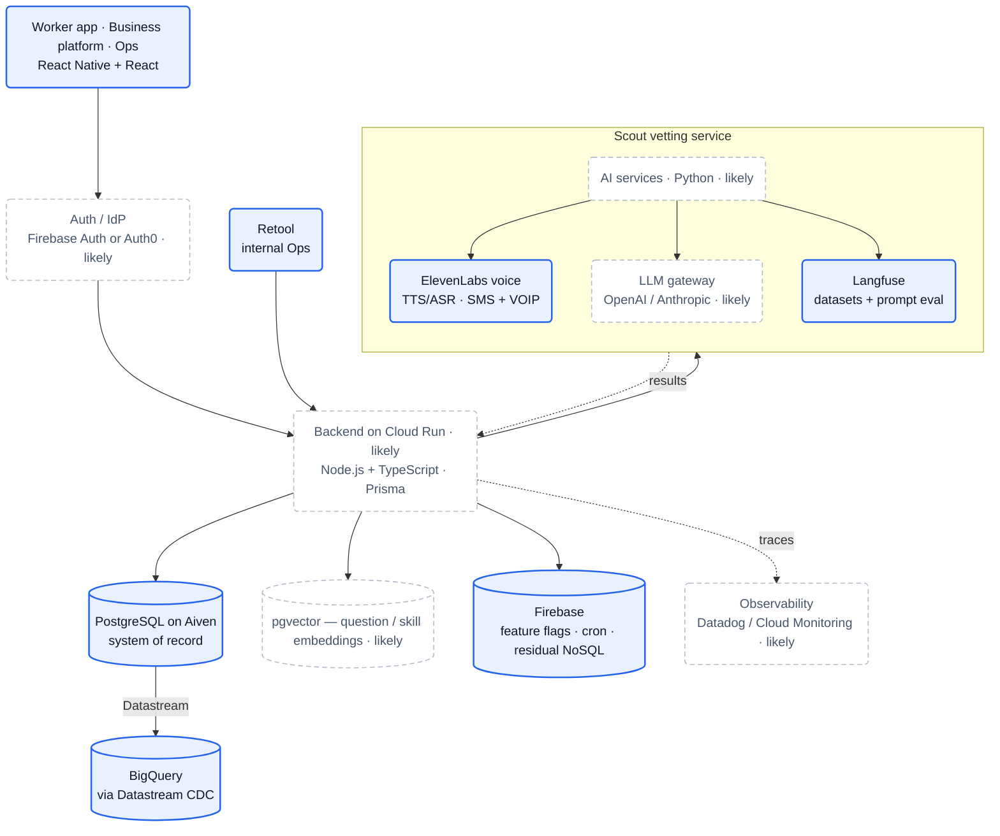

## What they do

[Traba][home] runs a **light-industrial staffing marketplace**: businesses (warehousing, manufacturing, distribution, logistics, fulfillment) post shifts, and vetted flexible workers claim them from a mobile app — *"Traba is a tech staffing platform that helps our business customers … find flexible workers to handle fluctuations in demand. Workers see shifts posted by businesses on the Traba mobile app and can sign up for them"* ([engineering blog][pg]). Founded in 2021 in Miami, now headquartered in SoHo, New York ([about][about], [JD][jd]).

The wedge is reliability, not just liquidity: the headline metric is a **98% show rate** against a stated industry norm of ~30%, plus 55% less turnover and 150+ assessed skill attributes per worker ([home][home]). Staffing is explicitly the beachhead, not the destination — *"We started in staffing — the biggest daily operational pain point — and used it to embed ourselves inside how these facilities actually run … now the foundation for something bigger: an AI platform that connects to the systems running every facility"* ([JD][jd]).

The numbers Traba states publicly:

- **$45.6M total funding**, backed by **Founders Fund, Khosla Ventures, and General Catalyst** ([JD][jd], [careers][careers]); Keith Rabois is a visible backer ([press][press]).
- **~100 employees**; **249K workers on platform**, **996+ light-industrial customers**, **1.0M workers connected to businesses**, operating across **33 states** ([about][about], [JD][jd]).
- **5X revenue growth** ([careers][careers]).
- Co-founders: **CEO Mike Shebat** (ex-Uber) and **CTO Akshay Buddiga** ([about][about]).

Three product surfaces are visible in the public record: the **marketplace** itself (worker mobile app + business web platform + internal Ops tooling), **Scout** — an AI phone interviewer that vets workers ([Scout post][scout]) — and **Neo**, a newer cross-system AI ops agent ([JD][jd]).

:::note[Positioning is mid-pivot — confidence: high]
Marketing still leads with "Labor That Works" staffing, but hiring and engineering content now frame Traba as *"building the autonomous future of industrial labor"* via *"fully autonomous, orchestrated multi-agent AI workflows"* ([JD][jd]). The marketplace is becoming the data + distribution layer under an agent platform.
:::

## Stack

A pragmatic, TypeScript-centric marketplace stack, with Python reserved for the AI/ML surface and a deliberate "buy the managed thing" bias on infrastructure.

| Layer | Choice | Evidence |
| --- | --- | --- |
| **Web frontend** | React / TypeScript (business platform + internal Ops tools) | [JD][jd] |
| **Mobile** | React Native (separate worker and business apps) | [JD][jd] |
| **Backend** | Node.js + TypeScript | [pg post][pg], [JD][jd] |
| **AI / ML services** | Python | [JD][jd] |
| **Primary DB** | PostgreSQL on **Aiven** (managed; chosen over GCP Cloud SQL) | [pg post][pg] |
| **ORM** | **Prisma** (chosen over TypeORM) | [pg post][pg] |
| **Legacy / secondary DB** | **Firestore** — retained for feature flags + remaining NoSQL cases | [pg post][pg] |
| **Cloud** | **GCP** — Firebase, Cloud Functions, Datastream | [pg post][pg] |
| **Analytics warehouse** | **BigQuery** | [pg post][pg] |
| **CDC / ingestion** | GCP **Datastream** (Postgres → BigQuery), routed via Aiven to avoid a ~$500/mo Kafka bill | [pg post][pg] |
| **Batch / scheduled** | Firebase cron jobs + scheduled tasks for pre-computing metrics | [pg post][pg] |
| **Internal tooling** | **Retool** workflows for the Ops team | [pg post][pg] |
| **Load testing** | **Artillery** | [pg post][pg] |
| **Voice AI** | **ElevenLabs** — TTS/ASR, telephony, multi-agent transfer, language detection/switching | [Scout post][scout] |
| **LLM eval / datasets** | **Langfuse** — human-annotated ground-truth datasets + prompt testing | [Scout post][scout] |
| **Worker comms** | SMS + VOIP (telephony) | [Scout post][scout] |

:::note[Key finding — managed-DB bet over GCP-native]
Despite living "deep in the GCP ecosystem," Traba put its primary Postgres on **Aiven**, not Cloud SQL — trading granular tuning for a managed pool, backups, and a Datastream→BigQuery path that dodged a Kafka bill ([pg post][pg]). Velocity over control.
:::

The foundation LLM behind Scout's reasoning/evaluation, the worker/business auth vendor, and the Node backend's specific GCP compute target are not stated publicly — reconstructed in [Likely stack & infra choices](#likely-stack--infra-choices).

## Architecture

### Core marketplace: out of the Fire(store)

Traba booted in 2021 on Firebase/Firestore — *"with the meeting quickly looming, they scrapped the schema and got set up on Firebase in a day"* ([pg post][pg]). As data turned relational (companies, workers, shifts, shift_signups, associations), Firestore's limits bit: no fuzzy/`LIKE` matching, no counts without full scans, no multiple-inequality queries, no joins — operations like "workers who worked last week, aren't currently busy, and aren't blocked by company X" required pulling documents into Node memory and filtering by hand ([pg post][pg]).

The fix was a **one-year, zero-downtime migration to PostgreSQL on Aiven**, behind per-collection feature flags. Today the system runs **Postgres and Firebase in conjunction** — Postgres as the relational system of record, Firestore retained for feature flags and lightweight NoSQL, Firebase cron jobs still pre-computing metrics, and Datastream replicating Postgres into BigQuery for analytics ([pg post][pg]).

Mermaid source

The migration's engine was **trigger-based replication** (chosen over in-code "shadow writes"): a Firestore document change fires a Cloud Function that translates the document into a Postgres row insert/update/delete ([pg post][pg]). Two race-condition classes had to be solved — out-of-order replications (fixed with per-collection **reconciliation scripts** run on a self-healing cron) and ordering/constraint failures (fixed with **custom retry logic, 15+ attempts**, plus a Slack alert that *"amazingly pinged us a grand total of 0 times"*) ([pg post][pg]). The team backfilled history with the same translation logic, hit **99.99% replication precision** by April, and migrated the riskiest collections (`shifts`, `shift_signups`, `workers`) last — flipping reads and writes simultaneously for `shifts` to avoid replication-lag overfills ([pg post][pg]).

:::note[Key finding — data-integrity bugs came from connection management]
Two of the biggest "unknown unknowns" were both connection-pool issues: `.map()` loops that opened N Postgres connections (fixed by batching), and an 8-months-in refactor consolidating scattered Firestore calls into a dedicated data-access layer ([pg post][pg]). The NoSQL→SQL move's hardest part wasn't queries — it was concurrency.
:::

### Scout: a multi-agent AI interviewer

**Scout** vets workers by phone at scale — *"an AI recruiter that conducts thousands of real-time interviews in parallel"* ([Scout post][scout]). It runs on **ElevenLabs** for the voice/telephony layer (low-latency TTS/ASR, multilingual), reaches workers over **SMS and VOIP**, and hands back **structured, decision-grade evaluations** rather than raw transcripts ([Scout post][scout]).

The design moved from a **single agent** (one large context prompt with role-specific content injected, one holistic evaluation prompt, English-only) to a **multi-agent architecture** with **agent transfer** — separate agents for job intro, vetting, shift-logistics confirmation, and worker Q&A — explicitly to dodge context degradation: *"at a certain threshold of context, they begin to degrade"* ([Scout post][scout]). Around that core sit a **semantic dedup pre-processor** (omits 10–20% of questions for repeat applicants), a **Spanish-capable** agent via ElevenLabs language switching, and **Custom Scout**, an operator-trained per-question good/bad/great rubric ([Scout post][scout]).

Mermaid source

:::note[Key finding — evaluation is a single templated prompt, tested like code]
Assessment isn't N static prompts — it's *"a single prompt template"* with questions and success criteria injected per call, evolved against continuously-updating **Langfuse** datasets of human-annotated ground truths, so prompt changes are tested *"in minutes rather than hours"* ([Scout post][scout]). Eval is treated as a versioned, measurable artifact.
:::

The outcomes Traba reports: **250,000+ AI-led interviews** to date; **85%+ of all vetting now AI-conducted** (targeting ~100% within half a year); and — counterintuitively — **AI-vetted workers are 15% more likely to complete their shifts** than human-vetted ones, attributed to a more consistent, empirically-refined process ([Scout post][scout]).

## Team

~100 employees, **~12 engineers** by the end of the Postgres migration ([pg post][pg], [JD][jd]). The named, attributable picture:

| Role | People | Source |
| --- | --- | --- |
| Co-founder / CEO | Mike Shebat (ex-Uber) | [about][about] |
| Co-founder / CTO | Akshay Buddiga | [about][about], [pg post][pg] |
| Founding engineer | Moreno Antunes | [pg post][pg] |
| Infra team | Allison Hojsak, Arvind Anand, Mike Staunton, Nazer Hasanian, Tara Nagar | [pg post][pg] |
| Analytics | Javier Rodriguez | [pg post][pg] |
| Scout team | Sumeet Bansal, Chirag Galani, Austin Carter, Shiv Godhia, Jeff Chen | [Scout post][scout] |

The engineering role is explicitly **full-stack, founding-team product engineering** — *"Lead the development of both frontend and backend applications … Architect … from real-time job matching algorithms to autonomous worker vetting pipelines powered by ML and AI agents"* — reporting directly to the CTO, working across mobile, web, and Ops surfaces ([JD][jd]). Traba advertises pedigree from Uber, Google, Meta, Twitter, Airbnb, DoorDash, Palantir, Square, LinkedIn, Amazon, and TikTok ([about][about]).

:::note[Inference — small, generalist eng org; no public ML-research function — confidence: medium]
The migration ran with ~12 engineers "chipping in when they had bandwidth," and the open role is a generalist full-stack product engineer, not a researcher ([pg post][pg], [JD][jd]). The AI work is applied — orchestration, prompting, eval — over third-party models (ElevenLabs voice, an unnamed LLM), consistent with no advertised in-house ML-research org.
:::

Culture markers: 100% in-person in SoHo, "Olympian's Work Ethic," equity "optimized for upside," and a stated preference for *"motors, not gears"* ([JD][jd], [careers][careers]).

## Process

**Migration ran alongside product work, not as a freeze.** No team was dedicated 100% to the year-long Postgres migration; it advanced opportunistically while features shipped, which forced the migration plan to absorb a moving target — reconciliation scripts that took minutes early on took **20+ minutes** near the end as new fields and scale piled on ([pg post][pg]).

**Safety came from scripts, flags, and load tests, not a QA org.** The verified mechanisms: per-collection reconciliation crons as a self-healing layer; 15+-retry trigger logic with Slack escalation; a **rollback script** (with request-freezing) prepared for the `shifts` cutover; and **Artillery** load tests blasting a Postgres-backed dev environment before the riskiest flips ([pg post][pg]). Analytics validated data alignment on top of the reconciliation scripts ([pg post][pg]).

**Prompt engineering is a measured loop.** For Scout, Traba built ground-truth collection → Langfuse datasets → a concurrent prompt-testing harness reporting accuracy, per-question-type breakdowns, and trend lines — explicitly to move *"from prompt guessing to prompt engineering"* ([Scout post][scout]).

:::note[Inference — feature-flagged, incremental cutover is the house style — confidence: high]
Both the DB migration (per-collection read/write flags, bake-in periods) and Scout (V1 operator safety net → progressive autonomy to 85%+) follow the same pattern: ship behind a flag, validate against ground truth, then widen autonomy ([pg post][pg], [Scout post][scout]).
:::

## Notable bets

1. **Staffing as a data wedge.** Win the "biggest daily operational pain point" first, accumulate *"millions of shifts of proprietary data"* and embedded customer relationships, then build the agent platform on top ([JD][jd]).
2. **Relational core, kept NoSQL where it fits.** A full year and zero downtime to move the system of record to Postgres — but Firestore stays for feature flags and cron. Right tool per job, not ideology ([pg post][pg]).
3. **Managed infra over control.** Aiven over Cloud SQL; Datastream over self-run Kafka; Prisma for migrations and type safety. Spend the team's scarce hours on product, not pool tuning ([pg post][pg]).
4. **AI as the default vetter, human as the shrinking loop.** From an operator "safety net" to 85%+ AI vetting, justified by a *measured* 15% lift in shift completion — autonomy earned with metrics, not asserted ([Scout post][scout]).
5. **Buy the voice layer, own the orchestration.** Lean on ElevenLabs for the hard real-time audio pipeline; keep the multi-agent design, dedup, rubric, and eval in-house ([Scout post][scout]).
6. **Eval as a first-class, versioned artifact.** Langfuse datasets + a custom test harness make prompt changes measurable — quality engineering aimed at a probabilistic system, replacing a traditional QA org ([Scout post][scout]).

## Unknowns

:::caution[What the public record can't confirm]
Open questions where even a best-practice guess would be a stretch (conventional infra guesses live in [Likely stack & infra choices](#likely-stack--infra-choices)):

- **Foundation LLM for Scout** — ElevenLabs (voice) and Langfuse (eval) are confirmed; the reasoning/evaluation model (OpenAI / Anthropic / Google) is never named.
- **Neo's internals** — only a one-line positioning blurb exists: *"cross-system reasoning, early warnings, and routine actions"* ([JD][jd]); no architecture, surfaces, or integration model is public.
- **Real-time job-matching algorithm** — named as a core system ([JD][jd]) but never described (heuristics vs ML ranking, features used).
- **Node backend compute target** — GCP is confirmed; Cloud Run vs GKE vs App Engine is not stated.
- **Auth vendor** — worker app + business platform + Ops tooling clearly need authn/authz; no vendor is named.
- **Semantic dedup mechanism** — "semantically similar questions" implies embeddings + a vector index, but the model and store aren't stated.
- **The second office** — "SoHo, New York +1" ([JD][jd]); the original Miami footprint's current status is unconfirmed.
:::

## Sources

Reconstructed from public sources only — no insider information. Crawled 2026-06-07. Claim tiers used above: **verified** (stated on a public page, linked) · **inferred** (reasoned from a cited signal, confidence flagged) · **speculative** (best-practice fill-in, labeled). Links are live; pages change, so the supporting quote for each claim is kept in this repo's evidence map (`temp/traba-evidence-map.md`).

| # | Source | Link |
| --- | --- | --- |
| S1 | Homepage | <https://traba.work/> |
| S2 | About | <https://traba.work/company/about> |
| S3 | Careers | <https://traba.work/company/careers> |
| S4 | Press | <https://traba.work/company/press> |
| S5 | Engineering index | <https://traba.work/company/engineering> |
| S6 | Project Scout: Building an AI Interviewer | <https://traba.work/company/engineering/building-scout> |
| S7 | Out of the Fire(store): Traba's Journey to Postgres | <https://traba.work/company/engineering/firestore-postgres-migration> |
| J1 | JD — Software Engineer (All Levels; NYC), via Paraform | <https://www.paraform.com/lists/cmpvai1zv00380dl2gnp66bl9/role/clw5sn7ct002ijq0c9r5k6dca> |

## Speculative reconstruction

:::tip[Best-practice reconstruction, not fact]
Nothing in this section is stated on a public page. It is what a ~100-person, Series-A/B team with *this* stack — Node/TypeScript on GCP, Postgres on Aiven via Prisma, React/React Native clients, ElevenLabs voice + an LLM for vetting, and a small generalist eng org — would *typically* build. It is here to complete the picture. In the diagram, solid boxes are verified anchors carried up from the sections above; everything dashed is assumed. Read every dashed box as "likely," not confirmed.
:::

### Likely stack & infra choices

None of these appear on a public page, but for a team on GCP + Aiven Postgres running an LLM-driven vetting product, they're the low-surprise choices:

| Component | Likely choice | Why |
| --- | --- | --- |
| Backend compute | Cloud Run (containers) | GCP-native, scales to zero, fits a small team avoiding cluster ops; matches the "managed over self-run" pattern |
| Foundation LLM | OpenAI or Anthropic via a thin gateway | Scout needs strong instruction-following for interview + eval; ElevenLabs handles voice, so the LLM is a separate, swappable call |
| Semantic dedup | embeddings + pgvector in Postgres | "semantically similar questions" implies vector similarity; Postgres is already the system of record |
| Auth | a managed IdP (Auth0 / Stytch / Firebase Auth) | Firebase Auth is the zero-friction holdover given the Firebase history; an IdP is the conventional alternative |
| Secrets / config | GCP Secret Manager | GCP-native default; table stakes once off Firebase-only |
| Observability | Datadog or GCP Cloud Monitoring + Langfuse for LLM | Langfuse is confirmed for prompt eval; app/infra telemetry is unstated but conventional |
| CI/CD | GitHub Actions | dominant default for a TypeScript monorepo; no signal either way |
| Job/queue | Cloud Tasks / Pub/Sub | already inside GCP; Cloud Functions + triggers are confirmed, so event plumbing exists |

### Full system architecture

A team this size would most likely run a modular Node service (or a few services) behind the React/React Native clients, with Postgres as the transactional core and the Scout/AI workloads as a separate Python surface calling out to ElevenLabs and an LLM. The verified spine is real: the clients, the Node+Prisma backend, Postgres on Aiven, the retained Firebase pieces, Datastream→BigQuery, Retool, and the ElevenLabs+Langfuse vetting loop. Reconstructed here are the **compute target**, the **LLM gateway + vector store**, the **auth layer**, and app/infra **observability**.

Mermaid source

[home]: https://traba.work/
[about]: https://traba.work/company/about
[careers]: https://traba.work/company/careers
[press]: https://traba.work/company/press
[eng]: https://traba.work/company/engineering
[scout]: https://traba.work/company/engineering/building-scout
[pg]: https://traba.work/company/engineering/firestore-postgres-migration
[jd]: https://www.paraform.com/lists/cmpvai1zv00380dl2gnp66bl9/role/clw5sn7ct002ijq0c9r5k6dca
