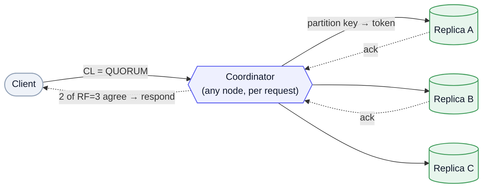
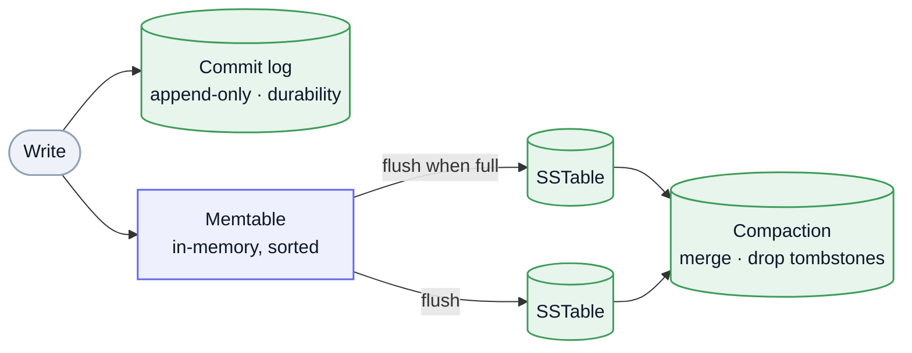

Apache Cassandra is a distributed **wide-column** store built for write-heavy, always-on, horizontally-scaled workloads. It fuses two lineages: **Dynamo's** leaderless replication + tunable consistency (no single point of failure, linear scale, multi-DC) and **Bigtable's** wide-column data model. Cassandra is the textbook **Dynamo-style** system — leaderless quorums, consistent hashing, eventual consistency, gossip — made concrete.

## Data model — query-first

A keyspace holds tables; a table's **primary key** is `(partition key, clustering columns…)`. The **partition key** decides *which nodes* store the row; **clustering columns** sort rows within a partition.

The mindset is the opposite of relational: **model around your queries, not your entities.** No joins, no ad-hoc `WHERE` — the partition key must be in the query. You denormalize aggressively and write the same data into several tables, one per access pattern. Duplication is the design, not a smell.

## Partitioning: the token ring

Cassandra places data with **[consistent hashing](/system-design/terminology/#data--storage)**: the partition key is hashed to a **token**, the ring of all tokens is divided into ranges, and each node owns a set of ranges. Adding or removing a node remaps only a slice of the ring, not the whole keyspace. **Vnodes** (many small token ranges per node) smooth out distribution and make rebalancing cheaper. This is **partitioning** in production.

## Replication & tunable consistency

Each keyspace sets a **replication factor (RF)** per datacenter — every partition is stored on RF nodes, **all equal, no leader**. `NetworkTopologyStrategy` spreads replicas across racks and DCs. *Any* node can act as the **coordinator** for a request and forward to the replicas.

Consistency is chosen **per query** via the **consistency level (CL)** — `ONE`, `QUORUM`, `LOCAL_QUORUM`, `ALL`. The key relation: **`R + W > RF`** gives you read-your-writes (a quorum read overlaps a quorum write on at least one current replica); `LOCAL_QUORUM` keeps multi-DC requests fast by staying in-region. This is the **PACELC** latency-vs-consistency dial exposed as a per-query knob — the same [quorum](/system-design/terminology/#data--storage) math.

Mermaid source

## Write path — why writes are so fast

A write appends to the **commit log** (durability) and updates an in-memory **memtable** — then it's acknowledged. **No read-before-write, no in-place update.** When a memtable fills, it flushes to an immutable on-disk **SSTable**. This is an **LSM-tree**: all writes are sequential appends, which is why Cassandra ingests at very high volume without flinching.

Mermaid source

## Read path & compaction

A read merges the memtable with potentially **many** SSTables holding pieces of the partition; **bloom filters** skip SSTables that can't contain the key, and a partition index + caches narrow the rest. Reads are costlier than writes — the LSM trade.

**Compaction** merges SSTables in the background, dropping overwritten cells and expired **tombstones** (delete markers). Strategies fit the workload: **STCS** (write-heavy), **LCS** (read-heavy, bounds SSTables per read), **TWCS** (time-series, drops whole old windows). Watch tombstones — a partition with many of them gets slow until `gc_grace` passes and compaction reclaims them.

## Conflict resolution & anti-entropy

With no leader, replicas drift and must reconcile:

- **Last-write-wins (LWW)** — conflicts resolve by each cell's **timestamp**, so **[clock skew](/system-design/terminology/#data--storage) across nodes can silently drop a write**. (Modern Cassandra uses LWW, not vector clocks.)
- **Hinted handoff** — a coordinator stashes writes meant for a *down* replica and replays them when it returns.
- **Read repair** — on a quorum read, replicas that disagree are corrected inline.
- **Anti-entropy repair** — Merkle-tree comparison (`nodetool repair`) reconciles deeper divergence; it must be run regularly.
- **Gossip** — a peer-to-peer protocol for membership and **failure detection** (phi-accrual). No master: every node learns the ring and who's up.

## When to use — and not

**Use it for:** write-heavy ingest, time-series / event / IoT data, always-on (AP) availability, multi-region active-active, linear horizontal scale, and *known* access patterns you can model tables around.

**Avoid it for:** ad-hoc queries, joins, or aggregations (it isn't relational — reach for [Postgres](/system-design/postgres-internals/)); workloads needing strong consistency or multi-key transactions by default; small datasets where the operational weight (repair, compaction tuning, capacity planning) isn't worth it.

---

These are working notes — Cassandra as the concrete embodiment of leaderless, quorum-based ideas, with the one-liner terms (quorum, consistent hashing, eventual consistency) in the [Terminology](/system-design/terminology/#data--storage). The throughline: trade joins and default-strong consistency for linear write scale and no single point of failure.
