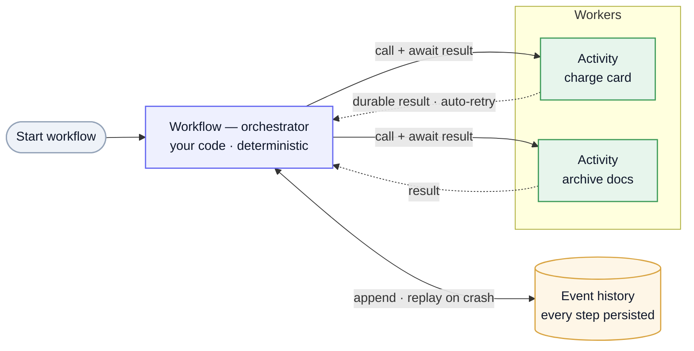

Temporal is a **durable execution** engine: you write a multi-step process as ordinary code, and it survives crashes, restarts, and waits of arbitrary length. The engine persists *every step* so a workflow that's halfway through — having charged a card, waiting three days for a callback — resumes exactly where it left off after a deploy or a node death. It's the answer to "I'm juggling retries, timeouts, correlation IDs, and brittle glue code across services" — that's not messaging, it's **workflow orchestration**. As the [Kafka page](/system-design/kafka/#kafka-vs-temporal--moving-data-vs-moving-work) puts it: **Kafka moves data; Temporal moves work.**

## The model

| Piece | What it is |
| --- | --- |
| **Workflow** | The orchestrator — *your code*, but **deterministic**: it issues steps, waits, and decides the flow. Its state is durable. |
| **Activity** | A single unit of side-effecting work (charge a card, call an API, write a file). The "command"; this is where non-determinism and failure live. |
| **Worker** | Your process that hosts and runs workflow + activity code. Temporal itself runs no business logic. |
| **Task queue** | How the Temporal service dispatches work to your workers (Temporal's own queue, not Kafka). |

## How it survives crashes

The core trick is **event history + deterministic replay.** Every workflow decision and activity result is appended to a durable **event history**. If a worker dies, another picks up the workflow and **replays the history** to reconstruct in-memory state exactly, then continues. That's why **workflow code must be deterministic** (no `now()`, no random, no direct I/O) and all side effects go in **activities** — replay must produce the same decisions every time.

Mermaid source

## Retries, timeouts, compensation

What you'd otherwise hand-roll, Temporal owns:

- **Automatic retries** — activities retry on failure per a configurable policy (backoff, max attempts), durably, across restarts.
- **Timeouts** — per activity and per workflow; a stuck step fails cleanly instead of hanging forever.
- **Durable timers** — `sleep(3 days)` actually works; the timer survives crashes and costs nothing while waiting.
- **Saga compensation** — on failure partway through, run compensating steps to undo prior work — the [saga](/system-design/terminology/#distributed-transactions--consistency) pattern, but expressed as plain try/catch instead of a hand-built state machine.

## Orchestration vs choreography — who owns the flow

This is the real reason to reach for it. In **choreography** (services reacting to each other's [events](/system-design/kafka/#event-vs-task--kafka-vs-a-queue)), responsibility is **diffuse**: the end-to-end flow is emergent, nobody owns it, and you reconstruct "what happened" from event soup. In **orchestration**, the **workflow is explicitly responsible** — it issues each command and *gets the result back*.

That answers the usual confusion about commands: a command isn't fire-and-forget. The workflow **`await`s the activity** and receives a **durable result or a failure** — the outcome is first-class, not something you hope arrives later as a separate "result event." One thing owns the process, sees its whole state, and decides what's next.

## Nexus — coordinating across services

A single workflow orchestrating its own activities is one team's process. **Nexus** extends durable execution **across service / team / namespace boundaries**: one application calls another's exposed operation as a typed, durable request and gets a result back — retries and timeouts handled — instead of stitching services together with raw events and queues and rebuilding the flow from "result events." So orchestration's "the caller owns it and gets a durable result" model holds *between* services, not just within one. **Kafka moves data; Temporal moves work — and Nexus is how Temporal moves work between services.**

## When to use — and not

**Use it for:** multi-step, long-running, must-not-drop-work processes — payments and order fulfillment, provisioning, onboarding, data/ML pipelines, anything with waits, retries, and compensation where you need to *see and own* the flow.

**Avoid it for:** simple request/response, single fire-and-forget tasks (a [queue](/system-design/kafka/#event-vs-task--kafka-vs-a-queue) is lighter), pure event fan-out (that's [Kafka](/system-design/kafka/)), or ultra-low-latency hot paths. It's an orchestration layer, not a message bus or a job runner.

## The durable-execution landscape

Temporal is the best-known, not the only option — they differ mostly in *deployment shape*:

| Engine | Shape | Notes |
| --- | --- | --- |
| **Temporal** | self-hosted cluster or Temporal Cloud | the most mature; the model described above |
| **Cadence** | self-hosted cluster | Uber's open-source engine — **Temporal is a fork of it**, so the model is nearly identical; still developed at Uber |
| **DBOS** | **library on Postgres** | durable steps persisted in your *own* Postgres, running in-process — no separate cluster to operate; lighter when you already run Postgres |
| Step Functions · Azure Durable Functions · Restate · Inngest | managed / serverless | the same durable-execution idea as a hosted service — less to run, less control |

The axis to weigh: **a cluster to operate (Temporal/Cadence)** vs. **a library on a DB you already run (DBOS)** vs. **a managed service** — power and portability against operational weight.

---

These are working notes on durable execution. The one idea to keep: **persist every step so the process survives anything, and make one thing own the flow** — which is what separates orchestration from a pile of events and glue. Vocabulary in the [Terminology](/system-design/terminology/#async--messaging); the data-vs-work contrast on the [Kafka page](/system-design/kafka/#kafka-vs-temporal--moving-data-vs-moving-work).
